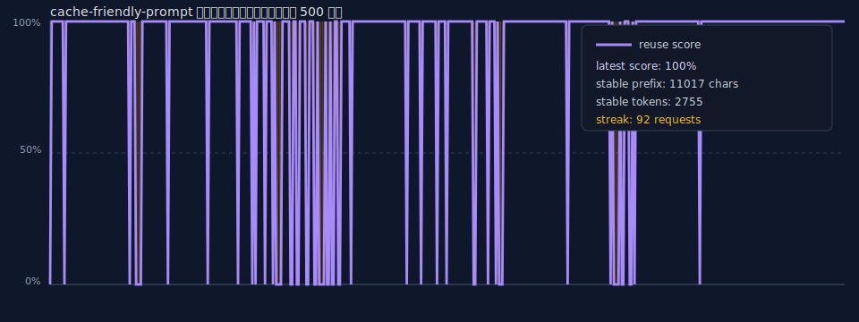
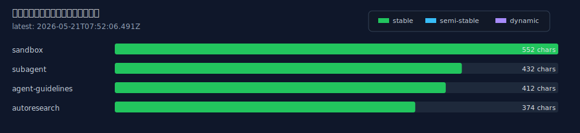
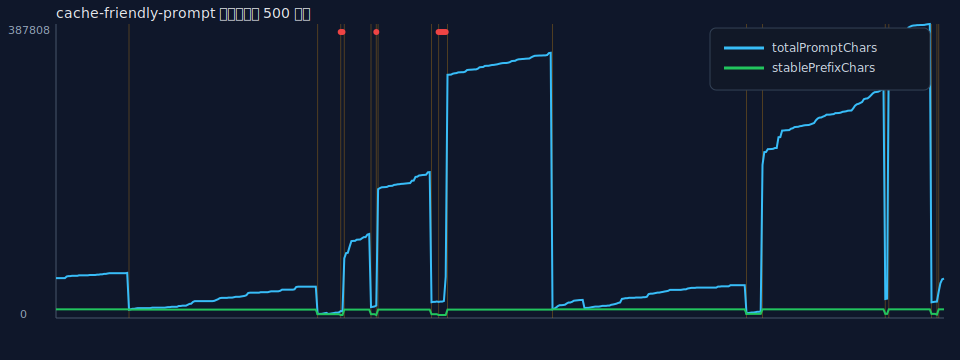

# cache-friendly-prompt レポート

最終更新: 2026-05-21T07:09:59.176Z

## サマリー

- 総リクエスト数: 867
- 最新 provider/model: zai/glm-5.1
- 最新 stablePrefixHash: `87244eaa`
- 最新 stable prefix: 11017 chars
- 最新 total prompt: 342269 chars
- 直近同一 hash 継続: 47 requests
- stablePrefixHash 変化回数: 74
- warning 件数: 48

## 用語

| 用語 | 説明 |
|---|---|
| stable prefix | provider に送るプロンプトの先頭に置かれる、変化しにくい部分。system prompt や stable fragment を含みます。 |
| stablePrefixHash | stable prefix の内容から計算した hash。同じ値が続くほど、安定部分が変わっていないことを示します。 |
| stablePrefixChars | stable prefix の文字数。キャッシュ候補になり得る先頭部分の大きさです。 |
| totalPromptChars | provider に送られるプロンプト全体の文字数。ユーザー発話、会話履歴、tool 結果、read 結果なども含まれ得ます。 |
| cacheability | 前回と同じ stablePrefixHash なら 100%、変化した直後は 0% とするキャッシュ再利用スコアです。 |
| hash change | stablePrefixHash が前回から変わった地点。安定部分が変化したため、キャッシュ再利用が効きにくくなる可能性があります。 |
| warning | cache-friendly-prompt が検出した注意点。例: stable prefix が短い、payload に不安定な構造がある、など。 |
| fragment | 各拡張が提供するプロンプト断片。stable / semi-stable / dynamic に分類されます。 |
| provider/model | リクエスト送信先の provider と model。例: `openai-codex/gpt-5.5`。 |

## キャッシュ可能性

- 紫線: reuse score。前回と同じ `stablePrefixHash` なら `100%`、変化した直後は `0%` です
- 100% に張り付いているほど、同じ stable prefix を継続して送れていることを示します
- オレンジの縦線は `stablePrefixHash` の変化点です
- stable prefix の大きさは右上の `stable prefix` / `stable tokens` に数値で表示します
- total prompt の大きさは、この図では考慮しません

## 拡張機能ごとのコンテキスト注入量

- 緑: stable。キャッシュ候補の先頭部分に入る拡張コンテキストです
- 水色: semi-stable。比較的変化しにくいセッション文脈です
- 紫: dynamic。毎ターン変わりやすく、末尾側に追加される文脈です
- 文字数は fragment 本文ベースです。古いログにはサイズ情報がないため、新しいリクエスト以降に表示されます

## 推移

## provider/model 別

| provider/model | requests | unique hashes | latest hash | stable chars | total chars |
|---|---:|---:|---|---:|---:|
| openai-codex/gpt-5.5 | 639 | 13 | `a2b8c6a3` | 3963 | 54292 |
| zai/glm-5.1 | 228 | 7 | `87244eaa` | 11017 | 342269 |

## 最近の hash 変化

| timestamp | provider/model | hash | stable chars | total chars |
|---|---|---|---:|---:|
| 2026-05-21T06:50:53.865Z | zai/glm-5.1 | `a2b8c6a3` → `87244eaa` | 11017 | 320788 |
| 2026-05-21T06:46:50.010Z | openai-codex/gpt-5.5 | `1b175f0c` → `a2b8c6a3` | 3963 | 21173 |
| 2026-05-21T06:43:31.824Z | openai-codex/gpt-5.5 | `87244eaa` → `1b175f0c` | 4963 | 20879 |
| 2026-05-21T06:33:03.087Z | zai/glm-5.1 | `a2b8c6a3` → `87244eaa` | 11017 | 169957 |
| 2026-05-21T06:32:40.993Z | openai-codex/gpt-5.5 | `1b175f0c` → `a2b8c6a3` | 3963 | 16534 |
| 2026-05-21T06:30:17.005Z | openai-codex/gpt-5.5 | `87244eaa` → `1b175f0c` | 4963 | 14312 |
| 2026-05-21T06:22:29.275Z | zai/glm-5.1 | `a2b8c6a3` → `87244eaa` | 11017 | 78722 |
| 2026-05-21T06:19:25.853Z | openai-codex/gpt-5.5 | `1b175f0c` → `a2b8c6a3` | 3963 | 9091 |
| 2026-05-21T06:11:12.264Z | openai-codex/gpt-5.5 | `87244eaa` → `1b175f0c` | 4963 | 5349 |
| 2026-05-21T05:18:49.561Z | openai-codex/gpt-5.5 | `be27db66` → `87244eaa` | 11017 | 11052 |
| 2026-05-21T05:02:00.675Z | openai-codex/gpt-5.5 | `844fbfb3` → `be27db66` | 11530 | 52572 |
| 2026-05-21T05:01:38.098Z | openai-codex/gpt-5.5 | `be27db66` → `844fbfb3` | 6342 | 7155 |
| 2026-05-21T05:01:36.438Z | openai-codex/gpt-5.5 | `844fbfb3` → `be27db66` | 11530 | 52572 |
| 2026-05-21T05:01:28.835Z | openai-codex/gpt-5.5 | `be27db66` → `844fbfb3` | 6342 | 7155 |
| 2026-05-21T05:01:28.545Z | openai-codex/gpt-5.5 | `844fbfb3` → `be27db66` | 11530 | 52093 |
| 2026-05-21T05:01:22.826Z | openai-codex/gpt-5.5 | `be27db66` → `844fbfb3` | 6342 | 7155 |
| 2026-05-21T05:01:22.584Z | openai-codex/gpt-5.5 | `844fbfb3` → `be27db66` | 11530 | 51607 |
| 2026-05-21T05:01:18.143Z | openai-codex/gpt-5.5 | `be27db66` → `844fbfb3` | 6342 | 7155 |
| 2026-05-21T05:01:16.246Z | openai-codex/gpt-5.5 | `844fbfb3` → `be27db66` | 11530 | 51548 |
| 2026-05-21T05:01:11.719Z | openai-codex/gpt-5.5 | `be27db66` → `844fbfb3` | 6342 | 6767 |
