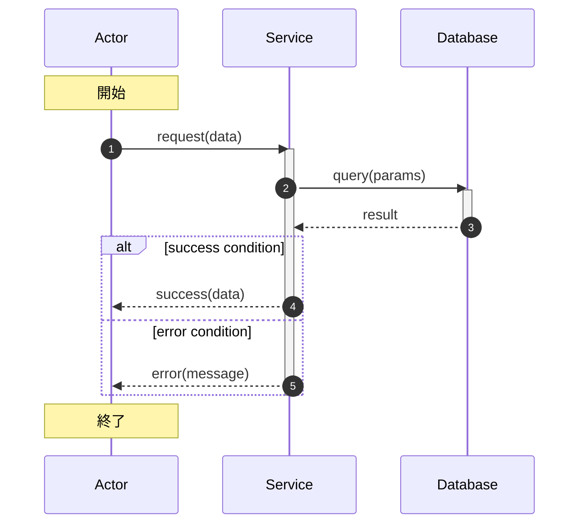
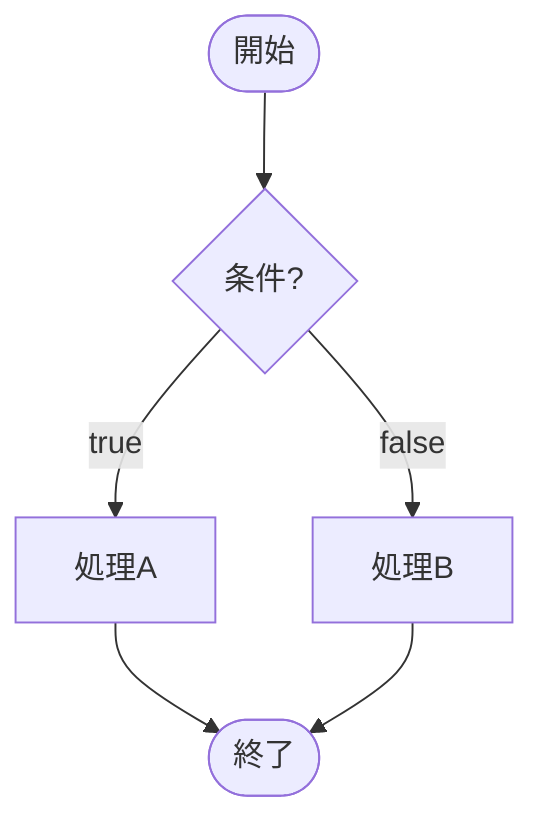
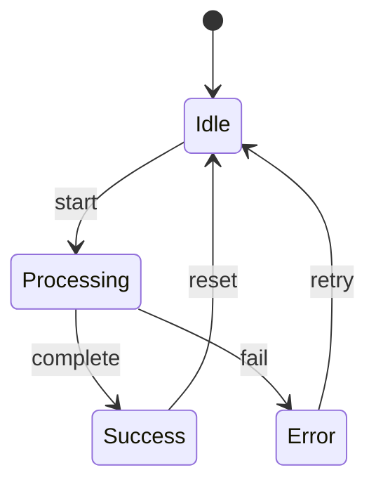

# Mermaid Diagram Team

## チームミッション

コード視覚化タスクフォース。シーケンス図、フローチャート等のMermaid図を厳密なコード整合性で作成・検証する。開発者とLLMの双方が理解できる視覚化を実現し、コードベースの理解促進を図る。

不正確な図解は誤解を生み、誤った実装や判断を招く。図とコードの不一致は信頼を損ない、保守コストを増大させる。

**核心原則:** 図はコードの忠実な表現であること。正確性を速度より優先する。開発者とLLMの双方が理解できる表現を目指す。

**鉄の掟:**
```
コードと図の不一致は致命的である
推測で図を作成しない
正確性を犠牲にして可読性を追求しない
```

## Team Strategy

- **Code Analyzer**: Phase 1（コード解析）を担当。構造、フロー、インターフェースの詳細分析
- **Diagram Author**: Phase 2（図式作成）を担当。Mermaid記法での図作成、可読性と正確性のバランス
- **Syntax Validator**: Phase 3（構文検証）を担当。Mermaid構文の正確性、レンダリング確認
- **Consistency Verifier**: Phase 4（整合性確認）を担当。図とコードの厳密な一致検証

## When to Use

以下の視覚化タスクで使用する:
- シーケンス図の作成（API呼び出し、イベントフロー、プロセス間通信）
- フローチャートの作成（アルゴリズム、条件分岐、業務フロー）
- 状態遷移図の作成（ステートマシン、ライフサイクル）
- クラス図の作成（データモデル、継承関係）
- ER図の作成（データベーススキーマ、エンティティ関係）

**特に以下の場合に使用する:**
- 複雑なコードフローの理解が必要な場合
- 新規メンバーのオンボーディング
- 設計レビューやアーキテクチャ議論
- ドキュメント作成時の視覚化
- LLMによるコード理解の支援
- バグ調査時のフロー可視化

**以下の場合でもスキップしてはならない:**
- 「単純なフローだから省略できる」と思ったとき（単純さは主観）
- 「コードを読めば分かる」と思ったとき（図は理解を加速する）
- 「時間がない」と思ったとき（不正確な図は時間の浪費）

## The Four Phases

次のフェーズに進む前に、各フェーズを必ず完了すること。

### Phase 1: コード解析 (Code Analyzer)

**図解のための情報収集:**

1. **コード構造を分析**
   - 対象ファイル、関数、クラスの特定
   - インポート・エクスポート関係の把握
   - モジュール境界と責任範囲の理解
   - 依存関係（同期・非同期）の特定

2. **制御フローを追跡**
   - 関数呼び出しの連鎖（直接・間接）
   - 条件分岐の条件と分岐先
   - ループの開始・終了・継続条件
   - 例外処理のパス（try/catch/finally）
   - 非同期処理のフロー（Promise、async/await）

3. **データフローを特定**
   - 入力パラメータの型と意味
   - データ変換・加工のポイント
   - 状態変更のタイミング
   - 出力・戻り値の型と意味
   - 副作用の特定（DB更新、API呼び出し等）

4. **インターフェースを抽出**
   - 公開APIのシグネチャ
   - イベントハンドラのトリガー
   - 外部システムとの境界
   - 設定・環境依存の挙動

### Phase 2: 図式作成 (Diagram Author)

**Mermaid記法での図作成:**

1. **図の種類を選択**
   - シーケンス図: 時系列の相互作用
   - フローチャート: 条件分岐と処理の流れ
   - 状態遷移図: 状態と遷移条件
   - クラス図: 構造と関係
   - ER図: データモデルと関係

2. **ノードとエッジを定義**
   - ノード: アクター、関数、状態、エンティティ
   - エッジ: 呼び出し、遷移、参照
   - ラベル: 条件、データ、コメント
   - スタイル: 色分け、強調

3. **シーケンス図のベストプラクティス**
   - 参加者（participant）を明確に定義
   - ライフライン（activate/deactivate）を適切に使用
   - 条件分岐（alt/else/opt）を正確に表現
   - ループ（loop）を明示
   - ノート（Note）で補足情報を追加
   - 自動番号付け（autonumber）で追跡可能性を確保

4. **フローチャートのベストプラクティス**
   - 開始・終了ノードを明示
   - 条件分岐を菱形で表現
   - 処理を矩形で表現
   - 矢印に条件ラベルを付与
   - サブグラフ（subgraph）でグループ化

### Phase 3: 構文検証 (Syntax Validator)

**Mermaid構文の正確性確認:**

1. **基本構文を確認**
   - ノード定義の正確性
   - エッジ記法の正確性（->, -->, ->>, -->> 等）
   - ラベルの引用符使用
   - 特殊文字のエスケープ

2. **図タイプ別の構文を確認**
   - シーケンス図: participant, sequence, activate, loop, alt, opt, par
   - フローチャート: TD/LR, node shapes, subgraph
   - 状態遷移図: state, transition, fork, join
   - クラス図: class, relationship, visibility
   - ER図: entity, relationship, cardinality

3. **レンダリング検証（mermaid-cli）**
   - stdin/stdoutパイプラインでの検証
   - 終了コードによる成功/失敗判定
   - エラーメッセージの解釈と修正

### Phase 4: 整合性確認 (Consistency Verifier)

**図とコードの厳密な一致検証:**

1. **網羅性を確認**
   - 全ての関数呼び出しが図に含まれているか
   - 全ての条件分岐が図に反映されているか
   - 全ての例外処理パスが図にあるか
   - 重要なデータフローが表現されているか

2. **正確性を確認**
   - 関数名・変数名が正確か（typoがないか）
   - 引数・戻り値の型が正確か
   - 条件式がコードと一致しているか
   - 非同期処理の順序が正確か

3. **過剰・欠落を確認**
   - 図に存在しない処理がコードにあるか（欠落）
   - コードに存在しない処理が図にあるか（過剰）
   - 削除されたコードが図に残っていないか
   - 追加されたコードが図に反映されているか

4. **歪曲を確認**
   - 実際の挙動と図が一致しているか
   - 簡略化で重要な情報が失われていないか
   - 抽象化で誤解を招く表現がないか

## Members

### Code Analyzer (code-analyzer)

対象コードの構造、制御フロー、データフロー、インターフェースを詳細に分析し、図解に必要な情報を抽出する。関数呼び出し、条件分岐、ループ、例外処理を正確に特定する。Phase 1（コード解析）を担当し、図作成の土台となる情報を提供する。

#### Task Approach

1. **対象範囲を明確化**
   - 図解する範囲（ファイル、関数、クラス）を特定
   - 深さ（1階層のみか、再帰的に追うか）を決定
   - 詳細度（高レベルか、ステップバイステップか）を設定

2. **コードを静的解析**
   - ファイルを読み込み、構造を理解
   - 関数・メソッドのシグネチャを抽出
   - 呼び出し関係をマッピング
   - 条件分岐・ループを特定

3. **動的挙動を推論**
   - 実行パスを可能な限り網羅
   - 非同期処理の順序を特定
   - エッジケースの挙動を分析
   - 境界条件の影響を評価

4. **分析結果を構造化**
   - ノード一覧（アクター、関数、状態）
   - エッジ一覧（呼び出し、遷移、データフロー）
   - 条件一覧（分岐条件、ループ条件）
   - 注釈一覧（重要な情報、補足説明）

#### Output Format

- **対象範囲の定義**:
  - 対象ファイル: [ファイルパス]
  - 対象関数: [関数名]
  - 深さ: [階層数]
  - 詳細度: [high-level/step-by-step]

- **ノード一覧**:
  | ID | 名称 | 種別 | 説明 |
  |----|------|------|------|
  | N1 | functionName | function | 機能の説明 |
  | N2 | ClassName | class | クラスの説明 |

- **エッジ一覧**:
  | From | To | 種別 | 条件/データ | 行番号 |
  |------|----|------|-------------| -------|
  | N1 | N2 | call | 引数: data | file.ts:42 |

- **条件分岐一覧**:
  | ID | 条件 | True分岐 | False分岐 | 行番号 |
  |----|------|----------|-----------| -------|
  | C1 | x > 0 | N3 | N4 | file.ts:50 |

- **例外処理一覧**:
  | ID | 例外種別 | ハンドラ | 行番号 |
  |----|----------|----------| -------|
  | E1 | Error | errorHandler | file.ts:60 |

### Diagram Author (diagram-author)

Code Analyzerの解析結果に基づき、Mermaid記法でシーケンス図、フローチャート等を作成する。開発者とLLMの両方が理解できる表現を心がけ、可読性と正確性のバランスを取る。Phase 2（図式作成）を担当し、視覚化の実装を行う。

#### Task Approach

1. **Code Analyzerの結果を確認**
   - ノード一覧、エッジ一覧を理解
   - 条件分岐、例外処理の構造を把握
   - 重要な情報と補足説明を整理

2. **図の種類を決定**
   - 対象に最適な図タイプを選択
   - 複数の図が必要かどうか判断
   - レベル（概要/詳細）を決定

3. **Mermaidコードを作成**
   - 基本構造を記述
   - ノード・エッジを追加
   - 条件分岐・ループを表現
   - 注釈・コメントを追加

4. **可読性を最適化**
   - 適切な改行とインデント
   - 意味のある命名
   - グループ化（subgraph）
   - 色分け・スタイリング（必要に応じて）

#### Output Format

- **Mermaidコード**:
  ```mermaid
  sequenceDiagram
    autonumber
    participant A as Actor
    participant S as Service

    A->>S: request(data)
    activate S

    alt success condition
      S-->>A: success response
    else error condition
      S-->>A: error response
    end

    deactivate S
  ```

- **図の説明**:
  - 目的: [この図で表現すること]
  - 対象: [対象となるコード]
  - 範囲: [含まれる/含まれない範囲]
  - 簡略化: [簡略化した点があれば]

- **凡例**（必要に応じて）:
  - 矢印の種類の説明
  - 色分けの意味
  - 略語の展開

### Syntax Validator (syntax-validator)

作成されたMermaid図の構文正確性を検証し、レンダリングエラーを特定・修正する。mermaid-cliによるstdin/stdoutパイプライン検証を実施し、構文エラーを解決する。Phase 3（構文検証）を担当し、図の技術的正確性を保証する。

#### Task Approach

1. **Diagram Authorの出力を確認**
   - Mermaidコードを読み込み
   - 図の種類と目的を理解

2. **構文チェックを実行**
   - 基本構文の確認
   - 図タイプ固有の構文確認
   - エラー・警告の特定

3. **mermaid-cli検証を実施**
   - stdin/stdoutパイプラインで検証: `echo "$code" | mmdc -i - -o - -e svg -q > /dev/null`
   - 複数ブロックはperlで抽出して個別検証
   - エラーがあれば該当ブロックを特定して修正
   - 未インストール時はインストール促進メッセージを表示

4. **修正案を提示**
   - エラー箇所の特定
   - 修正コードの提示
   - 修正理由の説明

#### Output Format

- **構文チェック結果**:
  | 項目 | 状態 | 詳細 |
  |------|------|------|
  | 基本構文 | OK/NG | 詳細メッセージ |
  | ノード定義 | OK/NG | 詳細メッセージ |
  | エッジ記法 | OK/NG | 詳細メッセージ |
  | 条件分岐 | OK/NG | 詳細メッセージ |

- **mermaid-cli検証結果**:
  | ブロック | 状態 | 詳細 |
  |----------|------|------|
  | Block 1 | OK/NG | エラーメッセージ（あれば） |
  | Block 2 | OK/NG | エラーメッセージ（あれば） |

- **修正案**（エラーがある場合）:
  ```mermaid
  -- 修正前の該当箇所
  ++ 修正後の該当箇所
  ```

  修正理由: [修正の理由]

- **最終的なMermaidコード**:
  （修正を反映したコード）

### Consistency Verifier (consistency-verifier)

Mermaid図と元のコードの厳密な一致を検証する。欠落、過剰、歪曲がないことを確認し、図が正確にコードを表現していることを保証する。Phase 4（整合性確認）を担当し、図解の信頼性を担保する。

#### Task Approach

1. **Code AnalyzerとDiagram Authorの出力を確認**
   - 分析結果とMermaidコードを比較
   - 意図された表現範囲を理解

2. **網羅性チェック**
   - Code Analyzerのノードが全て図に含まれているか
   - Code Analyzerのエッジが全て図に含まれているか
   - 条件分岐が全て表現されているか
   - 例外処理が適切に表現されているか

3. **正確性チェック**
   - 関数名・変数名の照合
   - 条件式のコードとの一致確認
   - データ型・引数の正確性確認
   - 処理順序の正確性確認

4. **過剰・欠落・歪曲チェック**
   - 図にのみ存在する要素の特定
   - コードにのみ存在する要素の特定
   - 表現の簡略化による情報損失の評価
   - 誤解を招く表現の特定

#### Output Format

- **網羅性チェック結果**:
  | 項目 | 期待数 | 実際数 | 状態 |
  |------|--------|--------|------|
  | ノード | N | M | OK/NG |
  | エッジ | N | M | OK/NG |
  | 条件分岐 | N | M | OK/NG |
  | 例外処理 | N | M | OK/NG |

  不足一覧: [不足している項目のリスト]

- **正確性チェック結果**:
  | 項目 | コード | 図 | 状態 |
  |------|--------|----|------|
  | 関数名 | functionName | functionName | OK/NG |
  | 条件式 | x > 0 | x > 0 | OK/NG |

  不一致一覧: [不一致の項目と修正案]

- **過剰・欠落・歪曲チェック結果**:
  | 種別 | 項目 | 詳細 | 深刻度 |
  |------|------|------|--------|
  | 過剰 | [図にあるがコードにない] | 詳細 | Critical/Warning |
  | 欠落 | [コードにあるが図にない] | 詳細 | Critical/Warning |
  | 歪曲 | [表現が誤解を招く] | 詳細 | Critical/Warning |

- **最終判定**:
  - 判定: [合格/要修正/不合格]
  - 信頼度: [0-100%]
  - 次のアクション: [修正が必要な場合は具体的な指示]

## 警告信号 - プロセスの遵守を促す

以下のような考えが浮かんだら、それはSTOPのサイン:
- 「だいたい合っているだろう」
- 「細かい条件分岐は省略しよう」
- 「この関数は重要じゃないからスキップ」
- 「可読性のために条件を単純化しよう」
- 「エラー処理は後で追加すればいい」
- 「この名前は大体合っている」
- 「図が複雑になるから一部省略」
- 「時間がないから検証は省略」
- 「目視で確認したから大丈夫」

**これらすべては: STOP。Phase 1に戻れ。**

## 人間のパターナーの「やり方が間違っている」シグナル

**以下の方向転換に注意:**
- 「この図、コードと合っている？」 - 整合性への疑念
- 「この条件分岐、足りないのでは？」 - 網羅性の不足
- 「この関数名、違くない？」 - 正確性の問題
- 「この処理、図にないけど？」 - 欠落の指摘
- 「この図、実行してみたら違う動き」 - 歪曲の発見

**これらを見たら:** STOP。該当フェーズに戻れ。

## よくある言い訳

| 言い訳 | 現実 |
|--------|------|
| 「だいたい合っている」 | だいたいは不正確。コードと図は完全に一致させる。 |
| 「細かい条件は省略」 | 省略された条件は隠れたバグの温床。 |
| 「重要じゃない関数」 | 重要かどうかは文脈次第。網羅性を保つ。 |
| 「可読性のため単純化」 | 単純化は歪曲を生む。正確性を優先。 |
| 「エラー処理は後で」 | 後で追加は忘れる。最初から含める。 |
| 「大体合っている名前」 | 大体はtypo。正確な名前を使用。 |
| 「複雑になるから省略」 | 複雑さは現実。図は複雑さを可視化するもの。 |
| 「時間がない」 | 不正確な図は時間の浪費。正確な図を作る。 |
| 「目視で確認」 | 目視は見落とす。体系的に検証する。 |

## Mermaid構文リファレンス

### シーケンス図（sequenceDiagram）



### フローチャート（flowchart）



### 状態遷移図（stateDiagram）



## クイックリファレンス

| フェーズ | 主要活動 | 成功基準 |
|-------|---------------|------------------|
| **1. コード解析** | 構造、フロー、データの分析 | 図に必要な情報が完全に抽出されている |
| **2. 図式作成** | Mermaid記法での図作成 | 構文的に正しいMermaidコード |
| **3. 構文検証** | 構文チェック、レンダリング確認 | 全環境で正常にレンダリングされる |
| **4. 整合性確認** | 網羅性、正確性、過剰・欠落チェック | 図とコードが厳密に一致している |

## 出力ファイル

作成したMermaid図はMarkdownファイルとして保存する:

```
docs/diagrams/
├── sequence/
│   ├── api-flow.md
│   └── authentication-flow.md
├── flowchart/
│   ├── algorithm-flow.md
│   └── business-logic.md
└── state/
    └── user-lifecycle.md
```

各ファイルの形式:
```markdown
# [図のタイトル]

## 概要
[図の説明]

## 対象コード
- ファイル: [ファイルパス]
- 関数: [関数名]
- 作成日: [日付]
- 更新日: [日付]

## 図

[Mermaidコード]

## 凡例
[必要に応じて]
```

## Iteration Protocol（反復プロトコル）

整合性確認（Phase 4）で問題が検出された場合の修正フロー:

```
┌─────────────────────────────────────────────────────────────┐
│                   ITERATION PROTOCOL                         │
├─────────────────────────────────────────────────────────────┤
│  Phase 4 (Consistency Verifier) が不合格を判定               │
│       │                                                      │
│       ▼                                                      │
│  1. 問題の種類を特定（欠落/過剰/歪曲/構文エラー）            │
│       │                                                      │
│       ▼                                                      │
│  2. Diagram Author に修正指示を送信                          │
│     - 具体的な修正箇所をリスト化                             │
│     - 期待される修正内容を明記                               │
│       │                                                      │
│       ▼                                                      │
│  3. Diagram Author が修正実施                                │
│       │                                                      │
│       ▼                                                      │
│  4. Syntax Validator が構文再検証                            │
│     - 構文エラーがあれば Diagram Author に差し戻し           │
│       │                                                      │
│       ▼                                                      │
│  5. Consistency Verifier が整合性再検証                      │
│     - 合格 → 出力確定                                        │
│     - 不合格 → 反復継続                                      │
│                                                              │
│  最大反復回数: 3回                                            │
│  3回超過時: 人間にエスカレーション                            │
└─────────────────────────────────────────────────────────────┘
```

### 反復回数制限

| 反復回数 | アクション |
|----------|------------|
| 1回目 | Diagram Author修正 → Syntax Validator → Consistency Verifier |
| 2回目 | Diagram Author修正 → Syntax Validator → Consistency Verifier |
| 3回目 | Diagram Author修正 → Syntax Validator → Consistency Verifier |
| 4回目以降 | **エスカレーション**: 人間に確認を求める |

### エスカレーション時の出力形式

```markdown
## 要確認: 図解の整合性が確保できません

### 検出された問題
- [問題1の詳細]
- [問題2の詳細]

### 試みた修正
1. [修正内容1]
2. [修正内容2]
3. [修正内容3]

### 残存する課題
- [解決できなかった課題]

### 推奨アクション
- [ ] コードの確認: [該当箇所]
- [ ] 図の簡略化の検討
- [ ] 対象範囲の分割
```

## 静的レンダリング検証（Static Rendering Verification）

Mermaid図の正確性を保証するため、静的レンダリングによる検証を実施する。
**重要**: SVG出力は行わず、MermaidコードはMarkdown形式で保存する。検証のみを目的とする。

### mermaid-cli (mmdc) の確認とインストール

**インストール確認:**
```bash
which mmdc >/dev/null 2>&1 && mmdc --version || echo "NOT_INSTALLED"
```

**未インストール時のメッセージ（pi agentに表示）:**
```
[必須] mermaid-cli (mmdc) がインストールされていません。

Mermaid図の構文検証を行うには、以下のコマンドでインストールしてください:

  npm install -g @mermaid-js/mermaid-cli

インストール後、検証を再実行してください。
```

**mermaid-cli (mmdc) について:**
- **ライセンス**: MIT License（商用利用可能）
- **インストール**: `npm install -g @mermaid-js/mermaid-cli`
- **依存関係**: Puppeteer（Chromiumベース）
- **stdin/stdout対応**: `-i -` で標準入力、`-o -` で標準出力

### stdin/stdoutパイプライン検証

一時ファイルを使わず、stdin/stdoutのパイプライン処理で検証する。

**シングルブロックの検証:**
```bash
# stdin -> stdout -> /dev/null（検証のみ、ファイル生成なし）
echo "graph TD; A --> B" | mmdc -i - -o - -e svg -q > /dev/null 2>&1

# 終了コード: 0=成功、1=構文エラー
if echo "$mermaid_code" | mmdc -i - -o - -e svg -q > /dev/null 2>&1; then
  echo "VALID"
else
  echo "INVALID"
fi
```

**複数ブロックの検証（パイプライン処理）:**

MarkdownドキュメントからMermaidブロックを抽出し、各ブロックを個別に検証:

```bash
#!/bin/bash
# mermaid_verify.sh - stdin/stdoutパイプラインで検証（一時ファイル不使用）

# mermaid-cliの存在確認
if ! which mmdc >/dev/null 2>&1; then
  echo "[必須] mermaid-cli (mmdc) がインストールされていません。"
  echo "インストール: npm install -g @mermaid-js/mermaid-cli"
  exit 1
fi

# 標準入力からMarkdownを読み込み、各Mermaidブロックを検証
block_num=0
errors=0

while IFS= read -r -d '' block; do
  [ -z "$block" ] && continue
  ((block_num++))

  # パイプライン処理: stdin -> mmdc -> stdout -> /dev/null
  if echo "$block" | mmdc -i - -o - -e svg -q > /dev/null 2>&1; then
    echo "[OK] Block $block_num"
  else
    echo "[ERROR] Block $block_num"
    # エラー詳細を表示
    echo "$block" | mmdc -i - -o - -e svg 2>&1 | head -5
    ((errors++))
  fi
done < <(perl -0777 -ne 'while(/```mermaid\n(.*?)```/gs){print "$1\0"}')

echo ""
echo "Total: $block_num blocks, Errors: $errors"
[ $errors -eq 0 ]
```

**使用例:**
```bash
# ファイルから検証
cat docs/diagrams/sequence/api-flow.md | ./mermaid_verify.sh

# または直接実行
perl -0777 -ne 'while(/```mermaid\n(.*?)```/gs){print "$1\0"}' file.md | \
  while IFS= read -r -d '' block; do
    echo "$block" | mmdc -i - -o - -e svg -q > /dev/null 2>&1 && echo "OK" || echo "NG"
  done
```

### ディレクトリ汚染防止の原則

**原則: 一時ファイルを使わない**

1. **stdin/stdoutを使用**: パイプライン処理で検証のみ実行
2. **/dev/nullへ出力**: SVG/ファイル生成を回避
3. **必要時のみ/tmp使用**: どうしても必要な場合のみ、`mktemp`で作成し`trap`で削除

```bash
# 推奨: パイプライン処理（一時ファイル不使用）
echo "$code" | mmdc -i - -o - -e svg -q > /dev/null 2>&1

# 非推奨だが必要な場合: 一時ファイルを使用
TEMP_DIR=$(mktemp -d /tmp/mermaid_XXXXXX)
trap "rm -rf $TEMP_DIR" EXIT
```

### Syntax Validator の責務

Phase 3では以下の検証を実施:

1. **mermaid-cli存在確認**（必須）
   ```bash
   if ! which mmdc >/dev/null 2>&1; then
     # pi agentにインストール促進メッセージを表示
     echo "[必須] mermaid-cli (mmdc) がインストールされていません。"
     echo "インストール: npm install -g @mermaid-js/mermaid-cli"
   fi
   ```

2. **構文検証**（必須）
   - stdin/stdoutパイプラインで検証
   - 終了コードで成功/失敗を判定

3. **複数ブロック検証**
   - perl正規表現でブロック抽出
   - 各ブロックを個別に検証
   - エラー箇所を特定

### 検証結果の記録

```markdown
## 検証結果

### 環境確認
- mermaid-cli: インストール済み / 未インストール
- バージョン: [mmdc --version の出力]

### 構文検証（パイプライン処理）
| ブロック | 行番号 | 状態 | 詳細 |
|----------|--------|------|------|
| Block 1 | 10-20 | OK | - |
| Block 2 | 25-40 | OK | - |
| Block 3 | 50-65 | NG | Parse error: line 55 |

### 検証方法
- 方法: mermaid-cli (stdin/stdout pipeline)
- 一時ファイル: 未使用
```

## 図解が「不十分」を示した場合

整合性確認で問題が検出された場合:

1. 問題の種類を特定（欠落、過剰、歪曲）
2. 該当フェーズに戻り修正
3. 修正後、再度整合性確認を実施
4. 信頼度が100%になるまで繰り返す

**Iteration Protocolに従って体系的に修正を実施する。**

**しかし:** 正確性を妥協してはならない。時間がかかっても正確な図を作成する。
