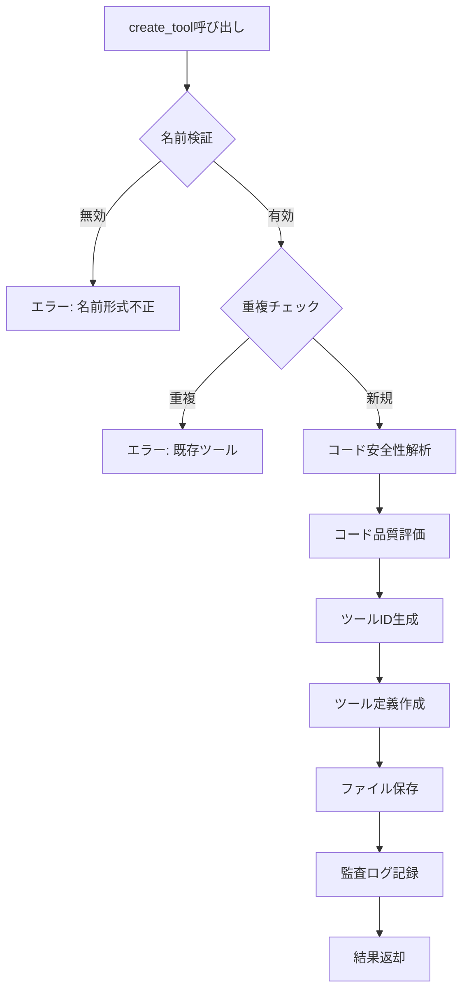
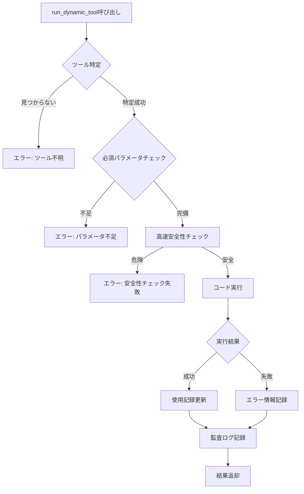
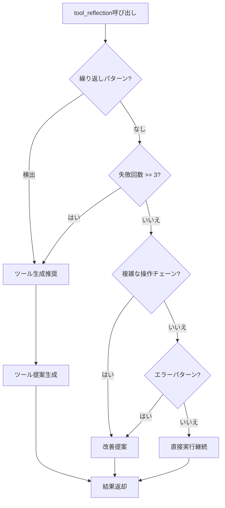

# 動的ツール生成システム - APIリファレンス

## 目次

- [概要](#概要)
- [クイックリファレンス](#クイックリファレンス)
- [create_tool](#create_tool)
- [run_dynamic_tool](#run_dynamic_tool)
- [list_dynamic_tools](#list_dynamic_tools)
- [delete_dynamic_tool](#delete_dynamic_tool)
- [tool_reflection](#tool_reflection)
- [共通型定義](#共通型定義)

---

## 概要

動的ツール生成システムは5つのツールを提供します:

| ツール名 | 説明 |
|----------|------|
| `create_tool` | 動的ツールを生成 |
| `run_dynamic_tool` | 生成済みツールを実行 |
| `list_dynamic_tools` | ツール一覧を表示 |
| `delete_dynamic_tool` | ツールを削除 |
| `tool_reflection` | 実行後の反省とツール生成判定 |

---

## クイックリファレンス

### ツール作成の基本パターン

```typescript
create_tool({
  name: "tool_name",           // 必須: 英字で始まる名前
  description: "説明",          // 必須: ツールの説明
  code: `// 必須: TypeScriptコード
async function execute(params) {
  // params: 入力パラメータ
  return { result: "value" };  // 戻り値
}`,
  parameters: { /* オプション */ },
  tags: ["optional"]           // オプション
})
```

### ツール実行の基本パターン

```typescript
run_dynamic_tool({
  tool_name: "tool_name",      // または tool_id: "dt_..."
  parameters: { /* 入力値 */ }
})
```

### よく使用するパターン

| タスク | コマンド |
|-------|---------|
| ツール一覧 | `list_dynamic_tools({})` |
| タグでフィルタ | `list_dynamic_tools({ tags: ["utility"] })` |
| 名前で検索 | `list_dynamic_tools({ name: "json" })` |
| ツール削除 | `delete_dynamic_tool({ tool_name: "...", confirm: true })` |
| 失敗時の分析 | `tool_reflection({ task_description: "...", last_tool_result: "エラー..." })` |

---

## create_tool

動的ツールを生成します。TypeScript/JavaScriptコードを指定して新しいツールを作成します。

### パラメータ

| パラメータ | 型 | 必須 | 説明 |
|------------|-----|------|------|
| `name` | string | Yes | ツール名（英字で始まり、英数字、アンダースコア、ハイフンのみ使用可能） |
| `description` | string | Yes | ツールの説明 |
| `code` | string | Yes | ツールのコード。`execute(params)` 関数を定義する必要があります |
| `parameters` | object | No | パラメータの定義（詳細は後述） |
| `tags` | string[] | No | ツールのタグ（カテゴリ分類用） |
| `generated_from` | string | No | ツールの生成元（タスク説明など） |

### パラメータ定義の詳細

`parameters` オブジェクトの各プロパティ:

```typescript
{
  [パラメータ名]: {
    type: "string" | "number" | "boolean" | "object" | "array",
    description: "パラメータの説明",
    default: デフォルト値,    // オプション
    enum: ["値1", "値2"],     // オプション: 許容値のリスト
    minimum: 最小値,          // オプション: number型用
    maximum: 最大値,          // オプション: number型用
    required: true | false    // オプション: 必須かどうか
  }
}
```

### 戻り値

成功時:
```
ツール「{name}」を作成しました。

ツールID: {tool_id}
安全性スコア: {score}
品質スコア: {score}
検証状態: {verified|unverified}

説明:
{description}

パラメータ:
- {param1} ({type}): {description}
- {param2} ({type}): {description}

使用方法:
run_dynamic_tool({ tool_id: "{tool_id}", parameters: { /* ... */ } })
```

失敗時:
```
エラー: {エラーメッセージ}
```

### 使用例

#### 基本的なツール作成

```typescript
create_tool({
  name: "string_reverse",
  description: "文字列を逆順にする",
  code: `
async function execute(params) {
  const input = params.text || "";
  return input.split("").reverse().join("");
}
`
})
```

#### パラメータ付きツール作成

```typescript
create_tool({
  name: "calculate_average",
  description: "数値の配列から平均値を計算",
  code: `
async function execute(params) {
  const numbers = params.numbers;
  if (!Array.isArray(numbers) || numbers.length === 0) {
    return { error: "有効な数値配列を指定してください" };
  }
  const sum = numbers.reduce((a, b) => a + b, 0);
  return sum / numbers.length;
}
`,
  parameters: {
    numbers: {
      type: "array",
      description: "平均を計算する数値の配列",
      required: true
    },
    precision: {
      type: "number",
      description: "小数点以下の桁数",
      default: 2,
      minimum: 0,
      maximum: 10
    }
  },
  tags: ["math", "statistics"]
})
```

#### 外部APIを呼び出すツール

```typescript
create_tool({
  name: "fetch_json",
  description: "指定URLからJSONデータを取得",
  code: `
async function execute(params) {
  const url = params.url;
  const timeout = params.timeout_ms || 5000;
  
  const controller = new AbortController();
  const timeoutId = setTimeout(() => controller.abort(), timeout);
  
  try {
    const response = await fetch(url, {
      signal: controller.signal,
      headers: { "Accept": "application/json" }
    });
    
    if (!response.ok) {
      return { error: "HTTP " + response.status + ": " + response.statusText };
    }
    
    return await response.json();
  } catch (e) {
    return { error: e.message };
  } finally {
    clearTimeout(timeoutId);
  }
}
`,
  parameters: {
    url: {
      type: "string",
      description: "取得するJSONのURL",
      required: true
    },
    timeout_ms: {
      type: "number",
      description: "タイムアウト時間（ミリ秒）",
      default: 5000
    }
  },
  tags: ["network", "api"],
  generated_from: "外部API統合タスク"
})
```

### フロー図



---

## run_dynamic_tool

登録済みの動的ツールを実行します。

### パラメータ

| パラメータ | 型 | 必須 | 説明 |
|------------|-----|------|------|
| `tool_id` | string | ※ | ツールID |
| `tool_name` | string | ※ | ツール名（`tool_id`の代わりに使用可能） |
| `parameters` | object | Yes | ツールに渡すパラメータ |
| `timeout_ms` | number | No | タイムアウト時間（ミリ秒、デフォルト: 30000） |

※ `tool_id` または `tool_name` のいずれかが必須

### 戻り値

成功時:
```
ツール「{name}」の実行が完了しました。

実行時間: {ms}ms

結果:
{結果の内容}
```

失敗時:
```
ツール「{name}」の実行に失敗しました。

実行時間: {ms}ms
エラー: {エラーメッセージ}
```

### 使用例

#### IDで指定して実行

```typescript
run_dynamic_tool({
  tool_id: "dt_abc123def456",
  parameters: {
    text: "Hello World"
  }
})
```

#### 名前で指定して実行

```typescript
run_dynamic_tool({
  tool_name: "string_reverse",
  parameters: {
    text: "Hello World"
  }
})
```

#### タイムアウト付き実行

```typescript
run_dynamic_tool({
  tool_name: "fetch_json",
  parameters: {
    url: "https://api.example.com/data",
    timeout_ms: 10000
  },
  timeout_ms: 15000
})
```

### 実行フロー



---

## list_dynamic_tools

登録済みの動的ツール一覧を表示します。

### パラメータ

| パラメータ | 型 | 必須 | 説明 |
|------------|-----|------|------|
| `name` | string | No | 名前でフィルタ（部分一致） |
| `tags` | string[] | No | タグでフィルタ |
| `min_safety_score` | number | No | 安全性スコアの最小値（0.0-1.0） |
| `limit` | number | No | 最大表示件数（デフォルト: 20） |

### 戻り値

```
# 登録済み動的ツール ({count}件)

## {tool_name_1}
- ID: {tool_id}
- 説明: {description}
- 信頼度: {confidence_score}
- 使用回数: {usage_count}回 | 最終使用: {last_used}
- 検証状態: {verification_status}
- タグ: {tag1}, {tag2}

## {tool_name_2}
...
```

### 使用例

#### 全ツール表示

```typescript
list_dynamic_tools({})
```

#### タグでフィルタ

```typescript
list_dynamic_tools({
  tags: ["utility", "json"]
})
```

#### 名前で検索

```typescript
list_dynamic_tools({
  name: "json"
})
```

#### 高信頼度ツールのみ表示

```typescript
list_dynamic_tools({
  min_safety_score: 0.8,
  limit: 10
})
```

---

## delete_dynamic_tool

登録済みの動的ツールを削除します。

### パラメータ

| パラメータ | 型 | 必須 | 説明 |
|------------|-----|------|------|
| `tool_id` | string | ※ | ツールID |
| `tool_name` | string | ※ | ツール名（`tool_id`の代わりに使用可能） |
| `confirm` | boolean | No | 削除の確認（`true`で削除実行） |

※ `tool_id` または `tool_name` のいずれかが必須

### 戻り値

成功時:
```
ツール「{name}」({tool_id})を削除しました。
```

失敗時:
```
エラー: {エラーメッセージ}
```

confirm未指定時:
```
エラー: 削除を確認するには confirm: true を指定してください
```

### 使用例

#### 確認付き削除

```typescript
delete_dynamic_tool({
  tool_name: "old_tool",
  confirm: true
})
```

#### IDで削除

```typescript
delete_dynamic_tool({
  tool_id: "dt_abc123def456",
  confirm: true
})
```

---

## tool_reflection

タスク実行後に反省を行い、新しいツール生成が推奨されるかを判定します。

### パラメータ

| パラメータ | 型 | 必須 | 説明 |
|------------|-----|------|------|
| `task_description` | string | Yes | 実行中のタスクの説明 |
| `last_tool_result` | string | Yes | 直前のツール実行結果 |
| `failed_attempts` | number | No | 失敗した試行回数 |

### 戻り値

ツール生成推奨時:
```
# ツール生成反省

## タスク分析
- 説明: {task}...
- 失敗回数: {count}

## 推奨: ツール生成
- 理由: {reason}

## 次のステップ
以下のコマンドでツールを生成してください:
create_tool({
  name: 'tool_name',
  description: 'ツールの説明',
  code: `// TypeScriptコード`,
  parameters: { /* ... */ }
})
```

継続推奨時:
```
# ツール生成反省

## タスク分析
- 説明: {task}...
- 失敗回数: {count}

## 推奨: 直接実行を継続
- 理由: ツール生成の条件を満たしていません
- 再利用可能性: {あり|なし}
```

### 使用例

#### 繰り返しパターンの検出

```typescript
tool_reflection({
  task_description: "複数のCSVファイルをJSONに変換する",
  last_tool_result: "変換完了: data1.csv -> data1.json",
  failed_attempts: 0
})
```

#### 失敗からの学習

```typescript
tool_reflection({
  task_description: "複雑なデータ変換処理",
  last_tool_result: "エラー: データ形式が不正です",
  failed_attempts: 3
})
```

### 判定ロジック



### ツール生成が推奨される条件

1. **繰り返しパターン検出**: 同じ操作が2回以上検出
2. **失敗回数**: 3回以上の失敗
3. **タスク特性**: 以下のキーワードを含む
   - 「繰り返し」「反復」「複数回」
   - 「変換」「フォーマット」「パース」
   - 「API呼び出し」「外部アクセス」
   - 「検証」「バリデーション」「チェック」
   - 「集計」「サマリー」「統計」

---

## 共通型定義

### ToolParameterDefinition

```typescript
interface ToolParameterDefinition {
  name: string;
  type: "string" | "number" | "boolean" | "object" | "array";
  required: boolean;
  description: string;
  default?: unknown;
  allowedValues?: unknown[];
}
```

### DynamicToolDefinition

```typescript
interface DynamicToolDefinition {
  id: string;                    // 自動生成ID
  name: string;                  // ツール名
  description: string;           // 説明
  mode: DynamicToolMode;         // 実行モード
  parameters: ToolParameterDefinition[];
  code: string;                  // 実行コード
  createdAt: string;             // 作成日時
  updatedAt: string;             // 更新日時
  createdFromTask?: string;      // 生成元タスク
  usageCount: number;            // 使用回数
  lastUsedAt?: string;           // 最終使用日時
  confidenceScore: number;       // 信頼度 (0-1)
  verificationStatus: VerificationStatus;
  tags: string[];
  createdBy: string;
}
```

### VerificationStatus

```typescript
type VerificationStatus =
  | "unverified"   // 未検証
  | "pending"      // 検証中
  | "passed"       // 検証通過
  | "failed"       // 検証失敗
  | "deprecated";  // 非推奨
```

### SafetyAnalysisResult

```typescript
interface SafetyAnalysisResult {
  score: number;                  // 安全性スコア (0-1)
  issues: SafetyAnalysisIssue[];  // 検出された問題
  allowedOperations: string[];    // 許可された操作
  blockedOperations: string[];    // ブロックされた操作
  recommendations: string[];      // 推奨事項
  isSafe: boolean;                // 安全判定
  confidence: number;             // 信頼度
}
```

### QualityAssessment

```typescript
interface QualityAssessment {
  score: number;                  // 品質スコア (0-1)
  categoryScores: CategoryScores; // カテゴリ別スコア
  issues: QualityIssue[];         // 品質問題
  improvements: string[];         // 改善提案
  confidence: number;             // 信頼度
}

interface CategoryScores {
  readability: number;        // 可読性
  errorHandling: number;      // エラーハンドリング
  documentation: number;      // ドキュメント
  testability: number;        // テスタビリティ
  performance: number;        // パフォーマンス
  securityAwareness: number;  // セキュリティ意識
}
```

---

## エラーコード一覧

| エラーメッセージ | 原因 | 対処 |
|------------------|------|------|
| ツール名は必須です | nameが空 | 名前を指定 |
| ツール名は英字で始まり... | 名前形式不正 | 命名規則に従う |
| ツール名「...」は既に存在します | 重複 | 別の名前を使用 |
| 最大ツール数に達しています | 上限到達 | 不要ツール削除 |
| 重大なセキュリティリスクが検出されました | 危険コード | コード修正 |
| ツールが見つかりません | ID/名前不明 | 正しいID/名前を指定 |
| 必須パラメータが不足しています | パラメータ不足 | 必須パラメータを追加 |
| 安全性チェック失敗 | 実行時検出 | コード修正 |
| 実行タイムアウト | 処理時間超過 | タイムアウト延長またはコード最適化 |
| ツール実行に失敗しました | ランタイムエラー | エラー詳細を確認してコード修正 |
| 削除を確認するには confirm: true を指定してください | 削除確認不足 | confirm: trueを追加 |

詳細なトラブルシューティング手順については、[README.md](./README.md#トラブルシューティング)を参照してください。

---

## 関連ドキュメント

- [README](./README.md) - システム概要、トラブルシューティング、FAQ
- [安全性ガイド](./SAFETY.md) - 安全性解析の仕組みと危険パターン一覧
- [トラブルシューティング](./TROUBLESHOOTING.md) - エラーコード一覧、問題診断フロー
- [運用ガイド](./OPERATIONS.md) - 日常運用、保守、監視手順
- [デプロイ手順書](./IMPLEMENTATION.md) - インストール、設定、デプロイ手順
