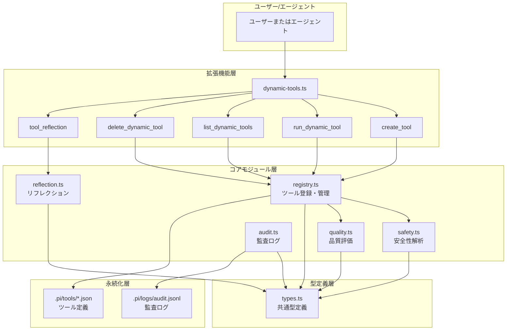
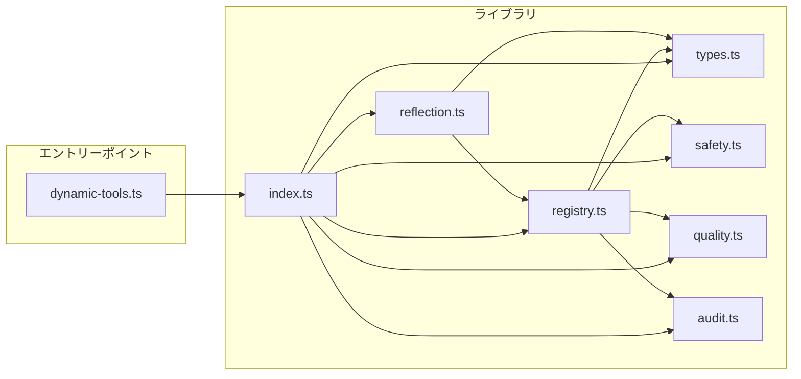
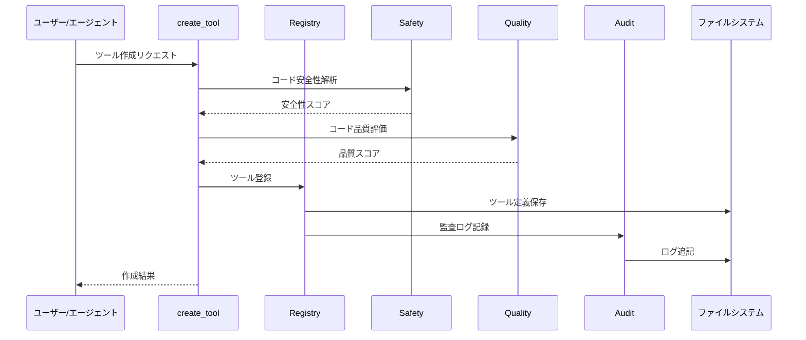
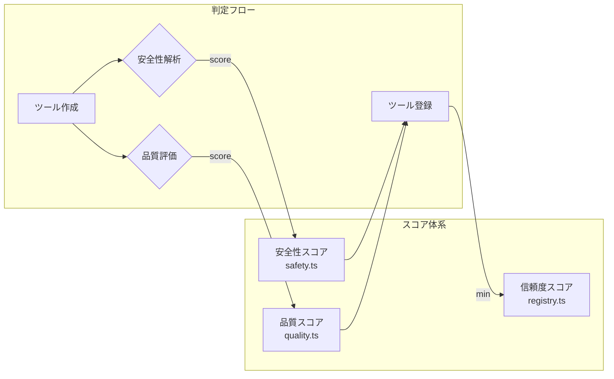

# 動的ツール生成システム

## 目次

- [概要](#概要)
- [前提条件](#前提条件)
- [Live-SWE-agentについて](#live-swe-agentについて)
- [アーキテクチャ](#アーキテクチャ)
- [クイックスタート](#クイックスタート)
- [ファイル構成](#ファイル構成)
- [トラブルシューティング](#トラブルシューティング)
- [関連ドキュメント](#関連ドキュメント)

---

## 概要

動的ツール生成システムは、Live-SWE-agent論文（arXiv:2511.13646v1）の概念に基づき、タスク実行中に必要なツールを動的に生成・実行・管理するシステムです。

### 主な特徴

- **動的ツール生成**: タスクに応じて新しいツールをその場で作成
- **安全性解析**: 11種類の危険パターンを検出し、リスクを評価
- **品質評価**: 生成されたコードの品質を多角的に評価
- **監査ログ**: 全操作を記録し、トレーサビリティを確保
- **リフレクション**: 実行結果を分析し、ツール生成の必要性を判定

---

## 前提条件

動的ツール生成システムを使用する前に、以下の条件を満たしていることを確認してください。

### 必須環境

| 項目 | 要件 |
|------|------|
| Node.js | v18.0.0以上 |
| TypeScript | v5.0.0以上（開発時） |
| pi-coding-agent | 最新版 |

### 拡張機能の有効化

動的ツール生成システムは、`.pi/extensions/dynamic-tools.ts`として配置され、pi起動時に自動的に読み込まれます。追加の設定は不要です。

### ディレクトリ構造の自動作成

初回使用時に以下のディレクトリが自動的に作成されます:

```
.pi/
├── tools/              # 生成されたツール定義
└── logs/
    └── dynamic-tools-audit.jsonl  # 監査ログ
```

---

## Live-SWE-agentについて

Live-SWE-agentは、大規模言語モデル（LLM）がタスク実行中に必要なツールを動的に生成する概念です。従来の静的なツールセットではなく、状況に応じて新しいツールを作成することで、より柔軟な問題解決を可能にします。

### 本実装の位置づけ

本実装は以下の特徴を持ちます:

| 特徴 | 説明 |
|------|------|
| 実行環境 | Node.js + TypeScript |
| 実行モデル | 同一プロセス内でフル権限実行 |
| 安全性制御 | 許可リスト（allowlist）ベースの検証 |
| 永続化 | ファイルシステムへのJSON保存 |

---

## アーキテクチャ

### 全体構成



### モジュールの依存関係



### データフロー



---

## クイックスタート

### 5分でわかる動的ツール生成

このチュートリアルでは、**「Markdown見出し抽出ツール」**を作成し、実際のファイル処理を体験します。

#### ステップ1: ツールを作成する

```typescript
create_tool({
  name: "extract_headings",
  description: "Markdownファイルから見出しを抽出する",
  code: `
async function execute(params) {
  const content = params.content;
  const maxLevel = params.max_level || 6;
  
  const lines = content.split("\\n");
  const headings = [];
  
  for (const line of lines) {
    const match = line.match(/^(#{1,6})\\s+(.+)$/);
    if (match) {
      const level = match[1].length;
      if (level <= maxLevel) {
        headings.push({
          level: level,
          text: match[2].trim()
        });
      }
    }
  }
  
  return headings;
}
`,
  parameters: {
    content: {
      type: "string",
      description: "Markdownファイルの内容",
      required: true
    },
    max_level: {
      type: "number",
      description: "抽出する見出しレベルの上限（1-6）",
      default: 6,
      minimum: 1,
      maximum: 6
    }
  },
  tags: ["markdown", "utility"]
})
```

**期待される出力**:
```
ツール「extract_headings」を作成しました。

ツールID: dt_abc123def456
安全性スコア: 1.00
品質スコア: 0.85
検証状態: verified

説明:
Markdownファイルから見出しを抽出する

パラメータ:
- content (string): Markdownファイルの内容
- max_level (number): 抽出する見出しレベルの上限（1-6）

使用方法:
run_dynamic_tool({ tool_id: "dt_abc123def456", parameters: { /* ... */ } })
```

#### ステップ2: ツールを実行する

**重要**: ツールの実行には2つの方法があります:
- **`tool_id`**: 正確なID指定（例: `dt_abc123def456`）。ステップ1の出力からコピー
- **`tool_name`**: 名前での指定（例: `extract_headings`）。覚えやすい

```typescript
// 方法1: tool_idで指定（正確）
run_dynamic_tool({
  tool_id: "dt_abc123def456",  // ステップ1の出力からコピー
  parameters: {
    content: "# Sample\n## Heading\nContent here",
    max_level: 3
  }
})

// 方法2: tool_nameで指定（簡便）
run_dynamic_tool({
  tool_name: "extract_headings",
  parameters: {
    content: "# Sample\n## Heading\nContent here",
    max_level: 3
  }
})
```

**期待される出力**:
```
ツール「extract_headings」の実行が完了しました。

実行時間: 12ms

結果:
[
  { "level": 1, "text": "動的ツール生成システム" },
  { "level": 2, "text": "概要" },
  { "level": 2, "text": "Live-SWE-agentについて" },
  { "level": 2, "text": "アーキテクチャ" },
  ...
]
```

#### ステップ3: よくあるエラーと対処法

| エラーメッセージ | 原因 | 対処法 |
|-----------------|------|--------|
| `ツール名は英字で始まり...` | 名前形式不正 | 英字で始まる名前に変更（例: `my_tool`） |
| `ツール名「...」は既に存在します` | 重複 | 別の名前を使用するか、既存ツールを削除 |
| `重大なセキュリティリスクが検出されました` | 危険なコードパターン | `fs.rm`や`eval`などの危険な操作を削除 |
| `必須パラメータが不足しています` | パラメータ不足 | `required: true`のパラメータを指定 |
| `実行タイムアウト` | 処理時間超過 | `timeout_ms`を増やすかコードを最適化 |

#### ステップ4: ツール一覧の確認

```typescript
list_dynamic_tools({})
```

#### ステップ5: 不要になったツールの削除

```typescript
delete_dynamic_tool({
  tool_name: "extract_headings",
  confirm: true
})
```

### チュートリアル完了後の状態

このチュートリアルを完了すると、以下のことができるようになります:

- [ ] 動的ツールの作成（`create_tool`）
- [ ] 動的ツールの実行（`run_dynamic_tool`）
- [ ] ツール一覧の確認（`list_dynamic_tools`）
- [ ] ツールの削除（`delete_dynamic_tool`）
- [ ] 基本的なエラーの対処

### 次のステップ

1. [APIリファレンス](./API.md)で全ツールの詳細を確認
2. [安全性ガイド](./SAFETY.md)で危険パターンと対策を学ぶ
3. `tool_reflection`でタスクパターンを分析し、自動ツール生成を活用

### その他のツール例

#### JSON整形ツール

```typescript
create_tool({
  name: "json_formatter",
  description: "JSONデータを整形して出力",
  code: `
async function execute(params) {
  const input = params.json_string;
  try {
    const parsed = JSON.parse(input);
    return JSON.stringify(parsed, null, 2);
  } catch (e) {
    return { error: "Invalid JSON: " + e.message };
  }
}
`,
  parameters: {
    json_string: {
      type: "string",
      description: "整形するJSON文字列",
      required: true
    }
  },
  tags: ["utility", "json"]
})
```

#### 実行後のリフレクション

```typescript
tool_reflection({
  task_description: "複数のJSONファイルを変換する",
  last_tool_result: "変換完了: 3ファイル処理",
  failed_attempts: 0
})
```

---

## 用語集

このドキュメントで使用される主要な用語と概念の関係を示します。



| 用語 | 説明 | 範囲 | 生成元 |
|------|------|------|--------|
| **安全性スコア** | コードの危険度を評価。危険パターン検出数に基づく | 0.0-1.0 | safety.ts |
| **品質スコア** | コードの保守性を評価。6カテゴリの加重平均 | 0.0-1.0 | quality.ts |
| **信頼度スコア** | ツールの実績に基づく信頼度。初期値は安全性/品質の最小値 | 0.0-1.0 | registry.ts |
| **検証状態** | ツールの検証レベル | unverified/pending/passed/failed/deprecated | registry.ts |
| **ツールID** | 一意識別子。`dt_` + 12文字ハッシュ | 例: dt_abc123def456 | registry.ts |

### スコアの関係

```
信頼度スコア = min(安全性スコア, 品質スコア) + 使用実績による調整
```

- 初回作成時: 信頼度 = min(安全性, 品質)
- 成功時: 信頼度 += 0.02（上限1.0）
- 失敗時: 信頼度 -= 0.05（下限0.1）

---

## ファイル構成

```
.pi/
├── extensions/
│   └── dynamic-tools.ts       # メイン拡張機能（ツールハンドラー）
├── lib/
│   └── dynamic-tools/
│       ├── index.ts           # エクスポート統合
│       ├── types.ts           # 型定義
│       ├── registry.ts        # ツール登録・管理
│       ├── safety.ts          # 安全性解析
│       ├── quality.ts         # 品質評価
│       ├── audit.ts           # 監査ログ
│       └── reflection.ts      # リフレクション
├── skills/
│   └── dynamic-tools/
│       └── SKILL.md           # スキル定義
├── tools/
│   └── dt_*.json              # 生成されたツール定義
├── logs/
│   └── dynamic-tools-audit.jsonl  # 監査ログ
└── docs/
    └── dynamic-tools/
        ├── README.md          # このファイル
        ├── API.md             # APIリファレンス
        ├── SAFETY.md          # 安全性ガイド
        ├── TROUBLESHOOTING.md # トラブルシューティングガイド
        └── OPERATIONS.md      # 運用手順書
```

---

## モジュール詳細

### types.ts - 型定義

全モジュールで使用される共通型を定義:

| 型 | 説明 |
|----|------|
| `DynamicToolDefinition` | ツール定義の完全な構造 |
| `DynamicToolMode` | 実行モード（bash/function/template/skill） |
| `VerificationStatus` | 検証状態（unverified/pending/passed/failed/deprecated） |
| `SafetyVerificationResult` | 安全性検証結果 |
| `DynamicToolsConfig` | システム設定 |

### registry.ts - ツール登録・管理

ツールのライフサイクルを管理:

- `DynamicToolRegistry` クラス: オブジェクト指向API
- `registerDynamicTool()`: ツール登録
- `listDynamicTools()`: ツール一覧取得
- `deleteDynamicTool()`: ツール削除
- `searchDynamicTools()`: キーワード検索
- `recommendToolsForTask()`: タスクに適したツール推奨

### safety.ts - 安全性解析

コードの安全性を多角的に評価:

- `analyzeCodeSafety()`: 詳細な安全性解析
- `quickSafetyCheck()`: 高速な簡易チェック
- `checkAllowlistCompliance()`: 許可リスト準拠チェック

### quality.ts - 品質評価

6つのカテゴリでコード品質を評価:

| カテゴリ | 評価内容 |
|----------|----------|
| readability | 可読性（行長、命名規則等） |
| errorHandling | エラーハンドリング |
| documentation | ドキュメント品質 |
| testability | テスタビリティ |
| performance | パフォーマンス効率 |
| securityAwareness | セキュリティ意識 |

### audit.ts - 監査ログ

全操作をJSONL形式で記録:

- `logAudit()`: ログ記録
- `readAuditLog()`: ログ読み込み
- `generateAuditReport()`: レポート生成

### reflection.ts - リフレクション

ツール実行後の分析と改善提案:

- `shouldCreateNewTool()`: ツール生成判定
- `detectRepetitivePattern()`: 繰り返しパターン検出
- `proposeToolFromTask()`: タスクからツール提案

---

## トラブルシューティング

詳細なトラブルシューティング手順、エラーコード一覧、シナリオ別の解決方法については [TROUBLESHOOTING.md](./TROUBLESHOOTING.md) を参照してください。

### よくある問題と解決方法

#### ツールが見つからない

**症状**: `エラー: ツールが見つかりません`

**原因**:
- ツールIDまたはツール名が間違っている
- ツールが削除されている
- ツール定義ファイルが破損している

**解決方法**:
```typescript
// ツール一覧で確認
list_dynamic_tools({})

// 名前で検索
list_dynamic_tools({ name: "ツール名の一部" })
```

**リカバリ手順（ツール定義ファイル破損時）**:
```bash
# 1. 破損したツール定義ファイルを特定
ls -la .pi/tools/

# 2. 破損したJSONファイルを確認
cat .pi/tools/dt_*.json | jq . > /dev/null 2>&1 || echo "破損ファイルあり"

# 3. 破損したファイルを削除またはバックアップ
mv .pi/tools/dt_broken.json .pi/tools/dt_broken.json.bak

# 4. ツールを再作成
create_tool({ name: "tool_name", ... })
```

#### 安全性チェック失敗

**症状**: `安全性チェック失敗: 〜が検出されました`

**原因**: コードに危険なパターンが含まれている

**解決方法**:
1. SAFETY.mdの「危険パターン一覧」を確認
2. 該当するパターンを修正するか、許可リストに追加

```typescript
// 安全な代替手段を使用
// 悪い例: eval(userInput)
// 良い例: JSON.parse(userInput)
```

**緊急時の対応（許可リスト調整が必要な場合）**:
```typescript
// 危険な操作が必要な場合、コードで明示的に許可リストを設定
import { analyzeCodeSafety, STANDARD_ALLOWLIST } from "./lib/dynamic-tools";

const result = analyzeCodeSafety(code, {
  allowlist: STANDARD_ALLOWLIST,
  strict: false
});
```

#### 実行タイムアウト

**症状**: `実行タイムアウト`

**原因**: 処理時間が制限を超過

**解決方法**:
```typescript
// タイムアウトを延長
run_dynamic_tool({
  tool_name: "slow_tool",
  parameters: { ... },
  timeout_ms: 60000  // 60秒に延長
})
```

**タイムアウト頻発時の調査手順**:
```bash
# 1. 監査ログでタイムアウト発生状況を確認
grep 'timeout' .pi/logs/dynamic-tools-audit.jsonl | tail -20

# 2. ツールの平均実行時間を確認
# （監査ログから実行時間を集計）

# 3. コードを最適化するか、タイムアウト値を調整
```

#### パラメータ不足エラー

**症状**: `必須パラメータが不足しています`

**原因**: 必須パラメータが指定されていない

**解決方法**:
```typescript
// ツール定義を確認して必須パラメータを特定
list_dynamic_tools({ name: "tool_name" })

// すべての必須パラメータを指定
run_dynamic_tool({
  tool_name: "tool_name",
  parameters: {
    required_param1: "value1",
    required_param2: "value2"
  }
})
```

#### 最大ツール数到達

**症状**: `最大ツール数に達しています`

**原因**: 登録ツール数が上限（デフォルト: 100）に達成

**解決方法**:
```typescript
// 不要なツールを削除
list_dynamic_tools({})
delete_dynamic_tool({ tool_name: "old_tool", confirm: true })
```

#### ツール実行エラー（ランタイムエラー）

**症状**: `ツール実行に失敗しました: <エラーメッセージ>`

**原因**:
- ツールコード内のバグ
- 予期しない入力値
- 外部リソースへのアクセス失敗

**解決方法**:
```typescript
// 1. エラー詳細を確認
// 実行結果のerrorフィールドを確認

// 2. デバッグモードで実行
run_dynamic_tool({
  tool_name: "problematic_tool",
  parameters: { ... },
  debug: true
})

// 3. ツールを修正して再作成
delete_dynamic_tool({ tool_name: "problematic_tool", confirm: true })
create_tool({ name: "problematic_tool", code: "/* 修正済みコード */", ... })
```

#### 信頼度スコアが低下

**症状**: ツールの信頼度スコアが継続的に低下

**原因**: ツール実行の失敗が繰り返されている

**解決方法**:
```bash
# 1. 監査ログで失敗パターンを分析
grep '"success":false' .pi/logs/dynamic-tools-audit.jsonl | \
  grep 'tool_name' | tail -50

# 2. 失敗の原因を特定
# - パラメータの問題？
# - 外部依存の問題？
# - コードのバグ？

# 3. 必要に応じてツールを再作成
```

#### 監査ログの破損

**症状**: 監査ログが読み込めない、または形式が不正

**原因**: ディスク障害、プロセス強制終了による書き込み中断

**リカバリ手順**:
```bash
# 1. 破損したログのバックアップ
cp .pi/logs/dynamic-tools-audit.jsonl .pi/logs/dynamic-tools-audit.jsonl.corrupted

# 2. 正常な行のみを抽出
cat .pi/logs/dynamic-tools-audit.jsonl.corrupted | \
  while read line; do echo "$line" | jq . > /dev/null 2>&1 && echo "$line"; done \
  > .pi/logs/dynamic-tools-audit.jsonl

# 3. ログの整合性確認
wc -l .pi/logs/dynamic-tools-audit.jsonl
```

### ログの確認方法

監査ログで問題を調査:

```bash
# 監査ログの場所
cat .pi/logs/dynamic-tools-audit.jsonl

# エラーのみ抽出
grep '"success":false' .pi/logs/dynamic-tools-audit.jsonl

# 特定ツールの履歴を確認
grep '"toolName":"target_tool"' .pi/logs/dynamic-tools-audit.jsonl

# 直近24時間の操作を確認
find .pi/logs -name "*.jsonl" -mtime -1 -exec cat {} \;

# 操作種別でフィルタ
grep '"action":"tool.create"' .pi/logs/dynamic-tools-audit.jsonl
grep '"action":"tool.delete"' .pi/logs/dynamic-tools-audit.jsonl
grep '"action":"verification.fail"' .pi/logs/dynamic-tools-audit.jsonl
```

### エラーコード一覧

| エラーメッセージ | 重大度 | 対処法 |
|-----------------|--------|--------|
| ツール名は必須です | low | nameパラメータを指定 |
| ツール名は英字で始まり... | low | 命名規則に従う（小文字英字開始） |
| ツール名「...」は既に存在します | medium | 別名を使用または既存ツール削除 |
| 最大ツール数に達しています | medium | 不要ツールの削除 |
| 重大なセキュリティリスクが検出されました | critical | コードの危険パターンを修正 |
| 安全性チェック失敗 | high | SAFETY.mdの危険パターン一覧を参照 |
| ツールが見つかりません | medium | 正しいID/名前を指定 |
| 必須パラメータが不足しています | low | 必須パラメータを追加 |
| 実行タイムアウト | medium | タイムアウト延長またはコード最適化 |
| ツール実行に失敗しました | high | エラー詳細を確認しコード修正 |

### 運用手順の詳細

日次・週次の運用手順、パフォーマンス監視、リカバリ手順などの詳細は [OPERATIONS.md](./OPERATIONS.md) を参照してください。

障害レベル分類、緊急時対応フロー、完全システム復旧手順など、詳細なリカバリ手順は [RECOVERY.md](./RECOVERY.md) を参照してください。

---

## よくある質問（FAQ）

### 基本操作に関する質問

#### Q: ツール名に使用できる文字は？

**A**: ツール名は以下のルールに従ってください：
- 英字で始める（数字や記号で始めない）
- 使用可能文字: 英字（小文字推奨）、数字、アンダースコア（_）、ハイフン（-）
- 64文字以内
- 予約語は使用不可（`bash`, `read`, `write`, `edit`, `question`など）

```typescript
// OK
"json_parser", "data_transformer_v2", "csv_to_json"

// NG
"1st_tool", "my-tool!", "MyTool"
```

#### Q: ツールの実行結果を確認するには？

**A**: `run_dynamic_tool`の戻り値に実行結果が含まれます：

```typescript
// 実行結果には実行時間と結果が表示されます
run_dynamic_tool({
  tool_name: "my_tool",
  parameters: { input: "test" }
})
// 出力:
// ツール「my_tool」の実行が完了しました。
// 実行時間: 15ms
// 結果:
// { "status": "success", ... }
```

#### Q: ツールを更新するには？

**A**: 現在、ツールの直接更新はサポートされていません。以下の手順で更新してください：

1. 新しいツールを別名（例: `tool_v2`）で登録
2. 動作確認
3. 旧ツールを削除
4. 必要に応じて新ツールを旧名称で再登録

#### Q: 複数のツールを一度に削除できますか？

**A**: 現在、ツールは1つずつ削除する必要があります：

```typescript
// 削除するツールのリストを確認
list_dynamic_tools({})

// 1つずつ削除
delete_dynamic_tool({ tool_name: "tool1", confirm: true })
delete_dynamic_tool({ tool_name: "tool2", confirm: true })
```

### エラー対応に関する質問

#### Q: 「重大なセキュリティリスクが検出されました」と表示される

**A**: コードにcritical重大度の危険パターンが含まれています。以下を確認してください：

- ファイル削除: `fs.rm`, `fs.unlink`など
- プロセス実行: `exec`, `spawn`など
- 動的コード実行: `eval`, `new Function`など

詳細はSAFETY.mdの「危険パターン一覧」を参照してください。

#### Q: 安全性スコアが低い場合でもツールを作成できますか？

**A**: はい。critical重大度のパターンがなければ、安全性スコアが低くてもツールは作成可能です。ただし、検証状態は`unverified`になります。

```typescript
// 出力例
// 安全性スコア: 0.45
// 品質スコア: 0.70
// 検証状態: unverified
```

#### Q: ツールが見つからないエラーが頻発する

**A**: 以下を確認してください：

1. ツール名のタイプミス（大文字小文字を含む）
2. ツールが削除されていないか
3. ツール定義ファイルが破損していないか

```typescript
// ツール一覧で確認
list_dynamic_tools({ name: "検索キーワード" })
```

### パフォーマンスに関する質問

#### Q: ツールの実行が遅い

**A**: 以下の対策を検討してください：

1. **タイムアウトを延長**: `timeout_ms`パラメータで延長
2. **コードの最適化**: ループの削減、バッチ処理
3. **データ量の削減**: 処理範囲を限定

```typescript
run_dynamic_tool({
  tool_name: "slow_tool",
  parameters: { batch_size: 100 },
  timeout_ms: 60000
})
```

#### Q: 最大ツール数に達した

**A**: 不要なツールを削除してください：

```typescript
// 未使用ツールの確認
list_dynamic_tools({})

// 削除
delete_dynamic_tool({ tool_name: "old_tool", confirm: true })
```

### 運用に関する質問

#### Q: 監査ログはどこに保存されますか？

**A**: `.pi/logs/dynamic-tools-audit.jsonl`にJSONL形式で保存されます。

#### Q: ツール定義のバックアップ方法は？

**A**: `.pi/tools/`ディレクトリをコピーしてください：

```bash
# バックアップ
cp -r .pi/tools ./backup_tools_$(date +%Y%m%d)
```

詳細は[OPERATIONS.md](./OPERATIONS.md)の「バックアップとリストア」を参照してください。

#### Q: ツールの使用状況を確認したい

**A**: `list_dynamic_tools`で使用回数と最終使用日時を確認できます：

```typescript
list_dynamic_tools({})
// 出力:
// - 使用回数: 15回 | 最終使用: 2026/02/16 12:00:00
```

または監査ログを分析してください：

```bash
grep '"action":"tool.run"' .pi/logs/dynamic-tools-audit.jsonl | \
  jq -r '.toolName' | sort | uniq -c | sort -rn
```

### セキュリティに関する質問

#### Q: どのようなコードがブロックされますか？

**A**: 以下のカテゴリのコードが検出・ブロックされます：

| カテゴリ | 重大度 | 例 |
|---------|--------|-----|
| ファイル削除 | critical | `fs.rm`, `fs.unlink` |
| プロセス実行 | critical | `exec`, `spawn` |
| 動的コード実行 | critical | `eval`, `new Function` |
| ネットワークアクセス | high | `fetch`, `axios` |
| ファイル書き込み | high | `fs.writeFile` |
| 機密データ参照 | high | `password`, `api_key` |

詳細はSAFETY.mdを参照してください。

#### Q: 外部APIにアクセスするツールを作成したい

**A**: ネットワークアクセスは`high`重大度で検出されます。以下の点に注意してください：

1. 信頼できるドメインのみにアクセス
2. タイムアウトを適切に設定
3. エラーハンドリングを実装

```typescript
async function execute(params) {
  const url = params.url;
  
  // ドメインのバリデーション
  const allowedDomains = ["api.example.com"];
  const hostname = new URL(url).hostname;
  
  if (!allowedDomains.includes(hostname)) {
    return { error: "許可されていないドメインです" };
  }
  
  // フェッチ処理...
}
```

---

## 関連ドキュメント

- [APIリファレンス](./API.md) - 各ツールの詳細な仕様
- [安全性ガイド](./SAFETY.md) - 安全性解析の仕組みと危険パターン一覧
- [トラブルシューティング](./TROUBLESHOOTING.md) - エラーコード一覧、問題診断フロー、FAQ
- [運用手順書](./OPERATIONS.md) - 運用・保守・リカバリ手順
- [リカバリ手順書](./RECOVERY.md) - 障害対応・緊急時対応・完全復旧手順
- [デプロイ手順書](./IMPLEMENTATION.md) - インストール、設定、デプロイ、アップグレード手順

---

## 注意事項

1. **実行権限**: 動的ツールは同一プロセス内でフル権限実行されます。信頼できないコードを実行しないでください。

2. **永続化**: ツール定義は `.pi/tools/` ディレクトリにJSON形式で保存されます。

3. **監査ログ**: 全操作は `.pi/logs/dynamic-tools-audit.jsonl` に記録されます。定期的にレビューしてください。

4. **最大ツール数**: デフォルトで最大100ツールまで登録可能です。設定で変更可能です。

5. **タイムアウト**: ツール実行のデフォルトタイムアウトは30秒です。
