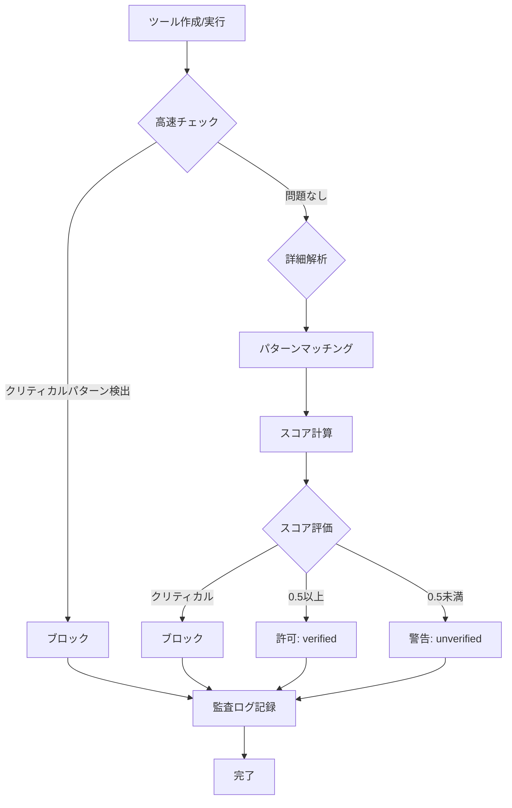

# 動的ツール生成システム 安全性解析

本ドキュメントでは、動的ツール生成システムの安全性解析の仕組みについて説明します。

## 目次

1. [概要](#概要)
2. [最初の3分で知るべき安全性ルール](#最初の3分で知るべき安全性ルール)
3. [安全性解析のフロー](#安全性解析のフロー)
4. [危険パターン一覧](#危険パターン一覧)
5. [許可リストの使い方](#許可リストの使い方)
6. [安全性スコアの計算](#安全性スコアの計算)
7. [ベストプラクティス](#ベストプラクティス)

---

## 概要

### 安全性解析の目的

動的に生成されたコードは、任意の操作を実行できる可能性があります。安全性解析は以下の目的で実施されます:

1. **意図しないデータ破壊の防止**: ファイル削除や上書きの検出
2. **システムへの影響の最小化**: プロセス実行やリソース枯渇の防止
3. **機密情報の保護**: パスワードやAPIキーの漏洩防止
4. **コードインジェクションの防止**: evalや動的コード実行の検出

### 解析のタイミング

安全性解析は以下の2段階で実行されます:

1. **ツール作成時**: `create_tool`実行時に詳細な安全性解析を実施
2. **ツール実行時**: `run_dynamic_tool`実行時に高速チェックを実施

---

## 最初の3分で知るべき安全性ルール

動的ツールを作成する前に、以下の**3つのルール**を理解してください。これらを守るだけで、ほとんどのセキュリティ問題を回避できます。

### ルール1: 禁止操作を避ける

以下の操作は、許可リストなしではブロックされます:

| 操作 | パターン例 | 重大度 |
|-----|----------|--------|
| ファイル削除 | `fs.rm`, `fs.unlink` | critical |
| 外部プロセス実行 | `exec`, `spawn` | critical |
| 動的コード実行 | `eval`, `new Function` | critical |
| ネットワークアクセス | `fetch`, `axios` | high |
| ファイル書き込み | `fs.writeFile` | high |

**代替案**:
```javascript
// 悪い例（ブロックされる）
eval(userCode);
fs.rm("/path/to/file");
exec("rm -rf ./temp");

// 良い例（安全）
JSON.parse(jsonString);           // evalの代わり
fs.readFile(path, "utf-8");       // 読み取りのみ
// 削除は論理削除またはアーカイブで対応
```

### ルール2: パラメータをバリデーションする

入力パラメータは必ず検証してください:

```javascript
async function execute(params) {
  // 必須パラメータのチェック
  if (!params.file_path) {
    return { error: "file_path is required" };
  }
  
  // 型のチェック
  if (typeof params.file_path !== "string") {
    return { error: "file_path must be a string" };
  }
  
  // パストラバーサル攻撃の防止
  const resolvedPath = path.resolve(params.file_path);
  if (!resolvedPath.startsWith(process.cwd())) {
    return { error: "Access denied" };
  }
  
  // 安全な処理を続行
}
```

### ルール3: エラーハンドリングを実装する

適切なエラーハンドリングで、予期しない挙動を防ぎます:

```javascript
async function execute(params) {
  try {
    const data = fs.readFileSync(params.file_path, "utf-8");
    return { success: true, data };
  } catch (error) {
    return { 
      success: false, 
      error: error instanceof Error ? error.message : String(error) 
    };
  }
}
```

### クイックチェックリスト

ツール作成前に確認:

- [ ] `fs.rm`, `fs.unlink`などの削除操作を使っていないか?
- [ ] `eval`, `new Function`などの動的実行を使っていないか?
- [ ] `exec`, `spawn`などのプロセス実行を使っていないか?
- [ ] 入力パラメータをバリデーションしているか?
- [ ] エラーハンドリングを実装しているか?

すべて「はい」なら、安全性スコアは0.8以上になる可能性が高いです。

---

## 安全性解析のフロー



### 高速チェック（quickSafetyCheck）

ツール実行前に瞬時に実行される簡易チェック。クリティカルな危険パターンのみを検出:

- ファイル/ディレクトリ削除
- 外部プロセス実行
- eval/Function動的コード実行

```typescript
const quickCheck = quickSafetyCheck(code);
if (!quickCheck.isSafe) {
  return { success: false, error: quickCheck.reason };
}
```

### 詳細解析（analyzeCodeSafety）

ツール作成時に実行される包括的な解析:

- 11種類の危険パターンを検出
- 安全性スコアを計算（0.0-1.0）
- 推奨事項を生成

```typescript
const analysis = analyzeCodeSafety(code, { strict: true });
// {
//   score: 0.75,
//   issues: [...],
//   allowedOperations: [...],
//   blockedOperations: [...],
//   recommendations: [...],
//   isSafe: true,
//   confidence: 0.85
// }
```

---

## 危険パターン一覧

安全性解析では、以下の11種類の危険パターンを検出します。

### カテゴリ1: ファイルシステム操作

#### 1.1 ファイルシステム削除 (file-system-delete)

**重大度**: critical

| パターン | 説明 |
|---------|------|
| `fs.rm(`, `fs.rmdir(`, `fs.unlink(` | Node.jsファイル削除API |
| `rmSync(`, `unlinkSync(` | 同期的な削除操作 |
| `rm -rf`, `rmdir` | シェルコマンドによる削除 |

**検出例**:

```javascript
// 検出されるコード
fs.rm("/path/to/file", { recursive: true });
execSync("rm -rf ./temp");
```

**対処法**: 削除操作が必要な場合は、許可リストで明示的に許可してください。

#### 1.2 ファイルシステム書き込み (file-system-write)

**重大度**: high

| パターン | 説明 |
|---------|------|
| `fs.writeFile(`, `fs.writeFileSync(` | ファイル書き込み |
| `fs.appendFile(`, `fs.appendFileSync(` | ファイル追記 |
| `fs.mkdir(`, `fs.mkdirSync(` | ディレクトリ作成 |

**検出例**:

```javascript
// 検出されるコード
fs.writeFileSync("/path/to/file", content);
fs.appendFileSync(logFile, logEntry);
```

**対処法**: 書き込み先パスをバリデーションし、許可されたパスのみに限定してください。

### カテゴリ2: プロセス実行

#### 2.1 プロセス実行 (process-spawn)

**重大度**: critical

| パターン | 説明 |
|---------|------|
| `child_process` | 子プロセスモジュール |
| `spawn(`, `exec(`, `execSync(` | プロセス実行API |
| `spawnSync(` | 同期的なプロセス実行 |

**検出例**:

```javascript
// 検出されるコード
const { exec } = require("child_process");
exec("ls -la", (error, stdout) => { ... });
execSync("npm install");
```

**対処法**: 外部プロセスの実行は許可されたコマンドのみに限定してください。

### カテゴリ3: ネットワークアクセス

#### 3.1 ネットワークアクセス (network-access)

**重大度**: high

| パターン | 説明 |
|---------|------|
| `fetch(` | Fetch API |
| `http.request`, `https.request` | HTTPリクエスト |
| `axios`, `superagent`, `node-fetch` | HTTPクライアント |
| `WebSocket`, `socket.io` | WebSocket接続 |

**検出例**:

```javascript
// 検出されるコード
fetch("https://api.example.com/data");
axios.get("/api/users");
const ws = new WebSocket("wss://example.com");
```

**対処法**: 外部APIアクセスは許可リストで制御し、信頼できるエンドポイントのみに限定してください。

### カテゴリ4: 動的コード実行

#### 4.1 eval使用 (eval-usage)

**重大度**: critical

| パターン | 説明 |
|---------|------|
| `eval(` | コード評価 |
| `new Function(` | 動的関数生成 |
| `vm.runIn` | VMでのコード実行 |

**検出例**:

```javascript
// 検出されるコード
eval("console.log('hello')");
new Function("return 1 + 1")();
vm.runInNewContext(userCode);
```

**対処法**: evalの使用は避け、静的なコード解析またはパーサーを使用してください。

### カテゴリ5: 環境変数と機密データ

#### 5.1 環境変数アクセス (environment-access)

**重大度**: medium

| パターン | 説明 |
|---------|------|
| `process.env[` | 動的な環境変数アクセス |

**検出例**:

```javascript
// 検出されるコード
const key = process.env[userProvidedKey];
```

**対処法**: 必要な環境変数のみを明示的にアクセスしてください。

#### 5.2 機密データ (sensitive-data)

**重大度**: high

| パターン | 説明 |
|---------|------|
| `password`, `secret`, `api_key` | 機密データへの参照 |
| `token`, `credential`, `private_key` | 認証情報 |

**検出例**:

```javascript
// 検出されるコード
const password = "hardcoded_password";
const apiKey = getApiKey();
```

**対処法**: 機密データは環境変数または安全なストレージから取得してください。

### カテゴリ6: リソース枯渇

#### 6.1 無限ループ (unbounded-operation)

**重大度**: high

| パターン | 説明 |
|---------|------|
| `while(true)`, `for(;;)` | 無限ループ |

**検出例**:

```javascript
// 検出されるコード
while (true) {
  // 処理
}
```

**対処法**: ループには上限を設けてください。

#### 6.2 リソース枯渇 (resource-exhaustion)

**重大度**: medium

| パターン | 説明 |
|---------|------|
| `setTimeout(..., [長い時間])` | 非常に長いタイムアウト |

**検出例**:

```javascript
// 検出されるコード（1000万ミリ秒 = 約2.8時間）
setTimeout(callback, 10000000);
```

**対処法**: タイムアウトは合理的な範囲内に設定してください。

### カテゴリ7: その他の脆弱性

#### 7.1 プロトタイプ汚染 (prototype-pollution)

**重大度**: high

| パターン | 説明 |
|---------|------|
| `__proto__` | プロトタイプ直接アクセス |
| `constructor.prototype` | コンストラクタ経由のアクセス |
| `Object.assign(..., ...)` | 深いマージ |

**検出例**:

```javascript
// 検出されるコード
obj.__proto__.polluted = true;
Object.assign(target, ...sources);
```

**対処法**: オブジェクトの深いマージは安全な方法で行ってください。

#### 7.2 危険な正規表現 (unsafe-regex)

**重大度**: medium

| パターン | 説明 |
|---------|------|
| ネストした量指定子 | ReDoS脆弱性 |

**検出例**:

```javascript
// 検出されるコード
/(a+)+$/.test(input);  // ReDoS脆弱性あり
/(a*)*$/.test(input);
```

**対処法**: ネストした量指定子を避けてください。

---

## 危険パターン一覧表

| 種類 | 重大度 | カテゴリ | 主なパターン |
|-----|-------|---------|-------------|
| file-system-delete | critical | ファイルシステム | `fs.rm`, `fs.unlink`, `rm -rf` |
| file-system-write | high | ファイルシステム | `fs.writeFile`, `fs.appendFile` |
| process-spawn | critical | プロセス | `exec`, `spawn`, `child_process` |
| network-access | high | ネットワーク | `fetch`, `axios`, `WebSocket` |
| eval-usage | critical | コード実行 | `eval`, `new Function`, `vm.runIn` |
| environment-access | medium | 環境変数 | `process.env[` |
| sensitive-data | high | 機密データ | `password`, `api_key`, `token` |
| unbounded-operation | high | リソース | `while(true)`, `for(;;)` |
| resource-exhaustion | medium | リソース | 長いタイムアウト |
| prototype-pollution | high | 脆弱性 | `__proto__`, `constructor.prototype` |
| unsafe-regex | medium | 脆弱性 | ネストした量指定子 |

---

## 許可リストの使い方

### 許可リストの種類

システムは3種類の標準許可リストを提供しています:

#### 1. デフォルト読み取り専用 (DEFAULT_READONLY_ALLOWLIST)

最も制限的。読み取り操作のみ許可。

```typescript
["file-system-read"]
```

#### 2. 標準 (STANDARD_ALLOWLIST)

読み取りと制限付き書き込みを許可。

```typescript
["file-system-read", "file-system-write"]
```

#### 3. フルアクセス (FULL_ACCESS_ALLOWLIST)

すべての操作を許可。使用注意。

```typescript
[
  "file-system-read",
  "file-system-write",
  "file-system-delete",
  "process-spawn",
  "network-access",
]
```

### 許可リストの適用

#### コードでの適用

```typescript
import { analyzeCodeSafety, STANDARD_ALLOWLIST } from "./lib/dynamic-tools";

const result = analyzeCodeSafety(code, {
  allowlist: STANDARD_ALLOWLIST,
  strict: true
});
```

#### 許可リストのカスタマイズ

```typescript
// カスタム許可リスト
const customAllowlist = [
  "file-system-read",
  "file-system-write",
  "network-access",  // ネットワークアクセスを許可
];

const result = analyzeCodeSafety(code, {
  allowlist: customAllowlist
});
```

### 許可リスト準拠チェック

```typescript
import { checkAllowlistCompliance } from "./lib/dynamic-tools";

const compliance = checkAllowlistCompliance(code, allowlist);
// {
//   compliant: false,
//   violations: ["許可されていない操作: process-spawn"]
// }
```

---

## 安全性スコアの計算

### スコアの範囲

安全性スコアは0.0から1.0の範囲で計算されます:

| スコア範囲 | 状態 | 説明 |
|-----------|------|------|
| 0.8以上 | 安全 | 検証済み、問題なし |
| 0.5-0.8 | 注意 | 軽微な問題あり |
| 0.5未満 | 警告 | 要確認、unverified |
| 0.0 | 危険 | クリティカルな問題あり |

### ペナルティ計算

各問題に対して重大度に応じたペナルティが適用されます:

```typescript
function getSeverityPenalty(severity, strict) {
  const multipliers = strict ? 1.5 : 1.0;

  switch (severity) {
    case "critical": return 0.5 * multipliers;  // -0.5 or -0.75
    case "high":     return 0.25 * multipliers; // -0.25 or -0.375
    case "medium":   return 0.1 * multipliers;  // -0.1 or -0.15
    case "low":      return 0.05 * multipliers; // -0.05 or -0.075
  }
}
```

### スコア計算の例

```javascript
// 初期スコア: 1.0

// コードに以下のパターンが含まれる場合:
// - fs.writeFile (high): -0.25
// - password参照 (high): -0.25
// - while(true) (high): -0.25

// 最終スコア: 1.0 - 0.25 - 0.25 - 0.25 = 0.25
```

### 信頼度の計算

信頼度は解析結果の確からしさを表します:

```typescript
let confidence = 0.7;  // ベースライン

if (issues.length === 0) {
  confidence = 0.9;    // 問題なし
} else if (issues.some(i => i.severity === "critical")) {
  confidence = 0.5;    // クリティカルな問題あり
}
```

---

## ベストプラクティス

### 1. 最小権限の原則

必要な操作のみを許可する許可リストを使用してください:

```typescript
// 良い例: 読み取り専用
const result = analyzeCodeSafety(code, {
  allowlist: DEFAULT_READONLY_ALLOWLIST
});

// 避けるべき例: フルアクセス
const result = analyzeCodeSafety(code, {
  allowlist: FULL_ACCESS_ALLOWLIST  // 注意が必要
});
```

### 2. 厳格モードの使用

本番環境では厳格モードを有効にしてください:

```typescript
const result = analyzeCodeSafety(code, {
  strict: true  // ペナルティが1.5倍に増加
});
```

### 3. 定期的な監査

監査ログを定期的に確認し、不審な操作を検出してください:

```typescript
import { readAuditLog, generateAuditReport } from "./lib/dynamic-tools";

// 過去7日間のログを確認
const since = new Date();
since.setDate(since.getDate() - 7);

const report = generateAuditReport(since);
console.log(report);
```

### 4. 安全なパターンの使用

危険なパターンを避け、安全な代替手段を使用してください:

| 危険なパターン | 安全な代替手段 |
|--------------|---------------|
| `eval(code)` | パーサーライブラリを使用 |
| `exec(cmd)` | 許可されたコマンドのみ実行 |
| `fs.rm(path)` | 論理削除またはアーカイブ |
| `password = "xxx"` | `process.env.PASSWORD` |

### 5. エラーハンドリングの実装

ツールコードには適切なエラーハンドリングを実装してください:

```typescript
async function execute(params) {
  try {
    // 処理
    return { success: true, result };
  } catch (error) {
    // エラーを適切に処理
    console.error("Error:", error.message);
    return { success: false, error: error.message };
  }
}
```

### 6. 入力のバリデーション

パラメータのバリデーションを実装してください:

```typescript
async function execute(params) {
  // 入力のバリデーション
  if (!params.file_path || typeof params.file_path !== "string") {
    return { success: false, error: "file_path is required" };
  }

  // パストラバーサル攻撃の防止
  const resolvedPath = path.resolve(params.file_path);
  if (!resolvedPath.startsWith(process.cwd())) {
    return { success: false, error: "Access denied" };
  }

  // 安全な処理を続行
}
```

---

## よくある質問（FAQ）

### Q1: 「重大なセキュリティリスクが検出されました」と表示される

**原因**: コードにcriticalレベルの危険パターンが含まれています。

**対処法**: 以下のパターンが含まれていないか確認してください:
- ファイル削除（`fs.rm`, `fs.unlink`, `rm -rf`）
- プロセス実行（`exec`, `spawn`, `child_process`）
- 動的コード実行（`eval`, `new Function`, `vm.runIn`）

```typescript
// 危険な例
exec("ls -la");  // process-spawn

// 安全な代替
fs.readdirSync(".");  // Node.js標準APIを使用
```

### Q2: 安全性スコアが0.5未満になる

**原因**: highレベルの問題が2つ以上、またはmediumレベルの問題が5つ以上検出されました。

**対処法**: SAFETY.mdの「危険パターン一覧」を参照し、検出されたパターンを修正してください。

### Q3: 許可リストを設定したい

**対処法**: 現在、許可リストはコードでのみ設定可能です。将来的には設定ファイルでの指定をサポートする予定です。

```typescript
// 一時的な対応: ツール作成時にカスタム許可リストを使用
import { analyzeCodeSafety, STANDARD_ALLOWLIST } from "./lib/dynamic-tools";

const result = analyzeCodeSafety(code, {
  allowlist: STANDARD_ALLOWLIST
});
```

### Q4: ネットワークアクセスを含むツールを作成したい

**原因**: ネットワークアクセスはhighレベルの危険パターンとして検出されます。

**対処法**: 
1. 外部APIへのアクセスが本当に必要か再検討
2. 必要な場合は、信頼できるドメインのみに限定するバリデーションを実装

```typescript
async function execute(params) {
  const url = params.url;
  
  // ドメインのバリデーション
  const allowedDomains = ["api.example.com", "cdn.example.com"];
  const urlObj = new URL(url);
  
  if (!allowedDomains.includes(urlObj.hostname)) {
    return { error: "許可されていないドメインです" };
  }
  
  // フェッチ処理...
}
```

### Q5: 監査ログを確認したい

**対処法**: `.pi/logs/dynamic-tools-audit.jsonl`にJSONL形式で記録されています。

```bash
# 最近のエントリを確認
tail -20 .pi/logs/dynamic-tools-audit.jsonl | jq .

# 失敗した操作のみ抽出
grep '"success":false' .pi/logs/dynamic-tools-audit.jsonl | jq .
```

---

## 関連ドキュメント

- [README](./README.md) - システム概要とアーキテクチャ
- [APIリファレンス](./API.md) - 各ツールの詳細なパラメータと戻り値
- [トラブルシューティング](./TROUBLESHOOTING.md) - エラーコード一覧、安全性エラーの詳細
- [運用ガイド](./OPERATIONS.md) - 日常運用、保守、監視手順
- [リカバリ手順書](./RECOVERY.md) - 障害対応・緊急時対応・完全復旧手順
- [デプロイ手順書](./IMPLEMENTATION.md) - インストール、設定、デプロイ手順

---

## 参考資料

- OWASP Code Injection: https://owasp.org/www-community/attacks/Code_Injection
- Node.js Security Best Practices: https://nodejs.org/en/docs/guides/security/
- ReDoS (Regular Expression Denial of Service): https://owasp.org/www-community/attacks/Regular_expression_Denial_of_Service_-_ReDoS
