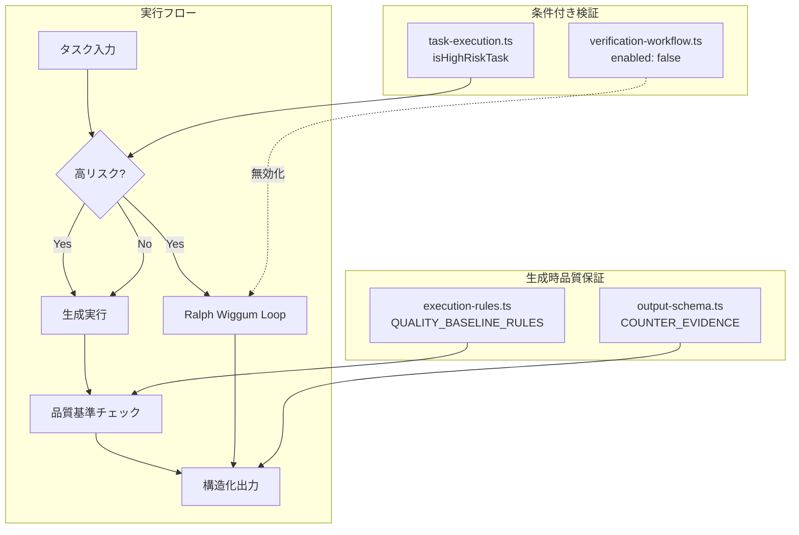

# 生成時品質保証システム データフロー

## 概要

「検証」から「生成時品質保証」への転換に伴い、以下の4つのコンポーネントを統合実装した。

## システム構成図



## コンポーネント詳細

### 1. QUALITY_BASELINE_RULES (execution-rules.ts)

**場所**: `.pi/lib/execution-rules.ts`

**目的**: LLMエージェントの出力生成時に適用される品質基準

**内容**:
- CLAIM-RESULT整合性チェック
- EVIDENCEの具体性要件
- CONFIDENCEの妥当性評価
- COUNTER_EVIDENCE必須化（高リスク時）
- 境界条件の明示

**統合方法**:
```typescript
// buildExecutionRulesSection内でデフォルト有効
if (options.includeQualityBaseline !== false) {
  lines.push(QUALITY_BASELINE_RULES.trim());
}
```

### 2. COUNTER_EVIDENCE フィールド (output-schema.ts)

**場所**: `.pi/lib/output-schema.ts`

**目的**: 構造化出力に反証証拠フィールドを追加

**変更点**:
- `ParsedStructuredOutput` インターフェースに追加
- `TEAM_MEMBER_OUTPUT_SCHEMA` に定義追加
- `parseStructuredOutput` 関数で解析対応

**スキーマ定義**:
```typescript
COUNTER_EVIDENCE: {
  type: "string",
  required: false,  // 高リスク時は必須推奨
  maxLength: 2000,
}
```

### 3. Ralph Wiggum Loop (task-execution.ts)

**場所**: `.pi/extensions/subagents/task-execution.ts`

**目的**: 高リスクタスク時のみ自己修正ループを適用

**実装**:
```typescript
// 高リスクタスク判定
const HIGH_RISK_PATTERNS: RegExp[] = [
  /削除/i, /delete/i, /remove/i,
  /本番/i, /production/i, /prod/i,
  /セキュリティ/i, /security/i, /auth/i,
  /権限/i, /permission/i, /privilege/i,
];

export function isHighRiskTask(task: string): boolean {
  return HIGH_RISK_PATTERNS.some(pattern => pattern.test(task));
}

// 条件付き適用
if (isHighRiskTask(input.task)) {
  // simpleVerificationHookを実行
}
```

### 4. 検証システム無効化 (verification-workflow.ts)

**場所**: `.pi/lib/verification-workflow.ts`

**変更点**:
```typescript
export const DEFAULT_VERIFICATION_CONFIG = {
  enabled: false,  // 生成時品質保証への転換により無効化
  // ...
};
```

## データフロー

1. **タスク受領**: サブエージェントがタスクを受け取る
2. **リスク評価**: `isHighRiskTask()` で高リスク判定
3. **プロンプト生成**: `QUALITY_BASELINE_RULES` を含むプロンプト構築
4. **実行**: LLMが生成を実行
5. **出力解析**: `COUNTER_EVIDENCE` を含む構造化出力を解析
6. **条件付き検証**: 高リスク時のみ `simpleVerificationHook` 実行
7. **結果返却**: 正規化された出力を返却

## 環境変数

| 変数名 | 値 | 説明 |
|--------|-----|------|
| `PI_VERIFICATION_WORKFLOW_MODE` | `disabled` | 事後検証を無効化 |
| `PI_OUTPUT_SCHEMA_MODE` | `strict` | スキーマ検証を使用 |

## 移行ガイド

### 従来の検証ワークフローからの移行

1. `DEFAULT_VERIFICATION_CONFIG.enabled` が `false` に設定済み
2. 生成時に `QUALITY_BASELINE_RULES` が自動適用される
3. 高リスクタスクのみ追加の検証が実行される

### 新しい出力フォーマット

```
SUMMARY: <短い要約>
CLAIM: <1文の中核主張>
EVIDENCE: <カンマ区切りの証拠>
CONFIDENCE: <0.0-1.0>
COUNTER_EVIDENCE: <反証証拠>
DISCUSSION: <議論>
RESULT:
<メイン回答>
NEXT_STEP: <次のアクション>
```

## 変更ファイル一覧

| ファイル | 変更内容 |
|----------|----------|
| `.pi/lib/execution-rules.ts` | `QUALITY_BASELINE_RULES` 追加、`includeQualityBaseline` オプション追加 |
| `.pi/lib/output-schema.ts` | `COUNTER_EVIDENCE` フィールド追加 |
| `.pi/extensions/subagents/task-execution.ts` | `isHighRiskTask()` 追加、条件付き検証実装 |
| `.pi/lib/verification-workflow.ts` | `enabled: false` 設定 |
