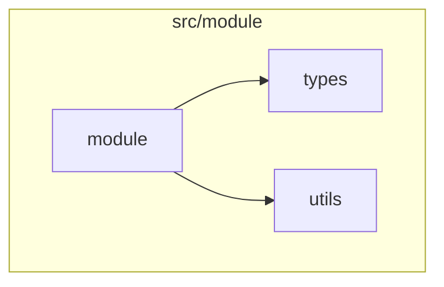
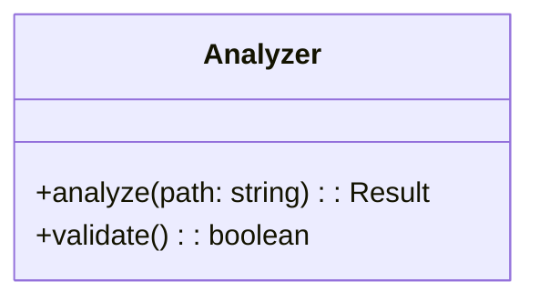

# Code Structure Analyzer Extension

実装からドキュメントを自動生成するハイブリッドシステム。

## 概要

この拡張機能は、TypeScriptソースコードを解析し、ドキュメント生成に必要なデータを自動的に抽出します。機械的生成（AST抽出、Mermaid図）とLLM解説を融合させ、効率的かつ高精度なドキュメント作成を実現します。

## アーキテクチャ

```
┌─────────────────────────────────────────────────────────────────────┐
│               ハイブリッドドキュメント生成フロー                       │
└──────────────────────────┬──────────────────────────────────────────┘
                           │
┌──────────────────────────▼──────────────────────────────────────────┐
│  Phase 1: 機械的生成 (code-structure-analyzer)                       │
│  ┌─────────────────┐  ┌─────────────────┐  ┌─────────────────────┐  │
│  │ AST抽出         │  │ Mermaid図生成   │  │ ドキュメント雛形    │  │
│  │                 │  │                 │  │                     │  │
│  │ - 関数シグネチャ│  │ - flowchart     │  │ - APIリファレンス   │  │
│  │ - クラス構造    │  │ - classDiagram  │  │ - 構造説明          │  │
│  │ - インターフェース│ │ - sequenceDiagram│ │ - LLM用プレースホルダ│ │
│  │ - 依存関係      │  │                 │  │                     │  │
│  └────────┬────────┘  └────────┬────────┘  └────────┬────────────┘  │
│           │                    │                    │                │
│           └────────────────────┴────────────────────┘                │
│                                │                                     │
└────────────────────────────────┼─────────────────────────────────────┘
                                 │
┌────────────────────────────────▼─────────────────────────────────────┐
│  Phase 2: LLM解説 (既存チーム連携)                                    │
│  ┌─────────────────┐  ┌─────────────────┐  ┌─────────────────────┐  │
│  │ Mermaid Diagram │  │ Docs Enablement │  │ Doc Gardening       │  │
│  │ Team            │  │ Team            │  │ Team                │  │
│  │                 │  │                 │  │                     │  │
│  │ - 図の検証      │  │ - 解説追加      │  │ - 鮮度チェック      │  │
│  │ - 整合性確認    │  │ - 品質保証      │  │ - 同期確認          │  │
│  └─────────────────┘  └─────────────────┘  └─────────────────────┘  │
│                                                                      │
└──────────────────────────────────────────────────────────────────────┘
```

## 提供ツール

### 1. `analyze_code_structure`

TypeScriptソースコードを解析し、構造データ、Mermaid図、ドキュメントセクションを一括生成。

```typescript
// 使用例
await analyzeCodeStructure({
  target: './src/my-module',
  diagramTypes: ['flowchart', 'classDiagram', 'sequenceDiagram'],
  includeLLMContext: true
});
```

**パラメータ**:
| 名前 | 型 | 必須 | 説明 |
|------|-----|------|------|
| target | string | はい | 解析対象のファイルまたはディレクトリパス |
| outputDir | string | いいえ | 出力ディレクトリ |
| diagramTypes | string[] | いいえ | 生成する図の種類（デフォルト: 全て） |
| includeLLMContext | boolean | いいえ | LLM用コンテキストを含める（デフォルト: true） |

**戻り値**:
- `structure`: 構造化データ（関数、クラス、インターフェース等）
- `diagrams`: Mermaid図（flowchart、classDiagram、sequenceDiagram）
- `docSections`: ドキュメントセクション（タイトル、概要、APIリファレンス等）
- `metadata`: メタデータ（解析日時、ファイルハッシュ等）

### 2. `extract_structure`

構造データのみを抽出（軽量版）。AST解析結果をJSONで取得。

```typescript
const structure = await extractStructure({
  target: './src/my-module',
  exclude: ['**/*.test.ts', '**/__tests__/**']
});
```

### 3. `generate_diagrams`

構造データからMermaid図のみを生成。

```typescript
const diagrams = await generateDiagrams({
  structure: structureData,
  types: ['flowchart', 'classDiagram']
});
```

### 4. `generate_markdown_doc`

解析結果からMarkdown形式のドキュメントを生成。

```typescript
const markdown = await generateMarkdown({
  result: analysisResult,
  outputPath: './ABDD/my-module.md'
});
```

## ワークフロー

### 推奨される使用フロー

```
1. 機械的生成
   ↓ analyze_code_structure
2. 出力確認
   ↓ 図・シグネチャの正確性
3. 既存チーム連携
   ↓ Mermaid Diagram Team で図を検証
4. LLM解説追加
   ↓ Docs Enablement Team で解説を追加
5. 品質チェック
   ↓ Doc Gardening Team で同期確認
6. 最終ドキュメント
```

### 既存チームとの統合

#### Mermaid Diagram Team連携

Phase 1（Code Analyzer）の入力として構造データを提供：

```typescript
// 構造データを抽出
const structure = await extractStructure({ target: './src' });

// Mermaid Diagram Team に引き継ぎ
// - Phase 1: 構造データを基に詳細解析
// - Phase 2: 図式作成（機械的生成図をベースに改善）
// - Phase 3: 構文検証
// - Phase 4: 整合性確認
```

#### Docs Enablement Team連携

生成された雛形に解説を追加：

```typescript
// ドキュメントセクションを生成
const docSections = generateDocSections(structure, diagrams);

// Docs Enablement Team に引き継ぎ
// - README Owner: 概要セクションを充実
// - Runbook Owner: 運用手順を追加
// - Docs Reviewer: 品質チェック
```

#### Doc Gardening Team連携

コード変更時の同期チェック：

```typescript
// ファイルハッシュを比較
const currentHash = result.metadata.fileHash;
const previousHash = getStoredHash('./ABDD/my-module.md');

if (currentHash !== previousHash) {
  // 再生成が必要
  // Doc Gardening Team に通知
}
```

## 生成されるドキュメント形式

```markdown
---
title: モジュール名 リファレンス
category: reference
audience: developer
last_updated: 2026-02-18
tags: [api-reference, auto-generated]
---

## 概要

<!-- LLM解説エリア: 以下に実装の概要を記述 -->

### 統計情報

| 項目 | 数 |
|------|-----|
| ファイル数 | 5 |
| 関数数 | 23 |
| クラス数 | 3 |

## 構造

### ファイル構造

```
src/
  module/
    index.ts
    types.ts
    utils.ts
```

### 外部依存

- `typescript`
- `minimatch`

## APIリファレンス

### 関数

#### `analyzeCodeStructure`

```typescript
async analyzeCodeStructure(params: AnalyzeOptions): Promise<AnalysisResult>
```

**パラメータ**

| 名前 | 型 | 必須 | 説明 |
|------|-----|------|------|
| target | string | はい | 解析対象パス |
| outputDir | string | いいえ | 出力ディレクトリ |

## 図解

### 依存関係図



### クラス図



## 詳細解説

<!-- LLM解説エリア: 以下に実装の詳細な解説を記述 -->
<!-- 設計判断、使用例、注意点などを追加してください -->

_（このセクションはLLMまたは人間が記述します）_

## メタデータ

| 項目 | 値 |
|------|-----|
| 解析日時 | 2026-02-18T00:00:00.000Z |
| ソースパス | ./src/module |
| ファイルハッシュ | abc123... |
```

## LLM用コンテキスト

`includeLLMContext: true` を設定すると、LLMが解説を追加する際に役立つ情報が含まれます：

```json
{
  "summary": "5ファイル、23関数、3クラスを検出。",
  "keyFunctions": [
    "analyzeCodeStructure(params)",
    "extractStructure(target)",
    "generateDiagrams(structure)"
  ],
  "keyClasses": ["Analyzer", "Parser", "Generator"],
  "keyInterfaces": ["AnalyzeOptions", "StructureData"],
  "dependencies": ["typescript", "minimatch"],
  "suggestedExplanationPoints": [
    "公開APIの設計意図と使い分けについて",
    "非同期処理のパターンと注意点について"
  ]
}
```

## 設定

### 除外パターン

```typescript
await analyzeCodeStructure({
  target: './src',
  exclude: [
    '**/*.test.ts',
    '**/*.spec.ts',
    '**/__tests__/**',
    '**/node_modules/**'
  ]
});
```

### 図の種類選択

```typescript
// 依存関係図のみ
await analyzeCodeStructure({
  target: './src',
  diagramTypes: ['flowchart']
});

// クラス図とシーケンス図
await analyzeCodeStructure({
  target: './src',
  diagramTypes: ['classDiagram', 'sequenceDiagram']
});
```

## 注意事項

1. **TypeScriptファイルのみ対応**: 現在は`.ts`、`.tsx`ファイルのみ解析可能
2. **シーケンス図は推論ベース**: 実際の関数呼び出しは静的解析では困難なため、インポート関係から推論
3. **JSDocの活用**: JSDocコメントがあると、より良いドキュメントが生成される
4. **LLM解説の必要性**: 機械的生成のみでは設計意図や使用例が欠落するため、LLM解説の追加を推奨

## 関連

- [Mermaid Diagram Team](../agent-teams/definitions/mermaid-diagram/team.md)
- [Docs Enablement Team](../agent-teams/definitions/docs-enablement/team.md)
- [Doc Gardening Team](../agent-teams/definitions/doc-gardening/team.md)
