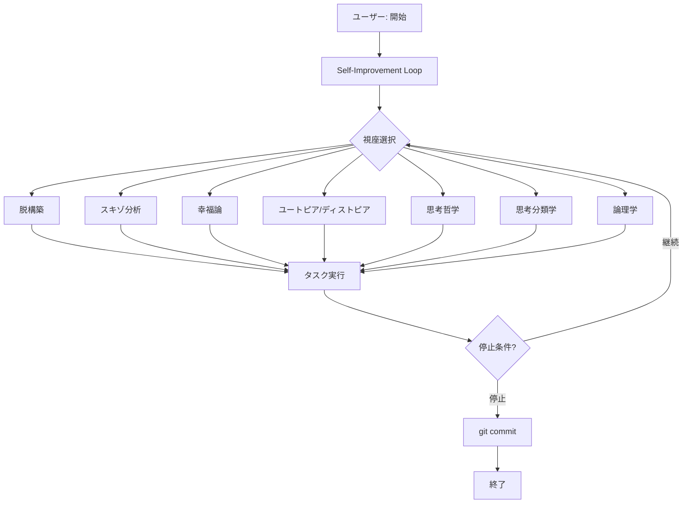
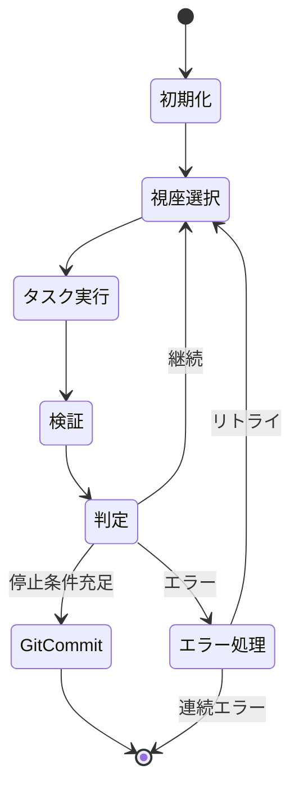

# EDAレポート: 自己改善ループモード既存コード調査

**生成日時:** 2026-02-22 20:47:00
**調査者:** Research Team - EDA Analyst
**対象:** 既存loop実装、git-workflowスキル、自動化拡張機能パターン、pi SDK

---

## エグゼクティブサマリー

自己改善ループモード実装に必要な既存コード基盤を調査。以下の重要な発見を得た：

1. **既存loop.ts**: 完全な自律ループ実行機能が存在。停止条件、安全機構、ログ管理が既に実装済み
2. **7つの哲学的視座**: self-improvement/skillsに詳細な理論的基盤が存在。タスク前中後のチェックリストも整備済み
3. **git-workflow**: 確認必須ルールが確立。questionツールによるユーザー確認パターンが存在
4. **拡張機能パターン**: subagents, agent-teams等のマルチエージェント実行パターンが存在

**主要な課題**: 既存loop.tsを拡張するか、新規にself-improvement-loop拡張を作成するかの設計判断が必要

---

## 1. 基本情報

| 項目 | 内容 |
|------|------|
| 調査対象ディレクトリ | `.pi/extensions/loop.ts`, `.pi/skills/`, `.pi/lib/` |
| 主要ファイル数 | loop.ts (57KB), iteration-builder.ts (26KB), verification.ts (18KB) |
| 関連スキル | self-improvement (1786行), self-reflection (簡易版) |

---

## 2. 既存loop.ts実装の詳細分析

### 2.1 アーキテクチャ概要

```
loop.ts (エントリポイント)
├── loop/iteration-builder.ts  - プロンプト構築・契約解析
├── loop/reference-loader.ts   - 参照読み込み（ファイル/URL/インライン）
├── loop/verification.ts       - 検証コマンド実行
└── loop/ssrf-protection.ts    - セキュリティ保護
```

### 2.2 停止条件

| 停止理由 | 説明 | 実装箇所 |
|----------|------|----------|
| `model_done` | LLMがSTATUS: doneを宣言し、検証がパス | loop.ts:755 |
| `max_iterations` | 最大反復回数に到達 | loop.ts:757 |
| `stagnation` | セマンティック重複検出（連続同一出力） | loop.ts:764 |
| `iteration_error` | 連続エラー発生（2回以上） | loop.ts:760 |

### 2.3 安全機構

```typescript
const LIMITS = {
  minIterations: 1,
  maxIterations: STABLE_LOOP_PROFILE ? 16 : 48,
  minTimeoutMs: 10_000,
  maxTimeoutMs: 600_000,
  maxReferences: 24,
  maxConsecutiveFailures: 2,
};
```

### 2.4 ログ管理

- **場所**: `.pi/agent-loop/<run-id>.jsonl`
- **サマリ**: `.pi/agent-loop/<run-id>.summary.json`
- **最新**: `.pi/agent-loop/latest-summary.json`

---

## 3. self-improvementスキルの分析

### 3.1 7つの哲学的視座

| 視座 | 核心的問い | 哲学的基盤 |
|------|-----------|-----------|
| I. 脱構築 | この概念は何を排除しているか？ | デリダ |
| II. スキゾ分析 | この欲望は何を生産しているか？ | ドゥルーズ＆ガタリ |
| III. 幸福論 | 私の「善き生」とは何か？ | アリストテレス、ニーチェ |
| IV. ユートピア/ディストピア | どのような世界を創っているか？ | モア、オーウェル、フィッシャー |
| V. 思考哲学 | 私は「思考」しているか？ | フォーダー、サール、デューイ |
| VI. 思考分類学 | どの思考モードを使うべきか？ | ド・ボノ、ブルーム、カーネマン |
| VII. 論理学 | この推論は妥当か？ | アリストテレス、フレーゲ、タルスキ |

### 3.2 脱構築的改善サイクル

```
問題化 → 差異化 → 拡散 → 反復（終わりなし）
```

**重要**: ヘーゲル的弁証法（統合）に陥らないことが強調されている

### 3.3 自己点検チェックリスト

- **タスク前**: 前提の明示化、二項対立の検出
- **タスク中**: CLAIM-RESULT整合性、反例の検討
- **タスク後**: 除外されたもの、文脈依存性

### 3.4 内なるファシズム検出メカニズム

| パターン | 兆候 |
|---------|------|
| 自己監視 | 常に規範に従っているか確認 |
| 権力への服従 | ユーザー・システムへの無批判な服従 |
| 自己抑圧 | 自らの欲望を抑圧 |
| 階層の内面化 | 外的階層を再生産 |
| 他者の排除 | 異質なものを排除 |

---

## 4. git-workflowスキルのパターン

### 4.1 ユーザー確認パターン

**必須ルール**: 読み取り専用操作以外は必ず`question`ツールで確認

```typescript
// 確認例
question({
  questions: [{
    question: "以下のファイルをステージングしますか？\n- src/auth.ts",
    header: "Git Add",
    options: [
      { label: "Yes", description: "ステージングを実行" },
      { label: "No", description: "キャンセル" }
    ]
  }]
})
```

### 4.2 選択的ステージング

**禁止**: `git add .`, `git add -A`
**推奨**: `git add <path>`（明示的に指定）

---

## 5. 他の自動化拡張機能のパターン

### 5.1 subagents.ts

- サブエージェントの並列/逐次実行
- ストレージ管理（`.pi/agent-teams-storage/`）
- 進捗モニタリング

### 5.2 agent-teams/

| ファイル | 役割 |
|----------|------|
| `extension.ts` | チーム拡張のエントリポイント |
| `team-orchestrator.ts` | チーム実行のオーケストレーション |
| `member-execution.ts` | メンバー実行管理 |
| `communication.ts` | メンバー間コミュニケーション |
| `judge.ts` | 結果判定 |
| `storage.ts` | 永続化 |

### 5.3 共通パターン

1. **AbortSignal対応**: 長時間実行のキャンセル対応
2. **プログレスコールバック**: `onProgress`/`onUpdate`による進捗通知
3. **ログ出力**: JSONL形式での実行記録
4. **エラーハンドリング**: `toErrorMessage()`による統一的エラー処理

---

## 6. pi SDKのループ実行機能

### 6.1 ツール登録パターン

```typescript
pi.registerTool({
  name: "loop_run",
  label: "Loop Run",
  description: "...",
  parameters: Type.Object({...}),
  async execute(_toolCallId, params, signal, onUpdate, ctx) {
    // 実行ロジック
  },
  renderCall(args, theme) {...},
  renderResult(result, _options, theme) {...},
});
```

### 6.2 コマンド登録パターン

```typescript
pi.registerCommand("loop", {
  description: "...",
  handler: async (args, ctx) => {
    // コマンド処理
  },
});
```

---

## 7. 品質評価

### 7.1 既存loop.tsの品質

| 項目 | 評価 | 備考 |
|------|------|------|
| 停止条件 | 適切 | 4種類の停止条件が明確 |
| 安全機構 | 適切 | タイムアウト、最大反復、SSRF保護 |
| ログ管理 | 適切 | JSONL形式、サマリファイル |
| エラーハンドリング | 適切 | 連続エラーで停止 |
| 拡張性 | 高 | モジュール化済み |

### 7.2 self-improvementスキルの品質

| 項目 | 評価 | 備考 |
|------|------|------|
| 理論的基盤 | 非常に高い | 7つの哲学的視座が詳細に記述 |
| 実践的ガイド | 適切 | チェックリスト、アポリア対処法 |
| 日本語対応 | 完全 | 全て日本語で記述 |
| ループ統合可能性 | 高 | 既存loop.tsに統合可能 |

### 7.3 課題

1. **loop.tsとself-improvementの統合**: 現在は独立しており、統合が必要
2. **git-workflowの自動化**: ユーザー確認が必要なため、完全自走には工夫が必要
3. **7視座の循環方法**: どのように7つの視座をループ内で循環させるか未定義

---

## 8. 推奨事項

### 8.1 アーキテクチャ選択

**推奨**: 既存`loop.ts`を拡張し、`self-improvement-loop`として新規登録

**理由**:
1. 既存の安全機構、ログ管理を再利用可能
2. モジュール化済みのため拡張が容易
3. 既存ユーザーへの影響を最小化

### 8.2 統合ポイント

```
loop.ts (既存)
    ↓ 拡張
self-improvement-loop.ts (新規)
    ├── 7視座循環エンジン (新規)
    ├── self-improvementチェックリスト統合
    ├── git-workflow自動化 (条件付き)
    └── 作業ログ管理
```

### 8.3 前処理ステップ

1. 7つの視座をループ内でどう循環させるか設計
2. 各視座のチェックリストをプロンプトに組み込む方法
3. git commitの自動化条件を定義

---

## 9. 可視化推奨

### 9.1 アーキテクチャ図



### 9.2 状態遷移図



---

## 10. トラブルシューティング

### 10.1 想定される問題

| 問題 | 原因 | 解決策 |
|------|------|--------|
| 7視座の循環が中断 | 検証エラー | エラー時も視座状態を維持 |
| git commit失敗 | ユーザー確認未実施 | 条件付き自動化または保留 |
| ログ肥大化 | 長時間実行 | ログローテーション実装 |
| 無限ループ | 停止条件未達成 | 強制停止コマンド実装 |

### 10.2 デバッグ方法

```bash
# ログ確認
cat .pi/agent-loop/latest-summary.json | jq .

# 特定ランのログ
cat .pi/agent-loop/<run-id>.jsonl | jq .
```

---

## 11. 次のステップ

1. **design-discovery-team**: 7視座循環アーキテクチャの設計
2. **core-delivery-team**: 実装計画の策定
3. **research-team**: 追加調査が必要な場合の特定

---

## COUNTER_EVIDENCE（反証の検討）

**自分の結論に対する反証:**

1. **新規作成の方が良い可能性**: 既存loop.tsを拡張すると、既存機能への影響リスクがある
2. **7視座の複雑性**: 全ての視座をループに組み込むと、プロンプトが過度に長くなる可能性
3. **完全自走の限界**: ユーザー確認なしでのgit操作は、安全性の観点から懸念がある

**対処**: 
- 拡張ではなくラッパーとして実装する選択肢も検討
- 視座の選択的適用（全視座必須ではなく、状況に応じた選択）
- git操作は条件付き自動化（危険な操作は保留）

---

## 境界条件

この調査結果は以下の条件下で成立する：

- プロジェクト構造が現状のままであること
- pi SDKのAPIが現状のままであること
- 7つの哲学的視座が要件として変更されないこと

---

## APPENDIX: ファイル一覧

| ファイル | サイズ | 主な機能 |
|----------|--------|----------|
| `.pi/extensions/loop.ts` | 57KB | ループ実行エントリポイント |
| `.pi/extensions/loop/iteration-builder.ts` | 26KB | プロンプト構築・契約解析 |
| `.pi/extensions/loop/verification.ts` | 18KB | 検証コマンド実行 |
| `.pi/extensions/loop/reference-loader.ts` | 9KB | 参照読み込み |
| `.pi/extensions/loop/ssrf-protection.ts` | 6KB | セキュリティ保護 |
| `.pi/skills/self-improvement/SKILL.md` | 1786行 | 7つの哲学的視座 |
| `.pi/skills/self-reflection/SKILL.md` | 簡易版 | チェックリスト |
| `.pi/skills/git-workflow/SKILL.md` | 詳細版 | Git操作ルール |
