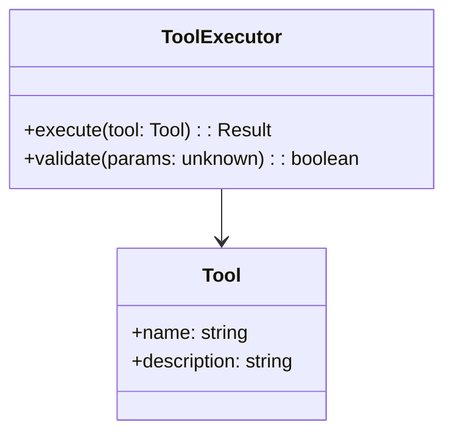
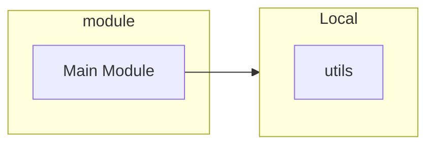
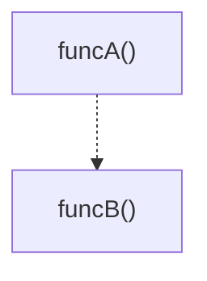
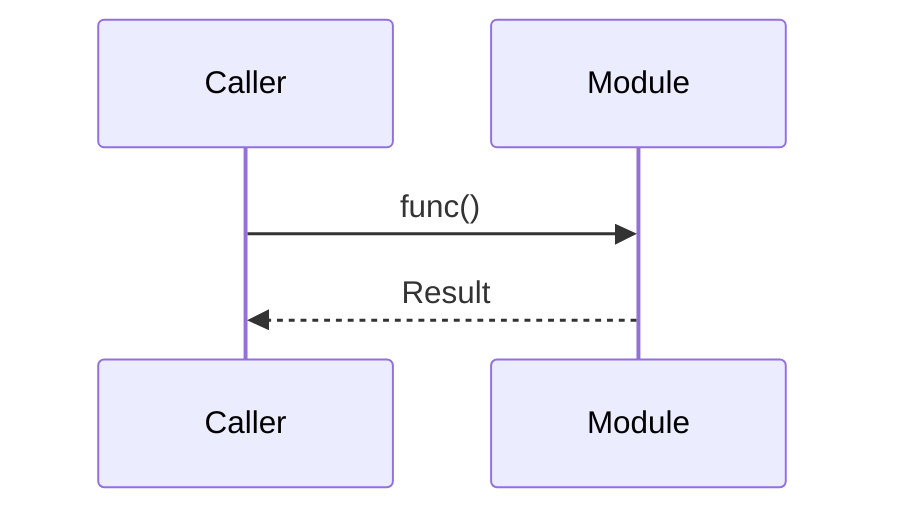

# ABDD（As-Built Driven Development）

実態駆動開発を支援するスキル。コードから生成される実態記述と、人間が定義する意図記述を比較し、乖離を可視化・解消する。

**主な機能:**
- **意図の確認**: philosophy.mdとspec.mdの理解支援
- **実態の確認**: as-builtドキュメントの解析（Mermaid図付き）
- **乖離検出**: 意図と実態の不一致を特定
- **修正提案**: 実装更新または意図修正の提案
- **JSDoc統合**: 自動JSDoc生成との連携

## 概要

ABDD（As-Built Driven Development）は、以下の3つの柱で構成される:

### 1. 一次成果物（Intentional Artifacts）

人間が定義し、維持する意図記述:

| ファイル | 目的 | 内容 |
|----------|------|------|
| `philosophy.md` | 価値観・優先順位 | 何を重視し、何を避けるか |
| `spec.md` | ドメイン不変条件 | 常に成り立つべきルール |

### 2. 実装実態記述（As-Built Documentation）

コードから自動生成される実態記述:

| ディレクトリ | 対象 | 内容 |
|--------------|------|------|
| `ABDD/.pi/extensions/` | 拡張機能 | APIリファレンス + Mermaid図 |
| `ABDD/.pi/lib/` | ライブラリ | APIリファレンス + Mermaid図 |

### 3. 反復ループ（Iteration Loop）

意図と実態を往復するレビューサイクル:

```
意図確認 --> 実態確認 --> 乖離検出 --> 修正 --> 再生成
    ^                                                       |
    |-------------------------------------------------------|
```

## 使用タイミング

以下の場合にこのスキルを読み込む:

- コード変更後のドキュメント更新
- アーキテクチャレビュー
- 仕様乖離の調査
- オンボーディング時の理解支援
- CI/CDでの整合性チェック

---

## ワークフロー

### ステップ1: 意図の確認

```bash
# 意図記述を読む
read philosophy.md
read spec.md
```

**確認ポイント:**
- 価値観: 何を重視しているか
- 優先順位: 何が重要か
- 禁則: 何をしてはいけないか
- 不変条件: 常に成り立つべきルール

### ステップ2: 実態の確認

```bash
# 実態記述を生成
npx tsx scripts/generate-abdd.ts

# 生成されたドキュメントを確認
ls ABDD/.pi/extensions/*.md
ls ABDD/.pi/lib/*.md
```

**確認ポイント:**
- Mermaid図: 構造と依存関係
- APIリファレンス: シグネチャと型
- JSDoc: ドキュメントの質

### ステップ3: 乖離の検出

意図と実態を比較し、以下を確認:

| 確認項目 | チェック内容 |
|----------|--------------|
| 価値観の合致 | 実装はphilosophyの価値観に合致しているか |
| 不変条件の充足 | 実装はspecの不変条件を満たしているか |
| 契約の遵守 | 実装はspecの契約に従っているか |
| 境界条件の維持 | 実装はspecの境界条件内で動作しているか |

### ステップ4: 修正

**実装を更新する場合:**
- 意図に合わない実装を修正
- 不変条件に違反するコードを修正
- 契約に従わないインターフェースを修正

**意図を修正する場合:**
- 実装が正しく、意図が古い場合
- 要件変更により意図が陳腐化した場合

### ステップ5: ドキュメント更新

```bash
# 実態ドキュメントを再生成
npx tsx scripts/generate-abdd.ts

# JSDocを更新（必要に応じて）
npx tsx scripts/add-jsdoc.ts

# レビュー記録を残す
# ABDD/reviews/YYYY-MM-DD.md に記録
```

---

## JSDoc統合フロー

### 自動JSDoc生成

add-jsdoc.tsとの統合ワークフロー:

```bash
# ドライラン（変更を確認）
npx tsx scripts/add-jsdoc.ts --dry-run

# 実行（JSDocを追加）
npx tsx scripts/add-jsdoc.ts

# チェック（CI用）
npx tsx scripts/add-jsdoc.ts --check

# 詳細ログ
npx tsx scripts/add-jsdoc.ts --verbose

# 全JSDoc再生成
npx tsx scripts/add-jsdoc.ts --regenerate
```

### 品質基準

JSDocの品質基準:

| 基準 | 説明 |
|------|------|
| カバレッジ | すべてのエクスポート関数にJSDocがあること |
| @param | すべてのパラメータに説明があること |
| @returns | 戻り値の説明があること（void以外） |
| 言語 | 日本語で記述されていること |
| 簡潔さ | 要約は50文字以内であること |

### 品質メトリクス

```bash
# 品質メトリクスを出力
npx tsx scripts/add-jsdoc.ts --metrics
```

出力されるメトリクス:
- filesProcessed: 処理されたファイル数
- elementsProcessed: 処理された要素数
- averageQualityScore: 平均品質スコア（0-100）
- paramCoverage: @paramカバレッジ（%）
- returnsCoverage: @returnsカバレッジ（%）

---

## Mermaid図の種類

generate-abdd.tsが生成するMermaid図:

### 1. クラス図（classDiagram）

クラスとインターフェースの構造を表現:



### 2. 依存関係図（flowchart）

モジュール間の依存関係を表現:



### 3. 関数フロー図（flowchart）

関数の呼び出し関係を表現:



### 4. シーケンス図（sequenceDiagram）

非同期処理の流れを表現:



---

## チェックリスト

### レビュー前

- [ ] philosophy.mdを読んだか
- [ ] spec.mdを読んだか
- [ ] as-builtドキュメントを生成したか
- [ ] 対象モジュールのMermaid図を確認したか

### レビュー中

- [ ] 実装は価値観に合致しているか
- [ ] 不変条件は満たされているか
- [ ] 契約は遵守されているか
- [ ] 境界条件内で動作しているか
- [ ] JSDocは適切に記述されているか

### レビュー後

- [ ] 乖離がある場合、修正案を作成したか
- [ ] ドキュメントを再生成したか
- [ ] レビュー記録を残したか
- [ ] CIでのチェックが通るか

---

## コマンドリファレンス

### generate-abdd.ts

```bash
# 実態ドキュメント生成
npx tsx scripts/generate-abdd.ts
```

**出力先:**
- `ABDD/.pi/extensions/*.md`
- `ABDD/.pi/lib/*.md`

**機能:**
- TypeScript AST解析
- Mermaid図生成
- クラス図、依存関係図、シーケンス図
- Mermaidバリデーション

### add-jsdoc.ts

```bash
# オプション
--dry-run       # 変更を適用せず、生成内容のみ表示
--check         # JSDocがない要素の数のみ表示（CI用）
--verbose       # 詳細ログを出力
--limit N       # 処理する要素数の上限（デフォルト: 50）
--file PATH     # 特定ファイルのみ処理
--regenerate    # 既存のJSDocも含めて再生成
--batch-size N  # バッチ処理の要素数（デフォルト: 5）
--force         # キャッシュを無視して強制再生成
--metrics       # 品質メトリクスをJSON出力
--no-cache      # キャッシュを使用しない
```

**環境変数:**
- `JSDOC_MAX_PARALLEL`: 並列数の上書き（デフォルト: 10）

---

## トラブルシューティング

### よくある問題

| 問題 | 原因 | 解決策 |
|------|------|--------|
| Mermaid図が表示されない | mmdc未インストール | `npm install -g @mermaid-js/mermaid-cli` |
| JSDocが生成されない | APIキー未設定 | `.pi/agent/auth.json`を確認 |
| 図が壊れている | 構文エラー | mmdcで検証、または簡易チェックを使用 |
| タイムアウトする | 要素数が多すぎる | `--limit`で制限、または`--batch-size`を調整 |
| キャッシュが古い | ファイル変更 | `--force`または`--no-cache`を使用 |

### Mermaidバリデーション

```bash
# mmdcがインストールされている場合: 厳密な検証
# されていない場合: 簡易検証
npx tsx scripts/generate-abdd.ts
```

### ログ確認

```bash
# JSDoc生成の詳細ログ
npx tsx scripts/add-jsdoc.ts --verbose

# 品質メトリクス
npx tsx scripts/add-jsdoc.ts --metrics
```

---

## ベストプラクティス

### 1. 定期的な再生成

コード変更後は必ず実態ドキュメントを再生成:

```bash
# コード変更後
npx tsx scripts/generate-abdd.ts
```

### 2. CIでのチェック

CIパイプラインでJSDocカバレッジをチェック:

```yaml
# .github/workflows/ci.yml
- name: Check JSDoc coverage
  run: npx tsx scripts/add-jsdoc.ts --check
```

### 3. レビュー記録の活用

乖離を発見したら記録を残す:

```markdown
# ABDD/reviews/YYYY-MM-DD.md

## 乖離の特定

| 箇所 | 意図 | 実態 | 修正方針 |
|------|------|------|----------|
| subagents.ts | 単一責任 | 複数責任 | 分割を検討 |
```

### 4. 意図の更新

実装が正しく、意図が古い場合は意図を更新:

```markdown
# philosophy.md

## 優先順位

- 1. 速度 > 正確性  # 変更: パフォーマンス要件の増加
+ 1. 正確性 > 速度  # 元の意図
```

---

## 関連ファイル

| ファイル | 目的 |
|----------|------|
| `scripts/generate-abdd.ts` | 実態ドキュメント生成 |
| `scripts/add-jsdoc.ts` | JSDoc自動生成 |
| `philosophy.md` | プロジェクト哲学 |
| `spec.md` | ドメイン仕様 |
| `ABDD/.pi/extensions/` | 拡張機能ドキュメント |
| `ABDD/.pi/lib/` | ライブラリドキュメント |
| `ABDD/reviews/` | レビュー記録 |

---

## デバッグ情報

### 記録されるイベント

| イベント種別 | 説明 | 記録タイミング |
|-------------|------|---------------|
| abdd_generate_start | 生成開始 | generate-abdd.ts実行時 |
| abdd_generate_end | 生成終了 | generate-abdd.ts完了時 |
| jsdoc_generate_start | JSDoc生成開始 | add-jsdoc.ts実行時 |
| jsdoc_generate_end | JSDoc生成終了 | add-jsdoc.ts完了時 |

### ログ確認方法

```bash
# 今日のログを確認
cat .pi/logs/events-$(date +%Y-%m-%d).jsonl | jq 'select(.eventType | startswith("abdd"))'
```

---

*このスキルはABDD（As-Built Driven Development）の概念に基づいて作成されました。*
