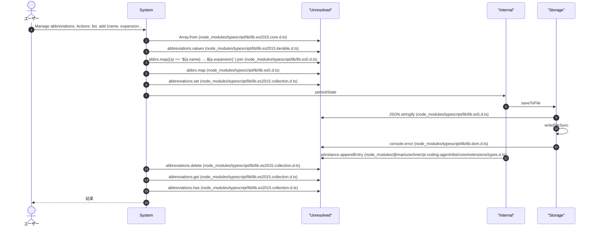
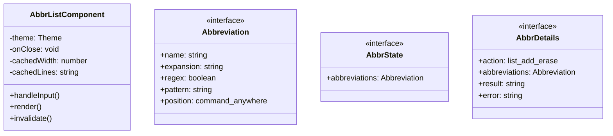
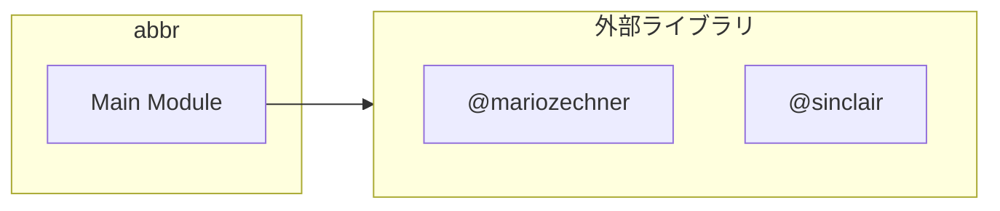

# abbr

## 概要

`abbr` モジュールのAPIリファレンス。

## インポート

```typescript
// from 'node:fs': fs
// from 'node:os': os
// from 'node:path': path
// from '@mariozechner/pi-ai': StringEnum
// from '@mariozechner/pi-coding-agent': ExtensionAPI, ExtensionContext, Theme
// ... and 2 more imports
```

## エクスポート一覧

| 種別 | 名前 | 説明 |
|------|------|------|
| インターフェース | `Abbreviation` | - |

## ユーザーフロー

このモジュールが提供するツールと、その実行フローを示します。

### abbr

Manage abbreviations. Actions: list, add (name, expansion), erase (name), rename (name, newName), query (name)



## 図解

### クラス図



### 依存関係図



## 関数

### loadFromFile

```typescript
loadFromFile(): void
```

**戻り値**: `void`

### saveToFile

```typescript
saveToFile(): void
```

**戻り値**: `void`

### persistState

```typescript
persistState(): void
```

**戻り値**: `void`

### findExpansion

```typescript
findExpansion(input: string): { expanded: string; original: string } | null
```

**パラメータ**

| 名前 | 型 | 必須 |
|------|-----|------|
| input | `string` | はい |

**戻り値**: `{ expanded: string; original: string } | null`

### escapeRegex

```typescript
escapeRegex(str: string): string
```

**パラメータ**

| 名前 | 型 | 必須 |
|------|-----|------|
| str | `string` | はい |

**戻り値**: `string`

### stripQuotes

```typescript
stripQuotes(str: string): string
```

**パラメータ**

| 名前 | 型 | 必須 |
|------|-----|------|
| str | `string` | はい |

**戻り値**: `string`

### reconstructState

```typescript
reconstructState(ctx: ExtensionContext): void
```

**パラメータ**

| 名前 | 型 | 必須 |
|------|-----|------|
| ctx | `ExtensionContext` | はい |

**戻り値**: `void`

## クラス

### AbbrListComponent

略語一覧を表示するUIコンポーネント

指定された幅に基づいて文字列の配列を生成します。
キャッシュが利用可能で、幅が変更されていない場合はキャッシュされた行を返します。

**プロパティ**

| 名前 | 型 | 可視性 |
|------|-----|--------|
| theme | `Theme` | private |
| onClose | `() => void` | private |
| cachedWidth | `number` | private |
| cachedLines | `string[]` | private |

**メソッド**

| 名前 | シグネチャ |
|------|------------|
| handleInput | `handleInput(data): void` |
| render | `render(width): string[]` |
| invalidate | `invalidate(): void` |

## インターフェース

### Abbreviation

```typescript
interface Abbreviation {
  name: string;
  expansion: string;
  regex?: boolean;
  pattern?: string;
  position?: "command" | "anywhere";
}
```

### AbbrState

```typescript
interface AbbrState {
  abbreviations: Abbreviation[];
}
```

### AbbrDetails

```typescript
interface AbbrDetails {
  action: "list" | "add" | "erase" | "rename" | "query";
  abbreviations: Abbreviation[];
  result?: string;
  error?: string;
}
```

---
*自動生成: 2026-02-22T19:26:59.760Z*
