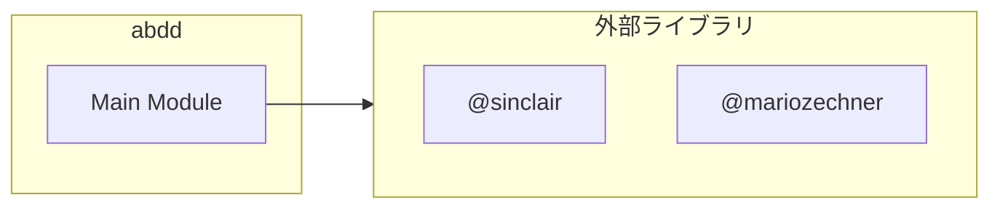

# abdd

## 概要

`abdd` モジュールのAPIリファレンス。

## インポート

```typescript
import { execSync } from 'node:child_process';
import { Type } from '@sinclair/typebox';
import { ExtensionAPI } from '@mariozechner/pi-coding-agent';
```

## エクスポート一覧

| 種別 | 名前 | 説明 |
|------|------|------|

## 図解

### 依存関係図



---
*自動生成: 2026-02-18T07:48:43.931Z*
