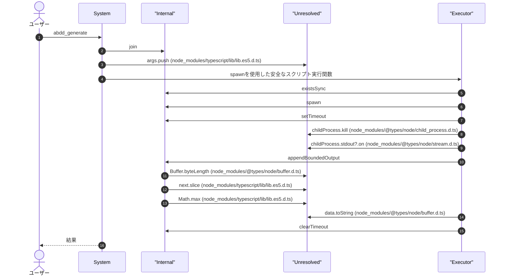
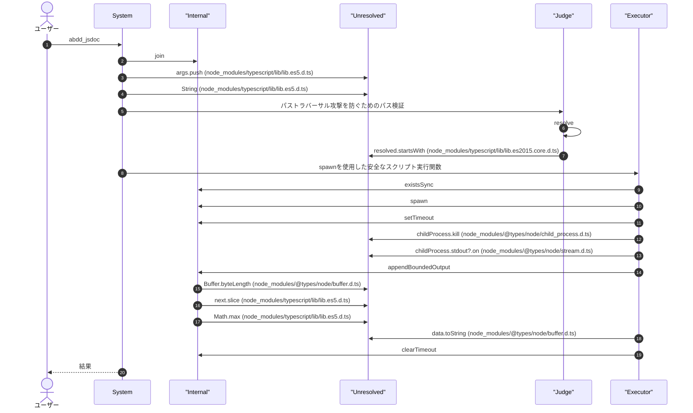
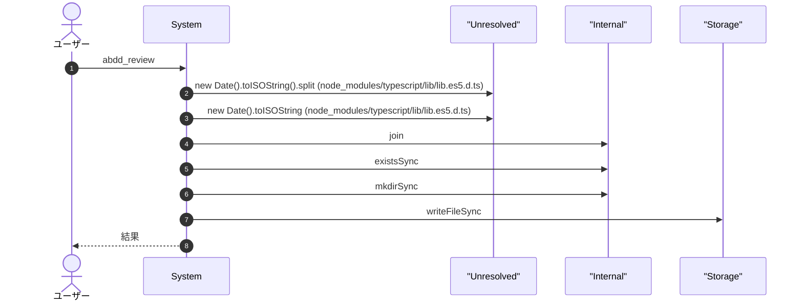
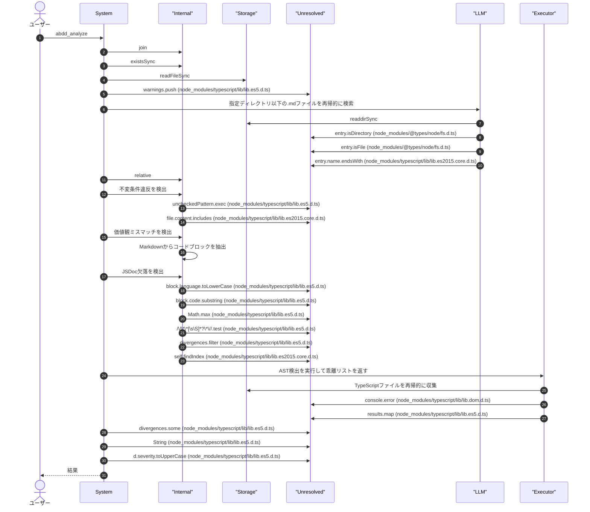
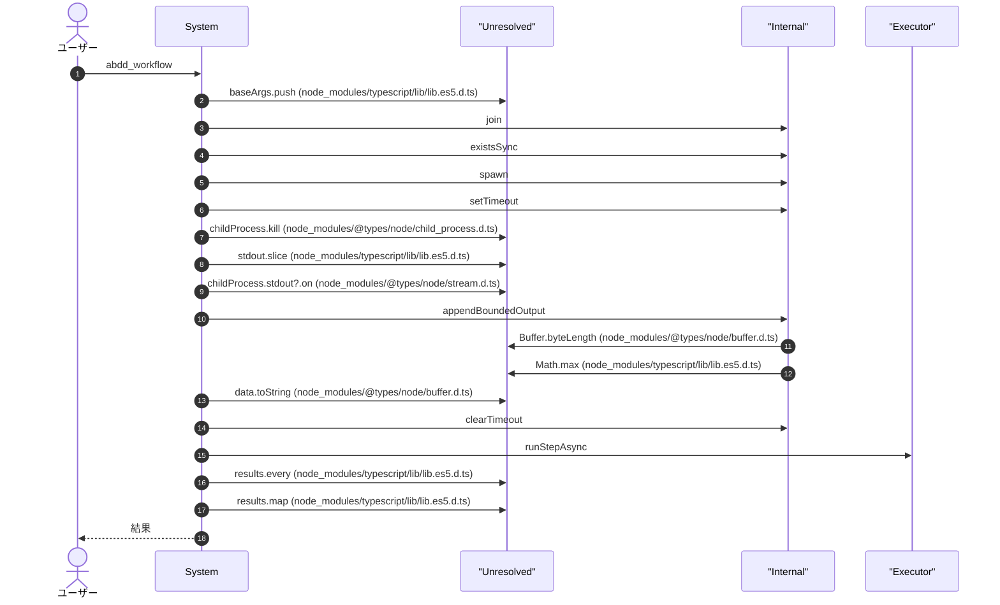
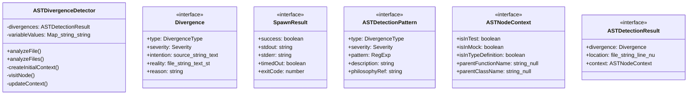
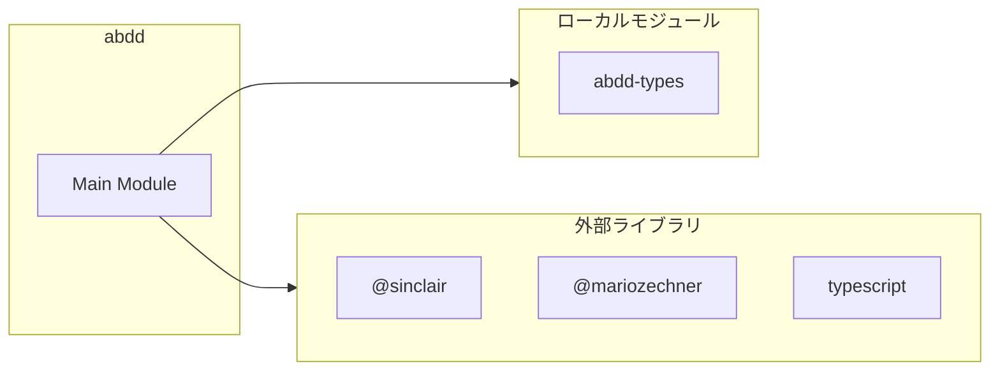

# abdd

## 概要

`abdd` モジュールのAPIリファレンス。

## インポート

```typescript
// from 'node:fs': fs
// from 'node:path': path
// from 'node:child_process': spawn
// from '@sinclair/typebox': Type, Static
// from '@mariozechner/pi-coding-agent': ExtensionAPI
// ... and 2 more imports
```

## エクスポート一覧

| 種別 | 名前 | 説明 |
|------|------|------|
| クラス | `ASTDivergenceDetector` | ASTベースの乖離検出器 |

## ユーザーフロー

このモジュールが提供するツールと、その実行フローを示します。

### abdd_generate




### abdd_jsdoc




### abdd_review




### abdd_analyze




### abdd_workflow




## 図解

### クラス図



### 依存関係図



## 関数

### appendBoundedOutput

```typescript
appendBoundedOutput(current: string, incoming: string, maxBytes: number): string
```

**パラメータ**

| 名前 | 型 | 必須 |
|------|-----|------|
| current | `string` | はい |
| incoming | `string` | はい |
| maxBytes | `number` | はい |

**戻り値**: `string`

### runScriptAsync

```typescript
runScriptAsync(scriptPath: string, args: string[], options: { timeoutMs?: number; cwd?: string }): Promise<SpawnResult>
```

spawnを使用した安全なスクリプト実行関数
execSync(args.join(" "))のコマンドインジェクション脆弱性を回避

**パラメータ**

| 名前 | 型 | 必須 |
|------|-----|------|
| scriptPath | `string` | はい |
| args | `string[]` | はい |
| options | `object` | はい |
| &nbsp;&nbsp;↳ timeoutMs | `number` | いいえ |
| &nbsp;&nbsp;↳ cwd | `string` | いいえ |

**戻り値**: `Promise<SpawnResult>`

### runStepAsync

```typescript
runStepAsync(stepName: string, scriptName: string, extraArgs: string[]): Promise<boolean>
```

**パラメータ**

| 名前 | 型 | 必須 |
|------|-----|------|
| stepName | `string` | はい |
| scriptName | `string` | はい |
| extraArgs | `string[]` | はい |

**戻り値**: `Promise<boolean>`

### findAllMdFiles

```typescript
findAllMdFiles(dir: string): string[]
```

指定ディレクトリ以下の.mdファイルを再帰的に検索

**パラメータ**

| 名前 | 型 | 必須 |
|------|-----|------|
| dir | `string` | はい |

**戻り値**: `string[]`

### detectInvariantViolations

```typescript
detectInvariantViolations(specContent: string, realityFiles: { path: string; content: string }[]): Divergence[]
```

不変条件違反を検出
spec.mdの未チェック項目（- [ ]）を検出し、実態記述に対応する記述があるか確認

**パラメータ**

| 名前 | 型 | 必須 |
|------|-----|------|
| specContent | `string` | はい |
| realityFiles | `{ path: string; content: string }[]` | はい |

**戻り値**: `Divergence[]`

### detectValueMismatches

```typescript
detectValueMismatches(_philosophyContent: string, realityFiles: { path: string; content: string }[]): Divergence[]
```

価値観ミスマッチを検出
philosophy.mdの禁則パターンを実態記述から検索

**パラメータ**

| 名前 | 型 | 必須 |
|------|-----|------|
| _philosophyContent | `string` | はい |
| realityFiles | `{ path: string; content: string }[]` | はい |

**戻り値**: `Divergence[]`

### detectJSDocMissing

```typescript
detectJSDocMissing(realityFiles: { path: string; content: string }[]): Divergence[]
```

JSDoc欠落を検出
実態記述内の関数定義で説明がないものを検出

**パラメータ**

| 名前 | 型 | 必須 |
|------|-----|------|
| realityFiles | `{ path: string; content: string }[]` | はい |

**戻り値**: `Divergence[]`

### extractCodeBlocks

```typescript
extractCodeBlocks(content: string): { language: string | null; code: string }[]
```

Markdownからコードブロックを抽出

**パラメータ**

| 名前 | 型 | 必須 |
|------|-----|------|
| content | `string` | はい |

**戻り値**: `{ language: string | null; code: string }[]`

### collectTypeScriptFiles

```typescript
collectTypeScriptFiles(dir: string): string[]
```

TypeScriptファイルを再帰的に収集

**パラメータ**

| 名前 | 型 | 必須 |
|------|-----|------|
| dir | `string` | はい |

**戻り値**: `string[]`

### runASTDetection

```typescript
runASTDetection(verbose: boolean): Divergence[]
```

AST検出を実行して乖離リストを返す

**パラメータ**

| 名前 | 型 | 必須 |
|------|-----|------|
| verbose | `boolean` | はい |

**戻り値**: `Divergence[]`

## クラス

### ASTDivergenceDetector

ASTベースの乖離検出器
ソースコードを直接AST解析し、価値観・不変条件の違反を高精度で検出する

データフロー解析により、変数経由の実行も検出可能:
- const cmd = "git add ."; execSync(cmd); → 検出可能
- const flag = "."; execSync(`git add ${flag}`); → 部分検出

**プロパティ**

| 名前 | 型 | 可視性 |
|------|-----|--------|
| divergences | `ASTDetectionResult[]` | private |
| variableValues | `Map<string, string>` | private |

**メソッド**

| 名前 | シグネチャ |
|------|------------|
| analyzeFile | `analyzeFile(filePath): ASTDetectionResult[]` |
| analyzeFiles | `analyzeFiles(filePaths): ASTDetectionResult[]` |
| createInitialContext | `createInitialContext(sourceFile): ASTNodeContext` |
| visitNode | `visitNode(node, sourceFile, context): void` |
| updateContext | `updateContext(node, context): ASTNodeContext` |
| isTestFunction | `isTestFunction(name): boolean` |
| isMockContext | `isMockContext(node): boolean` |
| checkCallExpression | `checkCallExpression(node, sourceFile, context): void` |
| getFunctionName | `getFunctionName(expr): string | null` |
| checkCommandArgument | `checkCommandArgument(arg, sourceFile, context): void` |
| trackVariableDeclaration | `trackVariableDeclaration(node): void` |
| resolveVariable | `resolveVariable(varName): string | undefined` |
| resolveTemplateExpression | `resolveTemplateExpression(node): string` |
| resolvePropertyAccess | `resolvePropertyAccess(node): string | undefined` |
| checkStringLiteral | `checkStringLiteral(node, sourceFile, context): void` |
| checkTemplateLiteral | `checkTemplateLiteral(node, sourceFile, context): void` |
| checkPropertyAssignment | `checkPropertyAssignment(node, sourceFile, context): void` |
| checkStringForPatterns | `checkStringForPatterns(text, node, sourceFile, context): void` |
| shouldExclude | `shouldExclude(text, context): boolean` |
| getNodeLocation | `getNodeLocation(node, sourceFile): { file: string; line: number; column: number }` |

## インターフェース

### Divergence

```typescript
interface Divergence {
  type: DivergenceType;
  severity: Severity;
  intention: { source: string; text: string };
  reality: { file: string; text: string };
  reason: string;
}
```

乖離候補

### SpawnResult

```typescript
interface SpawnResult {
  success: boolean;
  stdout: string;
  stderr: string;
  timedOut?: boolean;
  exitCode?: number;
}
```

spawn実行結果

### ASTDetectionPattern

```typescript
interface ASTDetectionPattern {
  type: DivergenceType;
  severity: Severity;
  pattern: RegExp;
  description: string;
  philosophyRef: string;
}
```

AST検出用パターン定義

### ASTNodeContext

```typescript
interface ASTNodeContext {
  isInTest: boolean;
  isInMock: boolean;
  isInTypeDefinition: boolean;
  parentFunctionName: string | null;
  parentClassName: string | null;
  sourceFile: ts.SourceFile;
}
```

AST検出用コンテキスト

### ASTDetectionResult

```typescript
interface ASTDetectionResult {
  divergence: Divergence;
  location: {
		file: string;
		line: number;
		column: number;
	};
  context: ASTNodeContext;
}
```

AST検出結果

## 型定義

### AbddGenerateParamsType

```typescript
type AbddGenerateParamsType = Static<typeof AbddGenerateParams>
```

### AbddJsdocParamsType

```typescript
type AbddJsdocParamsType = Static<typeof AbddJsdocParams>
```

### AbddReviewParamsType

```typescript
type AbddReviewParamsType = Static<typeof AbddReviewParams>
```

### AbddAnalyzeParamsType

```typescript
type AbddAnalyzeParamsType = Static<typeof AbddAnalyzeParams>
```

### AbddWorkflowParamsType

```typescript
type AbddWorkflowParamsType = Static<typeof AbddWorkflowParams>
```

### DivergenceType

```typescript
type DivergenceType = "value_mismatch" | "invariant_violation" | "contract_breach" | "missing_jsdoc"
```

乖離タイプ

### Severity

```typescript
type Severity = "low" | "medium" | "high"
```

乖離重要度

---
*自動生成: 2026-02-28T13:55:17.654Z*
