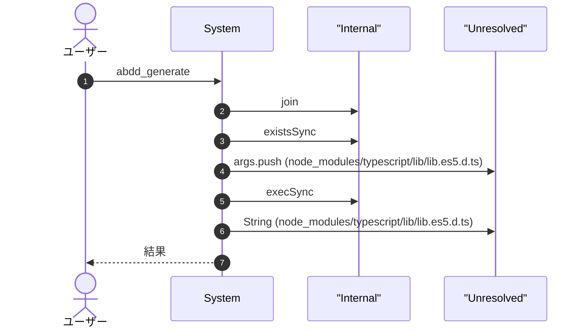
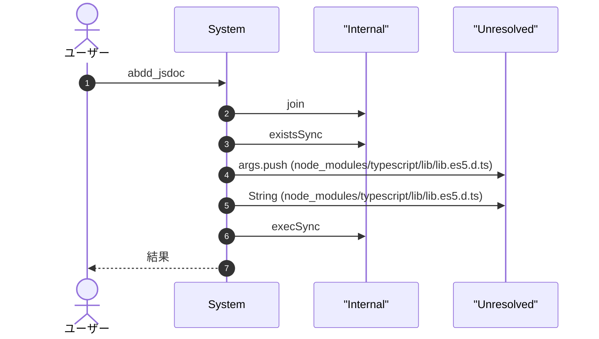
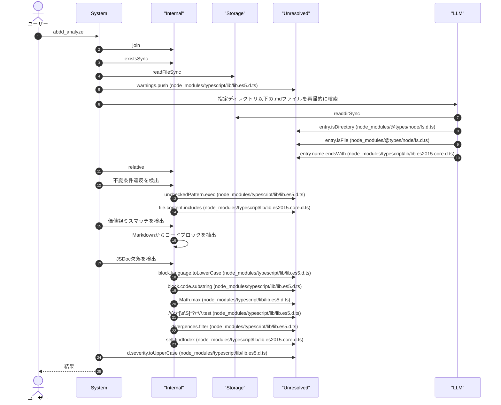
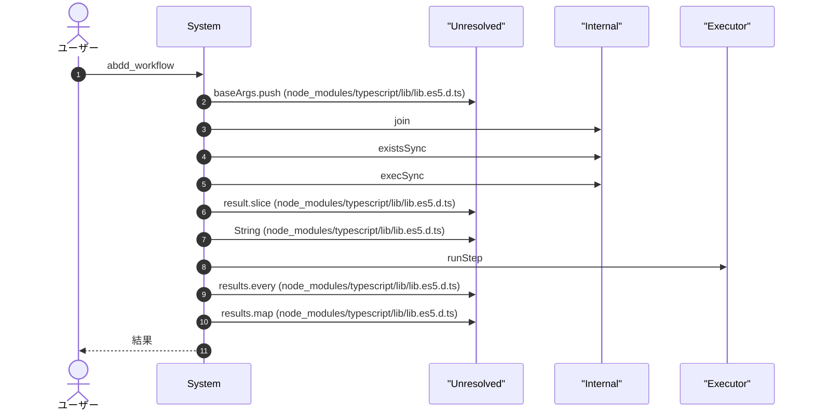
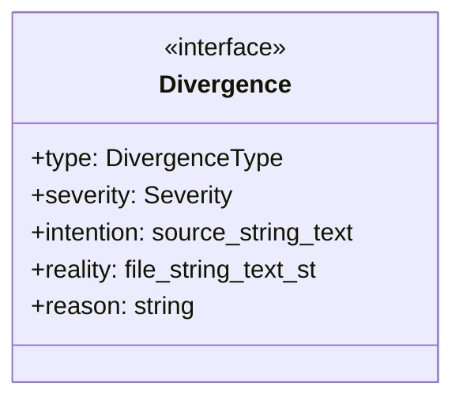

# abdd

## 概要

`abdd` モジュールのAPIリファレンス。

## インポート

```typescript
// from 'node:fs': fs
// from 'node:path': path
// from 'node:child_process': execSync
// from '@sinclair/typebox': Type
// from '@mariozechner/pi-coding-agent': ExtensionAPI
```

## エクスポート一覧

| 種別 | 名前 | 説明 |
|------|------|------|

## ユーザーフロー

このモジュールが提供するツールと、その実行フローを示します。

### abdd_generate




### abdd_jsdoc




### abdd_review


### abdd_analyze




### abdd_workflow




## 図解

### クラス図



### 依存関係図


## 関数

### runStep

```typescript
runStep(stepName: string, scriptName: string, extraArgs: string[]): boolean
```

**パラメータ**

| 名前 | 型 | 必須 |
|------|-----|------|
| stepName | `string` | はい |
| scriptName | `string` | はい |
| extraArgs | `string[]` | はい |

**戻り値**: `boolean`

### findAllMdFiles

```typescript
findAllMdFiles(dir: string): string[]
```

指定ディレクトリ以下の.mdファイルを再帰的に検索

**パラメータ**

| 名前 | 型 | 必須 |
|------|-----|------|
| dir | `string` | はい |

**戻り値**: `string[]`

### detectInvariantViolations

```typescript
detectInvariantViolations(specContent: string, realityFiles: { path: string; content: string }[]): Divergence[]
```

不変条件違反を検出
spec.mdの未チェック項目（- [ ]）を検出し、実態記述に対応する記述があるか確認

**パラメータ**

| 名前 | 型 | 必須 |
|------|-----|------|
| specContent | `string` | はい |
| realityFiles | `{ path: string; content: string }[]` | はい |

**戻り値**: `Divergence[]`

### detectValueMismatches

```typescript
detectValueMismatches(_philosophyContent: string, realityFiles: { path: string; content: string }[]): Divergence[]
```

価値観ミスマッチを検出
philosophy.mdの禁則パターンを実態記述から検索

**パラメータ**

| 名前 | 型 | 必須 |
|------|-----|------|
| _philosophyContent | `string` | はい |
| realityFiles | `{ path: string; content: string }[]` | はい |

**戻り値**: `Divergence[]`

### detectJSDocMissing

```typescript
detectJSDocMissing(realityFiles: { path: string; content: string }[]): Divergence[]
```

JSDoc欠落を検出
実態記述内の関数定義で説明がないものを検出

**パラメータ**

| 名前 | 型 | 必須 |
|------|-----|------|
| realityFiles | `{ path: string; content: string }[]` | はい |

**戻り値**: `Divergence[]`

### extractCodeBlocks

```typescript
extractCodeBlocks(content: string): { language: string | null; code: string }[]
```

Markdownからコードブロックを抽出

**パラメータ**

| 名前 | 型 | 必須 |
|------|-----|------|
| content | `string` | はい |

**戻り値**: `{ language: string | null; code: string }[]`

## インターフェース

### Divergence

```typescript
interface Divergence {
  type: DivergenceType;
  severity: Severity;
  intention: { source: string; text: string };
  reality: { file: string; text: string };
  reason: string;
}
```

乖離候補

## 型定義

### DivergenceType

```typescript
type DivergenceType = "value_mismatch" | "invariant_violation" | "contract_breach" | "missing_jsdoc"
```

乖離タイプ

### Severity

```typescript
type Severity = "low" | "medium" | "high"
```

乖離重要度

---
*自動生成: 2026-02-18T14:31:30.401Z*
