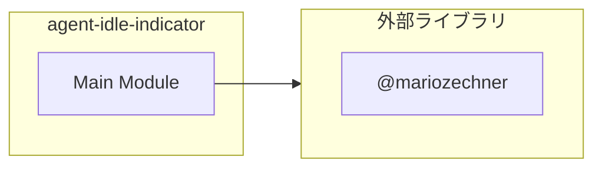

# agent-idle-indicator

## 概要

`agent-idle-indicator` モジュールのAPIリファレンス。

## インポート

```typescript
// from '@mariozechner/pi-coding-agent': ExtensionAPI
```

## エクスポート一覧

| 種別 | 名前 | 説明 |
|------|------|------|

## 図解

### 依存関係図



## 関数

### showIdleIndicator

```typescript
showIdleIndicator(ctx: ExtensionAPI["context"]): void
```

**パラメータ**

| 名前 | 型 | 必須 |
|------|-----|------|
| ctx | `ExtensionAPI["context"]` | はい |

**戻り値**: `void`

### clearIdleIndicator

```typescript
clearIdleIndicator(ctx: ExtensionAPI["context"]): void
```

**パラメータ**

| 名前 | 型 | 必須 |
|------|-----|------|
| ctx | `ExtensionAPI["context"]` | はい |

**戻り値**: `void`

### restoreOriginal

```typescript
restoreOriginal(ctx: ExtensionAPI["context"]): void
```

**パラメータ**

| 名前 | 型 | 必須 |
|------|-----|------|
| ctx | `ExtensionAPI["context"]` | はい |

**戻り値**: `void`

---
*自動生成: 2026-02-28T13:55:17.656Z*
