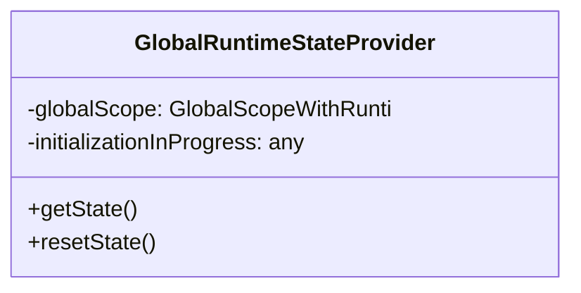
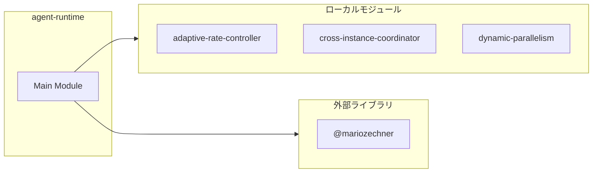
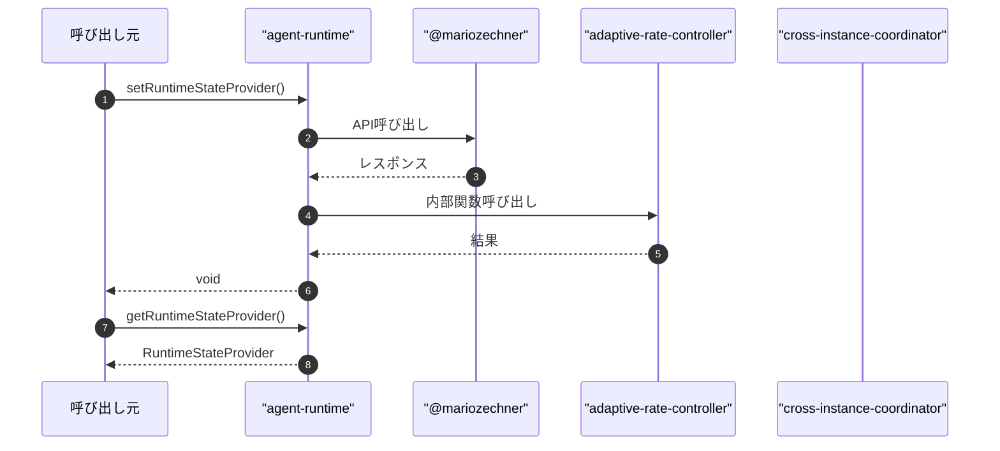

# agent-runtime

## 概要

`agent-runtime` モジュールのAPIリファレンス。

## インポート

```typescript
// from '@mariozechner/pi-coding-agent': ExtensionAPI
// from 'node:crypto': randomBytes
// from '../lib/adaptive-rate-controller': getEffectiveLimit, getSchedulerAwareLimit
// from '../lib/cross-instance-coordinator': getMyParallelLimit, isCoordinatorInitialized, getModelParallelLimit, ...
// from '../lib/cross-instance-coordinator': crossInstanceCoordinator
// ... and 11 more imports
```

## エクスポート一覧

| 種別 | 名前 | 説明 |
|------|------|------|
| 関数 | `setRuntimeStateProvider` | ランタイムステータスラインの表示オプション |
| 関数 | `getRuntimeStateProvider` | プロバイダを設定 |
| 関数 | `setRuntimeNowProvider` | 現在時刻取得関数を設定 |
| 関数 | `notifyRuntimeCapacityChanged` | 容量変更通知 |
| 関数 | `stopRuntimeReservationSweeper` | リザベーション停止 |
| 関数 | `getSharedRuntimeState` | 共有ランタイム状態取得 |
| 関数 | `getRuntimeSnapshot` | ランタイムスナップショット取得 |
| 関数 | `formatRuntimeStatusLine` | ステータス行を生成 |
| 関数 | `checkRuntimeCapacity` | ランタイムの容量チェックを行う |
| 関数 | `tryReserveRuntimeCapacity` | 容量予約を試行 |
| 関数 | `reserveRuntimeCapacity` | ランタイム容量を予約する |
| 関数 | `waitForRuntimeCapacity` | ランタイム容量が利用可能になるまで待機する |
| 関数 | `waitForRuntimeOrchestrationTurn` | ランタイムのオーケストレーション実行を待機する |
| 関数 | `acquireRuntimeDispatchPermit` | Acquire queue turn and capacity reservation atomic |
| 関数 | `resetRuntimeTransientState` | 一時状態をリセット |
| 関数 | `getModelAwareParallelLimit` | 並列制限数を取得 |
| 関数 | `shouldAllowParallelForModel` | 並列実行許可判定 |
| 関数 | `getLimitsSummary` | 制限サマリを取得 |
| 関数 | `broadcastCurrentQueueState` | キュー状態を配信 |
| 関数 | `getCheckpointManagerInstance` | チェックポイントマネージャーのインスタンスを取得 |
| 関数 | `getMetricsCollectorInstance` | メトリクスコレクタのインスタンスを取得 |
| 関数 | `recordTaskCompletion` | タスク完了を記録 |
| 関数 | `recordPreemptionEvent` | プリエンプションイベントを記録 |
| 関数 | `recordWorkStealEvent` | ワークスチールイベントを記録 |
| 関数 | `getSchedulerMetrics` | メトリクスを取得 |
| 関数 | `getCheckpointStats` | チェックポイント統計を取得する。 |
| 関数 | `attemptWorkStealing` | ワークスチーリングを試行 |
| 関数 | `getComprehensiveRuntimeStatus` | ランタイム包括ステータス取得 |
| 関数 | `formatComprehensiveRuntimeStatus` | ランタイム状態を整形 |
| 関数 | `registerAgentRuntimeExtension` | エージェントランタイム拡張を登録する |

## 図解

### クラス図



### 依存関係図



### 関数フロー

```mermaid
flowchart TD
  checkRuntimeCapacity["checkRuntimeCapacity()"]
  cleanupExpiredReservations["cleanupExpiredReservations()"]
  computeBackoffDelay["computeBackoffDelay()"]
  createCapacityCheck["createCapacityCheck()"]
  createReservationLease["createReservationLease()"]
  createRuntimeReservationId["createRuntimeReservationId()"]
  formatRuntimeStatusLine["formatRuntimeStatusLine()"]
  getClusterUsageSafe["getClusterUsageSafe()"]
  getLocalRuntimeUsage["getLocalRuntimeUsage()"]
  getRuntimeSnapshot["getRuntimeSnapshot()"]
  getRuntimeStateProvider["getRuntimeStateProvider()"]
  getSharedRuntimeState["getSharedRuntimeState()"]
  normalizePositiveInt["normalizePositiveInt()"]
  normalizeReservationTtlMs["normalizeReservationTtlMs()"]
  notifyRuntimeCapacityChanged["notifyRuntimeCapacityChanged()"]
  publishRuntimeUsageToCoordinator["publishRuntimeUsageToCoordinator()"]
  reserveRuntimeCapacity["reserveRuntimeCapacity()"]
  runtimeNow["runtimeNow()"]
  sanitizePlannedCount["sanitizePlannedCount()"]
  setRuntimeNowProvider["setRuntimeNowProvider()"]
  setRuntimeStateProvider["setRuntimeStateProvider()"]
  stopRuntimeReservationSweeper["stopRuntimeReservationSweeper()"]
  tryReserveRuntimeCapacity["tryReserveRuntimeCapacity()"]
  waitForRuntimeCapacityEvent["waitForRuntimeCapacityEvent()"]
  checkRuntimeCapacity --> createCapacityCheck
  checkRuntimeCapacity --> getRuntimeSnapshot
  formatRuntimeStatusLine --> getRuntimeSnapshot
  getRuntimeSnapshot --> cleanupExpiredReservations
  getRuntimeSnapshot --> getClusterUsageSafe
  getRuntimeSnapshot --> getLocalRuntimeUsage
  getRuntimeSnapshot --> getSharedRuntimeState
  notifyRuntimeCapacityChanged --> publishRuntimeUsageToCoordinator
  reserveRuntimeCapacity --> checkRuntimeCapacity
  reserveRuntimeCapacity --> computeBackoffDelay
  reserveRuntimeCapacity --> getRuntimeSnapshot
  reserveRuntimeCapacity --> normalizePositiveInt
  reserveRuntimeCapacity --> runtimeNow
  reserveRuntimeCapacity --> tryReserveRuntimeCapacity
  reserveRuntimeCapacity --> waitForRuntimeCapacityEvent
  tryReserveRuntimeCapacity --> cleanupExpiredReservations
  tryReserveRuntimeCapacity --> createCapacityCheck
  tryReserveRuntimeCapacity --> createReservationLease
  tryReserveRuntimeCapacity --> createRuntimeReservationId
  tryReserveRuntimeCapacity --> getRuntimeSnapshot
  tryReserveRuntimeCapacity --> getSharedRuntimeState
  tryReserveRuntimeCapacity --> normalizeReservationTtlMs
  tryReserveRuntimeCapacity --> notifyRuntimeCapacityChanged
  tryReserveRuntimeCapacity --> runtimeNow
  tryReserveRuntimeCapacity --> sanitizePlannedCount
```



### シーケンス図



## 関数

### setRuntimeStateProvider

```typescript
setRuntimeStateProvider(provider: RuntimeStateProvider): void
```

ランタイムステータスラインの表示オプション

**パラメータ**

| 名前 | 型 | 必須 |
|------|-----|------|
| provider | `RuntimeStateProvider` | はい |

**戻り値**: `void`

### getRuntimeStateProvider

```typescript
getRuntimeStateProvider(): RuntimeStateProvider
```

プロバイダを設定

**戻り値**: `RuntimeStateProvider`

### runtimeNowProvider

```typescript
runtimeNowProvider(): void
```

**戻り値**: `void`

### getRuntimeInstanceToken

```typescript
getRuntimeInstanceToken(): string
```

**戻り値**: `string`

### logRuntimeQueueDebug

```typescript
logRuntimeQueueDebug(message: string): void
```

**パラメータ**

| 名前 | 型 | 必須 |
|------|-----|------|
| message | `string` | はい |

**戻り値**: `void`

### runtimeNow

```typescript
runtimeNow(): number
```

**戻り値**: `number`

### setRuntimeNowProvider

```typescript
setRuntimeNowProvider(provider?: () => number): void
```

現在時刻取得関数を設定

**パラメータ**

| 名前 | 型 | 必須 |
|------|-----|------|
| provider | `() => number` | いいえ |

**戻り値**: `void`

### getDefaultReservationTtlMs

```typescript
getDefaultReservationTtlMs(): number
```

Get default reservation TTL from runtime config.

**戻り値**: `number`

### normalizePositiveInt

```typescript
normalizePositiveInt(value: unknown, fallback: number, max: any): number
```

**パラメータ**

| 名前 | 型 | 必須 |
|------|-----|------|
| value | `unknown` | はい |
| fallback | `number` | はい |
| max | `any` | はい |

**戻り値**: `number`

### normalizeReservationTtlMs

```typescript
normalizeReservationTtlMs(value: unknown): number
```

**パラメータ**

| 名前 | 型 | 必須 |
|------|-----|------|
| value | `unknown` | はい |

**戻り値**: `number`

### resolveLimitFromEnv

```typescript
resolveLimitFromEnv(envName: string, fallback: number, max: any): number
```

**パラメータ**

| 名前 | 型 | 必須 |
|------|-----|------|
| envName | `string` | はい |
| fallback | `number` | はい |
| max | `any` | はい |

**戻り値**: `number`

### getLocalRuntimeUsage

```typescript
getLocalRuntimeUsage(runtime: AgentRuntimeState): {
  totalActiveRequests: number;
  totalActiveLlm: number;
}
```

**パラメータ**

| 名前 | 型 | 必須 |
|------|-----|------|
| runtime | `AgentRuntimeState` | はい |

**戻り値**: `{
  totalActiveRequests: number;
  totalActiveLlm: number;
}`

### publishRuntimeUsageToCoordinator

```typescript
publishRuntimeUsageToCoordinator(): void
```

**戻り値**: `void`

### getClusterUsageSafe

```typescript
getClusterUsageSafe(localUsage: { totalActiveRequests: number; totalActiveLlm: number }): {
  totalActiveRequests: number;
  totalActiveLlm: number;
}
```

**パラメータ**

| 名前 | 型 | 必須 |
|------|-----|------|
| localUsage | `object` | はい |
| &nbsp;&nbsp;↳ totalActiveRequests | `number` | はい |
| &nbsp;&nbsp;↳ totalActiveLlm | `number` | はい |

**戻り値**: `{
  totalActiveRequests: number;
  totalActiveLlm: number;
}`

### notifyRuntimeCapacityChanged

```typescript
notifyRuntimeCapacityChanged(): void
```

容量変更通知

**戻り値**: `void`

### waitForRuntimeCapacityEvent

```typescript
async waitForRuntimeCapacityEvent(timeoutMs: number, signal?: AbortSignal): Promise<"event" | "timeout" | "aborted">
```

**パラメータ**

| 名前 | 型 | 必須 |
|------|-----|------|
| timeoutMs | `number` | はい |
| signal | `AbortSignal` | いいえ |

**戻り値**: `Promise<"event" | "timeout" | "aborted">`

### onEvent

```typescript
onEvent(): void
```

**戻り値**: `void`

### onAbort

```typescript
onAbort(): void
```

**戻り値**: `void`

### cleanup

```typescript
cleanup(): void
```

**戻り値**: `void`

### createRuntimeLimits

```typescript
createRuntimeLimits(): AgentRuntimeLimits
```

**戻り値**: `AgentRuntimeLimits`

### serializeRuntimeLimits

```typescript
serializeRuntimeLimits(limits: AgentRuntimeLimits): string
```

**パラメータ**

| 名前 | 型 | 必須 |
|------|-----|------|
| limits | `AgentRuntimeLimits` | はい |

**戻り値**: `string`

### ensureReservationSweeper

```typescript
ensureReservationSweeper(): void
```

**戻り値**: `void`

### stopRuntimeReservationSweeper

```typescript
stopRuntimeReservationSweeper(): void
```

リザベーション停止
リザベーションの定期実行を停止します。

**戻り値**: `void`

### createInitialRuntimeState

```typescript
createInitialRuntimeState(): AgentRuntimeState
```

**戻り値**: `AgentRuntimeState`

### sanitizeRuntimeLimits

```typescript
sanitizeRuntimeLimits(limits: AgentRuntimeLimits | undefined): AgentRuntimeLimits
```

**パラメータ**

| 名前 | 型 | 必須 |
|------|-----|------|
| limits | `AgentRuntimeLimits | undefined` | はい |

**戻り値**: `AgentRuntimeLimits`

### ensureRuntimeStateShape

```typescript
ensureRuntimeStateShape(runtime: AgentRuntimeState): AgentRuntimeState
```

**パラメータ**

| 名前 | 型 | 必須 |
|------|-----|------|
| runtime | `AgentRuntimeState` | はい |

**戻り値**: `AgentRuntimeState`

### isStrictRuntimeLimitMode

```typescript
isStrictRuntimeLimitMode(): boolean
```

**戻り値**: `boolean`

### enforceRuntimeLimitConsistency

```typescript
enforceRuntimeLimitConsistency(runtime: AgentRuntimeState): void
```

**パラメータ**

| 名前 | 型 | 必須 |
|------|-----|------|
| runtime | `AgentRuntimeState` | はい |

**戻り値**: `void`

### getSharedRuntimeState

```typescript
getSharedRuntimeState(): AgentRuntimeState
```

共有ランタイム状態取得

**戻り値**: `AgentRuntimeState`

### cleanupExpiredReservations

```typescript
cleanupExpiredReservations(runtime: AgentRuntimeState, nowMs: any): number
```

**パラメータ**

| 名前 | 型 | 必須 |
|------|-----|------|
| runtime | `AgentRuntimeState` | はい |
| nowMs | `any` | はい |

**戻り値**: `number`

### updateReservationHeartbeat

```typescript
updateReservationHeartbeat(runtime: AgentRuntimeState, reservationId: string, ttlMs?: number): number | undefined
```

**パラメータ**

| 名前 | 型 | 必須 |
|------|-----|------|
| runtime | `AgentRuntimeState` | はい |
| reservationId | `string` | はい |
| ttlMs | `number` | いいえ |

**戻り値**: `number | undefined`

### releaseReservation

```typescript
releaseReservation(runtime: AgentRuntimeState, reservationId: string): boolean
```

**パラメータ**

| 名前 | 型 | 必須 |
|------|-----|------|
| runtime | `AgentRuntimeState` | はい |
| reservationId | `string` | はい |

**戻り値**: `boolean`

### consumeReservation

```typescript
consumeReservation(runtime: AgentRuntimeState, reservationId: string): boolean
```

**パラメータ**

| 名前 | 型 | 必須 |
|------|-----|------|
| runtime | `AgentRuntimeState` | はい |
| reservationId | `string` | はい |

**戻り値**: `boolean`

### getRuntimeSnapshot

```typescript
getRuntimeSnapshot(): AgentRuntimeSnapshot
```

ランタイムスナップショット取得

**戻り値**: `AgentRuntimeSnapshot`

### formatRuntimeStatusLine

```typescript
formatRuntimeStatusLine(options: RuntimeStatusLineOptions): string
```

ステータス行を生成

**パラメータ**

| 名前 | 型 | 必須 |
|------|-----|------|
| options | `RuntimeStatusLineOptions` | はい |

**戻り値**: `string`

### sanitizePlannedCount

```typescript
sanitizePlannedCount(value: unknown): number
```

**パラメータ**

| 名前 | 型 | 必須 |
|------|-----|------|
| value | `unknown` | はい |

**戻り値**: `number`

### createRuntimeQueueEntryId

```typescript
createRuntimeQueueEntryId(): string
```

**戻り値**: `string`

### clampPlannedCount

```typescript
clampPlannedCount(value: number): number
```

**パラメータ**

| 名前 | 型 | 必須 |
|------|-----|------|
| value | `number` | はい |

**戻り値**: `number`

### getMaxPendingQueueEntries

```typescript
getMaxPendingQueueEntries(): number
```

**戻り値**: `number`

### getQueueClassRank

```typescript
getQueueClassRank(queueClass: RuntimeQueueClass): number
```

**パラメータ**

| 名前 | 型 | 必須 |
|------|-----|------|
| queueClass | `RuntimeQueueClass` | はい |

**戻り値**: `number`

### getPriorityRank

```typescript
getPriorityRank(priority: TaskPriority | undefined): number
```

**パラメータ**

| 名前 | 型 | 必須 |
|------|-----|------|
| priority | `TaskPriority | undefined` | はい |

**戻り値**: `number`

### trimPendingQueueToLimit

```typescript
trimPendingQueueToLimit(runtime: AgentRuntimeState): RuntimeQueueEntry | null
```

Keep pending queue bounded to avoid unbounded memory growth.
Eviction policy:
1) lower queue class first (batch < standard < interactive)
2) lower priority first (background < ... < critical)
3) older entries first (LRU-like by enqueue timestamp)

最適化: 比較ロジックを簡素化し、早期終了を追加

**パラメータ**

| 名前 | 型 | 必須 |
|------|-----|------|
| runtime | `AgentRuntimeState` | はい |

**戻り値**: `RuntimeQueueEntry | null`

### toQueueClass

```typescript
toQueueClass(input: RuntimeDispatchPermitInput): RuntimeQueueClass
```

**パラメータ**

| 名前 | 型 | 必須 |
|------|-----|------|
| input | `RuntimeDispatchPermitInput` | はい |

**戻り値**: `RuntimeQueueClass`

### createRuntimeReservationId

```typescript
createRuntimeReservationId(): string
```

**戻り値**: `string`

### removeQueuedEntry

```typescript
removeQueuedEntry(runtime: AgentRuntimeState, entryId: string): number
```

**パラメータ**

| 名前 | 型 | 必須 |
|------|-----|------|
| runtime | `AgentRuntimeState` | はい |
| entryId | `string` | はい |

**戻り値**: `number`

### sortQueueByPriority

```typescript
sortQueueByPriority(runtime: AgentRuntimeState): void
```

Sort queue entries by priority (higher priority first).

**パラメータ**

| 名前 | 型 | 必須 |
|------|-----|------|
| runtime | `AgentRuntimeState` | はい |

**戻り値**: `void`

### updatePriorityStats

```typescript
updatePriorityStats(runtime: AgentRuntimeState): void
```

Update priority statistics for monitoring.

**パラメータ**

| 名前 | 型 | 必須 |
|------|-----|------|
| runtime | `AgentRuntimeState` | はい |

**戻り値**: `void`

### promoteStarvingEntries

```typescript
promoteStarvingEntries(runtime: AgentRuntimeState, nowMs: number): void
```

Promote entries that have been waiting too long (starvation prevention).

**パラメータ**

| 名前 | 型 | 必須 |
|------|-----|------|
| runtime | `AgentRuntimeState` | はい |
| nowMs | `number` | はい |

**戻り値**: `void`

### createCapacityCheck

```typescript
createCapacityCheck(snapshot: AgentRuntimeSnapshot, input: RuntimeCapacityCheckInput): RuntimeCapacityCheck
```

**パラメータ**

| 名前 | 型 | 必須 |
|------|-----|------|
| snapshot | `AgentRuntimeSnapshot` | はい |
| input | `RuntimeCapacityCheckInput` | はい |

**戻り値**: `RuntimeCapacityCheck`

### checkRuntimeCapacity

```typescript
checkRuntimeCapacity(input: RuntimeCapacityCheckInput): RuntimeCapacityCheck
```

ランタイムの容量チェックを行う

**パラメータ**

| 名前 | 型 | 必須 |
|------|-----|------|
| input | `RuntimeCapacityCheckInput` | はい |

**戻り値**: `RuntimeCapacityCheck`

### findDispatchableQueueEntry

```typescript
findDispatchableQueueEntry(runtime: AgentRuntimeState): RuntimeQueueEntry | undefined
```

**パラメータ**

| 名前 | 型 | 必須 |
|------|-----|------|
| runtime | `AgentRuntimeState` | はい |

**戻り値**: `RuntimeQueueEntry | undefined`

### wait

```typescript
wait(ms: number, signal?: AbortSignal): Promise<void>
```

**パラメータ**

| 名前 | 型 | 必須 |
|------|-----|------|
| ms | `number` | はい |
| signal | `AbortSignal` | いいえ |

**戻り値**: `Promise<void>`

### onAbort

```typescript
onAbort(): void
```

**戻り値**: `void`

### computeBackoffDelay

```typescript
computeBackoffDelay(pollIntervalMs: number, attempts: number, remainingMs: number): number
```

**パラメータ**

| 名前 | 型 | 必須 |
|------|-----|------|
| pollIntervalMs | `number` | はい |
| attempts | `number` | はい |
| remainingMs | `number` | はい |

**戻り値**: `number`

### createReservationLease

```typescript
createReservationLease(reservation: RuntimeCapacityReservationRecord): RuntimeCapacityReservationLease
```

**パラメータ**

| 名前 | 型 | 必須 |
|------|-----|------|
| reservation | `RuntimeCapacityReservationRecord` | はい |

**戻り値**: `RuntimeCapacityReservationLease`

### tryReserveRuntimeCapacity

```typescript
tryReserveRuntimeCapacity(input: RuntimeCapacityReserveInput): RuntimeCapacityCheck & { reservation?: RuntimeCapacityReservationLease }
```

容量予約を試行

**パラメータ**

| 名前 | 型 | 必須 |
|------|-----|------|
| input | `RuntimeCapacityReserveInput` | はい |

**戻り値**: `RuntimeCapacityCheck & { reservation?: RuntimeCapacityReservationLease }`

### reserveRuntimeCapacity

```typescript
async reserveRuntimeCapacity(input: RuntimeCapacityReserveInput): Promise<RuntimeCapacityReserveResult>
```

ランタイム容量を予約する

**パラメータ**

| 名前 | 型 | 必須 |
|------|-----|------|
| input | `RuntimeCapacityReserveInput` | はい |

**戻り値**: `Promise<RuntimeCapacityReserveResult>`

### schedulerBasedWait

```typescript
async schedulerBasedWait(input: RuntimeCapacityWaitInput): Promise<RuntimeCapacityWaitResult>
```

Scheduler-based capacity wait (optional path).
Uses the new task scheduler for rate-limited execution.
Integrates with the actual runtime capacity check mechanism.

**パラメータ**

| 名前 | 型 | 必須 |
|------|-----|------|
| input | `RuntimeCapacityWaitInput` | はい |

**戻り値**: `Promise<RuntimeCapacityWaitResult>`

### waitForRuntimeCapacity

```typescript
async waitForRuntimeCapacity(input: RuntimeCapacityWaitInput): Promise<RuntimeCapacityWaitResult>
```

ランタイム容量が利用可能になるまで待機する

**パラメータ**

| 名前 | 型 | 必須 |
|------|-----|------|
| input | `RuntimeCapacityWaitInput` | はい |

**戻り値**: `Promise<RuntimeCapacityWaitResult>`

### waitForRuntimeOrchestrationTurn

```typescript
async waitForRuntimeOrchestrationTurn(input: RuntimeOrchestrationWaitInput): Promise<RuntimeOrchestrationWaitResult>
```

ランタイムのオーケストレーション実行を待機する

**パラメータ**

| 名前 | 型 | 必須 |
|------|-----|------|
| input | `RuntimeOrchestrationWaitInput` | はい |

**戻り値**: `Promise<RuntimeOrchestrationWaitResult>`

### acquireRuntimeDispatchPermit

```typescript
async acquireRuntimeDispatchPermit(input: RuntimeDispatchPermitInput): Promise<RuntimeDispatchPermitResult>
```

Acquire queue turn and capacity reservation atomically.

**パラメータ**

| 名前 | 型 | 必須 |
|------|-----|------|
| input | `RuntimeDispatchPermitInput` | はい |

**戻り値**: `Promise<RuntimeDispatchPermitResult>`

### resetRuntimeTransientState

```typescript
resetRuntimeTransientState(): void
```

一時状態をリセット

**戻り値**: `void`

### getModelAwareParallelLimit

```typescript
getModelAwareParallelLimit(provider: string, model: string): number
```

並列制限数を取得

**パラメータ**

| 名前 | 型 | 必須 |
|------|-----|------|
| provider | `string` | はい |
| model | `string` | はい |

**戻り値**: `number`

### shouldAllowParallelForModel

```typescript
shouldAllowParallelForModel(provider: string, model: string, currentActive: number): boolean
```

並列実行許可判定

**パラメータ**

| 名前 | 型 | 必須 |
|------|-----|------|
| provider | `string` | はい |
| model | `string` | はい |
| currentActive | `number` | はい |

**戻り値**: `boolean`

### getLimitsSummary

```typescript
getLimitsSummary(provider?: string, model?: string): string
```

制限サマリを取得

**パラメータ**

| 名前 | 型 | 必須 |
|------|-----|------|
| provider | `string` | いいえ |
| model | `string` | いいえ |

**戻り値**: `string`

### broadcastCurrentQueueState

```typescript
broadcastCurrentQueueState(): void
```

キュー状態を配信

**戻り値**: `void`

### getCheckpointManagerInstance

```typescript
getCheckpointManagerInstance(): ReturnType<typeof import("../lib/checkpoint-manager").getCheckpointManager> | null
```

チェックポイントマネージャーのインスタンスを取得

**戻り値**: `ReturnType<typeof import("../lib/checkpoint-manager").getCheckpointManager> | null`

### getMetricsCollectorInstance

```typescript
getMetricsCollectorInstance(): ReturnType<typeof import("../lib/metrics-collector").getMetricsCollector> | null
```

メトリクスコレクタのインスタンスを取得

**戻り値**: `ReturnType<typeof import("../lib/metrics-collector").getMetricsCollector> | null`

### recordTaskCompletion

```typescript
recordTaskCompletion(task: { id: string; source: string; provider: string; model: string; priority: string }, result: { waitedMs: number; executionMs: number; success: boolean }): void
```

タスク完了を記録

**パラメータ**

| 名前 | 型 | 必須 |
|------|-----|------|
| task | `object` | はい |
| &nbsp;&nbsp;↳ id | `string` | はい |
| &nbsp;&nbsp;↳ source | `string` | はい |
| &nbsp;&nbsp;↳ provider | `string` | はい |
| &nbsp;&nbsp;↳ model | `string` | はい |
| &nbsp;&nbsp;↳ priority | `string` | はい |
| result | `object` | はい |
| &nbsp;&nbsp;↳ waitedMs | `number` | はい |
| &nbsp;&nbsp;↳ executionMs | `number` | はい |
| &nbsp;&nbsp;↳ success | `boolean` | はい |

**戻り値**: `void`

### recordPreemptionEvent

```typescript
recordPreemptionEvent(taskId: string, reason: string): void
```

プリエンプションイベントを記録

**パラメータ**

| 名前 | 型 | 必須 |
|------|-----|------|
| taskId | `string` | はい |
| reason | `string` | はい |

**戻り値**: `void`

### recordWorkStealEvent

```typescript
recordWorkStealEvent(sourceInstance: string, taskId: string): void
```

ワークスチールイベントを記録

**パラメータ**

| 名前 | 型 | 必須 |
|------|-----|------|
| sourceInstance | `string` | はい |
| taskId | `string` | はい |

**戻り値**: `void`

### getSchedulerMetrics

```typescript
getSchedulerMetrics(): SchedulerMetrics | null
```

メトリクスを取得

**戻り値**: `SchedulerMetrics | null`

### getCheckpointStats

```typescript
getCheckpointStats(): CheckpointStats | null
```

チェックポイント統計を取得する。

**戻り値**: `CheckpointStats | null`

### attemptWorkStealing

```typescript
async attemptWorkStealing(): Promise<import("../lib/cross-instance-coordinator").StealableQueueEntry | null>
```

ワークスチーリングを試行

**戻り値**: `Promise<import("../lib/cross-instance-coordinator").StealableQueueEntry | null>`

### getComprehensiveRuntimeStatus

```typescript
getComprehensiveRuntimeStatus(): {
  runtime: AgentRuntimeSnapshot;
  metrics: SchedulerMetrics | null;
  checkpoints: CheckpointStats | null;
  stealing: import("../lib/cross-instance-coordinator").StealingStats | null;
  features: {
    preemption: boolean;
    workStealing: boolean;
    checkpoints: boolean;
    metrics: boolean;
  };
}
```

ランタイム包括ステータス取得

**戻り値**: `{
  runtime: AgentRuntimeSnapshot;
  metrics: SchedulerMetrics | null;
  checkpoints: CheckpointStats | null;
  stealing: import("../lib/cross-instance-coordinator").StealingStats | null;
  features: {
    preemption: boolean;
    workStealing: boolean;
    checkpoints: boolean;
    metrics: boolean;
  };
}`

### formatComprehensiveRuntimeStatus

```typescript
formatComprehensiveRuntimeStatus(): string
```

ランタイム状態を整形

**戻り値**: `string`

### registerAgentRuntimeExtension

```typescript
registerAgentRuntimeExtension(_pi: ExtensionAPI): void
```

エージェントランタイム拡張を登録する

**パラメータ**

| 名前 | 型 | 必須 |
|------|-----|------|
| _pi | `ExtensionAPI` | はい |

**戻り値**: `void`

## クラス

### GlobalRuntimeStateProvider

GlobalRuntimeStateProvider - デフォルト実装

globalThisを使用してプロセス全体で状態を共有する

**プロパティ**

| 名前 | 型 | 可視性 |
|------|-----|--------|
| globalScope | `GlobalScopeWithRuntime` | private |
| initializationInProgress | `any` | private |

**メソッド**

| 名前 | シグネチャ |
|------|------------|
| getState | `getState(): AgentRuntimeState` |
| resetState | `resetState(): void` |

---
*自動生成: 2026-02-24T17:08:01.792Z*
