# agent-runtime

## 概要

`agent-runtime` モジュールのAPIリファレンス。

## インポート

```typescript
// from '@mariozechner/pi-coding-agent': ExtensionAPI
// from '../lib/adaptive-rate-controller': getEffectiveLimit, getSchedulerAwareLimit
// from '../lib/cross-instance-coordinator': getMyParallelLimit, isCoordinatorInitialized, getModelParallelLimit, ...
// from '../lib/cross-instance-coordinator': broadcastQueueState, getWorkStealingSummary
// from '../lib/dynamic-parallelism': getParallelismAdjuster, getDynamicParallelism
// ... and 5 more imports
```

## エクスポート一覧

| 種別 | 名前 | 説明 |
|------|------|------|
| 関数 | `setRuntimeStateProvider` | ランタイム状態プロバイダーを設定する（テスト用） |
| 関数 | `getRuntimeStateProvider` | - |
| 関数 | `notifyRuntimeCapacityChanged` | ランタイム容量変更イベントを通知する |
| 関数 | `getSharedRuntimeState` | 共有ランタイム状態を取得する |
| 関数 | `getRuntimeSnapshot` | ランタイムのスナップショットを取得する |
| 関数 | `formatRuntimeStatusLine` | ランタイムの状態ステータス行をフォーマットする |
| 関数 | `checkRuntimeCapacity` | ランタイムの容量チェックを行う |
| 関数 | `tryReserveRuntimeCapacity` | ランタイム容量の予約を試行する |
| 関数 | `reserveRuntimeCapacity` | ランタイム容量を予約する |
| 関数 | `waitForRuntimeCapacity` | ランタイム容量が利用可能になるまで待機する |
| 関数 | `waitForRuntimeOrchestrationTurn` | ランタイムのオーケストレーション実行を待機する |
| 関数 | `resetRuntimeTransientState` | ランタイムの一時的な状態をリセットする |
| 関数 | `getModelAwareParallelLimit` | プロバイダとモデルに基づく並列制限を取得する |
| 関数 | `shouldAllowParallelForModel` | 特定のモデルでの並列実行を許可するか判定 |
| 関数 | `getLimitsSummary` | デバッグ用の現在の制限概要を取得 |
| 関数 | `broadcastCurrentQueueState` | 現在のキューステータスをブロードキャスト |
| 関数 | `getCheckpointManagerInstance` | チェックポイントマネージャーのインスタンスを取得 |
| 関数 | `getMetricsCollectorInstance` | メトリクスコレクターのインスタンスを取得（遅延初期化） |
| 関数 | `recordTaskCompletion` | タスク完了を記録する |
| 関数 | `recordPreemptionEvent` | プリエンプションイベントを記録する |
| 関数 | `recordWorkStealEvent` | ワークスチールイベントを記録する |
| 関数 | `getSchedulerMetrics` | スケジューラのメトリクスを取得する |
| 関数 | `getCheckpointStats` | チェックポイント統計を取得する。 |
| 関数 | `attemptWorkStealing` | ワークスチーリングを試行します。 |
| 関数 | `getComprehensiveRuntimeStatus` | ランタイムの包括的なステータスを取得する |
| 関数 | `formatComprehensiveRuntimeStatus` | ランタイムのステータスを整形して文字列で返す |
| 関数 | `registerAgentRuntimeExtension` | エージェントランタイム拡張を登録する |
| インターフェース | `AgentRuntimeLimits` | - |
| インターフェース | `RuntimeStateProvider` | - |
| インターフェース | `AgentRuntimeSnapshot` | - |
| インターフェース | `RuntimeStatusLineOptions` | - |
| インターフェース | `RuntimeCapacityCheckInput` | - |
| インターフェース | `RuntimeCapacityCheck` | - |
| インターフェース | `RuntimeCapacityWaitInput` | - |
| インターフェース | `RuntimeCapacityWaitResult` | - |
| インターフェース | `RuntimeCapacityReservationLease` | - |
| インターフェース | `RuntimeCapacityReserveInput` | - |
| インターフェース | `RuntimeCapacityReserveResult` | - |
| インターフェース | `RuntimeOrchestrationWaitInput` | - |
| インターフェース | `RuntimeOrchestrationLease` | ランタイムオーケストレーションのリース |
| インターフェース | `RuntimeOrchestrationWaitResult` | オーケストレーションの待機結果。 |

## 図解

### クラス図

```mermaid
classDiagram
  class GlobalRuntimeStateProvider {
    -globalScope: GlobalScopeWithRunti
    +getState()
    +resetState()
  }
  class AgentRuntimeLimits {
    <<interface>>
    +maxTotalActiveLlm: number
    +maxTotalActiveRequests: number
    +maxParallelSubagentsPerRun: number
    +maxParallelTeamsPerRun: number
    +maxParallelTeammatesPerTeam: number
  }
  class RuntimeQueueEntry {
    <<interface>>
  }
  class RuntimeCapacityReservationRecord {
    <<interface>>
    +id: string
    +toolName: string
    +additionalRequests: number
    +additionalLlm: number
    +createdAtMs: number
  }
  class AgentRuntimeState {
    <<interface>>
    +subagents: activeRunRequests_n
    +teams: activeTeamRuns_numb
    +queue: activeOrchestration
    +reservations: active_RuntimeCapac
    +limits: AgentRuntimeLimits
  }
  class RuntimeStateProvider {
    <<interface>>
  }
  class AgentRuntimeSnapshot {
    <<interface>>
    +subagentActiveRequests: number
    +subagentActiveAgents: number
    +teamActiveRuns: number
    +teamActiveAgents: number
    +reservedRequests: number
  }
  class RuntimeStatusLineOptions {
    <<interface>>
    +title: string
    +storedRuns: number
    +adaptivePenalty: number
    +adaptivePenaltyMax: number
  }
  class RuntimeCapacityCheckInput {
    <<interface>>
    +additionalRequests: number
    +additionalLlm: number
  }
  class RuntimeCapacityCheck {
    <<interface>>
    +allowed: boolean
    +reasons: string
    +projectedRequests: number
    +projectedLlm: number
    +snapshot: AgentRuntimeSnapshot
  }
  class RuntimeCapacityWaitInput {
    <<interface>>
    +maxWaitMs: number
    +pollIntervalMs: number
    +signal: AbortSignal
  }
  class RuntimeCapacityWaitResult {
    <<interface>>
    +waitedMs: number
    +attempts: number
    +timedOut: boolean
  }
  class RuntimeCapacityReservationLease {
    <<interface>>
    +id: string
    +toolName: string
    +additionalRequests: number
    +additionalLlm: number
    +expiresAtMs: number
  }
  class RuntimeCapacityReserveInput {
    <<interface>>
    +toolName: string
    +maxWaitMs: number
    +pollIntervalMs: number
    +reservationTtlMs: number
    +signal: AbortSignal
  }
  class RuntimeCapacityReserveResult {
    <<interface>>
    +waitedMs: number
    +attempts: number
    +timedOut: boolean
    +aborted: boolean
    +reservation: RuntimeCapacityReser
  }
  class RuntimeOrchestrationWaitInput {
    <<interface>>
    +toolName: string
    +priority: TaskPriority
    +estimatedDurationMs: number
    +estimatedRounds: number
    +deadlineMs: number
  }
  class RuntimeOrchestrationLease {
    <<interface>>
    +id: string
    +release: void
  }
  class RuntimeOrchestrationWaitResult {
    <<interface>>
    +allowed: boolean
    +waitedMs: number
    +attempts: number
    +timedOut: boolean
    +aborted: boolean
  }
```



### 依存関係図


### 関数フロー


### シーケンス図


## 関数

### setRuntimeStateProvider

```typescript
setRuntimeStateProvider(provider: RuntimeStateProvider): void
```

ランタイム状態プロバイダーを設定する（テスト用）

**パラメータ**

| 名前 | 型 | 必須 |
|------|-----|------|
| provider | `RuntimeStateProvider` | はい |

**戻り値**: `void`

### getRuntimeStateProvider

```typescript
getRuntimeStateProvider(): RuntimeStateProvider
```

**戻り値**: `RuntimeStateProvider`

### getDefaultReservationTtlMs

```typescript
getDefaultReservationTtlMs(): number
```

Get default reservation TTL from runtime config.

**戻り値**: `number`

### normalizePositiveInt

```typescript
normalizePositiveInt(value: unknown, fallback: number, max: any): number
```

**パラメータ**

| 名前 | 型 | 必須 |
|------|-----|------|
| value | `unknown` | はい |
| fallback | `number` | はい |
| max | `any` | はい |

**戻り値**: `number`

### normalizeReservationTtlMs

```typescript
normalizeReservationTtlMs(value: unknown): number
```

**パラメータ**

| 名前 | 型 | 必須 |
|------|-----|------|
| value | `unknown` | はい |

**戻り値**: `number`

### resolveLimitFromEnv

```typescript
resolveLimitFromEnv(envName: string, fallback: number, max: any): number
```

**パラメータ**

| 名前 | 型 | 必須 |
|------|-----|------|
| envName | `string` | はい |
| fallback | `number` | はい |
| max | `any` | はい |

**戻り値**: `number`

### notifyRuntimeCapacityChanged

```typescript
notifyRuntimeCapacityChanged(): void
```

ランタイム容量変更イベントを通知する

**戻り値**: `void`

### waitForRuntimeCapacityEvent

```typescript
async waitForRuntimeCapacityEvent(timeoutMs: number, signal?: AbortSignal): Promise<"event" | "timeout" | "aborted">
```

**パラメータ**

| 名前 | 型 | 必須 |
|------|-----|------|
| timeoutMs | `number` | はい |
| signal | `AbortSignal` | いいえ |

**戻り値**: `Promise<"event" | "timeout" | "aborted">`

### complete

```typescript
complete(result: "event" | "timeout" | "aborted"): void
```

**パラメータ**

| 名前 | 型 | 必須 |
|------|-----|------|
| result | `"event" | "timeout" | "aborted"` | はい |

**戻り値**: `void`

### onEvent

```typescript
onEvent(): void
```

**戻り値**: `void`

### onAbort

```typescript
onAbort(): void
```

**戻り値**: `void`

### createRuntimeLimits

```typescript
createRuntimeLimits(): AgentRuntimeLimits
```

**戻り値**: `AgentRuntimeLimits`

### serializeRuntimeLimits

```typescript
serializeRuntimeLimits(limits: AgentRuntimeLimits): string
```

**パラメータ**

| 名前 | 型 | 必須 |
|------|-----|------|
| limits | `AgentRuntimeLimits` | はい |

**戻り値**: `string`

### ensureReservationSweeper

```typescript
ensureReservationSweeper(): void
```

**戻り値**: `void`

### createInitialRuntimeState

```typescript
createInitialRuntimeState(): AgentRuntimeState
```

**戻り値**: `AgentRuntimeState`

### sanitizeRuntimeLimits

```typescript
sanitizeRuntimeLimits(limits: AgentRuntimeLimits | undefined): AgentRuntimeLimits
```

**パラメータ**

| 名前 | 型 | 必須 |
|------|-----|------|
| limits | `AgentRuntimeLimits | undefined` | はい |

**戻り値**: `AgentRuntimeLimits`

### ensureRuntimeStateShape

```typescript
ensureRuntimeStateShape(runtime: AgentRuntimeState): AgentRuntimeState
```

**パラメータ**

| 名前 | 型 | 必須 |
|------|-----|------|
| runtime | `AgentRuntimeState` | はい |

**戻り値**: `AgentRuntimeState`

### isStrictRuntimeLimitMode

```typescript
isStrictRuntimeLimitMode(): boolean
```

**戻り値**: `boolean`

### enforceRuntimeLimitConsistency

```typescript
enforceRuntimeLimitConsistency(runtime: AgentRuntimeState): void
```

**パラメータ**

| 名前 | 型 | 必須 |
|------|-----|------|
| runtime | `AgentRuntimeState` | はい |

**戻り値**: `void`

### getSharedRuntimeState

```typescript
getSharedRuntimeState(): AgentRuntimeState
```

共有ランタイム状態を取得する

**戻り値**: `AgentRuntimeState`

### cleanupExpiredReservations

```typescript
cleanupExpiredReservations(runtime: AgentRuntimeState, nowMs: any): number
```

**パラメータ**

| 名前 | 型 | 必須 |
|------|-----|------|
| runtime | `AgentRuntimeState` | はい |
| nowMs | `any` | はい |

**戻り値**: `number`

### updateReservationHeartbeat

```typescript
updateReservationHeartbeat(runtime: AgentRuntimeState, reservationId: string, ttlMs?: number): number | undefined
```

**パラメータ**

| 名前 | 型 | 必須 |
|------|-----|------|
| runtime | `AgentRuntimeState` | はい |
| reservationId | `string` | はい |
| ttlMs | `number` | いいえ |

**戻り値**: `number | undefined`

### releaseReservation

```typescript
releaseReservation(runtime: AgentRuntimeState, reservationId: string): boolean
```

**パラメータ**

| 名前 | 型 | 必須 |
|------|-----|------|
| runtime | `AgentRuntimeState` | はい |
| reservationId | `string` | はい |

**戻り値**: `boolean`

### consumeReservation

```typescript
consumeReservation(runtime: AgentRuntimeState, reservationId: string): boolean
```

**パラメータ**

| 名前 | 型 | 必須 |
|------|-----|------|
| runtime | `AgentRuntimeState` | はい |
| reservationId | `string` | はい |

**戻り値**: `boolean`

### getRuntimeSnapshot

```typescript
getRuntimeSnapshot(): AgentRuntimeSnapshot
```

ランタイムのスナップショットを取得する

**戻り値**: `AgentRuntimeSnapshot`

### formatRuntimeStatusLine

```typescript
formatRuntimeStatusLine(options: RuntimeStatusLineOptions): string
```

ランタイムの状態ステータス行をフォーマットする

**パラメータ**

| 名前 | 型 | 必須 |
|------|-----|------|
| options | `RuntimeStatusLineOptions` | はい |

**戻り値**: `string`

### sanitizePlannedCount

```typescript
sanitizePlannedCount(value: unknown): number
```

**パラメータ**

| 名前 | 型 | 必須 |
|------|-----|------|
| value | `unknown` | はい |

**戻り値**: `number`

### createRuntimeQueueEntryId

```typescript
createRuntimeQueueEntryId(): string
```

**戻り値**: `string`

### createRuntimeReservationId

```typescript
createRuntimeReservationId(): string
```

**戻り値**: `string`

### removeQueuedEntry

```typescript
removeQueuedEntry(runtime: AgentRuntimeState, entryId: string): number
```

**パラメータ**

| 名前 | 型 | 必須 |
|------|-----|------|
| runtime | `AgentRuntimeState` | はい |
| entryId | `string` | はい |

**戻り値**: `number`

### sortQueueByPriority

```typescript
sortQueueByPriority(runtime: AgentRuntimeState): void
```

Sort queue entries by priority (higher priority first).

**パラメータ**

| 名前 | 型 | 必須 |
|------|-----|------|
| runtime | `AgentRuntimeState` | はい |

**戻り値**: `void`

### updatePriorityStats

```typescript
updatePriorityStats(runtime: AgentRuntimeState): void
```

Update priority statistics for monitoring.

**パラメータ**

| 名前 | 型 | 必須 |
|------|-----|------|
| runtime | `AgentRuntimeState` | はい |

**戻り値**: `void`

### promoteStarvingEntries

```typescript
promoteStarvingEntries(runtime: AgentRuntimeState, nowMs: number): void
```

Promote entries that have been waiting too long (starvation prevention).

**パラメータ**

| 名前 | 型 | 必須 |
|------|-----|------|
| runtime | `AgentRuntimeState` | はい |
| nowMs | `number` | はい |

**戻り値**: `void`

### createCapacityCheck

```typescript
createCapacityCheck(snapshot: AgentRuntimeSnapshot, input: RuntimeCapacityCheckInput): RuntimeCapacityCheck
```

**パラメータ**

| 名前 | 型 | 必須 |
|------|-----|------|
| snapshot | `AgentRuntimeSnapshot` | はい |
| input | `RuntimeCapacityCheckInput` | はい |

**戻り値**: `RuntimeCapacityCheck`

### checkRuntimeCapacity

```typescript
checkRuntimeCapacity(input: RuntimeCapacityCheckInput): RuntimeCapacityCheck
```

ランタイムの容量チェックを行う

**パラメータ**

| 名前 | 型 | 必須 |
|------|-----|------|
| input | `RuntimeCapacityCheckInput` | はい |

**戻り値**: `RuntimeCapacityCheck`

### wait

```typescript
wait(ms: number, signal?: AbortSignal): Promise<void>
```

**パラメータ**

| 名前 | 型 | 必須 |
|------|-----|------|
| ms | `number` | はい |
| signal | `AbortSignal` | いいえ |

**戻り値**: `Promise<void>`

### onAbort

```typescript
onAbort(): void
```

**戻り値**: `void`

### computeBackoffDelay

```typescript
computeBackoffDelay(pollIntervalMs: number, attempts: number, remainingMs: number): number
```

**パラメータ**

| 名前 | 型 | 必須 |
|------|-----|------|
| pollIntervalMs | `number` | はい |
| attempts | `number` | はい |
| remainingMs | `number` | はい |

**戻り値**: `number`

### createReservationLease

```typescript
createReservationLease(reservation: RuntimeCapacityReservationRecord): RuntimeCapacityReservationLease
```

**パラメータ**

| 名前 | 型 | 必須 |
|------|-----|------|
| reservation | `RuntimeCapacityReservationRecord` | はい |

**戻り値**: `RuntimeCapacityReservationLease`

### tryReserveRuntimeCapacity

```typescript
tryReserveRuntimeCapacity(input: RuntimeCapacityReserveInput): RuntimeCapacityCheck & { reservation?: RuntimeCapacityReservationLease }
```

ランタイム容量の予約を試行する

**パラメータ**

| 名前 | 型 | 必須 |
|------|-----|------|
| input | `RuntimeCapacityReserveInput` | はい |

**戻り値**: `RuntimeCapacityCheck & { reservation?: RuntimeCapacityReservationLease }`

### reserveRuntimeCapacity

```typescript
async reserveRuntimeCapacity(input: RuntimeCapacityReserveInput): Promise<RuntimeCapacityReserveResult>
```

ランタイム容量を予約する

**パラメータ**

| 名前 | 型 | 必須 |
|------|-----|------|
| input | `RuntimeCapacityReserveInput` | はい |

**戻り値**: `Promise<RuntimeCapacityReserveResult>`

### schedulerBasedWait

```typescript
async schedulerBasedWait(input: RuntimeCapacityWaitInput): Promise<RuntimeCapacityWaitResult>
```

Scheduler-based capacity wait (optional path).
Uses the new task scheduler for rate-limited execution.
Integrates with the actual runtime capacity check mechanism.

**パラメータ**

| 名前 | 型 | 必須 |
|------|-----|------|
| input | `RuntimeCapacityWaitInput` | はい |

**戻り値**: `Promise<RuntimeCapacityWaitResult>`

### waitForRuntimeCapacity

```typescript
async waitForRuntimeCapacity(input: RuntimeCapacityWaitInput): Promise<RuntimeCapacityWaitResult>
```

ランタイム容量が利用可能になるまで待機する

**パラメータ**

| 名前 | 型 | 必須 |
|------|-----|------|
| input | `RuntimeCapacityWaitInput` | はい |

**戻り値**: `Promise<RuntimeCapacityWaitResult>`

### waitForRuntimeOrchestrationTurn

```typescript
async waitForRuntimeOrchestrationTurn(input: RuntimeOrchestrationWaitInput): Promise<RuntimeOrchestrationWaitResult>
```

ランタイムのオーケストレーション実行を待機する

**パラメータ**

| 名前 | 型 | 必須 |
|------|-----|------|
| input | `RuntimeOrchestrationWaitInput` | はい |

**戻り値**: `Promise<RuntimeOrchestrationWaitResult>`

### resetRuntimeTransientState

```typescript
resetRuntimeTransientState(): void
```

ランタイムの一時的な状態をリセットする

**戻り値**: `void`

### getModelAwareParallelLimit

```typescript
getModelAwareParallelLimit(provider: string, model: string): number
```

プロバイダとモデルに基づく並列制限を取得する

**パラメータ**

| 名前 | 型 | 必須 |
|------|-----|------|
| provider | `string` | はい |
| model | `string` | はい |

**戻り値**: `number`

### shouldAllowParallelForModel

```typescript
shouldAllowParallelForModel(provider: string, model: string, currentActive: number): boolean
```

特定のモデルでの並列実行を許可するか判定

**パラメータ**

| 名前 | 型 | 必須 |
|------|-----|------|
| provider | `string` | はい |
| model | `string` | はい |
| currentActive | `number` | はい |

**戻り値**: `boolean`

### getLimitsSummary

```typescript
getLimitsSummary(provider?: string, model?: string): string
```

デバッグ用の現在の制限概要を取得

**パラメータ**

| 名前 | 型 | 必須 |
|------|-----|------|
| provider | `string` | いいえ |
| model | `string` | いいえ |

**戻り値**: `string`

### broadcastCurrentQueueState

```typescript
broadcastCurrentQueueState(): void
```

現在のキューステータスをブロードキャスト

**戻り値**: `void`

### getCheckpointManagerInstance

```typescript
getCheckpointManagerInstance(): ReturnType<typeof import("../lib/checkpoint-manager").getCheckpointManager> | null
```

チェックポイントマネージャーのインスタンスを取得

**戻り値**: `ReturnType<typeof import("../lib/checkpoint-manager").getCheckpointManager> | null`

### getMetricsCollectorInstance

```typescript
getMetricsCollectorInstance(): ReturnType<typeof import("../lib/metrics-collector").getMetricsCollector> | null
```

メトリクスコレクターのインスタンスを取得（遅延初期化）

**戻り値**: `ReturnType<typeof import("../lib/metrics-collector").getMetricsCollector> | null`

### recordTaskCompletion

```typescript
recordTaskCompletion(task: { id: string; source: string; provider: string; model: string; priority: string }, result: { waitedMs: number; executionMs: number; success: boolean }): void
```

タスク完了を記録する

**パラメータ**

| 名前 | 型 | 必須 |
|------|-----|------|
| task | `object` | はい |
| &nbsp;&nbsp;↳ id | `string` | はい |
| &nbsp;&nbsp;↳ source | `string` | はい |
| &nbsp;&nbsp;↳ provider | `string` | はい |
| &nbsp;&nbsp;↳ model | `string` | はい |
| &nbsp;&nbsp;↳ priority | `string` | はい |
| result | `object` | はい |
| &nbsp;&nbsp;↳ waitedMs | `number` | はい |
| &nbsp;&nbsp;↳ executionMs | `number` | はい |
| &nbsp;&nbsp;↳ success | `boolean` | はい |

**戻り値**: `void`

### recordPreemptionEvent

```typescript
recordPreemptionEvent(taskId: string, reason: string): void
```

プリエンプションイベントを記録する

**パラメータ**

| 名前 | 型 | 必須 |
|------|-----|------|
| taskId | `string` | はい |
| reason | `string` | はい |

**戻り値**: `void`

### recordWorkStealEvent

```typescript
recordWorkStealEvent(sourceInstance: string, taskId: string): void
```

ワークスチールイベントを記録する

**パラメータ**

| 名前 | 型 | 必須 |
|------|-----|------|
| sourceInstance | `string` | はい |
| taskId | `string` | はい |

**戻り値**: `void`

### getSchedulerMetrics

```typescript
getSchedulerMetrics(): import("../lib/metrics-collector").SchedulerMetrics | null
```

スケジューラのメトリクスを取得する

**戻り値**: `import("../lib/metrics-collector").SchedulerMetrics | null`

### getCheckpointStats

```typescript
getCheckpointStats(): import("../lib/checkpoint-manager").CheckpointStats | null
```

チェックポイント統計を取得する。

**戻り値**: `import("../lib/checkpoint-manager").CheckpointStats | null`

### attemptWorkStealing

```typescript
async attemptWorkStealing(): Promise<import("../lib/cross-instance-coordinator").StealableQueueEntry | null>
```

ワークスチーリングを試行します。

**戻り値**: `Promise<import("../lib/cross-instance-coordinator").StealableQueueEntry | null>`

### getComprehensiveRuntimeStatus

```typescript
getComprehensiveRuntimeStatus(): {
  runtime: AgentRuntimeSnapshot;
  metrics: import("../lib/metrics-collector").SchedulerMetrics | null;
  checkpoints: import("../lib/checkpoint-manager").CheckpointStats | null;
  stealing: import("../lib/cross-instance-coordinator").StealingStats | null;
  features: {
    preemption: boolean;
    workStealing: boolean;
    checkpoints: boolean;
    metrics: boolean;
  };
}
```

ランタイムの包括的なステータスを取得する

**戻り値**: `{
  runtime: AgentRuntimeSnapshot;
  metrics: import("../lib/metrics-collector").SchedulerMetrics | null;
  checkpoints: import("../lib/checkpoint-manager").CheckpointStats | null;
  stealing: import("../lib/cross-instance-coordinator").StealingStats | null;
  features: {
    preemption: boolean;
    workStealing: boolean;
    checkpoints: boolean;
    metrics: boolean;
  };
}`

### formatComprehensiveRuntimeStatus

```typescript
formatComprehensiveRuntimeStatus(): string
```

ランタイムのステータスを整形して文字列で返す

**戻り値**: `string`

### registerAgentRuntimeExtension

```typescript
registerAgentRuntimeExtension(_pi: ExtensionAPI): void
```

エージェントランタイム拡張を登録する

**パラメータ**

| 名前 | 型 | 必須 |
|------|-----|------|
| _pi | `ExtensionAPI` | はい |

**戻り値**: `void`

## クラス

### GlobalRuntimeStateProvider

GlobalRuntimeStateProvider - デフォルト実装

globalThisを使用してプロセス全体で状態を共有する

**プロパティ**

| 名前 | 型 | 可視性 |
|------|-----|--------|
| globalScope | `GlobalScopeWithRuntime` | private |

**メソッド**

| 名前 | シグネチャ |
|------|------------|
| getState | `getState(): AgentRuntimeState` |
| resetState | `resetState(): void` |

## インターフェース

### AgentRuntimeLimits

```typescript
interface AgentRuntimeLimits {
  maxTotalActiveLlm: number;
  maxTotalActiveRequests: number;
  maxParallelSubagentsPerRun: number;
  maxParallelTeamsPerRun: number;
  maxParallelTeammatesPerTeam: number;
  maxConcurrentOrchestrations: number;
  capacityWaitMs: number;
  capacityPollMs: number;
}
```

### RuntimeQueueEntry

```typescript
interface RuntimeQueueEntry {
}
```

### RuntimeCapacityReservationRecord

```typescript
interface RuntimeCapacityReservationRecord {
  id: string;
  toolName: string;
  additionalRequests: number;
  additionalLlm: number;
  createdAtMs: number;
  heartbeatAtMs: number;
  expiresAtMs: number;
  consumedAtMs?: number;
}
```

### AgentRuntimeState

```typescript
interface AgentRuntimeState {
  subagents: {
    activeRunRequests: number;
    activeAgents: number;
  };
  teams: {
    activeTeamRuns: number;
    activeTeammates: number;
  };
  queue: {
    activeOrchestrations: number;
    pending: RuntimeQueueEntry[];
    /** Priority queue statistics (updated on enqueue/dequeue) */
    priorityStats?: {
      critical: number;
      high: number;
      normal: number;
      low: number;
      background: number;
    };
  };
  reservations: {
    active: RuntimeCapacityReservationRecord[];
  };
  limits: AgentRuntimeLimits;
  limitsVersion: string;
}
```

### RuntimeStateProvider

```typescript
interface RuntimeStateProvider {
  getState();
  resetState();
}
```

### AgentRuntimeSnapshot

```typescript
interface AgentRuntimeSnapshot {
  subagentActiveRequests: number;
  subagentActiveAgents: number;
  teamActiveRuns: number;
  teamActiveAgents: number;
  reservedRequests: number;
  reservedLlm: number;
  activeReservations: number;
  activeOrchestrations: number;
  queuedOrchestrations: number;
  queuedTools: string[];
  totalActiveRequests: number;
  totalActiveLlm: number;
  limits: AgentRuntimeLimits;
  limitsVersion: string;
  priorityStats?: {
    critical: number;
    high: number;
    normal: number;
    low: number;
    background: number;
  };
}
```

### RuntimeStatusLineOptions

```typescript
interface RuntimeStatusLineOptions {
  title?: string;
  storedRuns?: number;
  adaptivePenalty?: number;
  adaptivePenaltyMax?: number;
}
```

### RuntimeCapacityCheckInput

```typescript
interface RuntimeCapacityCheckInput {
  additionalRequests: number;
  additionalLlm: number;
}
```

### RuntimeCapacityCheck

```typescript
interface RuntimeCapacityCheck {
  allowed: boolean;
  reasons: string[];
  projectedRequests: number;
  projectedLlm: number;
  snapshot: AgentRuntimeSnapshot;
}
```

### RuntimeCapacityWaitInput

```typescript
interface RuntimeCapacityWaitInput {
  maxWaitMs?: number;
  pollIntervalMs?: number;
  signal?: AbortSignal;
}
```

### RuntimeCapacityWaitResult

```typescript
interface RuntimeCapacityWaitResult {
  waitedMs: number;
  attempts: number;
  timedOut: boolean;
}
```

### RuntimeCapacityReservationLease

```typescript
interface RuntimeCapacityReservationLease {
  id: string;
  toolName: string;
  additionalRequests: number;
  additionalLlm: number;
  expiresAtMs: number;
  consume: () => void;
  heartbeat: (ttlMs?: number) => void;
  release: () => void;
}
```

### RuntimeCapacityReserveInput

```typescript
interface RuntimeCapacityReserveInput {
  toolName?: string;
  maxWaitMs?: number;
  pollIntervalMs?: number;
  reservationTtlMs?: number;
  signal?: AbortSignal;
}
```

### RuntimeCapacityReserveResult

```typescript
interface RuntimeCapacityReserveResult {
  waitedMs: number;
  attempts: number;
  timedOut: boolean;
  aborted: boolean;
  reservation?: RuntimeCapacityReservationLease;
}
```

### RuntimeOrchestrationWaitInput

```typescript
interface RuntimeOrchestrationWaitInput {
  toolName: string;
  priority?: TaskPriority;
  estimatedDurationMs?: number;
  estimatedRounds?: number;
  deadlineMs?: number;
  source?: PriorityTaskMetadata["source"];
  maxWaitMs?: number;
  pollIntervalMs?: number;
  signal?: AbortSignal;
}
```

### RuntimeOrchestrationLease

```typescript
interface RuntimeOrchestrationLease {
  id: string;
  release: () => void;
}
```

ランタイムオーケストレーションのリース

### RuntimeOrchestrationWaitResult

```typescript
interface RuntimeOrchestrationWaitResult {
  allowed: boolean;
  waitedMs: number;
  attempts: number;
  timedOut: boolean;
  aborted: boolean;
  queuePosition: number;
  queuedAhead: number;
  orchestrationId: string;
  lease?: RuntimeOrchestrationLease;
}
```

オーケストレーションの待機結果。

## 型定義

### GlobalScopeWithRuntime

```typescript
type GlobalScopeWithRuntime = typeof globalThis & {
  __PI_SHARED_AGENT_RUNTIME_STATE__?: AgentRuntimeState;
}
```

---
*自動生成: 2026-02-18T14:31:30.424Z*
