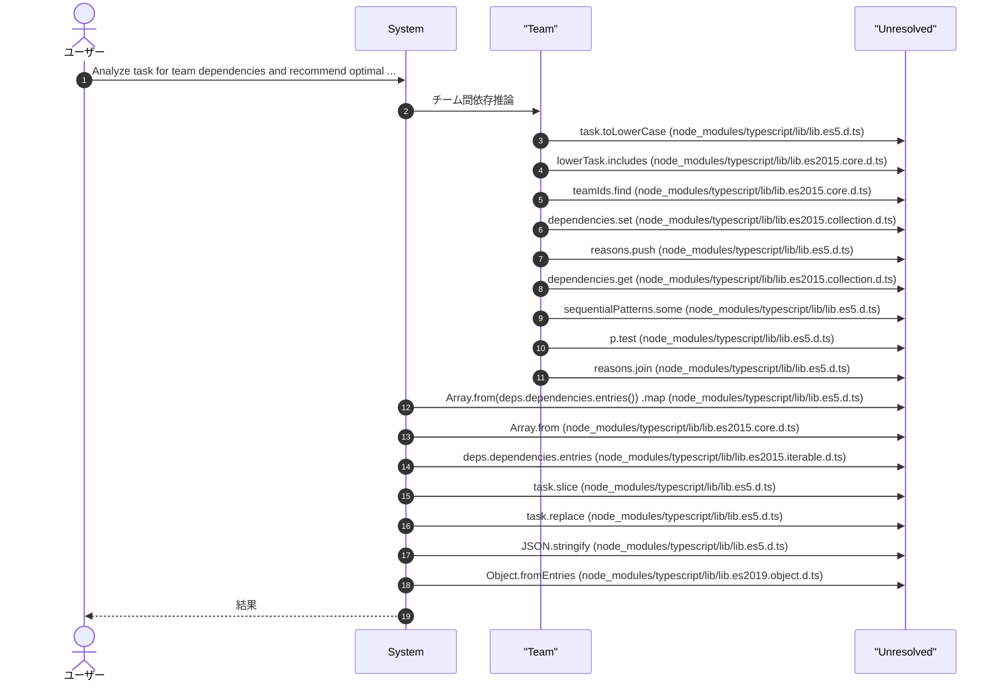
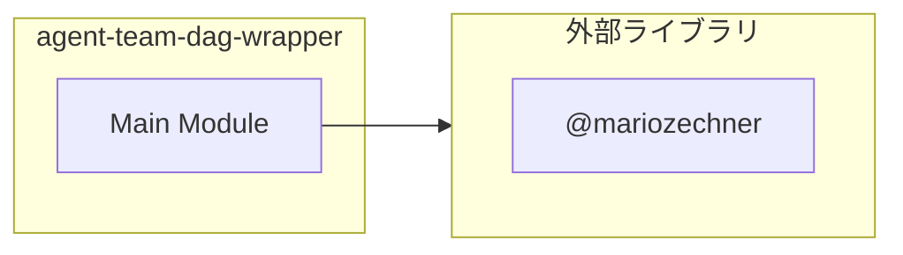

# agent-team-dag-wrapper

## 概要

`agent-team-dag-wrapper` モジュールのAPIリファレンス。

## インポート

```typescript
// from '@mariozechner/pi-ai': Type
// from '@mariozechner/pi-coding-agent': ExtensionAPI
```

## エクスポート一覧

| 種別 | 名前 | 説明 |
|------|------|------|

## ユーザーフロー

このモジュールが提供するツールと、その実行フローを示します。

### analyze_team_dependencies

Analyze task for team dependencies and recommend optimal execution strategy. Use before agent_team_run_parallel for complex tasks.



## 図解

### 依存関係図



## 関数

### inferTeamDependencies

```typescript
inferTeamDependencies(teamIds: string[], task: string): {
  hasDependencies: boolean;
  dependencies: Map<string, string[]>;
  description: string;
  recommendedTool: string;
}
```

Infer dependencies between teams based on task description

**パラメータ**

| 名前 | 型 | 必須 |
|------|-----|------|
| teamIds | `string[]` | はい |
| task | `string` | はい |

**戻り値**: `{
  hasDependencies: boolean;
  dependencies: Map<string, string[]>;
  description: string;
  recommendedTool: string;
}`

---
*自動生成: 2026-02-28T13:55:17.710Z*
