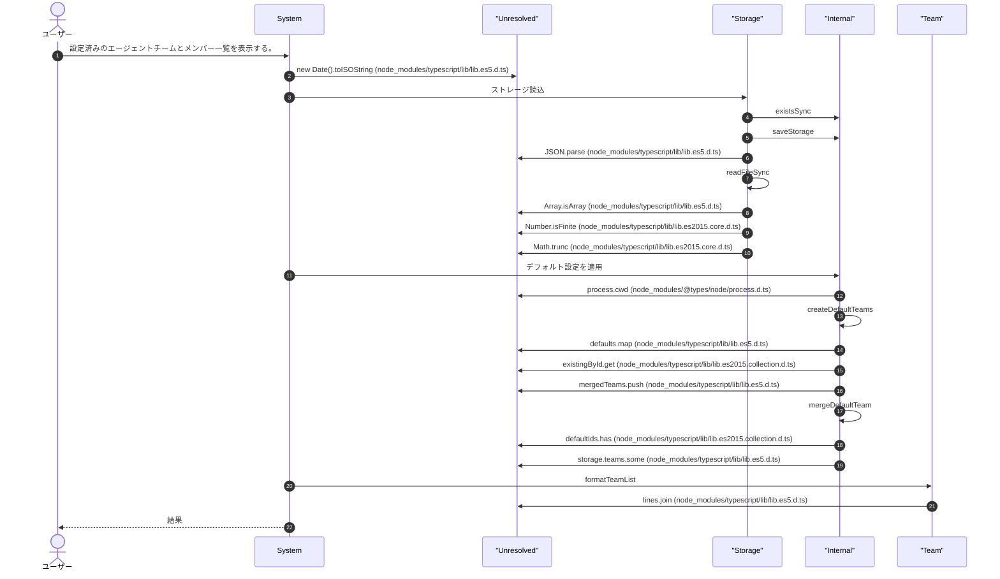
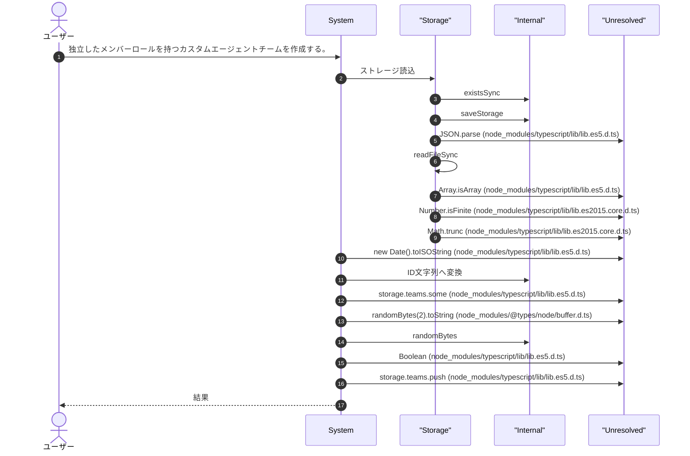
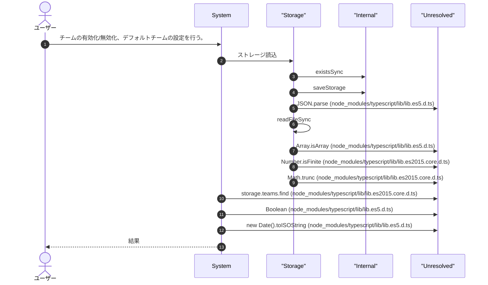
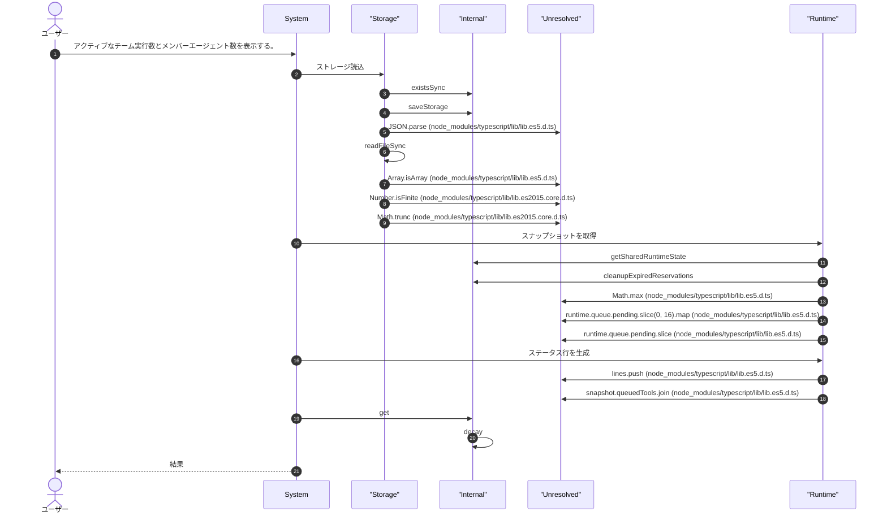
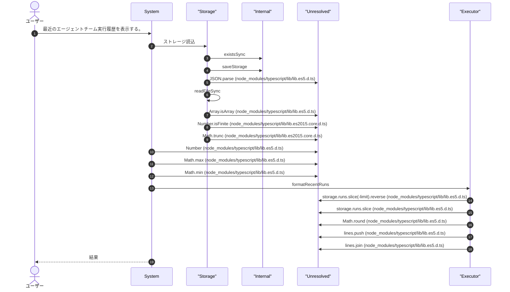
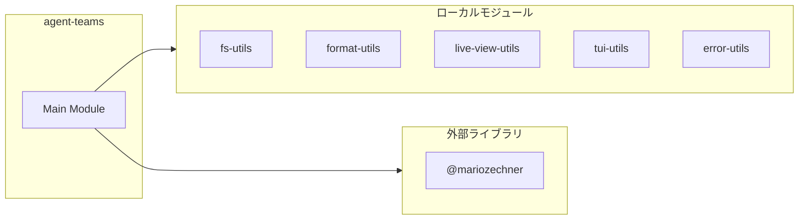
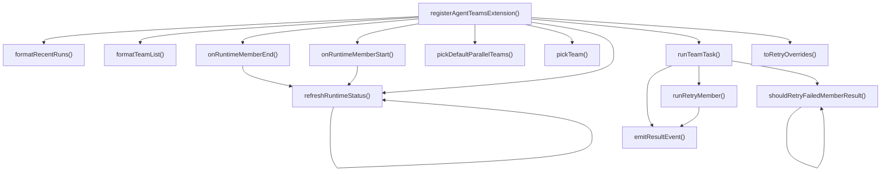
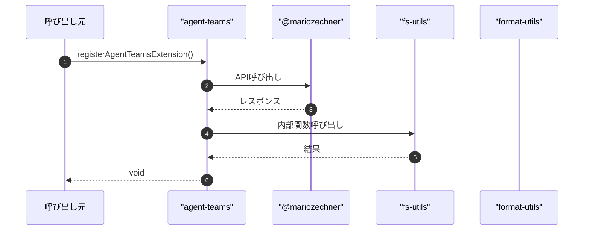

# agent-teams

## 概要

`agent-teams` モジュールのAPIリファレンス。

## インポート

```typescript
// from 'node:crypto': randomBytes
// from 'node:fs': existsSync, readdirSync, readFileSync, ...
// from 'node:os': homedir
// from 'node:path': basename, join
// from '@mariozechner/pi-ai': Type
// ... and 38 more imports
```

## エクスポート一覧

| 種別 | 名前 | 説明 |
|------|------|------|
| 関数 | `registerAgentTeamsExtension` | エージェントチーム拡張登録 |

## ユーザーフロー

このモジュールが提供するツールと、その実行フローを示します。

### agent_team_list

設定済みのエージェントチームとメンバー一覧を表示する。



### agent_team_create

独立したメンバーロールを持つカスタムエージェントチームを作成する。



### agent_team_configure

チームの有効化/無効化、デフォルトチームの設定を行う。



### agent_team_run

複数のメンバーエージェントでタスクを実行する。複数チームを並列実行できる場合はagent_team_run_parallelを使用。

```mermaid
sequenceDiagram
  autonumber
  actor User as ユーザー
  participant System as System
  participant Storage as "Storage"
  participant Internal as "Internal"
  participant Unresolved as "Unresolved"
  participant LLM as "LLM"
  participant Runtime as "Runtime"
  participant Team as "Team"
  participant Executor as "Executor"
  participant Judge as "Judge"

  User->>System: 複数のメンバーエージェントでタスクを実行する。複数チームを並列実行できる場合はagent_team_run_par...
  System->>Storage: ストレージ読込
  Storage->>Internal: existsSync
  Storage->>Internal: saveStorage
  Storage->>Unresolved: JSON.parse (node_modules/typescript/lib/lib.es5.d.ts)
  Storage->>Storage: readFileSync
  Storage->>Unresolved: Array.isArray (node_modules/typescript/lib/lib.es5.d.ts)
  Storage->>Unresolved: Number.isFinite (node_modules/typescript/lib/lib.es2015.core.d.ts)
  Storage->>Unresolved: Math.trunc (node_modules/typescript/lib/lib.es2015.core.d.ts)
  System->>LLM: pickTeam
  LLM->>Unresolved: storage.teams.find (node_modules/typescript/lib/lib.es2015.core.d.ts)
  System->>Internal: toRetryOverrides
  System->>Unresolved: team.members.filter (node_modules/typescript/lib/lib.es5.d.ts)
  System->>Unresolved: logger.startOperation (.pi/lib/comprehensive-logger.ts)
  System->>Runtime: スナップショットを取得
  Runtime->>Internal: getSharedRuntimeState
  Runtime->>Internal: cleanupExpiredReservations
  Runtime->>Unresolved: Math.max (node_modules/typescript/lib/lib.es5.d.ts)
  Runtime->>Unresolved: runtime.queue.pending.slice(0, 16).map (node_modules/typescript/lib/lib.es5.d.ts)
  Runtime->>Unresolved: runtime.queue.pending.slice (node_modules/typescript/lib/lib.es5.d.ts)
  System->>Runtime: ランタイムのオーケストレーション実行を待機する
  Runtime->>Internal: normalizePositiveInt
  Runtime->>Internal: createRuntimeQueueEntryId
  Runtime->>Unresolved: Date.now (node_modules/typescript/lib/lib.es5.d.ts)
  Runtime->>Internal: 優先度を推論
  Internal->>Unresolved: toolName.toLowerCase (node_modules/typescript/lib/lib.es5.d.ts)
  Internal->>Unresolved: lowerToolName.includes (node_modules/typescript/lib/lib.es2015.core.d.ts)
  Internal->>Unresolved: lowerToolName.startsWith (node_modules/typescript/lib/lib.es2015.core.d.ts)
  Runtime->>Unresolved: String (node_modules/typescript/lib/lib.es5.d.ts)
  Runtime->>Unresolved: runtime.queue.pending.push (node_modules/typescript/lib/lib.es5.d.ts)
  Runtime->>Internal: sortQueueByPriority
  Runtime->>Internal: updatePriorityStats
  Runtime->>Internal: notifyRuntimeCapacityChanged
  Runtime->>Unresolved: runtime.queue.pending.findIndex (node_modules/typescript/lib/lib.es2015.core.d.ts)
  Runtime->>Internal: removeQueuedEntry
  Runtime->>Internal: promoteStarvingEntries
  Runtime->>Internal: computeBackoffDelay
  Runtime->>Unresolved: Math.min (node_modules/typescript/lib/lib.es5.d.ts)
  Runtime->>Internal: waitForRuntimeCapacityEvent
  Runtime->>Internal: wait
  System->>Runtime: キューウェイトエラー生成
  Runtime->>Unresolved: snapshot.queuedTools.join (node_modules/typescript/lib/lib.es5.d.ts)
  System->>Internal: 通信ラウンド数を正規化
  Internal->>Unresolved: Number (node_modules/typescript/lib/lib.es5.d.ts)
  System->>Team: 再試行回数正規化
  System->>Internal: マップを作成
  Internal->>Unresolved: links.get(fromId)?.add (node_modules/typescript/lib/lib.es2015.collection.d.ts)
  Internal->>Unresolved: links.get (node_modules/typescript/lib/lib.es2015.collection.d.ts)
  Internal->>Internal: addLink
  Internal->>Unresolved: Array.from (node_modules/typescript/lib/lib.es2015.core.d.ts)
  System->>Runtime: 並行数リミットを取得
  System->>Runtime: applyLimit
  Runtime->>Unresolved: Math.floor (node_modules/typescript/lib/lib.es5.d.ts)
  System->>Runtime: 並列容量を解決
  Runtime->>Runtime: 容量予約を試行
  Runtime->>Internal: createCapacityCheck
  Runtime->>Internal: createRuntimeReservationId
  Runtime->>Internal: sanitizePlannedCount
  Runtime->>Internal: normalizeReservationTtlMs
  Runtime->>Internal: createReservationLease
  Runtime->>Runtime: 容量予約を実行
  Runtime->>Internal: checkRuntimeCapacity
  System->>Runtime: メンバー候補作成
  System->>Internal: raise
  Internal->>Internal: raiseWithReason
  System->>Runtime: 実行制限エラー生成
  Runtime->>Unresolved: Boolean (node_modules/typescript/lib/lib.es5.d.ts)
  System->>Executor: ハートビート開始
  Executor->>Internal: setInterval
  Executor->>Unresolved: reservation.heartbeat (.pi/extensions/agent-runtime.ts)
  Executor->>Unresolved: timer.unref (node_modules/@types/node/timers.d.ts)
  Executor->>Internal: clearInterval
  System->>Judge: タイムアウト時間を解決
  Judge->>Internal: モデル別タイムアウト
  Internal->>Internal: getModelBaseTimeoutMs
  Judge->>Internal: タイムアウトを正規化
  System->>Unresolved: getCostEstimator().estimate (.pi/lib/cost-estimator.ts)
  System->>Internal: コスト推定インスタンス取得
  System->>Unresolved: Math.round (node_modules/typescript/lib/lib.es5.d.ts)
  System->>Unresolved: console.log (node_modules/typescript/lib/lib.dom.d.ts)
  System->>Team: ライブ監視を生成
  Team->>Internal: clearTimeout
  Team->>Internal: setTimeout
  Team->>Internal: clearRenderTimer
  Team->>Internal: renderAgentTeamLiveView
  Team->>Internal: matchesKey
  Team->>Internal: close
  Team->>Internal: queueRender
  Team->>Internal: Enterキー判定
  Team->>Internal: pushLiveEvent
  Team->>Internal: formatLivePhase
  Team->>Internal: 時刻フォーマット
  Internal->>Unresolved: String(date.getHours()).padStart (node_modules/typescript/lib/lib.es2017.string.d.ts)
  Internal->>Unresolved: date.getHours (node_modules/typescript/lib/lib.es5.d.ts)
  Internal->>Unresolved: date.getMinutes (node_modules/typescript/lib/lib.es5.d.ts)
  Internal->>Unresolved: date.getSeconds (node_modules/typescript/lib/lib.es5.d.ts)
  Team->>Internal: 文字列正規化
  Internal->>Unresolved: input.replace(/\s+/g, ' ').trim (node_modules/typescript/lib/lib.es5.d.ts)
  Internal->>Unresolved: input.replace (node_modules/typescript/lib/lib.es5.d.ts)
  Internal->>Unresolved: normalizeCache.keys().next (node_modules/typescript/lib/lib.es2015.iterable.d.ts)
  Internal->>Unresolved: normalizeCache.keys (node_modules/typescript/lib/lib.es2015.iterable.d.ts)
  Internal->>Unresolved: normalizeCache.delete (node_modules/typescript/lib/lib.es2015.collection.d.ts)
  Internal->>Unresolved: normalizeCache.set (node_modules/typescript/lib/lib.es2015.collection.d.ts)
  Team->>Unresolved: globalEvents.splice (node_modules/typescript/lib/lib.es5.d.ts)
  Team->>Internal: 末尾にチャンク追加
  Team->>Unresolved: Buffer.byteLength (node_modules/@types/node/buffer.d.ts)
  Team->>Internal: 出現回数を数える
  Internal->>Unresolved: input.indexOf (node_modules/typescript/lib/lib.es5.d.ts)
  Team->>Unresolved: chunk.endsWith (node_modules/typescript/lib/lib.es2015.core.d.ts)
  System->>Team: キーを生成
  System->>Unresolved: liveMonitor?.appendBroadcastEvent (.pi/lib/team-types.ts)
  System->>Runtime: refreshRuntimeStatus
  System->>Unresolved: capacityReservation.consume (.pi/extensions/agent-runtime.ts)
  System->>Unresolved: liveMonitor?.markStarted (.pi/lib/team-types.ts)
  System->>Unresolved: liveMonitor?.appendEvent (.pi/lib/team-types.ts)
  System->>Team: チームでタスクを実行
  Team->>Internal: キャッシュクリア
  Internal->>Unresolved: beliefStateCache.clear (node_modules/typescript/lib/lib.es2015.collection.d.ts)
  Team->>Executor: 一意な実行IDを生成します。
  Executor->>Unresolved: now.getFullYear (node_modules/typescript/lib/lib.es5.d.ts)
  Executor->>Unresolved: now.getMonth (node_modules/typescript/lib/lib.es5.d.ts)
  Executor->>Unresolved: now.getDate (node_modules/typescript/lib/lib.es5.d.ts)
  Executor->>Unresolved: randomBytes(3).toString (node_modules/@types/node/buffer.d.ts)
  Executor->>Internal: randomBytes
  Team->>Unresolved: new Date().toISOString (node_modules/typescript/lib/lib.es5.d.ts)
  Team->>Unresolved: ensurePaths (.pi/extensions/agent-teams/storage.ts)
  Team->>Unresolved: result.diagnostics.confidence.toFixed (node_modules/typescript/lib/lib.es5.d.ts)
  Team->>Runtime: アイテム並列処理
  Runtime->>Internal: toPositiveLimit
  Runtime->>Internal: ensureNotAborted
  Runtime->>Unresolved: Promise.all (node_modules/typescript/lib/lib.es2015.iterable.d.ts)
  Runtime->>Internal: runWorker
  Team->>Internal: 親に連動する中止制御
  Internal->>Unresolved: controller.abort (node_modules/typescript/lib/lib.dom.d.ts)
  Internal->>Internal: addEventListener
  Internal->>Internal: removeEventListener
  Team->>Team: タスクを実行
  Team->>Internal: buildTeamMemberPrompt
  Team->>LLM: runPiPrintMode
  Team->>Internal: normalizeTeamMemberOutput
  Team->>Internal: extractSummary
  Team->>Internal: メッセージを文字列化
  Team->>Internal: emitResultEvent
  Team->>Unresolved: communicationMembers.some (node_modules/typescript/lib/lib.es5.d.ts)
  Team->>Internal: コンテキストマップを生成
  Internal->>Internal: sanitizeCommunicationSnippet
  Internal->>Internal: extractField
  Team->>Internal: チームメンバー向けの通信コンテキストを作成する
  Internal->>Unresolved: input.contextMap.values (node_modules/typescript/lib/lib.es2015.iterable.d.ts)
  Internal->>Unresolved: mentioned.has (node_modules/typescript/lib/lib.es2015.collection.d.ts)
  Team->>Internal: パートナーの参照を検出する（V2）
  Internal->>Internal: 通信IDモード取得
  Internal->>Internal: モード取得
  Internal->>Unresolved: pattern.exec (node_modules/typescript/lib/lib.es5.d.ts)
  Internal->>Unresolved: id.split (node_modules/typescript/lib/lib.es5.d.ts)
  Internal->>Internal: 議論立場解析
  Internal->>Unresolved: Object.entries (node_modules/typescript/lib/lib.es2017.object.d.ts)
  Internal->>Unresolved: Object.values(STANCE_PATTERNS).reduce (node_modules/typescript/lib/lib.es5.d.ts)
  Internal->>Internal: clampConfidence
  Team->>Team: shouldRetryFailedMemberResult
  Team->>Team: メンバーの再試行を実行
  Team->>Unresolved: Object.fromEntries (node_modules/typescript/lib/lib.es2019.object.d.ts)
  Team->>Internal: 代理不確実性計算
  Internal->>Unresolved: Math.sqrt (node_modules/typescript/lib/lib.es5.d.ts)
  Team->>Judge: 最終審査の実行
  Judge->>Internal: buildFallbackJudge
  Team->>Unresolved: getCostEstimator().recordExecution (.pi/lib/cost-estimator.ts)
  Team->>Storage: writeFileSync
  Team->>Unresolved: JSON.stringify (node_modules/typescript/lib/lib.es5.d.ts)
  System->>Unresolved: liveMonitor?.appendChunk (.pi/lib/team-types.ts)
  System->>Unresolved: liveMonitor?.markPhase (.pi/lib/team-types.ts)
  System->>Internal: 構造化出力からDISCUSSIONセクションを抽出
  Internal->>Unresolved: discussionPattern.test (node_modules/typescript/lib/lib.es5.d.ts)
  System->>Unresolved: liveMonitor?.appendDiscussion (.pi/lib/team-types.ts)
  System->>Unresolved: liveMonitor?.markFinished (.pi/lib/team-types.ts)
  System->>Storage: パターン付き保存
  Storage->>Unresolved: console.error (node_modules/typescript/lib/lib.dom.d.ts)
  System->>Unresolved: pi.appendEntry (node_modules/@mariozechner/pi-coding-agent/dist/core/extensions/types.d.ts)
  System->>Internal: エラーを圧力関連のカテゴリに分類する
  Internal->>Internal: extractStatusCodeFromMessage
  System->>Internal: lower
  Internal->>Internal: decay
  System->>Team: メンバー統合判定
  Team->>Internal: resolveTeamFailureOutcome
  System->>Team: チーム結果構築
  Team->>Unresolved: (input.communicationAudit ?? [])       .slice()       .sort (node_modules/typescript/lib/lib.es5.d.ts)
  Team->>Unresolved: left.memberId.localeCompare (node_modules/typescript/lib/lib.es5.d.ts)
  System->>Unresolved: logger.endOperation (.pi/lib/comprehensive-logger.ts)
  System->>Internal: トレースIDを生成
  System->>Unresolved: capacityReservation.release (.pi/extensions/agent-runtime.ts)
  System-->>User: 結果

```



### agent_team_run_parallel

選択したチームを並列実行する。teamIdsを省略した場合、現在の有効なチームのみを実行（保守的デフォルト）。

```mermaid
sequenceDiagram
  autonumber
  actor User as ユーザー
  participant System as System
  participant Storage as "Storage"
  participant Internal as "Internal"
  participant Unresolved as "Unresolved"
  participant LLM as "LLM"
  participant Runtime as "Runtime"
  participant Team as "Team"
  participant Judge as "Judge"
  participant Executor as "Executor"

  User->>System: 選択したチームを並列実行する。teamIdsを省略した場合、現在の有効なチームのみを実行（保守的デフォルト）。
  System->>Storage: ストレージ読込
  Storage->>Internal: existsSync
  Storage->>Internal: saveStorage
  Storage->>Unresolved: JSON.parse (node_modules/typescript/lib/lib.es5.d.ts)
  Storage->>Storage: readFileSync
  Storage->>Unresolved: Array.isArray (node_modules/typescript/lib/lib.es5.d.ts)
  Storage->>Unresolved: Number.isFinite (node_modules/typescript/lib/lib.es2015.core.d.ts)
  Storage->>Unresolved: Math.trunc (node_modules/typescript/lib/lib.es2015.core.d.ts)
  System->>Internal: toRetryOverrides
  System->>Unresolved: Array.from (node_modules/typescript/lib/lib.es2015.core.d.ts)
  System->>Unresolved: String(id).trim (node_modules/typescript/lib/lib.es5.d.ts)
  System->>Unresolved: String (node_modules/typescript/lib/lib.es5.d.ts)
  System->>Unresolved: requestedIds               .map((id) => storage.teams.find((team) => team.id === id))               .filter (node_modules/typescript/lib/lib.es5.d.ts)
  System->>Unresolved: requestedIds               .map (node_modules/typescript/lib/lib.es5.d.ts)
  System->>Unresolved: storage.teams.find (node_modules/typescript/lib/lib.es2015.core.d.ts)
  System->>Unresolved: Boolean (node_modules/typescript/lib/lib.es5.d.ts)
  System->>LLM: pickDefaultParallelTeams
  LLM->>Unresolved: String(process.env.PI_AGENT_TEAM_PARALLEL_DEFAULT || 'current')     .trim()     .toLowerCase (node_modules/typescript/lib/lib.es5.d.ts)
  LLM->>Unresolved: enabledTeams.slice (node_modules/typescript/lib/lib.es5.d.ts)
  System->>Unresolved: storage.teams.some (node_modules/typescript/lib/lib.es5.d.ts)
  System->>Unresolved: missingIds.join (node_modules/typescript/lib/lib.es5.d.ts)
  System->>Unresolved: logger.startOperation (.pi/lib/comprehensive-logger.ts)
  System->>Runtime: スナップショットを取得
  Runtime->>Internal: getSharedRuntimeState
  Runtime->>Internal: cleanupExpiredReservations
  Runtime->>Unresolved: Math.max (node_modules/typescript/lib/lib.es5.d.ts)
  System->>Runtime: ランタイムのオーケストレーション実行を待機する
  Runtime->>Internal: normalizePositiveInt
  Runtime->>Internal: createRuntimeQueueEntryId
  Runtime->>Unresolved: Date.now (node_modules/typescript/lib/lib.es5.d.ts)
  Runtime->>Internal: 優先度を推論
  Internal->>Unresolved: lowerToolName.includes (node_modules/typescript/lib/lib.es2015.core.d.ts)
  Internal->>Unresolved: lowerToolName.startsWith (node_modules/typescript/lib/lib.es2015.core.d.ts)
  Runtime->>Unresolved: runtime.queue.pending.push (node_modules/typescript/lib/lib.es5.d.ts)
  Runtime->>Internal: sortQueueByPriority
  Runtime->>Internal: updatePriorityStats
  Runtime->>Internal: notifyRuntimeCapacityChanged
  Runtime->>Unresolved: runtime.queue.pending.findIndex (node_modules/typescript/lib/lib.es2015.core.d.ts)
  Runtime->>Internal: removeQueuedEntry
  Runtime->>Internal: promoteStarvingEntries
  Runtime->>Internal: computeBackoffDelay
  Runtime->>Unresolved: Math.min (node_modules/typescript/lib/lib.es5.d.ts)
  Runtime->>Internal: waitForRuntimeCapacityEvent
  Runtime->>Internal: wait
  System->>Runtime: キューウェイトエラー生成
  System->>Internal: 通信ラウンド数を正規化
  Internal->>Unresolved: Number (node_modules/typescript/lib/lib.es5.d.ts)
  System->>Team: 再試行回数正規化
  System->>Judge: タイムアウト時間を解決
  Judge->>Internal: モデル別タイムアウト
  Internal->>Internal: getModelBaseTimeoutMs
  Internal->>Unresolved: Math.floor (node_modules/typescript/lib/lib.es5.d.ts)
  Judge->>Internal: タイムアウトを正規化
  System->>Runtime: 並行数リミットを取得
  System->>Internal: get
  Internal->>Internal: decay
  System->>Runtime: applyLimit
  System->>Unresolved: enabledTeams.reduce (node_modules/typescript/lib/lib.es5.d.ts)
  System->>Runtime: 並列容量を解決
  Runtime->>Runtime: 容量予約を試行
  Runtime->>Internal: createCapacityCheck
  Runtime->>Internal: createRuntimeReservationId
  Runtime->>Internal: sanitizePlannedCount
  Runtime->>Internal: normalizeReservationTtlMs
  Runtime->>Internal: createReservationLease
  Runtime->>Runtime: 容量予約を実行
  Runtime->>Internal: checkRuntimeCapacity
  System->>Runtime: 候補リスト作成
  System->>Internal: raise
  Internal->>Internal: raiseWithReason
  System->>Runtime: 実行制限エラー生成
  System->>Executor: ハートビート開始
  Executor->>Internal: setInterval
  Executor->>Unresolved: reservation.heartbeat (.pi/extensions/agent-runtime.ts)
  Executor->>Unresolved: timer.unref (node_modules/@types/node/timers.d.ts)
  Executor->>Internal: clearInterval
  System->>Team: ライブ監視を生成
  Team->>Internal: clearTimeout
  Team->>Internal: setTimeout
  Team->>Internal: clearRenderTimer
  Team->>Internal: renderAgentTeamLiveView
  Team->>Internal: matchesKey
  Team->>Internal: close
  Team->>Internal: queueRender
  Team->>Internal: Enterキー判定
  Team->>Internal: pushLiveEvent
  Team->>Internal: formatLivePhase
  Team->>Internal: 時刻フォーマット
  Internal->>Unresolved: String(date.getHours()).padStart (node_modules/typescript/lib/lib.es2017.string.d.ts)
  Internal->>Unresolved: date.getHours (node_modules/typescript/lib/lib.es5.d.ts)
  Internal->>Unresolved: date.getMinutes (node_modules/typescript/lib/lib.es5.d.ts)
  Internal->>Unresolved: date.getSeconds (node_modules/typescript/lib/lib.es5.d.ts)
  Team->>Internal: 文字列正規化
  Internal->>Unresolved: input.replace (node_modules/typescript/lib/lib.es5.d.ts)
  Internal->>Unresolved: normalizeCache.keys().next (node_modules/typescript/lib/lib.es2015.iterable.d.ts)
  Internal->>Unresolved: normalizeCache.keys (node_modules/typescript/lib/lib.es2015.iterable.d.ts)
  Internal->>Unresolved: normalizeCache.delete (node_modules/typescript/lib/lib.es2015.collection.d.ts)
  Internal->>Unresolved: normalizeCache.set (node_modules/typescript/lib/lib.es2015.collection.d.ts)
  Team->>Unresolved: globalEvents.splice (node_modules/typescript/lib/lib.es5.d.ts)
  Team->>Internal: 末尾にチャンク追加
  Team->>Unresolved: Buffer.byteLength (node_modules/@types/node/buffer.d.ts)
  Team->>Internal: 出現回数を数える
  Internal->>Unresolved: input.indexOf (node_modules/typescript/lib/lib.es5.d.ts)
  Team->>Unresolved: chunk.endsWith (node_modules/typescript/lib/lib.es2015.core.d.ts)
  System->>Unresolved: enabledTeams.flatMap (node_modules/typescript/lib/lib.es2019.array.d.ts)
  System->>Internal: マップを作成
  Internal->>Unresolved: links.get(fromId)?.add (node_modules/typescript/lib/lib.es2015.collection.d.ts)
  Internal->>Internal: addLink
  System->>Team: キーを生成
  System->>Unresolved: liveMonitor?.appendBroadcastEvent (.pi/lib/team-types.ts)
  System->>Runtime: refreshRuntimeStatus
  System->>Unresolved: getCostEstimator().estimate (.pi/lib/cost-estimator.ts)
  System->>Internal: コスト推定インスタンス取得
  System->>Unresolved: Math.round (node_modules/typescript/lib/lib.es5.d.ts)
  System->>Unresolved: console.log (node_modules/typescript/lib/lib.dom.d.ts)
  System->>Unresolved: capacityReservation.consume (.pi/extensions/agent-runtime.ts)
  System->>Runtime: アイテム並列処理
  Runtime->>Internal: toPositiveLimit
  Runtime->>Internal: ensureNotAborted
  Runtime->>Unresolved: Promise.all (node_modules/typescript/lib/lib.es2015.iterable.d.ts)
  Runtime->>Internal: runWorker
  System->>Internal: 親に連動する中止制御
  Internal->>Unresolved: controller.abort (node_modules/typescript/lib/lib.dom.d.ts)
  Internal->>Internal: addEventListener
  Internal->>Internal: removeEventListener
  System->>Team: チームでタスクを実行
  Team->>Internal: キャッシュクリア
  Internal->>Unresolved: beliefStateCache.clear (node_modules/typescript/lib/lib.es2015.collection.d.ts)
  Team->>Executor: 一意な実行IDを生成します。
  Executor->>Unresolved: now.getFullYear (node_modules/typescript/lib/lib.es5.d.ts)
  Executor->>Unresolved: now.getMonth (node_modules/typescript/lib/lib.es5.d.ts)
  Executor->>Unresolved: now.getDate (node_modules/typescript/lib/lib.es5.d.ts)
  Executor->>Unresolved: randomBytes(3).toString (node_modules/@types/node/buffer.d.ts)
  Executor->>Internal: randomBytes
  Team->>Unresolved: new Date().toISOString (node_modules/typescript/lib/lib.es5.d.ts)
  Team->>Unresolved: ensurePaths (.pi/extensions/agent-teams/storage.ts)
  Team->>Unresolved: result.diagnostics.confidence.toFixed (node_modules/typescript/lib/lib.es5.d.ts)
  Team->>Team: タスクを実行
  Team->>Internal: buildTeamMemberPrompt
  Team->>LLM: runPiPrintMode
  Team->>Internal: normalizeTeamMemberOutput
  Team->>Internal: extractSummary
  Team->>Internal: メッセージを文字列化
  Team->>Internal: emitResultEvent
  Team->>Internal: コンテキストマップを生成
  Internal->>Internal: sanitizeCommunicationSnippet
  Internal->>Internal: extractField
  Team->>Internal: チームメンバー向けの通信コンテキストを作成する
  Internal->>Unresolved: input.contextMap.values (node_modules/typescript/lib/lib.es2015.iterable.d.ts)
  Internal->>Unresolved: mentioned.has (node_modules/typescript/lib/lib.es2015.collection.d.ts)
  Team->>Internal: パートナーの参照を検出する（V2）
  Internal->>Internal: 通信IDモード取得
  Internal->>Internal: モード取得
  Internal->>Unresolved: pattern.exec (node_modules/typescript/lib/lib.es5.d.ts)
  Internal->>Unresolved: id.split (node_modules/typescript/lib/lib.es5.d.ts)
  Internal->>Internal: 議論立場解析
  Internal->>Unresolved: Object.entries (node_modules/typescript/lib/lib.es2017.object.d.ts)
  Internal->>Internal: clampConfidence
  Team->>Team: shouldRetryFailedMemberResult
  Team->>Team: メンバーの再試行を実行
  Team->>Unresolved: Object.fromEntries (node_modules/typescript/lib/lib.es2019.object.d.ts)
  Team->>Internal: 代理不確実性計算
  Internal->>Unresolved: Math.sqrt (node_modules/typescript/lib/lib.es5.d.ts)
  Team->>Judge: 最終審査の実行
  Judge->>Internal: buildFallbackJudge
  Team->>Unresolved: getCostEstimator().recordExecution (.pi/lib/cost-estimator.ts)
  Team->>Storage: writeFileSync
  Team->>Unresolved: JSON.stringify (node_modules/typescript/lib/lib.es5.d.ts)
  System->>Runtime: onRuntimeMemberStart
  System->>Unresolved: liveMonitor?.markStarted (.pi/lib/team-types.ts)
  System->>Unresolved: liveMonitor?.appendEvent (.pi/lib/team-types.ts)
  System->>Runtime: onRuntimeMemberEnd
  System->>Unresolved: liveMonitor?.appendChunk (.pi/lib/team-types.ts)
  System->>Unresolved: liveMonitor?.markPhase (.pi/lib/team-types.ts)
  System->>Internal: 構造化出力からDISCUSSIONセクションを抽出
  Internal->>Unresolved: discussionPattern.test (node_modules/typescript/lib/lib.es5.d.ts)
  System->>Unresolved: liveMonitor?.appendDiscussion (.pi/lib/team-types.ts)
  System->>Unresolved: liveMonitor?.markFinished (.pi/lib/team-types.ts)
  System->>Unresolved: pi.appendEntry (node_modules/@mariozechner/pi-coding-agent/dist/core/extensions/types.d.ts)
  System->>Internal: エラーを圧力関連のカテゴリに分類する
  Internal->>Internal: extractStatusCodeFromMessage
  System->>Internal: lower
  System->>Runtime: 並列実行判定
  Runtime->>Internal: resolveTeamMemberAggregateOutcome
  Runtime->>Internal: resolveTeamFailureOutcome
  System->>Team: チーム結果構築
  Team->>Unresolved: (input.communicationAudit ?? [])       .slice()       .sort (node_modules/typescript/lib/lib.es5.d.ts)
  Team->>Unresolved: left.memberId.localeCompare (node_modules/typescript/lib/lib.es5.d.ts)
  System->>Unresolved: logger.endOperation (.pi/lib/comprehensive-logger.ts)
  System->>Internal: トレースIDを生成
  System->>Unresolved: capacityReservation.release (.pi/extensions/agent-runtime.ts)
  System-->>User: 結果

```



### agent_team_status

アクティブなチーム実行数とメンバーエージェント数を表示する。



### agent_team_runs

最近のエージェントチーム実行履歴を表示する。



## 図解

### 依存関係図



### 関数フロー



### シーケンス図



## 関数

### shouldRetryFailedMemberResult

```typescript
shouldRetryFailedMemberResult(result: TeamMemberResult, retryRound: number): boolean
```

**パラメータ**

| 名前 | 型 | 必須 |
|------|-----|------|
| result | `TeamMemberResult` | はい |
| retryRound | `number` | はい |

**戻り値**: `boolean`

### toRetryOverrides

```typescript
toRetryOverrides(value: unknown): RetryWithBackoffOverrides | undefined
```

**パラメータ**

| 名前 | 型 | 必須 |
|------|-----|------|
| value | `unknown` | はい |

**戻り値**: `RetryWithBackoffOverrides | undefined`

### refreshRuntimeStatus

```typescript
refreshRuntimeStatus(ctx: any): void
```

Refresh runtime status display in the UI with agent-team-specific parameters.

**パラメータ**

| 名前 | 型 | 必須 |
|------|-----|------|
| ctx | `any` | はい |

**戻り値**: `void`

### formatTeamList

```typescript
formatTeamList(storage: TeamStorage): string
```

**パラメータ**

| 名前 | 型 | 必須 |
|------|-----|------|
| storage | `TeamStorage` | はい |

**戻り値**: `string`

### formatRecentRuns

```typescript
formatRecentRuns(storage: TeamStorage, limit: any): string
```

**パラメータ**

| 名前 | 型 | 必須 |
|------|-----|------|
| storage | `TeamStorage` | はい |
| limit | `any` | はい |

**戻り値**: `string`

### runPiPrintMode

```typescript
async runPiPrintMode(input: {
  provider?: string;
  model?: string;
  prompt: string;
  timeoutMs: number;
  signal?: AbortSignal;
  onTextDelta?: (delta: string) => void;
  onStderrChunk?: (chunk: string) => void;
}): Promise<PrintCommandResult>
```

Run pi-print mode for team member execution.

**パラメータ**

| 名前 | 型 | 必須 |
|------|-----|------|
| input | `object` | はい |
| &nbsp;&nbsp;↳ provider | `string` | いいえ |
| &nbsp;&nbsp;↳ model | `string` | いいえ |
| &nbsp;&nbsp;↳ prompt | `string` | はい |
| &nbsp;&nbsp;↳ timeoutMs | `number` | はい |
| &nbsp;&nbsp;↳ signal | `AbortSignal` | いいえ |
| &nbsp;&nbsp;↳ onTextDelta | `(delta: string) => void;  onStderrChunk?: (chunk: string) => void;` | いいえ |

**戻り値**: `Promise<PrintCommandResult>`

### pickTeam

```typescript
pickTeam(storage: TeamStorage, requestedId?: string): TeamDefinition | undefined
```

**パラメータ**

| 名前 | 型 | 必須 |
|------|-----|------|
| storage | `TeamStorage` | はい |
| requestedId | `string` | いいえ |

**戻り値**: `TeamDefinition | undefined`

### pickDefaultParallelTeams

```typescript
pickDefaultParallelTeams(storage: TeamStorage): TeamDefinition[]
```

**パラメータ**

| 名前 | 型 | 必須 |
|------|-----|------|
| storage | `TeamStorage` | はい |

**戻り値**: `TeamDefinition[]`

### runTeamTask

```typescript
async runTeamTask(input: {
  team: TeamDefinition;
  task: string;
  strategy: TeamStrategy;
  memberParallelLimit?: number;
  communicationRounds: number;
  failedMemberRetryRounds?: number;
  communicationLinks?: Map<string, string[]>;
  sharedContext?: string;
  timeoutMs: number;
  cwd: string;
  retryOverrides?: RetryWithBackoffOverrides;
  fallbackProvider?: string;
  fallbackModel?: string;
  signal?: AbortSignal;
  onMemberStart?: (member: TeamMember) => void;
  onMemberEnd?: (member: TeamMember) => void;
  onMemberTextDelta?: (member: TeamMember, delta: string) => void;
  onMemberStderrChunk?: (member: TeamMember, chunk: string) => void;
  onMemberResult?: (member: TeamMember, result: TeamMemberResult) => void;
  onMemberPhase?: (member: TeamMember, phase: TeamLivePhase, round?: number) => void;
  onMemberEvent?: (member: TeamMember, event: string) => void;
  onTeamEvent?: (event: string) => void;
}): Promise<{ runRecord: TeamRunRecord; memberResults: TeamMemberResult[]; communicationAudit: TeamCommunicationAuditEntry[] }>
```

**パラメータ**

| 名前 | 型 | 必須 |
|------|-----|------|
| input | `object` | はい |
| &nbsp;&nbsp;↳ team | `TeamDefinition` | はい |
| &nbsp;&nbsp;↳ task | `string` | はい |
| &nbsp;&nbsp;↳ strategy | `TeamStrategy` | はい |
| &nbsp;&nbsp;↳ memberParallelLimit | `number` | いいえ |
| &nbsp;&nbsp;↳ communicationRounds | `number` | はい |
| &nbsp;&nbsp;↳ failedMemberRetryRounds | `number` | いいえ |
| &nbsp;&nbsp;↳ communicationLinks | `Map<string, string[]>` | いいえ |
| &nbsp;&nbsp;↳ sharedContext | `string` | いいえ |
| &nbsp;&nbsp;↳ timeoutMs | `number` | はい |
| &nbsp;&nbsp;↳ cwd | `string` | はい |
| &nbsp;&nbsp;↳ retryOverrides | `RetryWithBackoffOverrides` | いいえ |
| &nbsp;&nbsp;↳ fallbackProvider | `string` | いいえ |
| &nbsp;&nbsp;↳ fallbackModel | `string` | いいえ |
| &nbsp;&nbsp;↳ signal | `AbortSignal` | いいえ |
| &nbsp;&nbsp;↳ onMemberStart | `(member: TeamMember) => void;  onMemberEnd?: (member: TeamMember) => void;  onMemberTextDelta?: (member: TeamMember, delta: string) => void;  onMemberStderrChunk?: (member: TeamMember, chunk: string) => void;  onMemberResult?: (member: TeamMember, result: TeamMemberResult) => void;  onMemberPhase?: (member: TeamMember, phase: TeamLivePhase, round?: number) => void;  onMemberEvent?: (member: TeamMember, event: string) => void;  onTeamEvent?: (event: string) => void;` | いいえ |

**戻り値**: `Promise<{ runRecord: TeamRunRecord; memberResults: TeamMemberResult[]; communicationAudit: TeamCommunicationAuditEntry[] }>`

### emitResultEvent

```typescript
emitResultEvent(member: TeamMember, phaseLabel: string, result: TeamMemberResult): void
```

**パラメータ**

| 名前 | 型 | 必須 |
|------|-----|------|
| member | `TeamMember` | はい |
| phaseLabel | `string` | はい |
| result | `TeamMemberResult` | はい |

**戻り値**: `void`

### runRetryMember

```typescript
async runRetryMember(member: TeamMember): Promise<TeamMemberResult>
```

**パラメータ**

| 名前 | 型 | 必須 |
|------|-----|------|
| member | `TeamMember` | はい |

**戻り値**: `Promise<TeamMemberResult>`

### registerAgentTeamsExtension

```typescript
registerAgentTeamsExtension(pi: ExtensionAPI): void
```

エージェントチーム拡張登録

**パラメータ**

| 名前 | 型 | 必須 |
|------|-----|------|
| pi | `ExtensionAPI` | はい |

**戻り値**: `void`

### onMemberStart

```typescript
onMemberStart(member: TeamMember): void
```

**パラメータ**

| 名前 | 型 | 必須 |
|------|-----|------|
| member | `TeamMember` | はい |

**戻り値**: `void`

### onMemberEnd

```typescript
onMemberEnd(member: TeamMember): void
```

**パラメータ**

| 名前 | 型 | 必須 |
|------|-----|------|
| member | `TeamMember` | はい |

**戻り値**: `void`

### onRuntimeMemberStart

```typescript
onRuntimeMemberStart(): void
```

**戻り値**: `void`

### onRuntimeMemberEnd

```typescript
onRuntimeMemberEnd(): void
```

**戻り値**: `void`

## 型定義

### LiveViewMode

```typescript
type LiveViewMode = TeamLiveViewMode
```

---
*自動生成: 2026-02-18T18:06:17.152Z*
