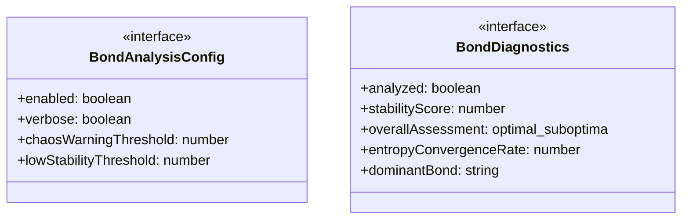
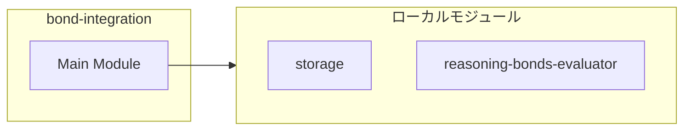
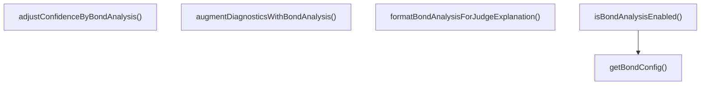
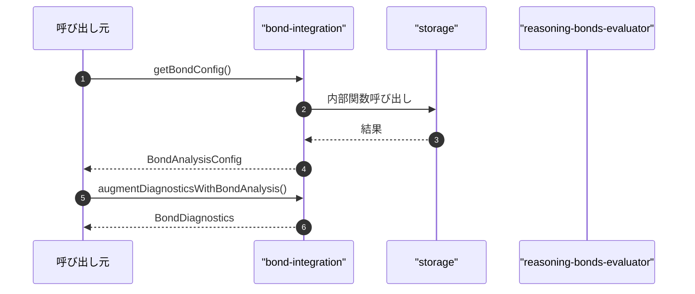

# bond-integration

## 概要

`bond-integration` モジュールのAPIリファレンス。

## インポート

```typescript
// from './storage.js': TeamMemberResult
// from '../../lib/reasoning-bonds-evaluator.js': evaluateTeamBonds, generateBondReport, BondEvaluationResult
```

## エクスポート一覧

| 種別 | 名前 | 説明 |
|------|------|------|
| 関数 | `getBondConfig` | 環境変数から設定を読み込み |
| 関数 | `augmentDiagnosticsWithBondAnalysis` | チームメンバーの実行結果にボンド分析を追加 |
| 関数 | `adjustConfidenceByBondAnalysis` | ボンド分析結果をJudge判定に反映するための重み調整 |
| 関数 | `formatBondAnalysisForJudgeExplanation` | ボンド分析結果をJudge説明に追加 |
| 関数 | `isBondAnalysisEnabled` | ボンド分析が有効かどうかを判定 |
| インターフェース | `BondAnalysisConfig` | ボンド分析の設定 |
| インターフェース | `BondDiagnostics` | ボンド分析の結果を含む拡張診断情報 |

## 図解

### クラス図



### 依存関係図



### 関数フロー



### シーケンス図



## 関数

### getBondConfig

```typescript
getBondConfig(): BondAnalysisConfig
```

環境変数から設定を読み込み

**戻り値**: `BondAnalysisConfig`

### augmentDiagnosticsWithBondAnalysis

```typescript
augmentDiagnosticsWithBondAnalysis(results: TeamMemberResult[], config: BondAnalysisConfig): BondDiagnostics
```

チームメンバーの実行結果にボンド分析を追加

**パラメータ**

| 名前 | 型 | 必須 |
|------|-----|------|
| results | `TeamMemberResult[]` | はい |
| config | `BondAnalysisConfig` | はい |

**戻り値**: `BondDiagnostics`

### adjustConfidenceByBondAnalysis

```typescript
adjustConfidenceByBondAnalysis(bondDiagnostics: BondDiagnostics, baseConfidence: number): number
```

ボンド分析結果をJudge判定に反映するための重み調整

**パラメータ**

| 名前 | 型 | 必須 |
|------|-----|------|
| bondDiagnostics | `BondDiagnostics` | はい |
| baseConfidence | `number` | はい |

**戻り値**: `number`

### formatBondAnalysisForJudgeExplanation

```typescript
formatBondAnalysisForJudgeExplanation(bondDiagnostics: BondDiagnostics): string
```

ボンド分析結果をJudge説明に追加

**パラメータ**

| 名前 | 型 | 必須 |
|------|-----|------|
| bondDiagnostics | `BondDiagnostics` | はい |

**戻り値**: `string`

### isBondAnalysisEnabled

```typescript
isBondAnalysisEnabled(): boolean
```

ボンド分析が有効かどうかを判定

**戻り値**: `boolean`

## インターフェース

### BondAnalysisConfig

```typescript
interface BondAnalysisConfig {
  enabled: boolean;
  verbose: boolean;
  chaosWarningThreshold: number;
  lowStabilityThreshold: number;
}
```

ボンド分析の設定

### BondDiagnostics

```typescript
interface BondDiagnostics {
  analyzed: boolean;
  stabilityScore: number;
  overallAssessment: "optimal" | "suboptimal" | "unstable" | "chaotic";
  entropyConvergenceRate: number;
  dominantBond: string;
  warnings: string[];
  recommendations: string[];
  detailedReport?: string;
}
```

ボンド分析の結果を含む拡張診断情報

---
*自動生成: 2026-02-22T18:55:28.004Z*
