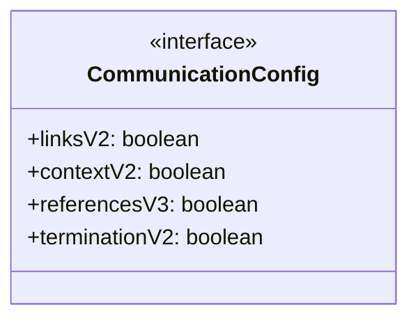
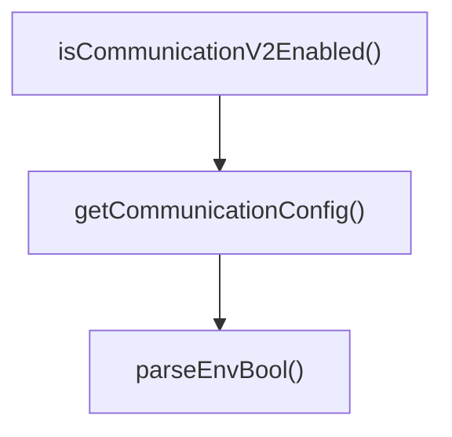

# communication-config

## 概要

`communication-config` モジュールのAPIリファレンス。

## エクスポート一覧

| 種別 | 名前 | 説明 |
|------|------|------|
| 関数 | `getCommunicationConfig` | コミュニケーション設定を取得する |
| 関数 | `isCommunicationV2Enabled` | コミュニケーションV2有効判定 |
| インターフェース | `CommunicationConfig` | コミュニケーション機能の設定 |

## 図解

### クラス図



### 関数フロー



## 関数

### getCommunicationConfig

```typescript
getCommunicationConfig(): CommunicationConfig
```

コミュニケーション設定を取得する

**戻り値**: `CommunicationConfig`

### parseEnvBool

```typescript
parseEnvBool(key: string, fallback: boolean): boolean
```

**パラメータ**

| 名前 | 型 | 必須 |
|------|-----|------|
| key | `string` | はい |
| fallback | `boolean` | はい |

**戻り値**: `boolean`

### isCommunicationV2Enabled

```typescript
isCommunicationV2Enabled(): boolean
```

コミュニケーションV2有効判定

**戻り値**: `boolean`

## インターフェース

### CommunicationConfig

```typescript
interface CommunicationConfig {
  linksV2: boolean;
  contextV2: boolean;
  referencesV3: boolean;
  terminationV2: boolean;
}
```

コミュニケーション機能の設定

---
*自動生成: 2026-02-28T13:55:17.713Z*
