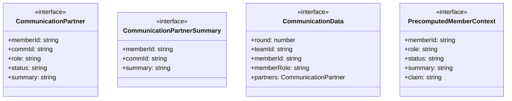
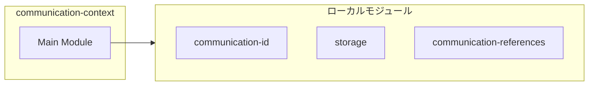
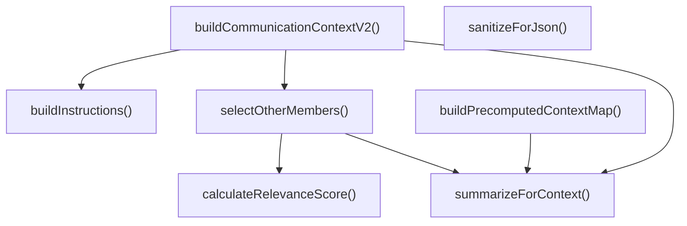
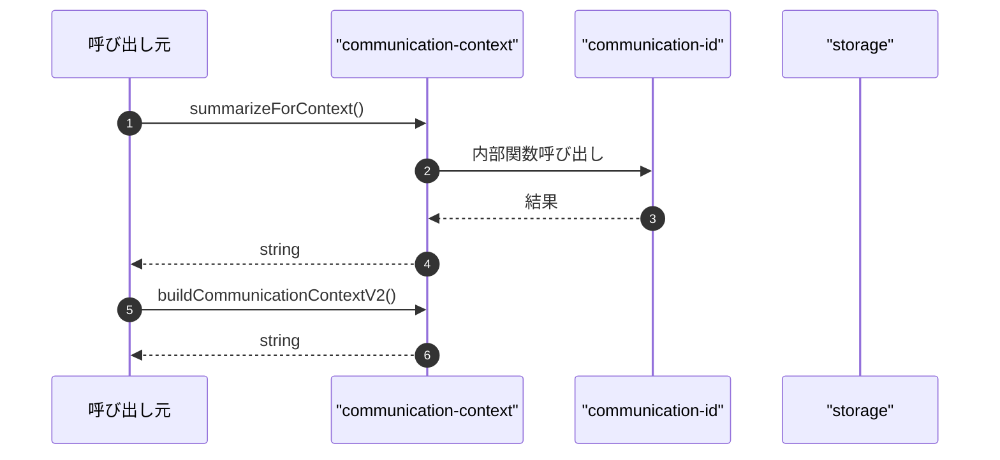

# communication-context

## 概要

`communication-context` モジュールのAPIリファレンス。

## インポート

```typescript
// from './communication-id': CommIdEntry
// from './storage': TeamMember, TeamDefinition
// from './communication-references': extractField
```

## エクスポート一覧

| 種別 | 名前 | 説明 |
|------|------|------|
| 関数 | `summarizeForContext` | テキストを指定文字数に要約する |
| 関数 | `buildCommunicationContextV2` | V2通信コンテキストを構築する |
| 関数 | `buildPrecomputedContextMap` | メンバー結果からコンテキストマップを作成 |
| 関数 | `sanitizeForJson` | JSON用文字列をサニタイズ |
| インターフェース | `CommunicationPartner` | 通信パートナー情報 |
| インターフェース | `CommunicationPartnerSummary` | 通信パートナーの要約情報 |
| インターフェース | `CommunicationData` | 通信データ構造 |
| インターフェース | `PrecomputedMemberContext` | 事前計算済みメンバーコンテキスト |

## 図解

### クラス図



### 依存関係図



### 関数フロー



### シーケンス図



## 関数

### summarizeForContext

```typescript
summarizeForContext(text: string, maxChars: number): string
```

テキストを指定文字数に要約する

**パラメータ**

| 名前 | 型 | 必須 |
|------|-----|------|
| text | `string` | はい |
| maxChars | `number` | はい |

**戻り値**: `string`

### selectOtherMembers

```typescript
selectOtherMembers(currentMember: TeamMember, allContexts: PrecomputedMemberContext[], mentionedIds: Set<string>, memberIdToCommId: Map<string, string>, limit: number): CommunicationPartnerSummary[]
```

**パラメータ**

| 名前 | 型 | 必須 |
|------|-----|------|
| currentMember | `TeamMember` | はい |
| allContexts | `PrecomputedMemberContext[]` | はい |
| mentionedIds | `Set<string>` | はい |
| memberIdToCommId | `Map<string, string>` | はい |
| limit | `number` | はい |

**戻り値**: `CommunicationPartnerSummary[]`

### calculateRelevanceScore

```typescript
calculateRelevanceScore(_currentMember: TeamMember, otherContext: PrecomputedMemberContext): number
```

**パラメータ**

| 名前 | 型 | 必須 |
|------|-----|------|
| _currentMember | `TeamMember` | はい |
| otherContext | `PrecomputedMemberContext` | はい |

**戻り値**: `number`

### buildCommunicationContextV2

```typescript
buildCommunicationContextV2(input: {
  team: TeamDefinition;
  member: TeamMember;
  round: number;
  partnerIds: string[];
  contextMap: Map<string, PrecomputedMemberContext>;
  commIdEntries: CommIdEntry[];
}): string
```

V2通信コンテキストを構築する

**パラメータ**

| 名前 | 型 | 必須 |
|------|-----|------|
| input | `object` | はい |
| &nbsp;&nbsp;↳ team | `TeamDefinition` | はい |
| &nbsp;&nbsp;↳ member | `TeamMember` | はい |
| &nbsp;&nbsp;↳ round | `number` | はい |
| &nbsp;&nbsp;↳ partnerIds | `string[]` | はい |
| &nbsp;&nbsp;↳ contextMap | `Map<string, PrecomputedMemberContext>` | はい |
| &nbsp;&nbsp;↳ commIdEntries | `CommIdEntry[]` | はい |

**戻り値**: `string`

### buildInstructions

```typescript
buildInstructions(): string[]
```

**戻り値**: `string[]`

### buildPrecomputedContextMap

```typescript
buildPrecomputedContextMap(results: Array<{
    memberId: string;
    role: string;
    status: string;
    summary?: string;
    output?: string;
    diagnostics?: { confidence?: number; evidenceCount?: number };
  }>): Map<string, PrecomputedMemberContext>
```

メンバー結果からコンテキストマップを作成

**パラメータ**

| 名前 | 型 | 必須 |
|------|-----|------|
| results | `Array<{
    memberId: string;
    role: string;...` | はい |

**戻り値**: `Map<string, PrecomputedMemberContext>`

### sanitizeForJson

```typescript
sanitizeForJson(text: string): string
```

JSON用文字列をサニタイズ

**パラメータ**

| 名前 | 型 | 必須 |
|------|-----|------|
| text | `string` | はい |

**戻り値**: `string`

## インターフェース

### CommunicationPartner

```typescript
interface CommunicationPartner {
  memberId: string;
  commId: string;
  role: string;
  status: string;
  summary: string;
  claim: string;
  confidence?: number;
  evidenceCount?: number;
}
```

通信パートナー情報

### CommunicationPartnerSummary

```typescript
interface CommunicationPartnerSummary {
  memberId: string;
  commId: string;
  summary: string;
}
```

通信パートナーの要約情報

### CommunicationData

```typescript
interface CommunicationData {
  round: number;
  teamId: string;
  memberId: string;
  memberRole: string;
  partners: CommunicationPartner[];
  others?: CommunicationPartnerSummary[];
}
```

通信データ構造

### PrecomputedMemberContext

```typescript
interface PrecomputedMemberContext {
  memberId: string;
  role: string;
  status: string;
  summary: string;
  claim: string;
  confidence?: number;
  evidenceCount?: number;
}
```

事前計算済みメンバーコンテキスト

---
*自動生成: 2026-02-28T13:55:17.717Z*
