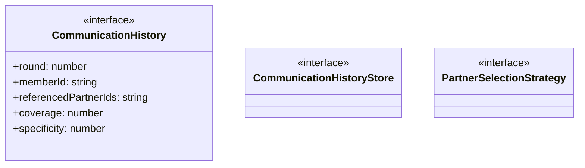

# communication-history

## 概要

`communication-history` モジュールのAPIリファレンス。

## エクスポート一覧

| 種別 | 名前 | 説明 |
|------|------|------|
| 関数 | `createCommunicationHistoryStore` | 通信履歴ストアを作成する |
| インターフェース | `CommunicationHistory` | 通信履歴エントリ |
| インターフェース | `CommunicationHistoryStore` | 通信履歴ストアインターフェース |
| インターフェース | `PartnerSelectionStrategy` | パートナー選択戦略 |

## 図解

### クラス図



## 関数

### createCommunicationHistoryStore

```typescript
createCommunicationHistoryStore(): CommunicationHistoryStore
```

通信履歴ストアを作成する

**戻り値**: `CommunicationHistoryStore`

## インターフェース

### CommunicationHistory

```typescript
interface CommunicationHistory {
  round: number;
  memberId: string;
  referencedPartnerIds: string[];
  coverage: number;
  specificity: number;
  stanceSummary: {
    agree: number;
    disagree: number;
    neutral: number;
    unknown: number;
  };
}
```

通信履歴エントリ

### CommunicationHistoryStore

```typescript
interface CommunicationHistoryStore {
  add(entry);
  getByMember(memberId);
  getByRound(round);
  getAll();
  getUnreferencedPartnerIds(memberId, partnerIds);
  getMostRecentRound();
  clear();
}
```

通信履歴ストアインターフェース

### PartnerSelectionStrategy

```typescript
interface PartnerSelectionStrategy {
  select(memberId, candidates, history, round);
}
```

パートナー選択戦略

---
*自動生成: 2026-02-28T13:55:17.719Z*
