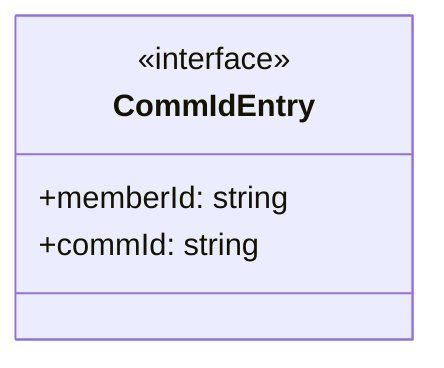
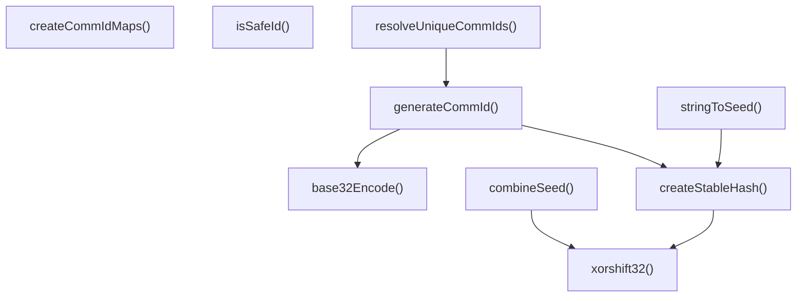

# communication-id

## 概要

`communication-id` モジュールのAPIリファレンス。

## エクスポート一覧

| 種別 | 名前 | 説明 |
|------|------|------|
| 関数 | `isSafeId` | - |
| 関数 | `generateCommId` | 通信用IDを生成する |
| 関数 | `resolveUniqueCommIds` | メンバーから一意な通信IDを解決する |
| 関数 | `createCommIdMaps` | - |
| 関数 | `stringToSeed` | - |
| 関数 | `combineSeed` | - |
| インターフェース | `CommIdEntry` | 通信IDエントリ |

## 図解

### クラス図



### 関数フロー



## 関数

### isSafeId

```typescript
isSafeId(id: string): boolean
```

**パラメータ**

| 名前 | 型 | 必須 |
|------|-----|------|
| id | `string` | はい |

**戻り値**: `boolean`

### generateCommId

```typescript
generateCommId(memberId: string, salt: any): string
```

通信用IDを生成する

**パラメータ**

| 名前 | 型 | 必須 |
|------|-----|------|
| memberId | `string` | はい |
| salt | `any` | はい |

**戻り値**: `string`

### resolveUniqueCommIds

```typescript
resolveUniqueCommIds(members: { id: string }[], salt: any): CommIdEntry[]
```

メンバーから一意な通信IDを解決する

**パラメータ**

| 名前 | 型 | 必須 |
|------|-----|------|
| members | `{ id: string }[]` | はい |
| salt | `any` | はい |

**戻り値**: `CommIdEntry[]`

### createCommIdMaps

```typescript
createCommIdMaps(entries: CommIdEntry[]): {
  memberIdToCommId: Map<string, string>;
  commIdToMemberId: Map<string, string>;
}
```

**パラメータ**

| 名前 | 型 | 必須 |
|------|-----|------|
| entries | `CommIdEntry[]` | はい |

**戻り値**: `{
  memberIdToCommId: Map<string, string>;
  commIdToMemberId: Map<string, string>;
}`

### createStableHash

```typescript
createStableHash(input: string): number
```

**パラメータ**

| 名前 | 型 | 必須 |
|------|-----|------|
| input | `string` | はい |

**戻り値**: `number`

### xorshift32

```typescript
xorshift32(x: number): number
```

**パラメータ**

| 名前 | 型 | 必須 |
|------|-----|------|
| x | `number` | はい |

**戻り値**: `number`

### base32Encode

```typescript
base32Encode(n: number): string
```

**パラメータ**

| 名前 | 型 | 必須 |
|------|-----|------|
| n | `number` | はい |

**戻り値**: `string`

### stringToSeed

```typescript
stringToSeed(input: string): number
```

**パラメータ**

| 名前 | 型 | 必須 |
|------|-----|------|
| input | `string` | はい |

**戻り値**: `number`

### combineSeed

```typescript
combineSeed(base: number, memberId: string, round: number): number
```

**パラメータ**

| 名前 | 型 | 必須 |
|------|-----|------|
| base | `number` | はい |
| memberId | `string` | はい |
| round | `number` | はい |

**戻り値**: `number`

## インターフェース

### CommIdEntry

```typescript
interface CommIdEntry {
  memberId: string;
  commId: string;
}
```

通信IDエントリ

---
*自動生成: 2026-02-22T18:55:28.016Z*
