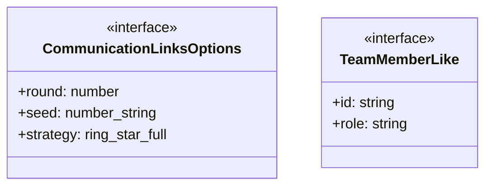
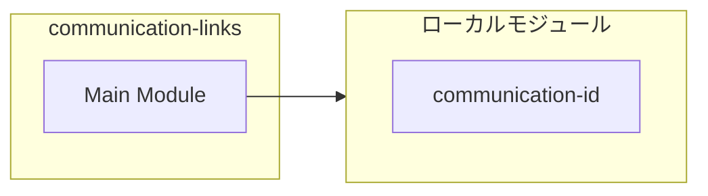
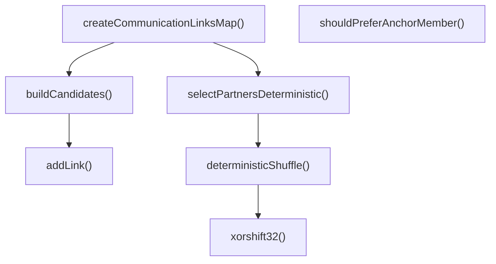
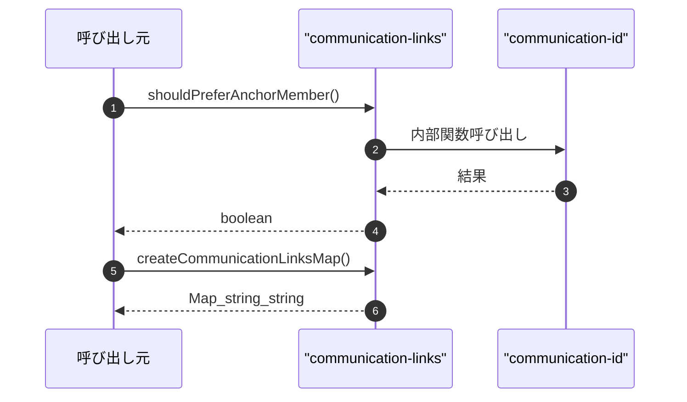

# communication-links

## 概要

`communication-links` モジュールのAPIリファレンス。

## インポート

```typescript
// from './communication-id': combineSeed, stringToSeed
```

## エクスポート一覧

| 種別 | 名前 | 説明 |
|------|------|------|
| 関数 | `shouldPreferAnchorMember` | - |
| 関数 | `createCommunicationLinksMap` | 通信リンクマップを作成する |
| 関数 | `deterministicShuffle` | 決定論的シャッフルを行う |
| インターフェース | `CommunicationLinksOptions` | 通信リンクオプション |
| インターフェース | `TeamMemberLike` | - |

## 図解

### クラス図



### 依存関係図



### 関数フロー



### シーケンス図



## 関数

### shouldPreferAnchorMember

```typescript
shouldPreferAnchorMember(member: { id: string; role?: string }): boolean
```

**パラメータ**

| 名前 | 型 | 必須 |
|------|-----|------|
| member | `object` | はい |
| &nbsp;&nbsp;↳ id | `string` | はい |
| &nbsp;&nbsp;↳ role | `string` | いいえ |

**戻り値**: `boolean`

### createCommunicationLinksMap

```typescript
createCommunicationLinksMap(members: TeamMemberLike[], options?: CommunicationLinksOptions): Map<string, string[]>
```

通信リンクマップを作成する

**パラメータ**

| 名前 | 型 | 必須 |
|------|-----|------|
| members | `TeamMemberLike[]` | はい |
| options | `CommunicationLinksOptions` | いいえ |

**戻り値**: `Map<string, string[]>`

### buildCandidates

```typescript
buildCandidates(ids: string[], anchors: string[], strategy: "ring" | "star" | "full"): Map<string, Set<string>>
```

**パラメータ**

| 名前 | 型 | 必須 |
|------|-----|------|
| ids | `string[]` | はい |
| anchors | `string[]` | はい |
| strategy | `"ring" | "star" | "full"` | はい |

**戻り値**: `Map<string, Set<string>>`

### addLink

```typescript
addLink(fromId: string, toId: string): void
```

**パラメータ**

| 名前 | 型 | 必須 |
|------|-----|------|
| fromId | `string` | はい |
| toId | `string` | はい |

**戻り値**: `void`

### selectPartnersDeterministic

```typescript
selectPartnersDeterministic(memberId: string, candidates: Set<string>, anchors: string[], round: number, seed: number, maxPartners: number): string[]
```

**パラメータ**

| 名前 | 型 | 必須 |
|------|-----|------|
| memberId | `string` | はい |
| candidates | `Set<string>` | はい |
| anchors | `string[]` | はい |
| round | `number` | はい |
| seed | `number` | はい |
| maxPartners | `number` | はい |

**戻り値**: `string[]`

### deterministicShuffle

```typescript
deterministicShuffle(array: T[], seed: number): T[]
```

決定論的シャッフルを行う

**パラメータ**

| 名前 | 型 | 必須 |
|------|-----|------|
| array | `T[]` | はい |
| seed | `number` | はい |

**戻り値**: `T[]`

### xorshift32

```typescript
xorshift32(x: number): number
```

**パラメータ**

| 名前 | 型 | 必須 |
|------|-----|------|
| x | `number` | はい |

**戻り値**: `number`

## インターフェース

### CommunicationLinksOptions

```typescript
interface CommunicationLinksOptions {
  round?: number;
  seed?: number | string;
  strategy?: "ring" | "star" | "full";
}
```

通信リンクオプション

### TeamMemberLike

```typescript
interface TeamMemberLike {
  id: string;
  role?: string;
}
```

---
*自動生成: 2026-02-22T18:55:28.022Z*
