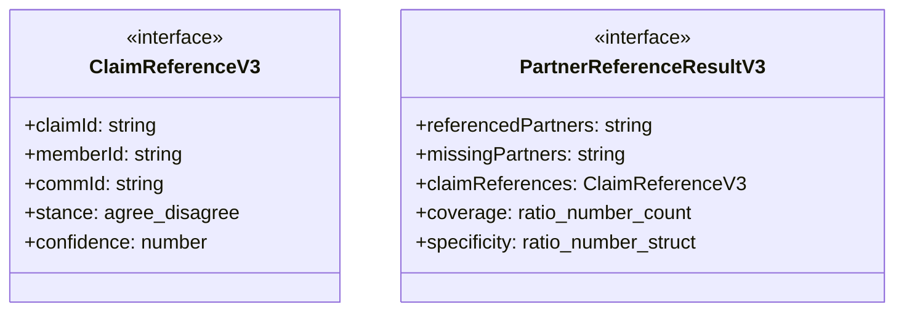
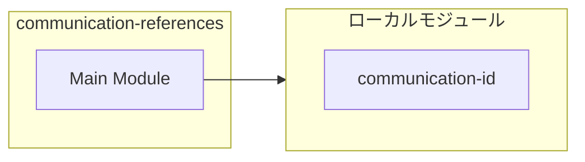
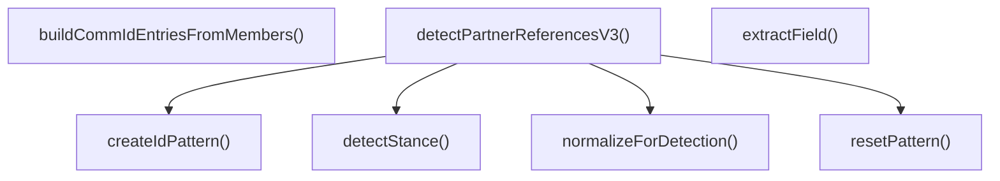
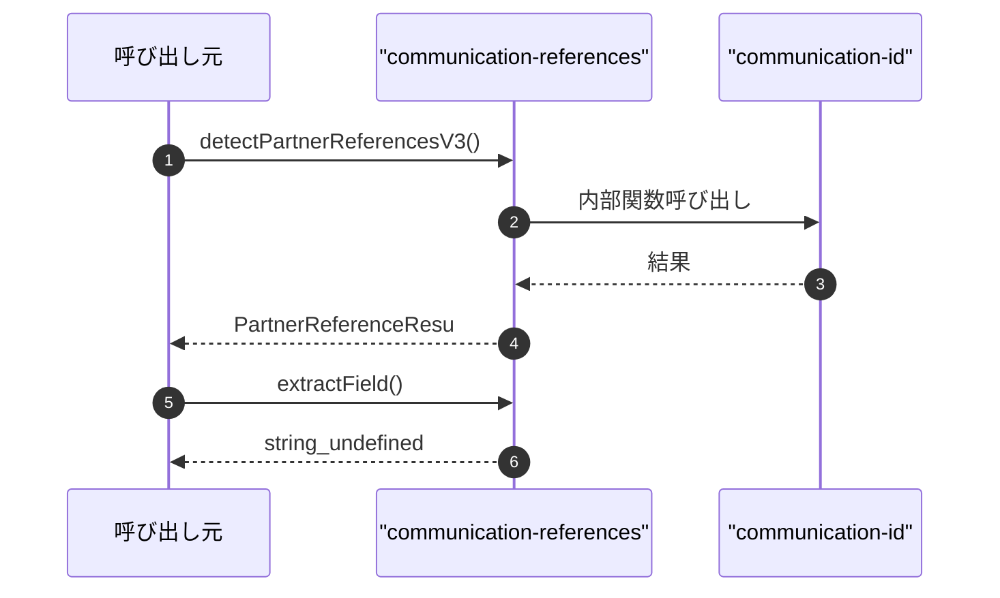

# communication-references

## 概要

`communication-references` モジュールのAPIリファレンス。

## インポート

```typescript
// from './communication-id': CommIdEntry
// from './communication-id': resolveUniqueCommIds
```

## エクスポート一覧

| 種別 | 名前 | 説明 |
|------|------|------|
| 関数 | `detectPartnerReferencesV3` | パートナー参照を検出する（V3） |
| 関数 | `extractField` | - |
| 関数 | `buildCommIdEntriesFromMembers` | - |
| インターフェース | `ClaimReferenceV3` | クレーム参照（V3） |
| インターフェース | `PartnerReferenceResultV3` | パートナー参照結果（V3） |

## 図解

### クラス図



### 依存関係図



### 関数フロー



### シーケンス図



## 関数

### createIdPattern

```typescript
createIdPattern(id: string): RegExp
```

**パラメータ**

| 名前 | 型 | 必須 |
|------|-----|------|
| id | `string` | はい |

**戻り値**: `RegExp`

### normalizeForDetection

```typescript
normalizeForDetection(text: string): string
```

**パラメータ**

| 名前 | 型 | 必須 |
|------|-----|------|
| text | `string` | はい |

**戻り値**: `string`

### resetPattern

```typescript
resetPattern(pattern: RegExp): void
```

**パラメータ**

| 名前 | 型 | 必須 |
|------|-----|------|
| pattern | `RegExp` | はい |

**戻り値**: `void`

### detectPartnerReferencesV3

```typescript
detectPartnerReferencesV3(output: string, partnerCommIds: string[], commIdToMemberId: Map<string, string>, _memberIdToCommId: Map<string, string>): PartnerReferenceResultV3
```

パートナー参照を検出する（V3）

**パラメータ**

| 名前 | 型 | 必須 |
|------|-----|------|
| output | `string` | はい |
| partnerCommIds | `string[]` | はい |
| commIdToMemberId | `Map<string, string>` | はい |
| _memberIdToCommId | `Map<string, string>` | はい |

**戻り値**: `PartnerReferenceResultV3`

### detectStance

```typescript
detectStance(output: string, targetId: string): { stance: "agree" | "disagree" | "neutral" | "unknown"; confidence: number; source: "explicit" | "inferred" | "default" }
```

**パラメータ**

| 名前 | 型 | 必須 |
|------|-----|------|
| output | `string` | はい |
| targetId | `string` | はい |

**戻り値**: `{ stance: "agree" | "disagree" | "neutral" | "unknown"; confidence: number; source: "explicit" | "inferred" | "default" }`

### extractField

```typescript
extractField(output: string, name: string): string | undefined
```

**パラメータ**

| 名前 | 型 | 必須 |
|------|-----|------|
| output | `string` | はい |
| name | `string` | はい |

**戻り値**: `string | undefined`

### buildCommIdEntriesFromMembers

```typescript
buildCommIdEntriesFromMembers(members: { id: string }[], salt: any): CommIdEntry[]
```

**パラメータ**

| 名前 | 型 | 必須 |
|------|-----|------|
| members | `{ id: string }[]` | はい |
| salt | `any` | はい |

**戻り値**: `CommIdEntry[]`

## インターフェース

### ClaimReferenceV3

```typescript
interface ClaimReferenceV3 {
  claimId: string;
  memberId: string;
  commId: string;
  stance: "agree" | "disagree" | "neutral" | "unknown";
  confidence: number;
  source: "explicit" | "inferred" | "default";
}
```

クレーム参照（V3）

### PartnerReferenceResultV3

```typescript
interface PartnerReferenceResultV3 {
  referencedPartners: string[];
  missingPartners: string[];
  claimReferences: ClaimReferenceV3[];
  coverage: {
    ratio: number;
    count: number;
    total: number;
  };
  specificity: {
    ratio: number;
    structuredCount: number;
    quoteCount: number;
  };
  overallQuality: number;
  stanceSummary: {
    agree: number;
    disagree: number;
    neutral: number;
    unknown: number;
  };
}
```

パートナー参照結果（V3）

---
*自動生成: 2026-02-22T18:55:28.026Z*
