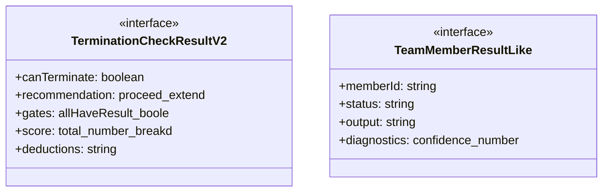
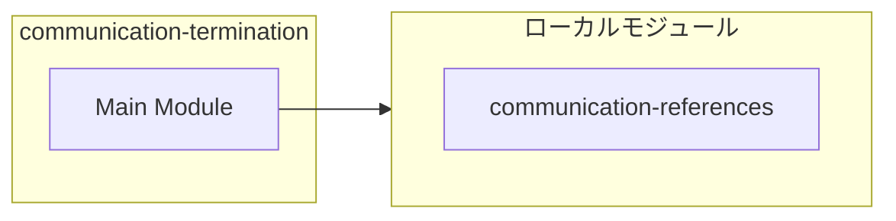
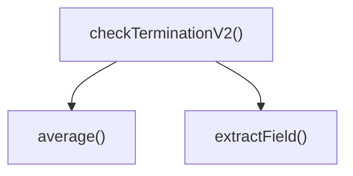

# communication-termination

## 概要

`communication-termination` モジュールのAPIリファレンス。

## インポート

```typescript
// from './communication-references': PartnerReferenceResultV3
```

## エクスポート一覧

| 種別 | 名前 | 説明 |
|------|------|------|
| 関数 | `checkTerminationV2` | 終了判定を行う（V2） |
| インターフェース | `TerminationCheckResultV2` | 終了判定結果（V2） |
| インターフェース | `TeamMemberResultLike` | チームメンバー結果（簡易版） |

## 図解

### クラス図



### 依存関係図



### 関数フロー



## 関数

### checkTerminationV2

```typescript
checkTerminationV2(results: TeamMemberResultLike[], referenceResults: PartnerReferenceResultV3[]): TerminationCheckResultV2
```

終了判定を行う（V2）

**パラメータ**

| 名前 | 型 | 必須 |
|------|-----|------|
| results | `TeamMemberResultLike[]` | はい |
| referenceResults | `PartnerReferenceResultV3[]` | はい |

**戻り値**: `TerminationCheckResultV2`

### average

```typescript
average(values: number[]): number
```

**パラメータ**

| 名前 | 型 | 必須 |
|------|-----|------|
| values | `number[]` | はい |

**戻り値**: `number`

### extractField

```typescript
extractField(output: string, name: string): string | undefined
```

**パラメータ**

| 名前 | 型 | 必須 |
|------|-----|------|
| output | `string` | はい |
| name | `string` | はい |

**戻り値**: `string | undefined`

## インターフェース

### TerminationCheckResultV2

```typescript
interface TerminationCheckResultV2 {
  canTerminate: boolean;
  recommendation: "proceed" | "extend" | "challenge";
  gates: {
    allHaveResult: boolean;
    noCriticalFailure: boolean;
    minCoverageMet: boolean;
  };
  score: {
    total: number;
    breakdown: {
      coverage: number;
      specificity: number;
      evidence: number;
      confidenceAlignment: number;
      stanceClarity: number;
    };
  };
  deductions: string[];
  raw: {
    avgCoverage: number;
    avgSpecificity: number;
    failedCount: number;
    missingResultCount: number;
  };
}
```

終了判定結果（V2）

### TeamMemberResultLike

```typescript
interface TeamMemberResultLike {
  memberId: string;
  status: string;
  output?: string;
  diagnostics?: {
    confidence?: number;
    evidenceCount?: number;
  };
}
```

チームメンバー結果（簡易版）

---
*自動生成: 2026-02-22T18:55:28.032Z*
