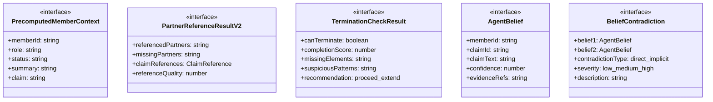
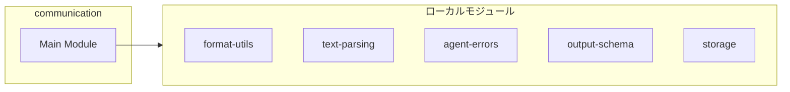
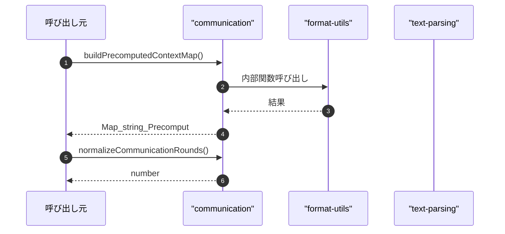

# communication

## 概要

`communication` モジュールのAPIリファレンス。

## インポート

```typescript
// from '../../lib/format-utils.js': normalizeForSingleLine
// from '../../lib/text-parsing': analyzeDiscussionStance
// from '../../lib/agent-errors': classifyFailureType, shouldRetryByClassification, FailureClassification
// from '../../lib/output-schema': getCommunicationIdMode, getStanceClassificationMode, CommunicationIdMode
// from './storage': TeamMember, TeamMemberResult, TeamDefinition, ...
// ... and 1 more imports
```

## エクスポート一覧

| 種別 | 名前 | 説明 |
|------|------|------|
| 関数 | `buildPrecomputedContextMap` | コンテキストマップを生成 |
| 関数 | `normalizeCommunicationRounds` | 通信ラウンド数を正規化 |
| 関数 | `normalizeFailedMemberRetryRounds` | - |
| 関数 | `shouldRetryFailedMemberResult` | 失敗したメンバー結果を再試行すべきか判定する |
| 関数 | `shouldPreferAnchorMember` | メンバー優先判定 |
| 関数 | `createCommunicationLinksMap` | 通信リンクマップ生成 |
| 関数 | `sanitizeCommunicationSnippet` | 通信スニペットをサニタイズする |
| 関数 | `detectPartnerReferencesV2` | パートナーの参照を検出する（V2） |
| 関数 | `extractField` | フィールド値を抽出 |
| 関数 | `buildCommunicationContext` | チームメンバー向けの通信コンテキストを作成する |
| 関数 | `detectPartnerReferences` | メンバーの出力から参照されるパートナーを検出します。 |
| 関数 | `checkTermination` | タスクの終了条件を判定する |
| 関数 | `updateBeliefState` | 信念状態を更新する |
| 関数 | `getBeliefSummary` | 信念サマリーを取得 |
| 関数 | `clearBeliefStateCache` | 信念状態キャッシュをクリア |
| インターフェース | `PrecomputedMemberContext` | メンバーの事前計算コンテキスト |
| インターフェース | `PartnerReferenceResultV2` | パートナー参照結果(V2) |
| インターフェース | `TerminationCheckResult` | 終了判定結果を表すインターフェース |
| インターフェース | `AgentBelief` | エージェントの信念を定義するインターフェース |
| インターフェース | `BeliefContradiction` | 信念の矛盾を定義するインターフェース |

## 図解

### クラス図



### 依存関係図



### 関数フロー

```mermaid
flowchart TD
  addLink["addLink()"]
  buildCommunicationContext["buildCommunicationContext()"]
  buildPrecomputedContextMap["buildPrecomputedContextMap()"]
  checkTermination["checkTermination()"]
  clearBeliefStateCache["clearBeliefStateCache()"]
  createCommunicationLinksMap["createCommunicationLinksMap()"]
  detectPartnerReferences["detectPartnerReferences()"]
  detectPartnerReferencesV2["detectPartnerReferencesV2()"]
  extractField["extractField()"]
  getBeliefSummary["getBeliefSummary()"]
  normalizeCommunicationRounds["normalizeCommunicationRounds()"]
  normalizeFailedMemberRetryRounds["normalizeFailedMemberRetryRounds()"]
  sanitizeCommunicationSnippet["sanitizeCommunicationSnippet()"]
  shouldPreferAnchorMember["shouldPreferAnchorMember()"]
  shouldRetryFailedMemberResult["shouldRetryFailedMemberResult()"]
  updateBeliefState["updateBeliefState()"]
  buildPrecomputedContextMap --> extractField
  buildPrecomputedContextMap --> sanitizeCommunicationSnippet
  checkTermination --> extractField
  createCommunicationLinksMap --> addLink
  updateBeliefState --> extractField
```



### シーケンス図



## 関数

### buildPrecomputedContextMap

```typescript
buildPrecomputedContextMap(results: TeamMemberResult[]): Map<string, PrecomputedMemberContext>
```

コンテキストマップを生成

チームメンバーの実行結果から事前計算されたコンテキスト情報を構築します。

**パラメータ**

| 名前 | 型 | 必須 |
|------|-----|------|
| results | `TeamMemberResult[]` | はい |

**戻り値**: `Map<string, PrecomputedMemberContext>`

### normalizeCommunicationRounds

```typescript
normalizeCommunicationRounds(value: unknown, fallback: any, isStableRuntime: any): number
```

通信ラウンド数を正規化

不明な値や不正な値を検証し、安全な数値型に変換します。

**パラメータ**

| 名前 | 型 | 必須 |
|------|-----|------|
| value | `unknown` | はい |
| fallback | `any` | はい |
| isStableRuntime | `any` | はい |

**戻り値**: `number`

### normalizeFailedMemberRetryRounds

```typescript
normalizeFailedMemberRetryRounds(value: unknown, fallback: any, isStableRuntime: any): number
```

**パラメータ**

| 名前 | 型 | 必須 |
|------|-----|------|
| value | `unknown` | はい |
| fallback | `any` | はい |
| isStableRuntime | `any` | はい |

**戻り値**: `number`

### shouldRetryFailedMemberResult

```typescript
shouldRetryFailedMemberResult(result: TeamMemberResult, retryRound: number, classifyPressureError: (error: unknown) => string): boolean
```

失敗したメンバー結果を再試行すべきか判定する

**パラメータ**

| 名前 | 型 | 必須 |
|------|-----|------|
| result | `TeamMemberResult` | はい |
| retryRound | `number` | はい |
| classifyPressureError | `(error: unknown) => string` | はい |

**戻り値**: `boolean`

### shouldPreferAnchorMember

```typescript
shouldPreferAnchorMember(member: TeamMember): boolean
```

メンバー優先判定

**パラメータ**

| 名前 | 型 | 必須 |
|------|-----|------|
| member | `TeamMember` | はい |

**戻り値**: `boolean`

### createCommunicationLinksMap

```typescript
createCommunicationLinksMap(members: TeamMember[]): Map<string, string[]>
```

通信リンクマップ生成

**パラメータ**

| 名前 | 型 | 必須 |
|------|-----|------|
| members | `TeamMember[]` | はい |

**戻り値**: `Map<string, string[]>`

### addLink

```typescript
addLink(fromId: string, toId: string): void
```

**パラメータ**

| 名前 | 型 | 必須 |
|------|-----|------|
| fromId | `string` | はい |
| toId | `string` | はい |

**戻り値**: `void`

### sanitizeCommunicationSnippet

```typescript
sanitizeCommunicationSnippet(value: string, fallback: string): string
```

通信スニペットをサニタイズする

**パラメータ**

| 名前 | 型 | 必須 |
|------|-----|------|
| value | `string` | はい |
| fallback | `string` | はい |

**戻り値**: `string`

### detectPartnerReferencesV2

```typescript
detectPartnerReferencesV2(output: string, partnerIds: string[], memberById: Map<string, TeamMember>, mode: CommunicationIdMode): PartnerReferenceResultV2
```

パートナーの参照を検出する（V2）

**パラメータ**

| 名前 | 型 | 必須 |
|------|-----|------|
| output | `string` | はい |
| partnerIds | `string[]` | はい |
| memberById | `Map<string, TeamMember>` | はい |
| mode | `CommunicationIdMode` | はい |

**戻り値**: `PartnerReferenceResultV2`

### extractField

```typescript
extractField(output: string, name: string): string | undefined
```

フィールド値を抽出

**パラメータ**

| 名前 | 型 | 必須 |
|------|-----|------|
| output | `string` | はい |
| name | `string` | はい |

**戻り値**: `string | undefined`

### buildCommunicationContext

```typescript
buildCommunicationContext(input: {
  team: TeamDefinition;
  member: TeamMember;
  round: number;
  partnerIds: string[];
  contextMap: Map<string, PrecomputedMemberContext>;
}): string
```

チームメンバー向けの通信コンテキストを作成する

**パラメータ**

| 名前 | 型 | 必須 |
|------|-----|------|
| input | `object` | はい |
| &nbsp;&nbsp;↳ team | `TeamDefinition` | はい |
| &nbsp;&nbsp;↳ member | `TeamMember` | はい |
| &nbsp;&nbsp;↳ round | `number` | はい |
| &nbsp;&nbsp;↳ partnerIds | `string[]` | はい |
| &nbsp;&nbsp;↳ contextMap | `Map<string, PrecomputedMemberContext>` | はい |

**戻り値**: `string`

### detectPartnerReferences

```typescript
detectPartnerReferences(output: string, partnerIds: string[], memberById: Map<string, TeamMember>): { referencedPartners: string[]; missingPartners: string[] }
```

メンバーの出力から参照されるパートナーを検出します。

**パラメータ**

| 名前 | 型 | 必須 |
|------|-----|------|
| output | `string` | はい |
| partnerIds | `string[]` | はい |
| memberById | `Map<string, TeamMember>` | はい |

**戻り値**: `{ referencedPartners: string[]; missingPartners: string[] }`

### checkTermination

```typescript
checkTermination(task: string, results: TeamMemberResult[], minCompletionScore: any): TerminationCheckResult
```

タスクの終了条件を判定する

**パラメータ**

| 名前 | 型 | 必須 |
|------|-----|------|
| task | `string` | はい |
| results | `TeamMemberResult[]` | はい |
| minCompletionScore | `any` | はい |

**戻り値**: `TerminationCheckResult`

### updateBeliefState

```typescript
updateBeliefState(memberId: string, output: string, round: number): AgentBelief[]
```

信念状態を更新する

**パラメータ**

| 名前 | 型 | 必須 |
|------|-----|------|
| memberId | `string` | はい |
| output | `string` | はい |
| round | `number` | はい |

**戻り値**: `AgentBelief[]`

### getBeliefSummary

```typescript
getBeliefSummary(memberIds: string[]): string
```

信念サマリーを取得

**パラメータ**

| 名前 | 型 | 必須 |
|------|-----|------|
| memberIds | `string[]` | はい |

**戻り値**: `string`

### clearBeliefStateCache

```typescript
clearBeliefStateCache(): void
```

信念状態キャッシュをクリア

**戻り値**: `void`

## インターフェース

### PrecomputedMemberContext

```typescript
interface PrecomputedMemberContext {
  memberId: string;
  role: string;
  status: string;
  summary: string;
  claim: string;
}
```

メンバーの事前計算コンテキスト

### PartnerReferenceResultV2

```typescript
interface PartnerReferenceResultV2 {
  referencedPartners: string[];
  missingPartners: string[];
  claimReferences: ClaimReference[];
  referenceQuality: number;
}
```

パートナー参照結果(V2)

### TerminationCheckResult

```typescript
interface TerminationCheckResult {
  canTerminate: boolean;
  completionScore: number;
  missingElements: string[];
  suspiciousPatterns: string[];
  recommendation: "proceed" | "extend" | "challenge";
}
```

終了判定結果を表すインターフェース

### AgentBelief

```typescript
interface AgentBelief {
  memberId: string;
  claimId: string;
  claimText: string;
  confidence: number;
  evidenceRefs: string[];
  round: number;
  timestamp: string;
}
```

エージェントの信念を定義するインターフェース

### BeliefContradiction

```typescript
interface BeliefContradiction {
  belief1: AgentBelief;
  belief2: AgentBelief;
  contradictionType: "direct" | "implicit" | "assumption_conflict";
  severity: "low" | "medium" | "high";
  description: string;
}
```

信念の矛盾を定義するインターフェース

---
*自動生成: 2026-02-18T15:54:40.894Z*
