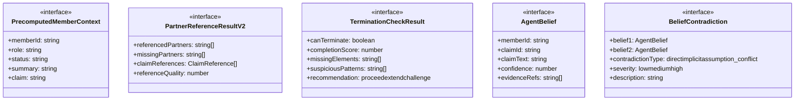

# communication

## 概要

`communication` モジュールのAPIリファレンス。

## インポート

```typescript
import { normalizeForSingleLine } from '../../lib/format-utils.js';
import { analyzeDiscussionStance } from '../../lib/text-parsing';
import { classifyFailureType, shouldRetryByClassification, FailureClassification } from '../../lib/agent-errors';
import { getCommunicationIdMode, getStanceClassificationMode, CommunicationIdMode } from '../../lib/output-schema';
import { TeamMember, TeamMemberResult, TeamDefinition... } from './storage';
// ... and 1 more imports
```

## エクスポート一覧

| 種別 | 名前 | 説明 |
|------|------|------|
| 関数 | `buildPrecomputedContextMap` | Build a map of precomputed member contexts. |
| 関数 | `normalizeCommunicationRounds` | Normalize and validate communication rounds parame |
| 関数 | `normalizeFailedMemberRetryRounds` | Normalize and validate failed member retry rounds  |
| 関数 | `shouldRetryFailedMemberResult` | Determine if a failed member result should be retr |
| 関数 | `shouldPreferAnchorMember` | Determine if a member should be preferred as an an |
| 関数 | `createCommunicationLinksMap` | Create a communication links map for team members. |
| 関数 | `sanitizeCommunicationSnippet` | Sanitize a communication snippet for safe inclusio |
| 関数 | `detectPartnerReferencesV2` | Detect partner references with optional structured |
| 関数 | `extractField` | Extract a named field from structured output text. |
| 関数 | `buildCommunicationContext` | Build communication context for a team member. |
| 関数 | `detectPartnerReferences` | Detect which partners are referenced in member out |
| 関数 | `checkTermination` | Check if task execution can be safely terminated. |
| 関数 | `updateBeliefState` | Update belief state for a member based on their ou |
| 関数 | `getBeliefSummary` | Get belief summary for communication context. |
| 関数 | `clearBeliefStateCache` | Clear belief state cache (call at start of new tea |
| インターフェース | `PrecomputedMemberContext` | Precomputed context for a team member to avoid red |
| インターフェース | `PartnerReferenceResultV2` | Result of detecting partner references with struct |
| インターフェース | `TerminationCheckResult` | Termination check result. |
| インターフェース | `AgentBelief` | Belief tracking structure for monitoring agent pos |
| インターフェース | `BeliefContradiction` | Detected contradiction between agent beliefs. |

## 図解

### クラス図



### 依存関係図


### 関数フロー


## 関数

### buildPrecomputedContextMap

```typescript
buildPrecomputedContextMap(results: TeamMemberResult[]): Map<string, PrecomputedMemberContext>
```

Build a map of precomputed member contexts.
Extracts and sanitizes fields once per round.

**パラメータ**

| 名前 | 型 | 必須 |
|------|-----|------|
| results | `TeamMemberResult[]` | はい |

**戻り値**: `Map<string, PrecomputedMemberContext>`

### normalizeCommunicationRounds

```typescript
normalizeCommunicationRounds(value: unknown, fallback: any, isStableRuntime: any): number
```

Normalize and validate communication rounds parameter.
In stable runtime profile, always returns DEFAULT_COMMUNICATION_ROUNDS.

**パラメータ**

| 名前 | 型 | 必須 |
|------|-----|------|
| value | `unknown` | はい |
| fallback | `any` | はい |
| isStableRuntime | `any` | はい |

**戻り値**: `number`

### normalizeFailedMemberRetryRounds

```typescript
normalizeFailedMemberRetryRounds(value: unknown, fallback: any, isStableRuntime: any): number
```

Normalize and validate failed member retry rounds parameter.
In stable runtime profile, always returns DEFAULT_FAILED_MEMBER_RETRY_ROUNDS.

**パラメータ**

| 名前 | 型 | 必須 |
|------|-----|------|
| value | `unknown` | はい |
| fallback | `any` | はい |
| isStableRuntime | `any` | はい |

**戻り値**: `number`

### shouldRetryFailedMemberResult

```typescript
shouldRetryFailedMemberResult(result: TeamMemberResult, retryRound: number, classifyPressureError: (error: unknown) => string): boolean
```

Determine if a failed member result should be retried.
Uses unified failure classification from agent-errors.ts.
Rate-limit and capacity errors are excluded (handled by backoff in runMember).

**パラメータ**

| 名前 | 型 | 必須 |
|------|-----|------|
| result | `TeamMemberResult` | はい |
| retryRound | `number` | はい |
| classifyPressureError | `(error: unknown) => string` | はい |

**戻り値**: `boolean`

### shouldPreferAnchorMember

```typescript
shouldPreferAnchorMember(member: TeamMember): boolean
```

Determine if a member should be preferred as an anchor in communication.
Anchors are members with consensus, synthesizer, reviewer, lead, or judge roles.

**パラメータ**

| 名前 | 型 | 必須 |
|------|-----|------|
| member | `TeamMember` | はい |

**戻り値**: `boolean`

### createCommunicationLinksMap

```typescript
createCommunicationLinksMap(members: TeamMember[]): Map<string, string[]>
```

Create a communication links map for team members.
Each member gets a list of partners they should communicate with.
Links are created based on:
1. Adjacent members in the team (circular)
2. Anchor members (consensus, synthesizer, reviewer, lead, judge)

**パラメータ**

| 名前 | 型 | 必須 |
|------|-----|------|
| members | `TeamMember[]` | はい |

**戻り値**: `Map<string, string[]>`

### addLink

```typescript
addLink(fromId: string, toId: string): void
```

**パラメータ**

| 名前 | 型 | 必須 |
|------|-----|------|
| fromId | `string` | はい |
| toId | `string` | はい |

**戻り値**: `void`

### sanitizeCommunicationSnippet

```typescript
sanitizeCommunicationSnippet(value: string, fallback: string): string
```

Sanitize a communication snippet for safe inclusion in prompts.
Removes instruction-like text that could be exploited.

**パラメータ**

| 名前 | 型 | 必須 |
|------|-----|------|
| value | `string` | はい |
| fallback | `string` | はい |

**戻り値**: `string`

### detectPartnerReferencesV2

```typescript
detectPartnerReferencesV2(output: string, partnerIds: string[], memberById: Map<string, TeamMember>, mode: CommunicationIdMode): PartnerReferenceResultV2
```

Detect partner references with optional structured ID tracking (V2).
Falls back to string matching for backward compatibility.

**パラメータ**

| 名前 | 型 | 必須 |
|------|-----|------|
| output | `string` | はい |
| partnerIds | `string[]` | はい |
| memberById | `Map<string, TeamMember>` | はい |
| mode | `CommunicationIdMode` | はい |

**戻り値**: `PartnerReferenceResultV2`

### extractField

```typescript
extractField(output: string, name: string): string | undefined
```

Extract a named field from structured output text.
Looks for patterns like "FIELD_NAME: value" at the start of lines.

**パラメータ**

| 名前 | 型 | 必須 |
|------|-----|------|
| output | `string` | はい |
| name | `string` | はい |

**戻り値**: `string | undefined`

### buildCommunicationContext

```typescript
buildCommunicationContext(input: {
  team: TeamDefinition;
  member: TeamMember;
  round: number;
  partnerIds: string[];
  contextMap: Map<string, PrecomputedMemberContext>;
}): string
```

Build communication context for a team member.
Includes partner summaries, claims, and communication instructions.

**パラメータ**

| 名前 | 型 | 必須 |
|------|-----|------|
| input | `{
  team: TeamDefinition;
  member: TeamMember;
  round: number;
  partnerIds: string[];
  contextMap: Map<string, PrecomputedMemberContext>;
}` | はい |

**戻り値**: `string`

### detectPartnerReferences

```typescript
detectPartnerReferences(output: string, partnerIds: string[], memberById: Map<string, TeamMember>): { referencedPartners: string[]; missingPartners: string[] }
```

Detect which partners are referenced in member output.
Checks for partner ID or role name mentions.

**パラメータ**

| 名前 | 型 | 必須 |
|------|-----|------|
| output | `string` | はい |
| partnerIds | `string[]` | はい |
| memberById | `Map<string, TeamMember>` | はい |

**戻り値**: `{ referencedPartners: string[]; missingPartners: string[] }`

### checkTermination

```typescript
checkTermination(task: string, results: TeamMemberResult[], minCompletionScore: any): TerminationCheckResult
```

Check if task execution can be safely terminated.
Based on arXiv:2602.06176 recommendations for completion verification.

**パラメータ**

| 名前 | 型 | 必須 |
|------|-----|------|
| task | `string` | はい |
| results | `TeamMemberResult[]` | はい |
| minCompletionScore | `any` | はい |

**戻り値**: `TerminationCheckResult`

### updateBeliefState

```typescript
updateBeliefState(memberId: string, output: string, round: number): AgentBelief[]
```

Update belief state for a member based on their output.

**パラメータ**

| 名前 | 型 | 必須 |
|------|-----|------|
| memberId | `string` | はい |
| output | `string` | はい |
| round | `number` | はい |

**戻り値**: `AgentBelief[]`

### getBeliefSummary

```typescript
getBeliefSummary(memberIds: string[]): string
```

Get belief summary for communication context.

**パラメータ**

| 名前 | 型 | 必須 |
|------|-----|------|
| memberIds | `string[]` | はい |

**戻り値**: `string`

### clearBeliefStateCache

```typescript
clearBeliefStateCache(): void
```

Clear belief state cache (call at start of new team execution).

**戻り値**: `void`

## インターフェース

### PrecomputedMemberContext

```typescript
interface PrecomputedMemberContext {
  memberId: string;
  role: string;
  status: string;
  summary: string;
  claim: string;
}
```

Precomputed context for a team member to avoid redundant parsing.

### PartnerReferenceResultV2

```typescript
interface PartnerReferenceResultV2 {
  referencedPartners: string[];
  missingPartners: string[];
  claimReferences: ClaimReference[];
  referenceQuality: number;
}
```

Result of detecting partner references with structured ID tracking.

### TerminationCheckResult

```typescript
interface TerminationCheckResult {
  canTerminate: boolean;
  completionScore: number;
  missingElements: string[];
  suspiciousPatterns: string[];
  recommendation: "proceed" | "extend" | "challenge";
}
```

Termination check result.
Verifies that the task has been completed before ending execution.
Based on arXiv:2602.06176 recommendations for completion verification.

### AgentBelief

```typescript
interface AgentBelief {
  memberId: string;
  claimId: string;
  claimText: string;
  confidence: number;
  evidenceRefs: string[];
  round: number;
  timestamp: string;
}
```

Belief tracking structure for monitoring agent positions across rounds.
Based on arXiv:2602.06176 recommendations for multi-agent robustness.

### BeliefContradiction

```typescript
interface BeliefContradiction {
  belief1: AgentBelief;
  belief2: AgentBelief;
  contradictionType: "direct" | "implicit" | "assumption_conflict";
  severity: "low" | "medium" | "high";
  description: string;
}
```

Detected contradiction between agent beliefs.

---
*自動生成: 2026-02-17T21:48:27.441Z*
