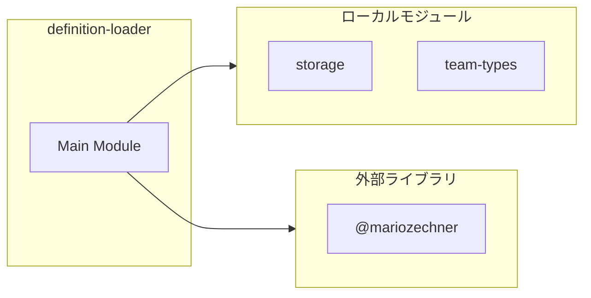
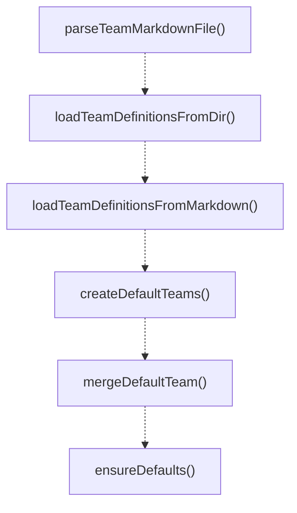
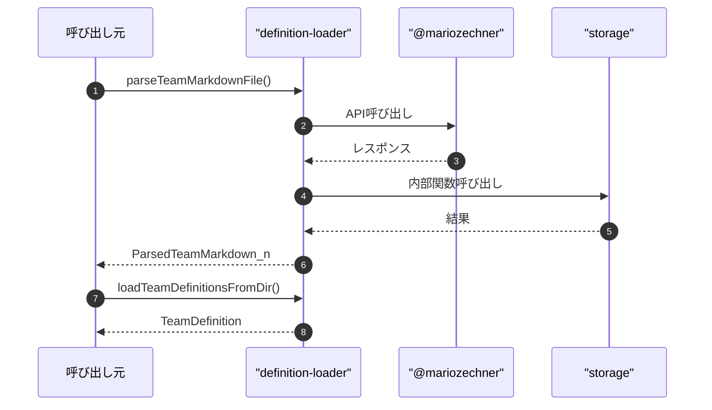

# definition-loader

## 概要

`definition-loader` モジュールのAPIリファレンス。

## インポート

```typescript
import { existsSync, readdirSync, readFileSync } from 'node:fs';
import { homedir } from 'node:os';
import { basename, join } from 'node:path';
import { parseFrontmatter } from '@mariozechner/pi-coding-agent';
import { TeamDefinition, TeamMember, TeamStorage } from './storage';
// ... and 2 more imports
```

## エクスポート一覧

| 種別 | 名前 | 説明 |
|------|------|------|
| 関数 | `parseTeamMarkdownFile` | YAMLフロントマター付きチームMarkdownを解析 |
| 関数 | `loadTeamDefinitionsFromDir` | ディレクトリからチーム定義を読み込む |
| 関数 | `loadTeamDefinitionsFromMarkdown` | Markdownからチーム定義を読み込む |
| 関数 | `createDefaultTeams` | デフォルトのチーム定義を作成する |
| 関数 | `mergeDefaultTeam` | 既存とデフォルトのチーム定義をマージする |
| 関数 | `ensureDefaults` | デフォルトチーム設定を適用・統合する |

## 図解

### 依存関係図



### 関数フロー



### シーケンス図



## 関数

### getTeamDefinitionsDir

```typescript
getTeamDefinitionsDir(cwd: string): string
```

**パラメータ**

| 名前 | 型 | 必須 |
|------|-----|------|
| cwd | `string` | はい |

**戻り値**: `string`

### getAgentBaseDirFromEnv

```typescript
getAgentBaseDirFromEnv(): string
```

**戻り値**: `string`

### getGlobalTeamDefinitionsDir

```typescript
getGlobalTeamDefinitionsDir(): string
```

**戻り値**: `string`

### getBundledTeamDefinitionsDir

```typescript
getBundledTeamDefinitionsDir(): string | undefined
```

**戻り値**: `string | undefined`

### getCandidateTeamDefinitionsDirs

```typescript
getCandidateTeamDefinitionsDirs(cwd: string): string[]
```

**パラメータ**

| 名前 | 型 | 必須 |
|------|-----|------|
| cwd | `string` | はい |

**戻り値**: `string[]`

### parseTeamMarkdownFile

```typescript
parseTeamMarkdownFile(filePath: string): ParsedTeamMarkdown | null
```

YAMLフロントマター付きチームMarkdownを解析

**パラメータ**

| 名前 | 型 | 必須 |
|------|-----|------|
| filePath | `string` | はい |

**戻り値**: `ParsedTeamMarkdown | null`

### loadTeamDefinitionsFromDir

```typescript
loadTeamDefinitionsFromDir(definitionsDir: string, nowIso: string): TeamDefinition[]
```

ディレクトリからチーム定義を読み込む

**パラメータ**

| 名前 | 型 | 必須 |
|------|-----|------|
| definitionsDir | `string` | はい |
| nowIso | `string` | はい |

**戻り値**: `TeamDefinition[]`

### loadTeamDefinitionsFromMarkdown

```typescript
loadTeamDefinitionsFromMarkdown(cwd: string, nowIso: string): TeamDefinition[]
```

Markdownからチーム定義を読み込む

**パラメータ**

| 名前 | 型 | 必須 |
|------|-----|------|
| cwd | `string` | はい |
| nowIso | `string` | はい |

**戻り値**: `TeamDefinition[]`

### createRapidSwarmMembers

```typescript
createRapidSwarmMembers(count: number): TeamMember[]
```

**パラメータ**

| 名前 | 型 | 必須 |
|------|-----|------|
| count | `number` | はい |

**戻り値**: `TeamMember[]`

### getHardcodedDefaultTeams

```typescript
getHardcodedDefaultTeams(nowIso: string): TeamDefinition[]
```

**パラメータ**

| 名前 | 型 | 必須 |
|------|-----|------|
| nowIso | `string` | はい |

**戻り値**: `TeamDefinition[]`

### createDefaultTeams

```typescript
createDefaultTeams(nowIso: string, cwd?: string): TeamDefinition[]
```

デフォルトのチーム定義を作成する

**パラメータ**

| 名前 | 型 | 必須 |
|------|-----|------|
| nowIso | `string` | はい |
| cwd | `string` | いいえ |

**戻り値**: `TeamDefinition[]`

### mergeDefaultTeam

```typescript
mergeDefaultTeam(existing: TeamDefinition, fallback: TeamDefinition): TeamDefinition
```

既存とデフォルトのチーム定義をマージする

**パラメータ**

| 名前 | 型 | 必須 |
|------|-----|------|
| existing | `TeamDefinition` | はい |
| fallback | `TeamDefinition` | はい |

**戻り値**: `TeamDefinition`

### ensureDefaults

```typescript
ensureDefaults(storage: TeamStorage, nowIso: string, cwd?: string): TeamStorage
```

デフォルトチーム設定を適用・統合する

**パラメータ**

| 名前 | 型 | 必須 |
|------|-----|------|
| storage | `TeamStorage` | はい |
| nowIso | `string` | はい |
| cwd | `string` | いいえ |

**戻り値**: `TeamStorage`

---
*自動生成: 2026-02-18T07:17:30.124Z*
