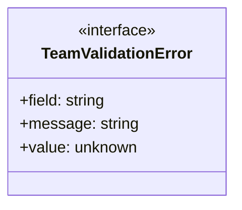
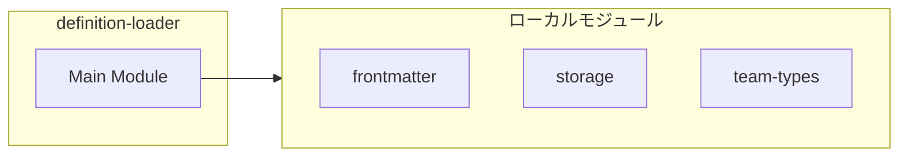
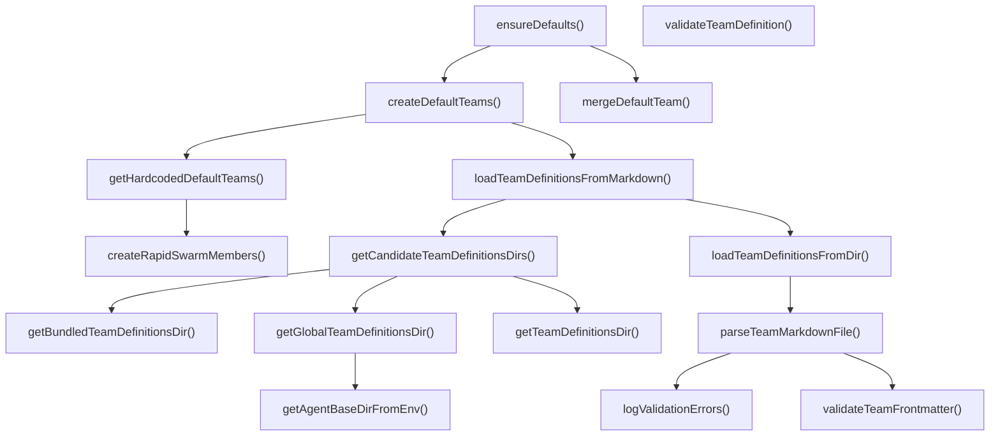
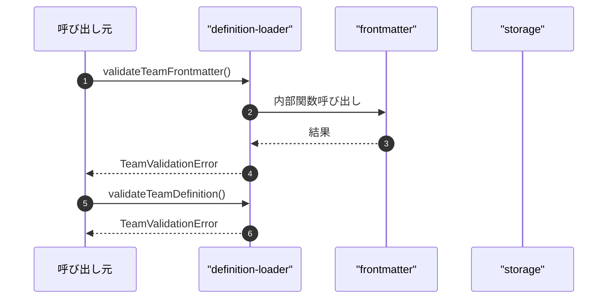

# definition-loader

## 概要

`definition-loader` モジュールのAPIリファレンス。

## インポート

```typescript
// from 'node:fs': existsSync, readdirSync, readFileSync, ...
// from 'node:os': homedir
// from 'node:path': dirname, join
// from 'node:url': fileURLToPath
// from '../../lib/frontmatter.js': parseFrontmatter
// ... and 3 more imports
```

## エクスポート一覧

| 種別 | 名前 | 説明 |
|------|------|------|
| 関数 | `validateTeamFrontmatter` | チームフロントマターをバリデーション |
| 関数 | `validateTeamDefinition` | TeamDefinitionオブジェクトをバリデーション |
| 関数 | `parseTeamMarkdownFile` | チームMarkdownファイルをパース |
| 関数 | `loadTeamDefinitionsFromDir` | ディレクトリからチーム定義を読込 |
| 関数 | `loadTeamDefinitionsFromMarkdown` | Markdownからチーム定義を読込（全ディレクトリ統合） |
| 関数 | `createDefaultTeams` | デフォルトチーム定義を生成 |
| 関数 | `mergeDefaultTeam` | デフォルトチーム定義を統合 |
| 関数 | `ensureDefaults` | デフォルト設定を適用 |
| インターフェース | `TeamValidationError` | チーム定義のバリデーションエラー |

## 図解

### クラス図



### 依存関係図



### 関数フロー



### シーケンス図



## 関数

### validateTeamFrontmatter

```typescript
validateTeamFrontmatter(frontmatter: Partial<TeamFrontmatter>, filePath: string): TeamValidationError[]
```

チームフロントマターをバリデーション

**パラメータ**

| 名前 | 型 | 必須 |
|------|-----|------|
| frontmatter | `Partial<TeamFrontmatter>` | はい |
| filePath | `string` | はい |

**戻り値**: `TeamValidationError[]`

### validateTeamDefinition

```typescript
validateTeamDefinition(team: Partial<TeamDefinition>): TeamValidationError[]
```

TeamDefinitionオブジェクトをバリデーション

**パラメータ**

| 名前 | 型 | 必須 |
|------|-----|------|
| team | `Partial<TeamDefinition>` | はい |

**戻り値**: `TeamValidationError[]`

### logValidationErrors

```typescript
logValidationErrors(errors: TeamValidationError[], filePath: string): void
```

バリデーションエラーを警告ログに変換

**パラメータ**

| 名前 | 型 | 必須 |
|------|-----|------|
| errors | `TeamValidationError[]` | はい |
| filePath | `string` | はい |

**戻り値**: `void`

### getModuleDir

```typescript
getModuleDir(): string
```

Get the directory containing this module.
Works in both development and after pi install (jiti preserves import.meta.url).

**戻り値**: `string`

### getTeamDefinitionsDir

```typescript
getTeamDefinitionsDir(cwd: string): string
```

**パラメータ**

| 名前 | 型 | 必須 |
|------|-----|------|
| cwd | `string` | はい |

**戻り値**: `string`

### getAgentBaseDirFromEnv

```typescript
getAgentBaseDirFromEnv(): string
```

**戻り値**: `string`

### getGlobalTeamDefinitionsDir

```typescript
getGlobalTeamDefinitionsDir(): string
```

**戻り値**: `string`

### getBundledTeamDefinitionsDir

```typescript
getBundledTeamDefinitionsDir(): string | undefined
```

Get the bundled team definitions directory.
Uses import.meta.url for reliable path resolution regardless of cwd.
Returns undefined if the bundled definitions directory doesn't exist.

**戻り値**: `string | undefined`

### getCandidateTeamDefinitionsDirs

```typescript
getCandidateTeamDefinitionsDirs(cwd: string): string[]
```

**パラメータ**

| 名前 | 型 | 必須 |
|------|-----|------|
| cwd | `string` | はい |

**戻り値**: `string[]`

### parseTeamMarkdownFile

```typescript
parseTeamMarkdownFile(filePath: string): ParsedTeamMarkdown | null
```

チームMarkdownファイルをパース

**パラメータ**

| 名前 | 型 | 必須 |
|------|-----|------|
| filePath | `string` | はい |

**戻り値**: `ParsedTeamMarkdown | null`

### loadTeamDefinitionsFromDir

```typescript
loadTeamDefinitionsFromDir(definitionsDir: string, nowIso: string): TeamDefinition[]
```

ディレクトリからチーム定義を読込

**パラメータ**

| 名前 | 型 | 必須 |
|------|-----|------|
| definitionsDir | `string` | はい |
| nowIso | `string` | はい |

**戻り値**: `TeamDefinition[]`

### loadTeamDefinitionsFromMarkdown

```typescript
loadTeamDefinitionsFromMarkdown(cwd: string, nowIso: string): TeamDefinition[]
```

Markdownからチーム定義を読込（全ディレクトリ統合）

**パラメータ**

| 名前 | 型 | 必須 |
|------|-----|------|
| cwd | `string` | はい |
| nowIso | `string` | はい |

**戻り値**: `TeamDefinition[]`

### createRapidSwarmMembers

```typescript
createRapidSwarmMembers(count: number): TeamMember[]
```

**パラメータ**

| 名前 | 型 | 必須 |
|------|-----|------|
| count | `number` | はい |

**戻り値**: `TeamMember[]`

### getHardcodedDefaultTeams

```typescript
getHardcodedDefaultTeams(nowIso: string): TeamDefinition[]
```

**パラメータ**

| 名前 | 型 | 必須 |
|------|-----|------|
| nowIso | `string` | はい |

**戻り値**: `TeamDefinition[]`

### createDefaultTeams

```typescript
createDefaultTeams(nowIso: string, cwd?: string): TeamDefinition[]
```

デフォルトチーム定義を生成

**パラメータ**

| 名前 | 型 | 必須 |
|------|-----|------|
| nowIso | `string` | はい |
| cwd | `string` | いいえ |

**戻り値**: `TeamDefinition[]`

### mergeDefaultTeam

```typescript
mergeDefaultTeam(existing: TeamDefinition, fallback: TeamDefinition): TeamDefinition
```

デフォルトチーム定義を統合

既存のチーム定義に、フォールバック用のデフォルト定義をマージします。

**パラメータ**

| 名前 | 型 | 必須 |
|------|-----|------|
| existing | `TeamDefinition` | はい |
| fallback | `TeamDefinition` | はい |

**戻り値**: `TeamDefinition`

### ensureDefaults

```typescript
ensureDefaults(storage: TeamStorage, nowIso: string, cwd?: string): TeamStorage
```

デフォルト設定を適用

ストレージに対して、現在時刻やディレクトリ情報を含むデフォルト設定を反映・統合します。

**パラメータ**

| 名前 | 型 | 必須 |
|------|-----|------|
| storage | `TeamStorage` | はい |
| nowIso | `string` | はい |
| cwd | `string` | いいえ |

**戻り値**: `TeamStorage`

## インターフェース

### TeamValidationError

```typescript
interface TeamValidationError {
  field: string;
  message: string;
  value?: unknown;
}
```

チーム定義のバリデーションエラー

---
*自動生成: 2026-02-24T17:08:01.843Z*
