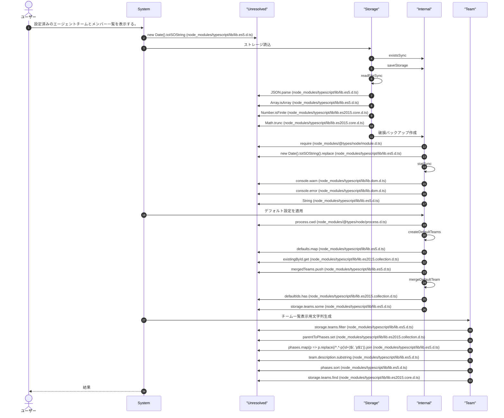
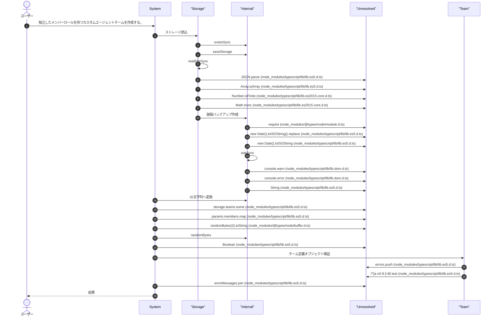
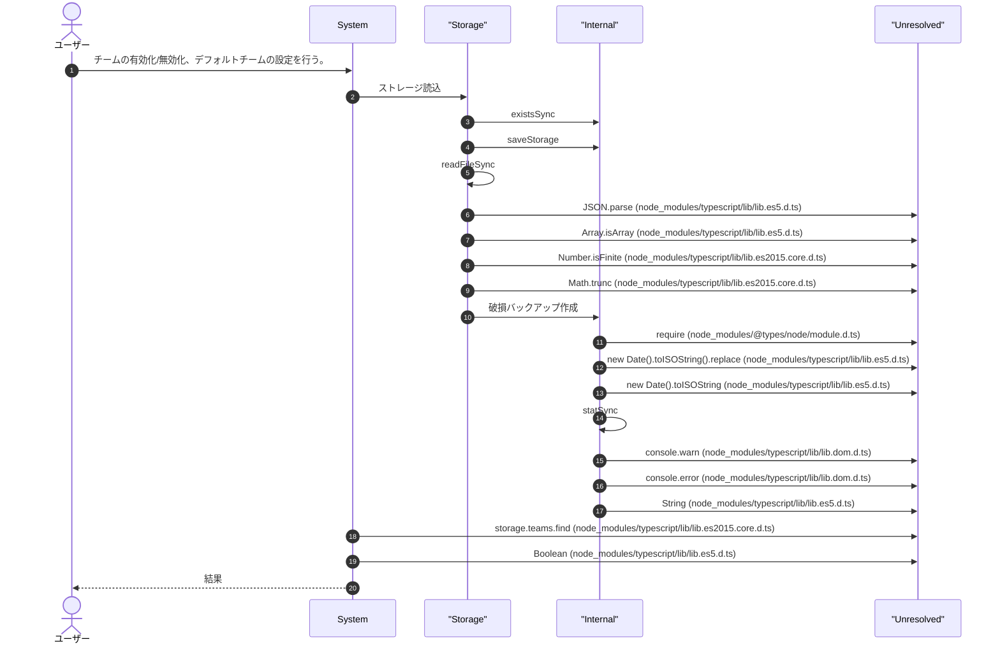
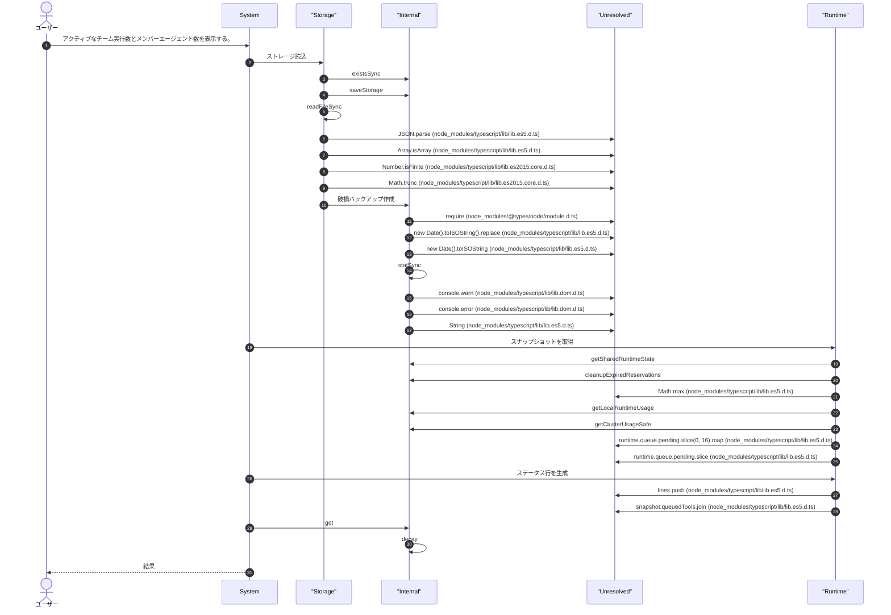
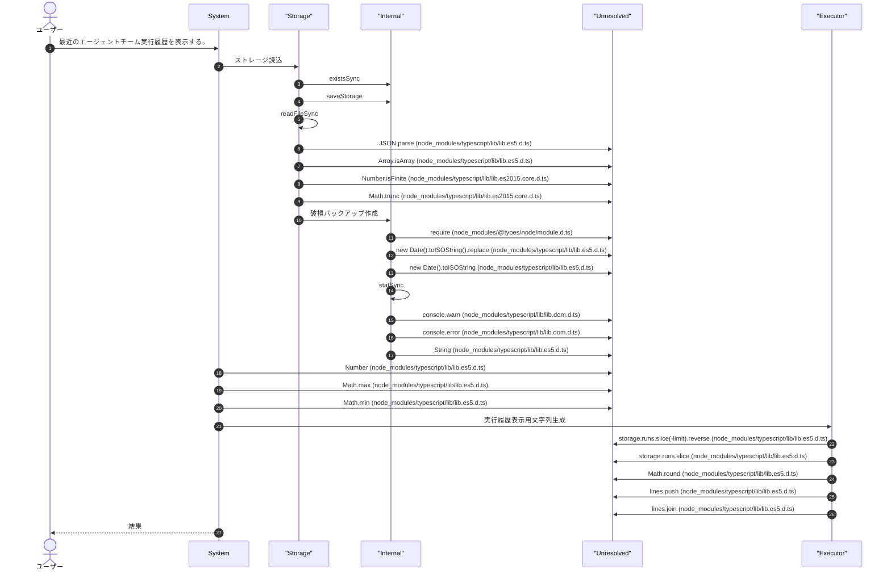
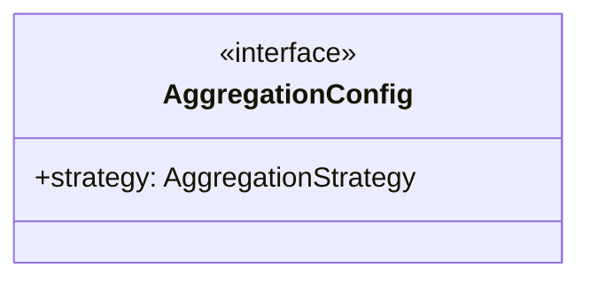
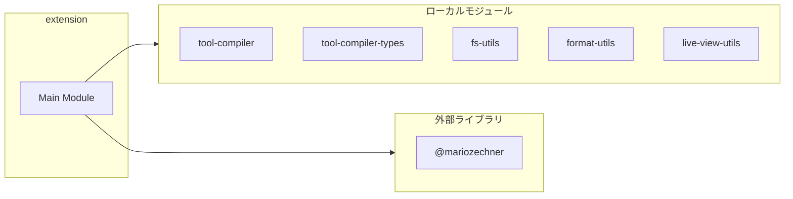
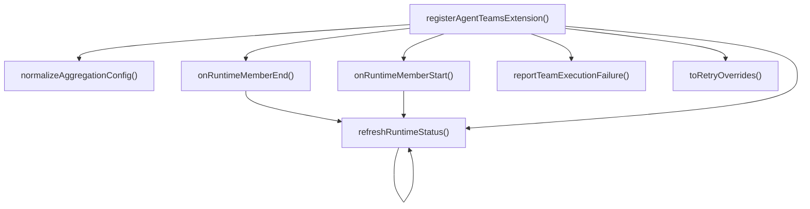
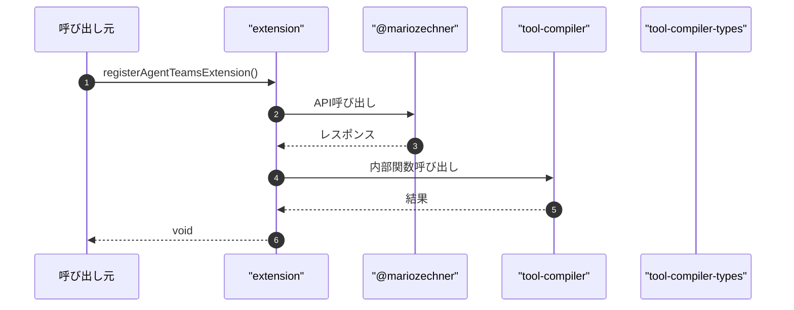

# extension

## 概要

`extension` モジュールのAPIリファレンス。

## インポート

```typescript
// from 'node:crypto': randomBytes
// from 'node:fs': existsSync, readdirSync, readFileSync, ...
// from 'node:os': homedir
// from 'node:path': basename, join
// from '@mariozechner/pi-ai': Type
// ... and 45 more imports
```

## エクスポート一覧

| 種別 | 名前 | 説明 |
|------|------|------|
| 関数 | `registerAgentTeamsExtension` | エージェントチーム拡張登録 |

## ユーザーフロー

このモジュールが提供するツールと、その実行フローを示します。

### agent_team_list

設定済みのエージェントチームとメンバー一覧を表示する。



### agent_team_create

独立したメンバーロールを持つカスタムエージェントチームを作成する。



### agent_team_configure

チームの有効化/無効化、デフォルトチームの設定を行う。



### agent_team_run

複数のメンバーエージェントでタスクを実行する。複数チームを並列実行できる場合はagent_team_run_parallelを使用。

```mermaid
sequenceDiagram
  autonumber
  actor User as ユーザー
  participant System as System
  participant Unresolved as "Unresolved"
  participant Judge as "Judge"
  participant Storage as "Storage"
  participant Internal as "Internal"
  participant LLM as "LLM"
  participant Executor as "Executor"
  participant Team as "Team"
  participant Runtime as "Runtime"

  User->>System: 複数のメンバーエージェントでタスクを実行する。複数チームを並列実行できる場合はagent_team_run_par...
  System->>Unresolved: String (node_modules/typescript/lib/lib.es5.d.ts)
  System->>Judge: UL所有権確認
  Judge->>Storage: 状態を読み込む
  Storage->>Internal: join
  Storage->>Internal: getTaskDir
  Storage->>Storage: readFileSync
  Storage->>Unresolved: JSON.parse (node_modules/typescript/lib/lib.es5.d.ts)
  Judge->>Internal: ID取得
  Judge->>LLM: PID抽出
  LLM->>Unresolved: instanceId.match (node_modules/typescript/lib/lib.es5.d.ts)
  LLM->>Unresolved: Number (node_modules/typescript/lib/lib.es5.d.ts)
  LLM->>Unresolved: Number.isInteger (node_modules/typescript/lib/lib.es2015.core.d.ts)
  Judge->>Executor: プロセス生存確認
  Executor->>Unresolved: process.kill (node_modules/@types/node/process.d.ts)
  System->>Storage: ストレージ読込
  Storage->>Internal: existsSync
  Storage->>Internal: saveStorage
  Storage->>Unresolved: Array.isArray (node_modules/typescript/lib/lib.es5.d.ts)
  Storage->>Unresolved: Number.isFinite (node_modules/typescript/lib/lib.es2015.core.d.ts)
  Storage->>Unresolved: Math.trunc (node_modules/typescript/lib/lib.es2015.core.d.ts)
  Storage->>Internal: 破損バックアップ作成
  Internal->>Unresolved: require (node_modules/@types/node/module.d.ts)
  Internal->>Unresolved: new Date().toISOString().replace (node_modules/typescript/lib/lib.es5.d.ts)
  Internal->>Unresolved: new Date().toISOString (node_modules/typescript/lib/lib.es5.d.ts)
  Internal->>Internal: statSync
  Internal->>Unresolved: console.warn (node_modules/typescript/lib/lib.dom.d.ts)
  Internal->>Unresolved: console.error (node_modules/typescript/lib/lib.dom.d.ts)
  System->>LLM: チーム選択
  LLM->>Unresolved: storage.teams.find (node_modules/typescript/lib/lib.es2015.core.d.ts)
  System->>Internal: toRetryOverrides
  System->>Unresolved: team.members.filter (node_modules/typescript/lib/lib.es5.d.ts)
  System->>Unresolved: logger.startOperation (.pi/lib/comprehensive-logger.ts)
  System->>Unresolved: String(params.strategy || 'parallel').toLowerCase (node_modules/typescript/lib/lib.es5.d.ts)
  System->>Internal: 通信ラウンド数を正規化
  Internal->>Unresolved: Math.max (node_modules/typescript/lib/lib.es5.d.ts)
  Internal->>Unresolved: Math.min (node_modules/typescript/lib/lib.es5.d.ts)
  System->>Team: 再試行回数正規化
  System->>Internal: 設定を環境変数から取得
  Internal->>Internal: parseEnvBool
  System->>Judge: 一意通信ID解決
  Judge->>Internal: generateCommId
  Judge->>Unresolved: usedCommIds.has (node_modules/typescript/lib/lib.es2015.collection.d.ts)
  Judge->>Unresolved: usedCommIds.add (node_modules/typescript/lib/lib.es2015.collection.d.ts)
  Judge->>Unresolved: entries.push (node_modules/typescript/lib/lib.es5.d.ts)
  System->>Internal: リンクマップ生成
  Internal->>Internal: 文字列をシード値化
  Internal->>Internal: createStableHash
  Internal->>Unresolved: members.map (node_modules/typescript/lib/lib.es5.d.ts)
  Internal->>Internal: buildCandidates
  Internal->>Unresolved: candidates.get (node_modules/typescript/lib/lib.es2015.collection.d.ts)
  Internal->>Internal: selectPartnersDeterministic
  Internal->>Unresolved: result.set (node_modules/typescript/lib/lib.es2015.collection.d.ts)
  System->>Runtime: スナップショットを取得
  Runtime->>Internal: getSharedRuntimeState
  Runtime->>Internal: cleanupExpiredReservations
  Runtime->>Internal: getLocalRuntimeUsage
  Runtime->>Internal: getClusterUsageSafe
  Runtime->>Unresolved: runtime.queue.pending.slice (node_modules/typescript/lib/lib.es5.d.ts)
  System->>Runtime: 並行数リミットを取得
  Runtime->>Internal: toFiniteNumber
  System->>Runtime: applyLimit
  Runtime->>Unresolved: Math.floor (node_modules/typescript/lib/lib.es5.d.ts)
  System->>Runtime: acquireRuntimeDispatchPermit
  Runtime->>Internal: normalizePositiveInt
  Runtime->>Internal: clampPlannedCount
  Runtime->>Internal: createRuntimeQueueEntryId
  Runtime->>Internal: runtimeNow
  Runtime->>Internal: 優先度推論
  Internal->>Unresolved: toolName.toLowerCase().trim (node_modules/typescript/lib/lib.es5.d.ts)
  Internal->>Unresolved: normalized.startsWith (node_modules/typescript/lib/lib.es2015.core.d.ts)
  Runtime->>Internal: validateToolName
  Runtime->>Internal: toQueueClass
  Runtime->>Internal: trimPendingQueueToLimit
  Runtime->>Internal: sortQueueByPriority
  Runtime->>Internal: updatePriorityStats
  Runtime->>Internal: notifyRuntimeCapacityChanged
  Runtime->>Unresolved: runtime.queue.pending.findIndex (node_modules/typescript/lib/lib.es2015.core.d.ts)
  Runtime->>Internal: findDispatchableQueueEntry
  Runtime->>Internal: tryReserveRuntimeCapacity
  Runtime->>Internal: removeQueuedEntry
  Runtime->>Unresolved: reservationAttempt.reservation?.consume (.pi/lib/runtime-types.ts)
  Runtime->>Unresolved: reservationAttempt.reservation?.heartbeat (.pi/lib/runtime-types.ts)
  Runtime->>Unresolved: reservationAttempt.reservation?.release (.pi/lib/runtime-types.ts)
  Runtime->>Internal: promoteStarvingEntries
  Runtime->>Internal: checkRuntimeCapacity
  Runtime->>Internal: computeBackoffDelay
  Runtime->>Internal: waitForRuntimeCapacityEvent
  Runtime->>Internal: wait
  System->>Unresolved: Math.round (node_modules/typescript/lib/lib.es5.d.ts)
  System->>Internal: raise
  Internal->>Internal: raiseWithReason
  System->>Runtime: 実行制限エラー生成
  Runtime->>Unresolved: Boolean (node_modules/typescript/lib/lib.es5.d.ts)
  System->>Executor: ハートビート開始
  Executor->>Internal: setInterval
  Executor->>Internal: clearInterval
  Executor->>Unresolved: timer.unref (node_modules/@types/node/timers.d.ts)
  Executor->>Unresolved: registry.unregister (node_modules/typescript/lib/lib.es2021.weakref.d.ts)
  Executor->>Internal: doCleanup
  Executor->>Unresolved: registry.register (node_modules/typescript/lib/lib.es2021.weakref.d.ts)
  Executor->>Unresolved: Date.now (node_modules/typescript/lib/lib.es5.d.ts)
  System->>Judge: タイムアウト時間を解決
  Judge->>Internal: モデル別タイムアウト
  Internal->>Internal: getModelBaseTimeoutMs
  Judge->>Internal: タイムアウトを正規化
  System->>Unresolved: getCostEstimator().estimate (.pi/lib/cost-estimator.ts)
  System->>Internal: コスト推定インスタンス取得
  System->>Internal: コスト推定デバッグログ出力
  Internal->>Unresolved: Object.entries (node_modules/typescript/lib/lib.es2017.object.d.ts)
  System->>Team: ライブ監視を生成
  Team->>Internal: clearTimeout
  Team->>Unresolved: items.some (node_modules/typescript/lib/lib.es5.d.ts)
  Team->>Internal: hasRunningItems
  Team->>Internal: clearPollTimer
  Team->>Internal: hasDynamicState
  Team->>Internal: queueRender
  Team->>Internal: setTimeout
  Team->>Internal: clearRenderTimer
  Team->>Unresolved: ctx.ui     .custom((tui: TuiInstance, theme: Theme, _keybindings: KeybindingMap, done: () => void) => {       doneUi = done;       requestRender = () => {         if (!closed) {           tui.requestRender();         }       };        // 初期レンダリングとポーリング開始を即座に行う       // UIセットアップ完了後、メンバー実行開始を待たずにポーリングを開始       // これにより経過時間の秒数更新や状態表示が遅延なく行われる       setTimeout(() => {         if (!closed) {           queueRender();           startPolling();         }       }, 0);        return {         render: (width: number) =>           renderAgentTeamLiveView({             title: input.title,             items,             globalEvents,             cursor,             mode,             stream,             width,             height: tui.terminal.rows,             theme,             queueStatus,           }),         invalidate: () => {},         handleInput: (rawInput: string) => {           if (matchesKey(rawInput, 'q')) {             close();             return;           }            if (matchesKey(rawInput, Key.escape)) {             if (mode === 'detail' || mode === 'discussion' || mode === 'timeline') {               mode = 'list';               queueRender();               return;             }             close();             return;           }            if (rawInput === 'j' || matchesKey(rawInput, Key.down)) {             cursor = Math.min(items.length - 1, cursor + 1);             queueRender();             return;           }            if (rawInput === 'k' || matchesKey(rawInput, Key.up)) {             cursor = Math.max(0, cursor - 1);             queueRender();             return;           }            if (rawInput === 'g') {             cursor = 0;             queueRender();             return;           }            if (rawInput === 'G') {             cursor = Math.max(0, items.length - 1);             queueRender();             return;           }            if (mode === 'list' && isEnterInput(rawInput)) {             mode = 'detail';             queueRender();             return;           }            if ((mode === 'detail' || mode === 'discussion') && (rawInput === 'b' || rawInput === 'B')) {             mode = 'list';             queueRender();             return;           }            if ((mode === 'list' || mode === 'detail') && (rawInput === 'd' || rawInput === 'D')) {             mode = 'discussion';             queueRender();             return;           }            if ((mode === 'list' || mode === 'detail' || mode === 'discussion') && (rawInput === 't' || rawInput === 'T')) {             mode = 'timeline';             queueRender();             return;           }            if ((mode === 'list' || mode === 'detail' || mode === 'discussion' || mode === 'timeline') && (rawInput === 'v' || rawInput === 'V')) {             mode = 'gantt';             queueRender();             return;           }            if (mode === 'timeline' && (rawInput === 'b' || rawInput === 'B')) {             mode = 'list';             queueRender();             return;           }            if (mode === 'timeline' && (rawInput === 'd' || rawInput === 'D')) {             mode = 'discussion';             queueRender();             return;           }            if (mode === 'timeline' && matchesKey(rawInput, Key.escape)) {             mode = 'list';             queueRender();             return;           }            if (mode === 'gantt' && (rawInput === 'b' || rawInput === 'B')) {             mode = 'list';             queueRender();             return;           }            if (mode === 'gantt' && (rawInput === 't' || rawInput === 'T')) {             mode = 'timeline';             queueRender();             return;           }            if (mode === 'gantt' && matchesKey(rawInput, Key.escape)) {             mode = 'list';             queueRender();             return;           }            if (rawInput === '\t' || rawInput === 'tab') {             stream = stream === 'stdout' ? 'stderr' : 'stdout';             queueRender();             return;           }         },       };     }, {       overlay: true,       overlayOptions: () => ({         width: '100%',         maxHeight: '100%',         row: 0,         col: 0,         margin: 0,       }),     })     .catch(() => undefined)     .finally (node_modules/typescript/lib/lib.es2018.promise.d.ts)
  Team->>Unresolved: ctx.ui     .custom((tui: TuiInstance, theme: Theme, _keybindings: KeybindingMap, done: () => void) => {       doneUi = done;       requestRender = () => {         if (!closed) {           tui.requestRender();         }       };        // 初期レンダリングとポーリング開始を即座に行う       // UIセットアップ完了後、メンバー実行開始を待たずにポーリングを開始       // これにより経過時間の秒数更新や状態表示が遅延なく行われる       setTimeout(() => {         if (!closed) {           queueRender();           startPolling();         }       }, 0);        return {         render: (width: number) =>           renderAgentTeamLiveView({             title: input.title,             items,             globalEvents,             cursor,             mode,             stream,             width,             height: tui.terminal.rows,             theme,             queueStatus,           }),         invalidate: () => {},         handleInput: (rawInput: string) => {           if (matchesKey(rawInput, 'q')) {             close();             return;           }            if (matchesKey(rawInput, Key.escape)) {             if (mode === 'detail' || mode === 'discussion' || mode === 'timeline') {               mode = 'list';               queueRender();               return;             }             close();             return;           }            if (rawInput === 'j' || matchesKey(rawInput, Key.down)) {             cursor = Math.min(items.length - 1, cursor + 1);             queueRender();             return;           }            if (rawInput === 'k' || matchesKey(rawInput, Key.up)) {             cursor = Math.max(0, cursor - 1);             queueRender();             return;           }            if (rawInput === 'g') {             cursor = 0;             queueRender();             return;           }            if (rawInput === 'G') {             cursor = Math.max(0, items.length - 1);             queueRender();             return;           }            if (mode === 'list' && isEnterInput(rawInput)) {             mode = 'detail';             queueRender();             return;           }            if ((mode === 'detail' || mode === 'discussion') && (rawInput === 'b' || rawInput === 'B')) {             mode = 'list';             queueRender();             return;           }            if ((mode === 'list' || mode === 'detail') && (rawInput === 'd' || rawInput === 'D')) {             mode = 'discussion';             queueRender();             return;           }            if ((mode === 'list' || mode === 'detail' || mode === 'discussion') && (rawInput === 't' || rawInput === 'T')) {             mode = 'timeline';             queueRender();             return;           }            if ((mode === 'list' || mode === 'detail' || mode === 'discussion' || mode === 'timeline') && (rawInput === 'v' || rawInput === 'V')) {             mode = 'gantt';             queueRender();             return;           }            if (mode === 'timeline' && (rawInput === 'b' || rawInput === 'B')) {             mode = 'list';             queueRender();             return;           }            if (mode === 'timeline' && (rawInput === 'd' || rawInput === 'D')) {             mode = 'discussion';             queueRender();             return;           }            if (mode === 'timeline' && matchesKey(rawInput, Key.escape)) {             mode = 'list';             queueRender();             return;           }            if (mode === 'gantt' && (rawInput === 'b' || rawInput === 'B')) {             mode = 'list';             queueRender();             return;           }            if (mode === 'gantt' && (rawInput === 't' || rawInput === 'T')) {             mode = 'timeline';             queueRender();             return;           }            if (mode === 'gantt' && matchesKey(rawInput, Key.escape)) {             mode = 'list';             queueRender();             return;           }            if (rawInput === '\t' || rawInput === 'tab') {             stream = stream === 'stdout' ? 'stderr' : 'stdout';             queueRender();             return;           }         },       };     }, {       overlay: true,       overlayOptions: () => ({         width: '100%',         maxHeight: '100%',         row: 0,         col: 0,         margin: 0,       }),     })     .catch (node_modules/typescript/lib/lib.es5.d.ts)
  Team->>Unresolved: ctx.ui     .custom (.pi/lib/tui-types.ts)
  Team->>Unresolved: tui.requestRender (.pi/lib/tui-types.ts)
  Team->>Internal: startPolling
  Team->>Internal: renderAgentTeamLiveView
  Team->>Internal: matchesKey
  Team->>Internal: close
  Team->>Internal: Enterキー判定
  Team->>Internal: pushStateTransition
  Team->>Internal: pushLiveEvent
  Team->>Internal: formatLivePhase
  Team->>Internal: 時刻フォーマット
  Internal->>Unresolved: String(date.getHours()).padStart (node_modules/typescript/lib/lib.es2017.string.d.ts)
  Internal->>Unresolved: date.getHours (node_modules/typescript/lib/lib.es5.d.ts)
  Internal->>Unresolved: date.getMinutes (node_modules/typescript/lib/lib.es5.d.ts)
  Internal->>Unresolved: date.getSeconds (node_modules/typescript/lib/lib.es5.d.ts)
  Team->>Internal: 文字列正規化
  Internal->>Unresolved: normalizeCache.keys().next (node_modules/typescript/lib/lib.es2015.iterable.d.ts)
  Internal->>Unresolved: normalizeCache.keys (node_modules/typescript/lib/lib.es2015.iterable.d.ts)
  Internal->>Unresolved: normalizeCache.delete (node_modules/typescript/lib/lib.es2015.collection.d.ts)
  Team->>Unresolved: globalEvents.splice (node_modules/typescript/lib/lib.es5.d.ts)
  Team->>Internal: 末尾にチャンク追加
  Team->>Unresolved: Buffer.byteLength (node_modules/@types/node/buffer.d.ts)
  Team->>Internal: 出現回数を数える
  Internal->>Unresolved: input.indexOf (node_modules/typescript/lib/lib.es5.d.ts)
  Team->>Unresolved: chunk.endsWith (node_modules/typescript/lib/lib.es2015.core.d.ts)
  Team->>Internal: classifyActivityFromChunk
  System->>Team: キーを生成
  System->>Unresolved: liveMonitor?.appendBroadcastEvent (.pi/lib/team-types.ts)
  System->>Unresolved: liveMonitor?.updateQueueStatus (.pi/lib/team-types.ts)
  System->>Runtime: refreshRuntimeStatus
  System->>Unresolved: liveMonitor?.markStarted (.pi/lib/team-types.ts)
  System->>Unresolved: liveMonitor?.appendEvent (.pi/lib/team-types.ts)
  System->>Team: チームタスク実行
  Team->>Internal: キャッシュクリア
  Internal->>Unresolved: beliefCacheMutex.runExclusive (node_modules/async-mutex/lib/Mutex.d.ts)
  Internal->>Unresolved: beliefStateCacheByTeam.clear (node_modules/typescript/lib/lib.es2015.collection.d.ts)
  Team->>Executor: 一意な実行IDを生成します。
  Executor->>Unresolved: now.getFullYear (node_modules/typescript/lib/lib.es5.d.ts)
  Executor->>Unresolved: now.getMonth (node_modules/typescript/lib/lib.es5.d.ts)
  Executor->>Unresolved: now.getDate (node_modules/typescript/lib/lib.es5.d.ts)
  Executor->>Unresolved: randomBytes(3).toString (node_modules/@types/node/buffer.d.ts)
  Executor->>Internal: randomBytes
  Team->>Unresolved: ensurePaths (.pi/extensions/agent-teams/storage.ts)
  Team->>Unresolved: result.diagnostics.confidence.toFixed (node_modules/typescript/lib/lib.es5.d.ts)
  Team->>Runtime: 指定した並行数制限で非同期タスクを実行する
  Runtime->>Unresolved: console.debug (node_modules/typescript/lib/lib.dom.d.ts)
  Runtime->>Internal: toPositiveLimit
  Runtime->>Unresolved: items       .map((item, index) => ({         index,         weight: itemWeights.get(getItemId(item)) ?? 1.0,       }))       .sort (node_modules/typescript/lib/lib.es5.d.ts)
  Runtime->>Internal: 親に連動する中止制御
  Internal->>Unresolved: controller.abort (node_modules/typescript/lib/lib.dom.d.ts)
  Internal->>Internal: addEventListener
  Internal->>Internal: removeEventListener
  Runtime->>Internal: ensureNotAborted
  Runtime->>Internal: isPoolAbortError
  Runtime->>Unresolved: Promise.all (node_modules/typescript/lib/lib.es2015.iterable.d.ts)
  Runtime->>Unresolved: Array.from (node_modules/typescript/lib/lib.es2015.core.d.ts)
  Runtime->>Internal: runWorker
  Team->>Internal: createChildAbort
  Team->>Team: タスクを実行
  Team->>Internal: 関連パターンを検索
  Internal->>Internal: loadPatternStorage
  Internal->>Internal: キーワード抽出
  Internal->>Internal: タスク分類
  Team->>Internal: buildTeamMemberPrompt
  Team->>Runtime: レート制限キー生成
  Team->>Internal: バックオフ再試行実行
  Internal->>Internal: resolveRetryWithBackoffConfig
  Internal->>Internal: toOptionalNonNegativeInt
  Internal->>Internal: toOptionalPositiveInt
  Internal->>Internal: normalizeRateLimitKey
  Internal->>Internal: createRateLimitKeyScope
  Internal->>Internal: createAbortError
  Internal->>Judge: サーキットブレーカーをチェック
  Internal->>Runtime: 観測データを記録
  Internal->>Internal: getRateLimitGateSnapshot
  Internal->>Internal: selectLongestRateLimitGate
  Internal->>Internal: createRateLimitFastFailError
  Internal->>Internal: sleepWithAbort
  Internal->>Internal: registerRateLimitGateSuccess
  Internal->>Internal: 成功を記録
  Internal->>Internal: extractRetryStatusCode
  Internal->>Internal: isNetworkErrorRetryable
  Internal->>Internal: 失敗を記録
  Internal->>Internal: computeBackoffDelayMs
  Internal->>Internal: registerRateLimitGateHit
  Team->>LLM: runPiPrintMode
  Team->>Internal: エラーメッセージを抽出
  Internal->>Unresolved: JSON.stringify (node_modules/typescript/lib/lib.es5.d.ts)
  Team->>Internal: isIdleTimeoutErrorMessage
  Team->>Internal: 非同期待機
  Internal->>Unresolved: Promise.resolve (node_modules/typescript/lib/lib.es2015.promise.d.ts)
  Team->>Internal: エラーメッセージを整形
  Team->>Internal: normalizeTeamMemberOutput
  Team->>Internal: extractSummary
  Team->>Internal: emitResultEvent
  Team->>Internal: コンテキストマップを生成
  Internal->>Internal: sanitizeCommunicationSnippet
  Internal->>Internal: extractField
  Team->>Internal: executeCommunicationRound
  Team->>Internal: executeFailedMemberRetries
  Team->>Internal: executeFinalJudge
  System->>Unresolved: liveMonitor?.appendChunk (.pi/lib/team-types.ts)
  System->>Unresolved: liveMonitor?.markPhase (.pi/lib/team-types.ts)
  System->>Internal: 構造化出力からDISCUSSIONセクションを抽出
  Internal->>Unresolved: output.split (node_modules/typescript/lib/lib.es5.d.ts)
  Internal->>Unresolved: discussionPattern.test (node_modules/typescript/lib/lib.es5.d.ts)
  System->>Unresolved: liveMonitor?.appendDiscussion (.pi/lib/team-types.ts)
  System->>Unresolved: liveMonitor?.markFinished (.pi/lib/team-types.ts)
  System->>Storage: パターン付き保存
  System->>Unresolved: pi.appendEntry (node_modules/@mariozechner/pi-coding-agent/dist/core/extensions/types.d.ts)
  System->>Internal: メッセージから圧力エラーの種別を分類
  Internal->>Internal: extractStatusCodeFromMessage
  Internal->>Unresolved: lowerMessage.includes (node_modules/typescript/lib/lib.es2015.core.d.ts)
  System->>Internal: lower
  Internal->>Internal: decay
  System->>Team: メンバー統合判定
  Team->>Internal: resolveTeamFailureOutcome
  System->>Team: チーム結果構築
  Team->>Unresolved: left.memberId.localeCompare (node_modules/typescript/lib/lib.es5.d.ts)
  System->>Unresolved: logger.endOperation (.pi/lib/comprehensive-logger.ts)
  System->>Internal: トレースIDを生成
  System->>Unresolved: Object.fromEntries (node_modules/typescript/lib/lib.es2019.object.d.ts)
  System->>Team: reportTeamExecutionFailure
  Team->>Unresolved: pi.sendMessage (node_modules/@mariozechner/pi-coding-agent/dist/core/extensions/types.d.ts)
  System->>Judge: 代替判定生成
  Judge->>Internal: computeProxyUncertainty
  Judge->>Internal: 値を制限
  System-->>User: 結果

```

### agent_team_run_parallel

選択したチームを並列実行する。teamIdsを省略した場合、現在の有効なチームのみを実行（保守的デフォルト）。

```mermaid
sequenceDiagram
  autonumber
  actor User as ユーザー
  participant System as System
  participant Unresolved as "Unresolved"
  participant Judge as "Judge"
  participant Storage as "Storage"
  participant Internal as "Internal"
  participant LLM as "LLM"
  participant Executor as "Executor"
  participant Team as "Team"
  participant Runtime as "Runtime"

  User->>System: 選択したチームを並列実行する。teamIdsを省略した場合、現在の有効なチームのみを実行（保守的デフォルト）。
  System->>Unresolved: String (node_modules/typescript/lib/lib.es5.d.ts)
  System->>Judge: UL所有権確認
  Judge->>Storage: 状態を読み込む
  Storage->>Internal: join
  Storage->>Internal: getTaskDir
  Storage->>Storage: readFileSync
  Storage->>Unresolved: JSON.parse (node_modules/typescript/lib/lib.es5.d.ts)
  Judge->>Internal: ID取得
  Judge->>LLM: PID抽出
  LLM->>Unresolved: instanceId.match (node_modules/typescript/lib/lib.es5.d.ts)
  LLM->>Unresolved: Number (node_modules/typescript/lib/lib.es5.d.ts)
  LLM->>Unresolved: Number.isInteger (node_modules/typescript/lib/lib.es2015.core.d.ts)
  Judge->>Executor: プロセス生存確認
  Executor->>Unresolved: process.kill (node_modules/@types/node/process.d.ts)
  System->>Storage: ストレージ読込
  Storage->>Internal: existsSync
  Storage->>Internal: saveStorage
  Storage->>Unresolved: Array.isArray (node_modules/typescript/lib/lib.es5.d.ts)
  Storage->>Unresolved: Number.isFinite (node_modules/typescript/lib/lib.es2015.core.d.ts)
  Storage->>Unresolved: Math.trunc (node_modules/typescript/lib/lib.es2015.core.d.ts)
  Storage->>Internal: 破損バックアップ作成
  Internal->>Unresolved: require (node_modules/@types/node/module.d.ts)
  Internal->>Unresolved: new Date().toISOString().replace (node_modules/typescript/lib/lib.es5.d.ts)
  Internal->>Unresolved: new Date().toISOString (node_modules/typescript/lib/lib.es5.d.ts)
  Internal->>Internal: statSync
  Internal->>Unresolved: console.warn (node_modules/typescript/lib/lib.dom.d.ts)
  Internal->>Unresolved: console.error (node_modules/typescript/lib/lib.dom.d.ts)
  System->>Internal: toRetryOverrides
  System->>Unresolved: Array.from (node_modules/typescript/lib/lib.es2015.core.d.ts)
  System->>Unresolved: params.teamIds.map((id) => String(id).trim()).filter (node_modules/typescript/lib/lib.es5.d.ts)
  System->>Unresolved: params.teamIds.map (node_modules/typescript/lib/lib.es5.d.ts)
  System->>Unresolved: String(id).trim (node_modules/typescript/lib/lib.es5.d.ts)
  System->>Unresolved: storage.teams.find (node_modules/typescript/lib/lib.es2015.core.d.ts)
  System->>Unresolved: Boolean (node_modules/typescript/lib/lib.es5.d.ts)
  System->>LLM: 並列チーム選択
  LLM->>Unresolved: String(process.env.PI_AGENT_TEAM_PARALLEL_DEFAULT || 'current')     .trim()     .toLowerCase (node_modules/typescript/lib/lib.es5.d.ts)
  LLM->>Unresolved: enabledTeams.slice (node_modules/typescript/lib/lib.es5.d.ts)
  System->>Unresolved: storage.teams.some (node_modules/typescript/lib/lib.es5.d.ts)
  System->>Unresolved: logger.startOperation (.pi/lib/comprehensive-logger.ts)
  System->>Internal: 通信ラウンド数を正規化
  Internal->>Unresolved: Math.max (node_modules/typescript/lib/lib.es5.d.ts)
  Internal->>Unresolved: Math.min (node_modules/typescript/lib/lib.es5.d.ts)
  System->>Team: 再試行回数正規化
  System->>Judge: タイムアウト時間を解決
  Judge->>Internal: モデル別タイムアウト
  Internal->>Internal: getModelBaseTimeoutMs
  Internal->>Unresolved: Math.floor (node_modules/typescript/lib/lib.es5.d.ts)
  Judge->>Internal: タイムアウトを正規化
  Internal->>Internal: toFiniteNumber
  System->>Internal: aggregationStrategyパラメータを正規化する
  Internal->>Unresolved: validStrategies.includes (node_modules/typescript/lib/lib.es2016.array.include.d.ts)
  System->>Runtime: スナップショットを取得
  Runtime->>Internal: getSharedRuntimeState
  Runtime->>Internal: cleanupExpiredReservations
  Runtime->>Internal: getLocalRuntimeUsage
  Runtime->>Internal: getClusterUsageSafe
  System->>Runtime: 並行数リミットを取得
  System->>Internal: get
  Internal->>Internal: decay
  System->>Runtime: applyLimit
  System->>Unresolved: enabledTeams.reduce (node_modules/typescript/lib/lib.es5.d.ts)
  System->>Runtime: acquireRuntimeDispatchPermit
  Runtime->>Internal: normalizePositiveInt
  Runtime->>Internal: clampPlannedCount
  Runtime->>Internal: createRuntimeQueueEntryId
  Runtime->>Internal: runtimeNow
  Runtime->>Internal: 優先度推論
  Internal->>Unresolved: normalized.startsWith (node_modules/typescript/lib/lib.es2015.core.d.ts)
  Runtime->>Internal: validateToolName
  Runtime->>Internal: toQueueClass
  Runtime->>Internal: trimPendingQueueToLimit
  Runtime->>Unresolved: runtime.queue.pending.push (node_modules/typescript/lib/lib.es5.d.ts)
  Runtime->>Internal: sortQueueByPriority
  Runtime->>Internal: updatePriorityStats
  Runtime->>Internal: notifyRuntimeCapacityChanged
  Runtime->>Unresolved: runtime.queue.pending.findIndex (node_modules/typescript/lib/lib.es2015.core.d.ts)
  Runtime->>Internal: findDispatchableQueueEntry
  Runtime->>Internal: tryReserveRuntimeCapacity
  Runtime->>Internal: removeQueuedEntry
  Runtime->>Unresolved: reservationAttempt.reservation?.consume (.pi/lib/runtime-types.ts)
  Runtime->>Unresolved: reservationAttempt.reservation?.heartbeat (.pi/lib/runtime-types.ts)
  Runtime->>Unresolved: reservationAttempt.reservation?.release (.pi/lib/runtime-types.ts)
  Runtime->>Internal: promoteStarvingEntries
  Runtime->>Internal: checkRuntimeCapacity
  Runtime->>Internal: computeBackoffDelay
  Runtime->>Internal: waitForRuntimeCapacityEvent
  Runtime->>Internal: wait
  System->>Unresolved: enabledTeams.map((team) => team.id).sort (node_modules/typescript/lib/lib.es5.d.ts)
  System->>Unresolved: Math.round (node_modules/typescript/lib/lib.es5.d.ts)
  System->>Internal: raise
  Internal->>Internal: raiseWithReason
  System->>Runtime: 実行制限エラー生成
  System->>Executor: ハートビート開始
  Executor->>Internal: setInterval
  Executor->>Internal: clearInterval
  Executor->>Unresolved: timer.unref (node_modules/@types/node/timers.d.ts)
  Executor->>Unresolved: registry.unregister (node_modules/typescript/lib/lib.es2021.weakref.d.ts)
  Executor->>Internal: doCleanup
  Executor->>Unresolved: registry.register (node_modules/typescript/lib/lib.es2021.weakref.d.ts)
  Executor->>Unresolved: Date.now (node_modules/typescript/lib/lib.es5.d.ts)
  System->>Team: ライブ監視を生成
  Team->>Internal: clearTimeout
  Team->>Internal: hasRunningItems
  Team->>Internal: clearPollTimer
  Team->>Internal: hasDynamicState
  Team->>Internal: queueRender
  Team->>Internal: setTimeout
  Team->>Internal: clearRenderTimer
  Team->>Unresolved: ctx.ui     .custom((tui: TuiInstance, theme: Theme, _keybindings: KeybindingMap, done: () => void) => {       doneUi = done;       requestRender = () => {         if (!closed) {           tui.requestRender();         }       };        // 初期レンダリングとポーリング開始を即座に行う       // UIセットアップ完了後、メンバー実行開始を待たずにポーリングを開始       // これにより経過時間の秒数更新や状態表示が遅延なく行われる       setTimeout(() => {         if (!closed) {           queueRender();           startPolling();         }       }, 0);        return {         render: (width: number) =>           renderAgentTeamLiveView({             title: input.title,             items,             globalEvents,             cursor,             mode,             stream,             width,             height: tui.terminal.rows,             theme,             queueStatus,           }),         invalidate: () => {},         handleInput: (rawInput: string) => {           if (matchesKey(rawInput, 'q')) {             close();             return;           }            if (matchesKey(rawInput, Key.escape)) {             if (mode === 'detail' || mode === 'discussion' || mode === 'timeline') {               mode = 'list';               queueRender();               return;             }             close();             return;           }            if (rawInput === 'j' || matchesKey(rawInput, Key.down)) {             cursor = Math.min(items.length - 1, cursor + 1);             queueRender();             return;           }            if (rawInput === 'k' || matchesKey(rawInput, Key.up)) {             cursor = Math.max(0, cursor - 1);             queueRender();             return;           }            if (rawInput === 'g') {             cursor = 0;             queueRender();             return;           }            if (rawInput === 'G') {             cursor = Math.max(0, items.length - 1);             queueRender();             return;           }            if (mode === 'list' && isEnterInput(rawInput)) {             mode = 'detail';             queueRender();             return;           }            if ((mode === 'detail' || mode === 'discussion') && (rawInput === 'b' || rawInput === 'B')) {             mode = 'list';             queueRender();             return;           }            if ((mode === 'list' || mode === 'detail') && (rawInput === 'd' || rawInput === 'D')) {             mode = 'discussion';             queueRender();             return;           }            if ((mode === 'list' || mode === 'detail' || mode === 'discussion') && (rawInput === 't' || rawInput === 'T')) {             mode = 'timeline';             queueRender();             return;           }            if ((mode === 'list' || mode === 'detail' || mode === 'discussion' || mode === 'timeline') && (rawInput === 'v' || rawInput === 'V')) {             mode = 'gantt';             queueRender();             return;           }            if (mode === 'timeline' && (rawInput === 'b' || rawInput === 'B')) {             mode = 'list';             queueRender();             return;           }            if (mode === 'timeline' && (rawInput === 'd' || rawInput === 'D')) {             mode = 'discussion';             queueRender();             return;           }            if (mode === 'timeline' && matchesKey(rawInput, Key.escape)) {             mode = 'list';             queueRender();             return;           }            if (mode === 'gantt' && (rawInput === 'b' || rawInput === 'B')) {             mode = 'list';             queueRender();             return;           }            if (mode === 'gantt' && (rawInput === 't' || rawInput === 'T')) {             mode = 'timeline';             queueRender();             return;           }            if (mode === 'gantt' && matchesKey(rawInput, Key.escape)) {             mode = 'list';             queueRender();             return;           }            if (rawInput === '\t' || rawInput === 'tab') {             stream = stream === 'stdout' ? 'stderr' : 'stdout';             queueRender();             return;           }         },       };     }, {       overlay: true,       overlayOptions: () => ({         width: '100%',         maxHeight: '100%',         row: 0,         col: 0,         margin: 0,       }),     })     .catch(() => undefined)     .finally (node_modules/typescript/lib/lib.es2018.promise.d.ts)
  Team->>Unresolved: ctx.ui     .custom((tui: TuiInstance, theme: Theme, _keybindings: KeybindingMap, done: () => void) => {       doneUi = done;       requestRender = () => {         if (!closed) {           tui.requestRender();         }       };        // 初期レンダリングとポーリング開始を即座に行う       // UIセットアップ完了後、メンバー実行開始を待たずにポーリングを開始       // これにより経過時間の秒数更新や状態表示が遅延なく行われる       setTimeout(() => {         if (!closed) {           queueRender();           startPolling();         }       }, 0);        return {         render: (width: number) =>           renderAgentTeamLiveView({             title: input.title,             items,             globalEvents,             cursor,             mode,             stream,             width,             height: tui.terminal.rows,             theme,             queueStatus,           }),         invalidate: () => {},         handleInput: (rawInput: string) => {           if (matchesKey(rawInput, 'q')) {             close();             return;           }            if (matchesKey(rawInput, Key.escape)) {             if (mode === 'detail' || mode === 'discussion' || mode === 'timeline') {               mode = 'list';               queueRender();               return;             }             close();             return;           }            if (rawInput === 'j' || matchesKey(rawInput, Key.down)) {             cursor = Math.min(items.length - 1, cursor + 1);             queueRender();             return;           }            if (rawInput === 'k' || matchesKey(rawInput, Key.up)) {             cursor = Math.max(0, cursor - 1);             queueRender();             return;           }            if (rawInput === 'g') {             cursor = 0;             queueRender();             return;           }            if (rawInput === 'G') {             cursor = Math.max(0, items.length - 1);             queueRender();             return;           }            if (mode === 'list' && isEnterInput(rawInput)) {             mode = 'detail';             queueRender();             return;           }            if ((mode === 'detail' || mode === 'discussion') && (rawInput === 'b' || rawInput === 'B')) {             mode = 'list';             queueRender();             return;           }            if ((mode === 'list' || mode === 'detail') && (rawInput === 'd' || rawInput === 'D')) {             mode = 'discussion';             queueRender();             return;           }            if ((mode === 'list' || mode === 'detail' || mode === 'discussion') && (rawInput === 't' || rawInput === 'T')) {             mode = 'timeline';             queueRender();             return;           }            if ((mode === 'list' || mode === 'detail' || mode === 'discussion' || mode === 'timeline') && (rawInput === 'v' || rawInput === 'V')) {             mode = 'gantt';             queueRender();             return;           }            if (mode === 'timeline' && (rawInput === 'b' || rawInput === 'B')) {             mode = 'list';             queueRender();             return;           }            if (mode === 'timeline' && (rawInput === 'd' || rawInput === 'D')) {             mode = 'discussion';             queueRender();             return;           }            if (mode === 'timeline' && matchesKey(rawInput, Key.escape)) {             mode = 'list';             queueRender();             return;           }            if (mode === 'gantt' && (rawInput === 'b' || rawInput === 'B')) {             mode = 'list';             queueRender();             return;           }            if (mode === 'gantt' && (rawInput === 't' || rawInput === 'T')) {             mode = 'timeline';             queueRender();             return;           }            if (mode === 'gantt' && matchesKey(rawInput, Key.escape)) {             mode = 'list';             queueRender();             return;           }            if (rawInput === '\t' || rawInput === 'tab') {             stream = stream === 'stdout' ? 'stderr' : 'stdout';             queueRender();             return;           }         },       };     }, {       overlay: true,       overlayOptions: () => ({         width: '100%',         maxHeight: '100%',         row: 0,         col: 0,         margin: 0,       }),     })     .catch (node_modules/typescript/lib/lib.es5.d.ts)
  Team->>Unresolved: ctx.ui     .custom (.pi/lib/tui-types.ts)
  Team->>Unresolved: tui.requestRender (.pi/lib/tui-types.ts)
  Team->>Internal: startPolling
  Team->>Internal: renderAgentTeamLiveView
  Team->>Internal: matchesKey
  Team->>Internal: close
  Team->>Internal: Enterキー判定
  Team->>Internal: pushStateTransition
  Team->>Internal: pushLiveEvent
  Team->>Internal: formatLivePhase
  Team->>Internal: 時刻フォーマット
  Internal->>Unresolved: String(date.getHours()).padStart (node_modules/typescript/lib/lib.es2017.string.d.ts)
  Internal->>Unresolved: date.getHours (node_modules/typescript/lib/lib.es5.d.ts)
  Internal->>Unresolved: date.getMinutes (node_modules/typescript/lib/lib.es5.d.ts)
  Internal->>Unresolved: date.getSeconds (node_modules/typescript/lib/lib.es5.d.ts)
  Team->>Internal: 文字列正規化
  Internal->>Unresolved: normalizeCache.keys().next (node_modules/typescript/lib/lib.es2015.iterable.d.ts)
  Internal->>Unresolved: normalizeCache.keys (node_modules/typescript/lib/lib.es2015.iterable.d.ts)
  Internal->>Unresolved: normalizeCache.delete (node_modules/typescript/lib/lib.es2015.collection.d.ts)
  Internal->>Unresolved: normalizeCache.set (node_modules/typescript/lib/lib.es2015.collection.d.ts)
  Team->>Unresolved: globalEvents.splice (node_modules/typescript/lib/lib.es5.d.ts)
  Team->>Internal: 末尾にチャンク追加
  Team->>Unresolved: Buffer.byteLength (node_modules/@types/node/buffer.d.ts)
  Team->>Internal: 出現回数を数える
  Internal->>Unresolved: input.indexOf (node_modules/typescript/lib/lib.es5.d.ts)
  Team->>Unresolved: chunk.endsWith (node_modules/typescript/lib/lib.es2015.core.d.ts)
  Team->>Internal: classifyActivityFromChunk
  System->>Unresolved: enabledTeams.flatMap (node_modules/typescript/lib/lib.es2019.array.d.ts)
  System->>Internal: マップを作成
  Internal->>Unresolved: links.get(fromId)?.add (node_modules/typescript/lib/lib.es2015.collection.d.ts)
  Internal->>Internal: addLink
  System->>Team: キーを生成
  System->>Unresolved: liveMonitor?.appendBroadcastEvent (.pi/lib/team-types.ts)
  System->>Runtime: refreshRuntimeStatus
  System->>Unresolved: getCostEstimator().estimate (.pi/lib/cost-estimator.ts)
  System->>Internal: コスト推定インスタンス取得
  System->>Internal: コスト推定デバッグログ出力
  Internal->>Unresolved: Object.entries (node_modules/typescript/lib/lib.es2017.object.d.ts)
  System->>Internal: 親に連動する中止制御
  Internal->>Unresolved: controller.abort (node_modules/typescript/lib/lib.dom.d.ts)
  Internal->>Internal: addEventListener
  Internal->>Internal: removeEventListener
  System->>Team: チームタスク実行
  Team->>Internal: キャッシュクリア
  Internal->>Unresolved: beliefCacheMutex.runExclusive (node_modules/async-mutex/lib/Mutex.d.ts)
  Internal->>Unresolved: beliefStateCacheByTeam.clear (node_modules/typescript/lib/lib.es2015.collection.d.ts)
  Team->>Executor: 一意な実行IDを生成します。
  Executor->>Unresolved: now.getFullYear (node_modules/typescript/lib/lib.es5.d.ts)
  Executor->>Unresolved: now.getMonth (node_modules/typescript/lib/lib.es5.d.ts)
  Executor->>Unresolved: now.getDate (node_modules/typescript/lib/lib.es5.d.ts)
  Executor->>Unresolved: randomBytes(3).toString (node_modules/@types/node/buffer.d.ts)
  Executor->>Internal: randomBytes
  Team->>Unresolved: ensurePaths (.pi/extensions/agent-teams/storage.ts)
  Team->>Unresolved: result.diagnostics.confidence.toFixed (node_modules/typescript/lib/lib.es5.d.ts)
  Team->>Runtime: 指定した並行数制限で非同期タスクを実行する
  Runtime->>Unresolved: console.debug (node_modules/typescript/lib/lib.dom.d.ts)
  Runtime->>Internal: toPositiveLimit
  Runtime->>Internal: ensureNotAborted
  Runtime->>Internal: isPoolAbortError
  Runtime->>Unresolved: Promise.all (node_modules/typescript/lib/lib.es2015.iterable.d.ts)
  Runtime->>Internal: runWorker
  Team->>Internal: createChildAbort
  Team->>Team: タスクを実行
  Team->>Internal: 関連パターンを検索
  Internal->>Internal: loadPatternStorage
  Internal->>Internal: キーワード抽出
  Internal->>Internal: タスク分類
  Internal->>Unresolved: patternKeywords.has (node_modules/typescript/lib/lib.es2015.collection.d.ts)
  Team->>Internal: buildTeamMemberPrompt
  Team->>Runtime: レート制限キー生成
  Team->>Internal: バックオフ再試行実行
  Internal->>Internal: resolveRetryWithBackoffConfig
  Internal->>Internal: toOptionalNonNegativeInt
  Internal->>Internal: toOptionalPositiveInt
  Internal->>Internal: normalizeRateLimitKey
  Internal->>Internal: createRateLimitKeyScope
  Internal->>Internal: createAbortError
  Internal->>Judge: サーキットブレーカーをチェック
  Internal->>Runtime: 観測データを記録
  Internal->>Internal: getRateLimitGateSnapshot
  Internal->>Internal: selectLongestRateLimitGate
  Internal->>Internal: createRateLimitFastFailError
  Internal->>Internal: sleepWithAbort
  Internal->>Internal: registerRateLimitGateSuccess
  Internal->>Internal: 成功を記録
  Internal->>Internal: extractRetryStatusCode
  Internal->>Internal: isNetworkErrorRetryable
  Internal->>Internal: 失敗を記録
  Internal->>Internal: computeBackoffDelayMs
  Internal->>Internal: registerRateLimitGateHit
  Team->>LLM: runPiPrintMode
  Team->>Internal: エラーメッセージを抽出
  Internal->>Unresolved: JSON.stringify (node_modules/typescript/lib/lib.es5.d.ts)
  Team->>Internal: isIdleTimeoutErrorMessage
  Team->>Internal: 非同期待機
  Internal->>Unresolved: Promise.resolve (node_modules/typescript/lib/lib.es2015.promise.d.ts)
  Team->>Internal: エラーメッセージを整形
  Team->>Internal: normalizeTeamMemberOutput
  Team->>Internal: extractSummary
  Team->>Internal: emitResultEvent
  Team->>Internal: コンテキストマップを生成
  Internal->>Internal: sanitizeCommunicationSnippet
  Internal->>Internal: extractField
  Team->>Internal: executeCommunicationRound
  Team->>Internal: executeFailedMemberRetries
  Team->>Internal: executeFinalJudge
  System->>Runtime: onRuntimeMemberStart
  System->>Unresolved: liveMonitor?.markStarted (.pi/lib/team-types.ts)
  System->>Unresolved: liveMonitor?.appendEvent (.pi/lib/team-types.ts)
  System->>Runtime: onRuntimeMemberEnd
  System->>Unresolved: liveMonitor?.appendChunk (.pi/lib/team-types.ts)
  System->>Unresolved: liveMonitor?.markPhase (.pi/lib/team-types.ts)
  System->>Internal: 構造化出力からDISCUSSIONセクションを抽出
  Internal->>Unresolved: output.split (node_modules/typescript/lib/lib.es5.d.ts)
  Internal->>Unresolved: discussionPattern.test (node_modules/typescript/lib/lib.es5.d.ts)
  System->>Unresolved: liveMonitor?.appendDiscussion (.pi/lib/team-types.ts)
  System->>Unresolved: liveMonitor?.markFinished (.pi/lib/team-types.ts)
  System->>Team: reportTeamExecutionFailure
  Team->>Unresolved: pi.sendMessage (node_modules/@mariozechner/pi-coding-agent/dist/core/extensions/types.d.ts)
  System->>Unresolved: Object.fromEntries (node_modules/typescript/lib/lib.es2019.object.d.ts)
  System->>Judge: 代替判定生成
  Judge->>Internal: computeProxyUncertainty
  Judge->>Internal: 値を制限
  System->>Storage: writeFileSync
  System->>Team: チーム重み計算
  Team->>Internal: getAgentSpecializationWeight
  System->>Unresolved: pi.appendEntry (node_modules/@mariozechner/pi-coding-agent/dist/core/extensions/types.d.ts)
  System->>Internal: メッセージから圧力エラーの種別を分類
  Internal->>Internal: extractStatusCodeFromMessage
  System->>Internal: lower
  System->>Runtime: 並列実行判定
  Runtime->>Internal: resolveTeamMemberAggregateOutcome
  Runtime->>Internal: resolveTeamFailureOutcome
  System->>Team: チーム結果集約
  Team->>Internal: aggregateRuleBased
  Team->>Internal: aggregateMajorityVote
  Team->>Internal: aggregateBestConfidence
  Team->>Internal: aggregateWithLLM
  System->>Team: チーム結果構築
  Team->>Unresolved: left.memberId.localeCompare (node_modules/typescript/lib/lib.es5.d.ts)
  System->>Unresolved: logger.endOperation (.pi/lib/comprehensive-logger.ts)
  System->>Internal: トレースIDを生成
  System-->>User: 結果

```

### agent_team_status

アクティブなチーム実行数とメンバーエージェント数を表示する。



### agent_team_runs

最近のエージェントチーム実行履歴を表示する。



## 図解

### クラス図



### 依存関係図



### 関数フロー



### シーケンス図



## 関数

### isToolCompilerEnabled

```typescript
isToolCompilerEnabled(): boolean
```

Check if Tool Compiler is enabled via environment variable

**戻り値**: `boolean`

### fuseMemberToolsIfEnabled

```typescript
fuseMemberToolsIfEnabled(memberTools: Map<string, Array<{ name: string; arguments: Record<string, unknown> }>>): Map<string, Array<{ name: string; description: string; parameters: Record<string, unknown> }>>
```

Fuse member tools if Tool Compiler is enabled

**パラメータ**

| 名前 | 型 | 必須 |
|------|-----|------|
| memberTools | `Map<string, Array<{ name: string; arguments: Re...` | はい |

**戻り値**: `Map<string, Array<{ name: string; description: string; parameters: Record<string, unknown> }>>`

### toRetryOverrides

```typescript
toRetryOverrides(value: unknown): RetryWithBackoffOverrides | undefined
```

**パラメータ**

| 名前 | 型 | 必須 |
|------|-----|------|
| value | `unknown` | はい |

**戻り値**: `RetryWithBackoffOverrides | undefined`

### normalizeAggregationConfig

```typescript
normalizeAggregationConfig(param: unknown): AggregationConfig
```

aggregationStrategyパラメータを正規化する
デフォルトは'rule-based'（後方互換性維持）

**パラメータ**

| 名前 | 型 | 必須 |
|------|-----|------|
| param | `unknown` | はい |

**戻り値**: `AggregationConfig`

### refreshRuntimeStatus

```typescript
refreshRuntimeStatus(ctx: any): void
```

Refresh runtime status display in the UI with agent-team-specific parameters.

**パラメータ**

| 名前 | 型 | 必須 |
|------|-----|------|
| ctx | `any` | はい |

**戻り値**: `void`

### runPiPrintMode

```typescript
async runPiPrintMode(input: {
  provider?: string;
  model?: string;
  prompt: string;
  timeoutMs: number;
  signal?: AbortSignal;
  onTextDelta?: (delta: string) => void;
  onStderrChunk?: (chunk: string) => void;
}): Promise<PrintCommandResult>
```

Run pi-print mode for team member execution.

**パラメータ**

| 名前 | 型 | 必須 |
|------|-----|------|
| input | `object` | はい |
| &nbsp;&nbsp;↳ provider | `string` | いいえ |
| &nbsp;&nbsp;↳ model | `string` | いいえ |
| &nbsp;&nbsp;↳ prompt | `string` | はい |
| &nbsp;&nbsp;↳ timeoutMs | `number` | はい |
| &nbsp;&nbsp;↳ signal | `AbortSignal` | いいえ |
| &nbsp;&nbsp;↳ onTextDelta | `(delta: string) => void;  onStderrChunk?: (chunk: string) => void;` | いいえ |

**戻り値**: `Promise<PrintCommandResult>`

### registerAgentTeamsExtension

```typescript
registerAgentTeamsExtension(pi: ExtensionAPI): void
```

エージェントチーム拡張登録

**パラメータ**

| 名前 | 型 | 必須 |
|------|-----|------|
| pi | `ExtensionAPI` | はい |

**戻り値**: `void`

### reportTeamExecutionFailure

```typescript
reportTeamExecutionFailure(scope: "agent_team_run" | "agent_team_run_parallel", teamId: string, errorMessage: string, ctx: any): void
```

**パラメータ**

| 名前 | 型 | 必須 |
|------|-----|------|
| scope | `"agent_team_run" | "agent_team_run_parallel"` | はい |
| teamId | `string` | はい |
| errorMessage | `string` | はい |
| ctx | `any` | はい |

**戻り値**: `void`

### onMemberStart

```typescript
onMemberStart(member: TeamMember): void
```

**パラメータ**

| 名前 | 型 | 必須 |
|------|-----|------|
| member | `TeamMember` | はい |

**戻り値**: `void`

### onMemberEnd

```typescript
onMemberEnd(member: TeamMember): void
```

**パラメータ**

| 名前 | 型 | 必須 |
|------|-----|------|
| member | `TeamMember` | はい |

**戻り値**: `void`

### onRuntimeMemberStart

```typescript
onRuntimeMemberStart(): void
```

**戻り値**: `void`

### onRuntimeMemberEnd

```typescript
onRuntimeMemberEnd(): void
```

**戻り値**: `void`

### runTeamWorker

```typescript
async runTeamWorker(team: TeamDefinition): Promise<TeamRunResult>
```

**パラメータ**

| 名前 | 型 | 必須 |
|------|-----|------|
| team | `TeamDefinition` | はい |

**戻り値**: `Promise<TeamRunResult>`

## インターフェース

### AggregationConfig

```typescript
interface AggregationConfig {
  strategy: AggregationStrategy;
}
```

集約戦略の正規化結果

## 型定義

### LiveViewMode

```typescript
type LiveViewMode = TeamLiveViewMode
```

### TeamRunResult

```typescript
type TeamRunResult = {
          team: TeamDefinition;
          runRecord: TeamRunRecord;
          memberResults: TeamMemberResult[];
          communicationAudit: TeamCommunicationAuditEntry[];
          uncertaintyProxy?: TeamUncertaintyProxy;
          uncertaintyProxyExplanation?: JudgeExplanation;
        }
```

---
*自動生成: 2026-02-28T13:55:18.737Z*
