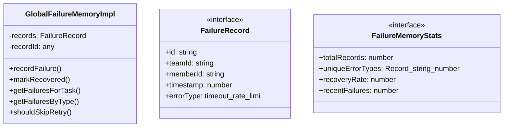

# failure-memory

## 概要

`failure-memory` モジュールのAPIリファレンス。

## エクスポート一覧

| 種別 | 名前 | 説明 |
|------|------|------|
| 関数 | `getGlobalFailureMemory` | グローバル失敗メモリを取得する |
| 関数 | `clearGlobalFailureMemory` | グローバル失敗メモリをクリアする |
| 関数 | `hashTask` | タスク文字列からハッシュを生成する |
| インターフェース | `FailureRecord` | 失敗レコード |
| インターフェース | `FailureMemoryStats` | 失敗メモリ統計情報 |
| 型 | `GlobalFailureMemory` | 型エクスポート |

## 図解

### クラス図



## 関数

### getGlobalFailureMemory

```typescript
getGlobalFailureMemory(): GlobalFailureMemoryImpl
```

グローバル失敗メモリを取得する

**戻り値**: `GlobalFailureMemoryImpl`

### clearGlobalFailureMemory

```typescript
clearGlobalFailureMemory(): void
```

グローバル失敗メモリをクリアする

**戻り値**: `void`

### hashTask

```typescript
hashTask(task: string): string
```

タスク文字列からハッシュを生成する

**パラメータ**

| 名前 | 型 | 必須 |
|------|-----|------|
| task | `string` | はい |

**戻り値**: `string`

## クラス

### GlobalFailureMemoryImpl

グローバル失敗メモリの実装クラス

**プロパティ**

| 名前 | 型 | 可視性 |
|------|-----|--------|
| records | `FailureRecord[]` | private |
| recordId | `any` | private |

**メソッド**

| 名前 | シグネチャ |
|------|------------|
| recordFailure | `recordFailure(teamId, memberId, error, taskSignature, retryAttempt): FailureRecord` |
| markRecovered | `markRecovered(recordId): void` |
| getFailuresForTask | `getFailuresForTask(taskSignature): FailureRecord[]` |
| getFailuresByType | `getFailuresByType(errorType): FailureRecord[]` |
| shouldSkipRetry | `shouldSkipRetry(taskSignature, errorType): boolean` |
| getStats | `getStats(): FailureMemoryStats` |
| clear | `clear(): void` |
| pruneOldRecords | `pruneOldRecords(): void` |
| classifyError | `classifyError(error): FailureRecord["errorType"]` |
| toErrorMessage | `toErrorMessage(error): string` |

## インターフェース

### FailureRecord

```typescript
interface FailureRecord {
  id: string;
  teamId: string;
  memberId: string;
  timestamp: number;
  errorType: "timeout" | "rate-limit" | "capacity" | "validation" | "unknown";
  errorMessage: string;
  taskSignature: string;
  retryAttempt: number;
  recovered: boolean;
}
```

失敗レコード

### FailureMemoryStats

```typescript
interface FailureMemoryStats {
  totalRecords: number;
  uniqueErrorTypes: Record<string, number>;
  recoveryRate: number;
  recentFailures: number;
}
```

失敗メモリ統計情報

## 型定義

### GlobalFailureMemory

```typescript
type GlobalFailureMemory = GlobalFailureMemoryImpl
```

型エクスポート

---
*自動生成: 2026-02-24T17:08:02.090Z*
