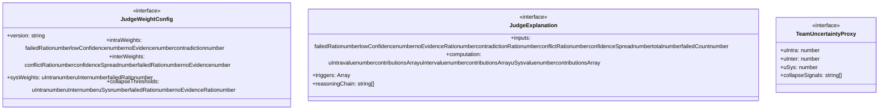
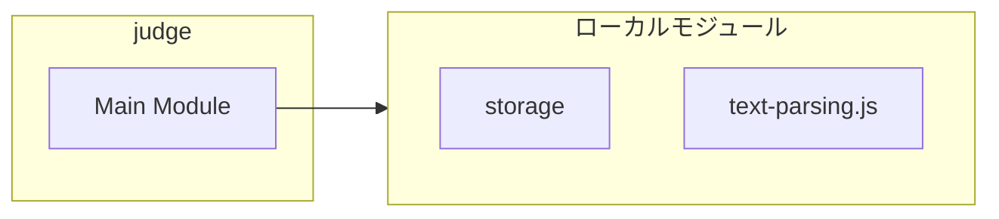
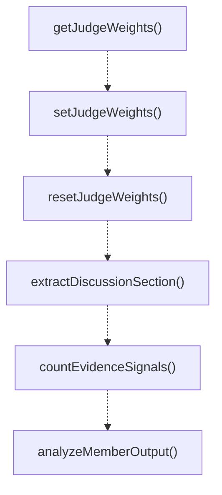
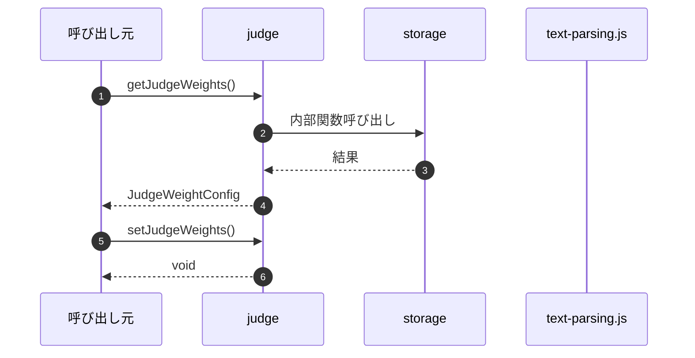

# judge

## 概要

`judge` モジュールのAPIリファレンス。

## インポート

```typescript
import { TeamDefinition, TeamFinalJudge, TeamMemberResult... } from './storage';
import { clampConfidence, parseUnitInterval, extractField... } from '../../lib/text-parsing.js';
```

## エクスポート一覧

| 種別 | 名前 | 説明 |
|------|------|------|
| 関数 | `getJudgeWeights` | Get the current judge weight configuration. |
| 関数 | `setJudgeWeights` | Set custom judge weights at runtime (primarily for |
| 関数 | `resetJudgeWeights` | Reset judge weights to defaults. |
| 関数 | `extractDiscussionSection` | Extract the DISCUSSION section from structured out |
| 関数 | `countEvidenceSignals` | Count evidence signals in the output. |
| 関数 | `analyzeMemberOutput` | Analyze a team member's output for quality signals |
| 関数 | `computeProxyUncertainty` | Compute uncertainty proxy from team member results |
| 関数 | `computeProxyUncertaintyWithExplainability` | Compute uncertainty proxy with detailed explanatio |
| 関数 | `formatJudgeExplanation` | Generate human-readable explanation of judge decis |
| 関数 | `buildFallbackJudge` | Build a fallback judge verdict when no LLM-based j |
| 関数 | `runFinalJudge` | Run the final judge process. |
| インターフェース | `JudgeWeightConfig` | Configuration for uncertainty weight parameters. |
| インターフェース | `JudgeExplanation` | Detailed explanation of judge decision factors. |
| インターフェース | `TeamUncertaintyProxy` | Uncertainty proxy computed from member results. |

## 図解

### クラス図



### 依存関係図



### 関数フロー



### シーケンス図



## 関数

### getJudgeWeights

```typescript
getJudgeWeights(): JudgeWeightConfig
```

Get the current judge weight configuration.
Can be overridden via PI_JUDGE_WEIGHTS_PATH environment variable.

MIGRATION COMPLETE: File-based configuration now supported (v2.0.0+)
Set PI_JUDGE_WEIGHTS_PATH to a JSON file path to use custom weights.

**戻り値**: `JudgeWeightConfig`

### setJudgeWeights

```typescript
setJudgeWeights(weights: JudgeWeightConfig): void
```

Set custom judge weights at runtime (primarily for testing).

**パラメータ**

| 名前 | 型 | 必須 |
|------|-----|------|
| weights | `JudgeWeightConfig` | はい |

**戻り値**: `void`

### resetJudgeWeights

```typescript
resetJudgeWeights(): void
```

Reset judge weights to defaults.

**戻り値**: `void`

### extractDiscussionSection

```typescript
extractDiscussionSection(output: string): string
```

Extract the DISCUSSION section from structured output.
Returns content between DISCUSSION: label and the next major label.

**パラメータ**

| 名前 | 型 | 必須 |
|------|-----|------|
| output | `string` | はい |

**戻り値**: `string`

### countEvidenceSignals

```typescript
countEvidenceSignals(output: string): number
```

Count evidence signals in the output.
Looks for EVIDENCE field items and file:line references.

**パラメータ**

| 名前 | 型 | 必須 |
|------|-----|------|
| output | `string` | はい |

**戻り値**: `number`

### analyzeMemberOutput

```typescript
analyzeMemberOutput(output: string): TeamMemberResult["diagnostics"]
```

Analyze a team member's output for quality signals.
Returns diagnostic metrics for uncertainty calculation.

**パラメータ**

| 名前 | 型 | 必須 |
|------|-----|------|
| output | `string` | はい |

**戻り値**: `TeamMemberResult["diagnostics"]`

### computeProxyUncertainty

```typescript
computeProxyUncertainty(memberResults: TeamMemberResult[]): TeamUncertaintyProxy
```

Compute uncertainty proxy from team member results.
Calculates intra-member, inter-member, and system-level uncertainty.

**パラメータ**

| 名前 | 型 | 必須 |
|------|-----|------|
| memberResults | `TeamMemberResult[]` | はい |

**戻り値**: `TeamUncertaintyProxy`

### computeProxyUncertaintyWithExplainability

```typescript
computeProxyUncertaintyWithExplainability(memberResults: TeamMemberResult[], weights: JudgeWeightConfig): { proxy: TeamUncertaintyProxy; explanation: JudgeExplanation }
```

Compute uncertainty proxy with detailed explanation.
Enhanced version that provides factor-by-factor breakdown.

**パラメータ**

| 名前 | 型 | 必須 |
|------|-----|------|
| memberResults | `TeamMemberResult[]` | はい |
| weights | `JudgeWeightConfig` | はい |

**戻り値**: `{ proxy: TeamUncertaintyProxy; explanation: JudgeExplanation }`

### formatJudgeExplanation

```typescript
formatJudgeExplanation(explanation: JudgeExplanation): string
```

Generate human-readable explanation of judge decision.

**パラメータ**

| 名前 | 型 | 必須 |
|------|-----|------|
| explanation | `JudgeExplanation` | はい |

**戻り値**: `string`

### buildFallbackJudge

```typescript
buildFallbackJudge(input: {
  memberResults: TeamMemberResult[];
  proxy?: TeamUncertaintyProxy;
  error?: string;
}): TeamFinalJudge
```

Build a fallback judge verdict when no LLM-based judgment is available.
Uses deterministic rules based on uncertainty proxy.

**パラメータ**

| 名前 | 型 | 必須 |
|------|-----|------|
| input | `{
  memberResults: TeamMemberResult[];
  proxy?: TeamUncertaintyProxy;
  error?: string;
}` | はい |

**戻り値**: `TeamFinalJudge`

### runFinalJudge

```typescript
async runFinalJudge(input: {
  team: TeamDefinition;
  task: string;
  strategy: TeamStrategy;
  memberResults: TeamMemberResult[];
  proxy: TeamUncertaintyProxy;
  timeoutMs: number;
  signal?: AbortSignal;
}): Promise<TeamFinalJudge>
```

Run the final judge process.
In stable profile mode, this uses deterministic fallback logic without LLM calls.

**パラメータ**

| 名前 | 型 | 必須 |
|------|-----|------|
| input | `{
  team: TeamDefinition;
  task: string;
  strategy: TeamStrategy;
  memberResults: TeamMemberResult[];
  proxy: TeamUncertaintyProxy;
  timeoutMs: number;
  signal?: AbortSignal;
}` | はい |

**戻り値**: `Promise<TeamFinalJudge>`

## インターフェース

### JudgeWeightConfig

```typescript
interface JudgeWeightConfig {
  version: string;
  intraWeights: {
    failedRatio: number;
    lowConfidence: number;
    noEvidence: number;
    contradiction: number;
  };
  interWeights: {
    conflictRatio: number;
    confidenceSpread: number;
    failedRatio: number;
    noEvidence: number;
  };
  sysWeights: {
    uIntra: number;
    uInter: number;
    failedRatio: number;
  };
  collapseThresholds: {
    uIntra: number;
    uInter: number;
    uSys: number;
    failedRatio: number;
    noEvidenceRatio: number;
  };
}
```

Configuration for uncertainty weight parameters.
These weights determine how different factors contribute to uncertainty.

### JudgeExplanation

```typescript
interface JudgeExplanation {
  inputs: {
    failedRatio: number;
    lowConfidence: number;
    noEvidenceRatio: number;
    contradictionRatio: number;
    conflictRatio: number;
    confidenceSpread: number;
    total: number;
    failedCount: number;
  };
  computation: {
    uIntra: {
      value: number;
      contributions: Array<{ factor: string; weight: number; value: number; contribution: number }>;
    };
    uInter: {
      value: number;
      contributions: Array<{ factor: string; weight: number; value: number; contribution: number }>;
    };
    uSys: {
      value: number;
      contributions: Array<{ factor: string; weight: number; value: number; contribution: number }>;
    };
  };
  triggers: Array<{
    signal: string;
    actualValue: number;
    threshold: number;
    triggered: boolean;
  }>;
  reasoningChain: string[];
}
```

Detailed explanation of judge decision factors.

### TeamUncertaintyProxy

```typescript
interface TeamUncertaintyProxy {
  uIntra: number;
  uInter: number;
  uSys: number;
  collapseSignals: string[];
}
```

Uncertainty proxy computed from member results.
Used to assess overall team output quality and reliability.

---
*自動生成: 2026-02-17T21:54:59.597Z*
