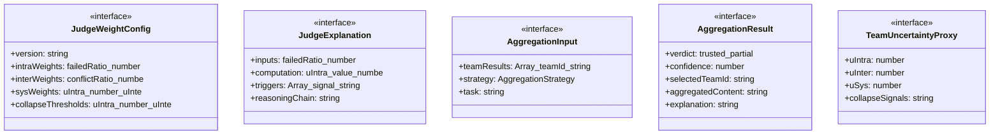
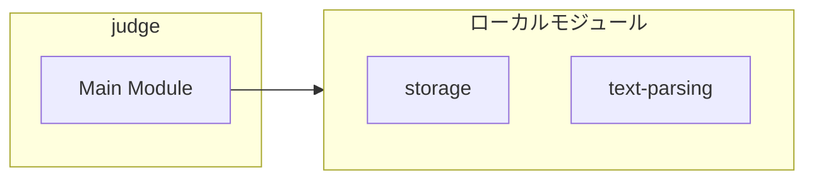
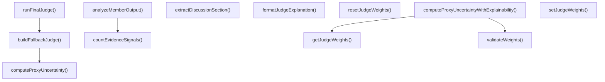
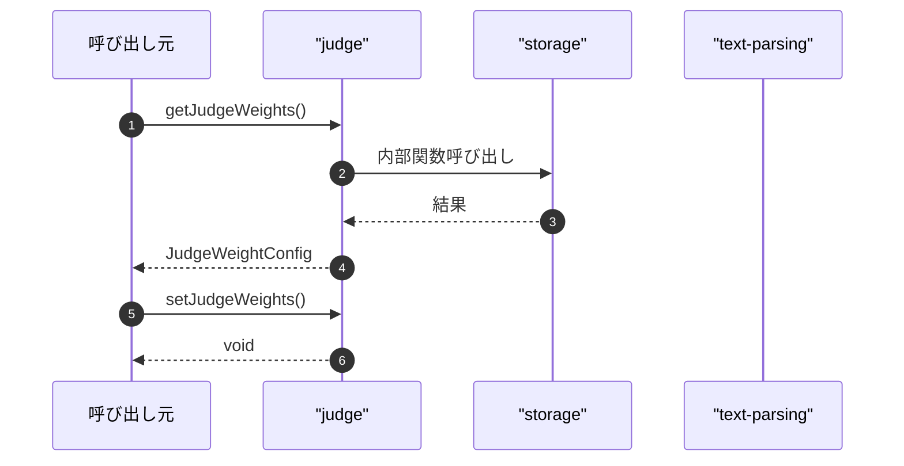

# judge

## 概要

`judge` モジュールのAPIリファレンス。

## インポート

```typescript
// from './storage': TeamDefinition, TeamFinalJudge, TeamMemberResult, ...
// from 'node:fs': existsSync, readFileSync
// from 'node:path': resolve, isAbsolute
// from '../../lib/text-parsing.js': clampConfidence, parseUnitInterval, extractField, ...
```

## エクスポート一覧

| 種別 | 名前 | 説明 |
|------|------|------|
| 関数 | `getJudgeWeights` | 重み設定を取得 |
| 関数 | `setJudgeWeights` | 重み設定を更新 |
| 関数 | `resetJudgeWeights` | 判定重みを初期化 |
| 関数 | `extractDiscussionSection` | 構造化出力からDISCUSSIONセクションを抽出 |
| 関数 | `countEvidenceSignals` | - |
| 関数 | `analyzeMemberOutput` | メンバー出力を解析 |
| 関数 | `computeProxyUncertainty` | 代理不確実性を計算 |
| 関数 | `computeProxyUncertaintyWithExplainability` | 不確実性と説明を計算 |
| 関数 | `formatJudgeExplanation` | 判定理由を整形 |
| 関数 | `buildFallbackJudge` | 代替判定を生成 |
| 関数 | `runFinalJudge` | 最終審査を実行 |
| インターフェース | `JudgeWeightConfig` | 審判の重み設定 |
| インターフェース | `JudgeExplanation` | 判定決定要因の詳細な説明 |
| インターフェース | `AggregationInput` | 集約関数への入力データ |
| インターフェース | `AggregationResult` | 集約関数の出力結果 |
| インターフェース | `TeamUncertaintyProxy` | チームの不確実性を表現 |
| 型 | `AggregationStrategy` | 並列チーム実行時の結果集約戦略 |

## 図解

### クラス図



### 依存関係図



### 関数フロー



### シーケンス図



## 関数

### getJudgeWeights

```typescript
getJudgeWeights(): JudgeWeightConfig
```

重み設定を取得

**戻り値**: `JudgeWeightConfig`

### setJudgeWeights

```typescript
setJudgeWeights(weights: JudgeWeightConfig): void
```

重み設定を更新

**パラメータ**

| 名前 | 型 | 必須 |
|------|-----|------|
| weights | `JudgeWeightConfig` | はい |

**戻り値**: `void`

### resetJudgeWeights

```typescript
resetJudgeWeights(): void
```

判定重みを初期化

**戻り値**: `void`

### extractDiscussionSection

```typescript
extractDiscussionSection(output: string): string
```

構造化出力からDISCUSSIONセクションを抽出

**パラメータ**

| 名前 | 型 | 必須 |
|------|-----|------|
| output | `string` | はい |

**戻り値**: `string`

### countEvidenceSignals

```typescript
countEvidenceSignals(output: string): number
```

**パラメータ**

| 名前 | 型 | 必須 |
|------|-----|------|
| output | `string` | はい |

**戻り値**: `number`

### analyzeMemberOutput

```typescript
analyzeMemberOutput(output: string): TeamMemberResult["diagnostics"]
```

メンバー出力を解析

**パラメータ**

| 名前 | 型 | 必須 |
|------|-----|------|
| output | `string` | はい |

**戻り値**: `TeamMemberResult["diagnostics"]`

### computeProxyUncertainty

```typescript
computeProxyUncertainty(memberResults: TeamMemberResult[]): TeamUncertaintyProxy
```

代理不確実性を計算

**パラメータ**

| 名前 | 型 | 必須 |
|------|-----|------|
| memberResults | `TeamMemberResult[]` | はい |

**戻り値**: `TeamUncertaintyProxy`

### validateWeights

```typescript
validateWeights(weights: JudgeWeightConfig): boolean
```

重み設定の妥当性を検証する

**パラメータ**

| 名前 | 型 | 必須 |
|------|-----|------|
| weights | `JudgeWeightConfig` | はい |

**戻り値**: `boolean`

### computeProxyUncertaintyWithExplainability

```typescript
computeProxyUncertaintyWithExplainability(memberResults: TeamMemberResult[], weights: JudgeWeightConfig): { proxy: TeamUncertaintyProxy; explanation: JudgeExplanation }
```

不確実性と説明を計算

**パラメータ**

| 名前 | 型 | 必須 |
|------|-----|------|
| memberResults | `TeamMemberResult[]` | はい |
| weights | `JudgeWeightConfig` | はい |

**戻り値**: `{ proxy: TeamUncertaintyProxy; explanation: JudgeExplanation }`

### formatJudgeExplanation

```typescript
formatJudgeExplanation(explanation: JudgeExplanation): string
```

判定理由を整形

**パラメータ**

| 名前 | 型 | 必須 |
|------|-----|------|
| explanation | `JudgeExplanation` | はい |

**戻り値**: `string`

### buildFallbackJudge

```typescript
buildFallbackJudge(input: {
  memberResults: TeamMemberResult[];
  proxy?: TeamUncertaintyProxy;
  error?: string;
}): TeamFinalJudge
```

代替判定を生成

**パラメータ**

| 名前 | 型 | 必須 |
|------|-----|------|
| input | `object` | はい |
| &nbsp;&nbsp;↳ memberResults | `TeamMemberResult[]` | はい |
| &nbsp;&nbsp;↳ proxy | `TeamUncertaintyProxy` | いいえ |
| &nbsp;&nbsp;↳ error | `string` | いいえ |

**戻り値**: `TeamFinalJudge`

### runFinalJudge

```typescript
async runFinalJudge(input: {
  team: TeamDefinition;
  task: string;
  strategy: TeamStrategy;
  memberResults: TeamMemberResult[];
  proxy: TeamUncertaintyProxy;
  timeoutMs: number;
  signal?: AbortSignal;
}): Promise<TeamFinalJudge>
```

最終審査を実行

**パラメータ**

| 名前 | 型 | 必須 |
|------|-----|------|
| input | `object` | はい |
| &nbsp;&nbsp;↳ team | `TeamDefinition` | はい |
| &nbsp;&nbsp;↳ task | `string` | はい |
| &nbsp;&nbsp;↳ strategy | `TeamStrategy` | はい |
| &nbsp;&nbsp;↳ memberResults | `TeamMemberResult[]` | はい |
| &nbsp;&nbsp;↳ proxy | `TeamUncertaintyProxy` | はい |
| &nbsp;&nbsp;↳ timeoutMs | `number` | はい |
| &nbsp;&nbsp;↳ signal | `AbortSignal` | いいえ |

**戻り値**: `Promise<TeamFinalJudge>`

## インターフェース

### JudgeWeightConfig

```typescript
interface JudgeWeightConfig {
  version: string;
  intraWeights: {
    failedRatio: number;
    lowConfidence: number;
    noEvidence: number;
    contradiction: number;
  };
  interWeights: {
    conflictRatio: number;
    confidenceSpread: number;
    failedRatio: number;
    noEvidence: number;
  };
  sysWeights: {
    uIntra: number;
    uInter: number;
    failedRatio: number;
  };
  collapseThresholds: {
    uIntra: number;
    uInter: number;
    uSys: number;
    failedRatio: number;
    noEvidenceRatio: number;
  };
}
```

審判の重み設定

### JudgeExplanation

```typescript
interface JudgeExplanation {
  inputs: {
    failedRatio: number;
    lowConfidence: number;
    noEvidenceRatio: number;
    contradictionRatio: number;
    conflictRatio: number;
    confidenceSpread: number;
    total: number;
    failedCount: number;
  };
  computation: {
    uIntra: {
      value: number;
      contributions: Array<{ factor: string; weight: number; value: number; contribution: number }>;
    };
    uInter: {
      value: number;
      contributions: Array<{ factor: string; weight: number; value: number; contribution: number }>;
    };
    uSys: {
      value: number;
      contributions: Array<{ factor: string; weight: number; value: number; contribution: number }>;
    };
  };
  triggers: Array<{
    signal: string;
    actualValue: number;
    threshold: number;
    triggered: boolean;
  }>;
  reasoningChain: string[];
}
```

判定決定要因の詳細な説明

### AggregationInput

```typescript
interface AggregationInput {
  teamResults: Array<{
    teamId: string;
    memberResults: TeamMemberResult[];
    finalJudge: TeamFinalJudge;
  }>;
  strategy: AggregationStrategy;
  task: string;
}
```

集約関数への入力データ

### AggregationResult

```typescript
interface AggregationResult {
  verdict: 'trusted' | 'partial' | 'untrusted';
  confidence: number;
  selectedTeamId?: string;
  aggregatedContent?: string;
  explanation: string;
}
```

集約関数の出力結果

### TeamUncertaintyProxy

```typescript
interface TeamUncertaintyProxy {
  uIntra: number;
  uInter: number;
  uSys: number;
  collapseSignals: string[];
}
```

チームの不確実性を表現

## 型定義

### AggregationStrategy

```typescript
type AggregationStrategy = | 'rule-based'      // 現在の動作（決定論的）
  | 'majority-vote'   // 最も多い評決が採用される
  | 'best-confidence' // 最高信頼度が採用される
  | 'llm-aggregate'
```

並列チーム実行時の結果集約戦略

---
*自動生成: 2026-02-24T17:08:02.094Z*
