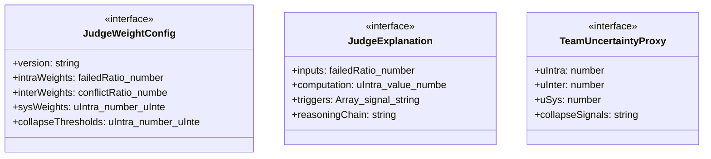
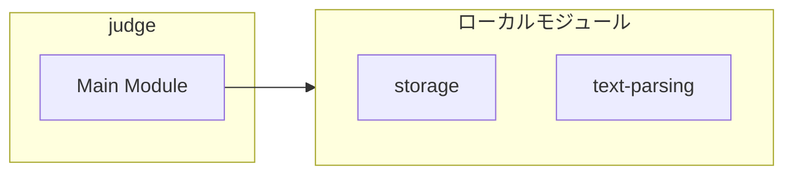
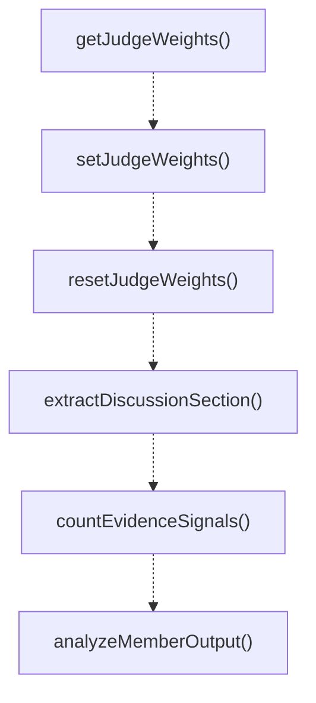
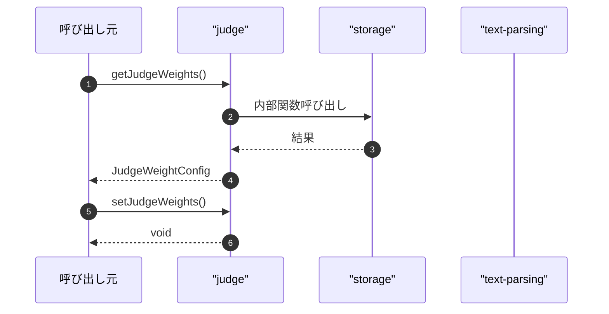

# judge

## 概要

`judge` モジュールのAPIリファレンス。

## インポート

```typescript
import { TeamDefinition, TeamFinalJudge, TeamMemberResult... } from './storage';
import { clampConfidence, parseUnitInterval, extractField... } from '../../lib/text-parsing.js';
```

## エクスポート一覧

| 種別 | 名前 | 説明 |
|------|------|------|
| 関数 | `getJudgeWeights` | 現在の判定重み設定を取得する |
| 関数 | `setJudgeWeights` | カスタムの判定重みを設定 |
| 関数 | `resetJudgeWeights` | 判定の重みをデフォルトに戻す |
| 関数 | `extractDiscussionSection` | 構造化出力からDISCUSSIONセクションを抽出 |
| 関数 | `countEvidenceSignals` | 出力内の証拠シグナルの数をカウントする |
| 関数 | `analyzeMemberOutput` | チームメンバーの出力を解析し、診断情報を返す |
| 関数 | `computeProxyUncertainty` | チームの不確実性プロキシを計算する |
| 関数 | `computeProxyUncertaintyWithExplainability` | 不確実性プロキシと説明を計算する |
| 関数 | `formatJudgeExplanation` | 判定の決定理由を人間が読める形式で整形する |
| 関数 | `buildFallbackJudge` | LLM判定がない場合の代替判定を生成する |
| 関数 | `runFinalJudge` | 最終判定プロセスを実行します |
| インターフェース | `JudgeWeightConfig` | 判定の重み付け設定 |
| インターフェース | `JudgeExplanation` | 判定決定要因の詳細な説明 |
| インターフェース | `TeamUncertaintyProxy` | メンバー結果から計算される不確実性プロキシ |

## 図解

### クラス図



### 依存関係図



### 関数フロー



### シーケンス図



## 関数

### getJudgeWeights

```typescript
getJudgeWeights(): JudgeWeightConfig
```

現在の判定重み設定を取得する

**戻り値**: `JudgeWeightConfig`

### setJudgeWeights

```typescript
setJudgeWeights(weights: JudgeWeightConfig): void
```

カスタムの判定重みを設定

**パラメータ**

| 名前 | 型 | 必須 |
|------|-----|------|
| weights | `JudgeWeightConfig` | はい |

**戻り値**: `void`

### resetJudgeWeights

```typescript
resetJudgeWeights(): void
```

判定の重みをデフォルトに戻す

**戻り値**: `void`

### extractDiscussionSection

```typescript
extractDiscussionSection(output: string): string
```

構造化出力からDISCUSSIONセクションを抽出

**パラメータ**

| 名前 | 型 | 必須 |
|------|-----|------|
| output | `string` | はい |

**戻り値**: `string`

### countEvidenceSignals

```typescript
countEvidenceSignals(output: string): number
```

出力内の証拠シグナルの数をカウントする

**パラメータ**

| 名前 | 型 | 必須 |
|------|-----|------|
| output | `string` | はい |

**戻り値**: `number`

### analyzeMemberOutput

```typescript
analyzeMemberOutput(output: string): TeamMemberResult["diagnostics"]
```

チームメンバーの出力を解析し、診断情報を返す

**パラメータ**

| 名前 | 型 | 必須 |
|------|-----|------|
| output | `string` | はい |

**戻り値**: `TeamMemberResult["diagnostics"]`

### computeProxyUncertainty

```typescript
computeProxyUncertainty(memberResults: TeamMemberResult[]): TeamUncertaintyProxy
```

チームの不確実性プロキシを計算する

**パラメータ**

| 名前 | 型 | 必須 |
|------|-----|------|
| memberResults | `TeamMemberResult[]` | はい |

**戻り値**: `TeamUncertaintyProxy`

### computeProxyUncertaintyWithExplainability

```typescript
computeProxyUncertaintyWithExplainability(memberResults: TeamMemberResult[], weights: JudgeWeightConfig): { proxy: TeamUncertaintyProxy; explanation: JudgeExplanation }
```

不確実性プロキシと説明を計算する

**パラメータ**

| 名前 | 型 | 必須 |
|------|-----|------|
| memberResults | `TeamMemberResult[]` | はい |
| weights | `JudgeWeightConfig` | はい |

**戻り値**: `{ proxy: TeamUncertaintyProxy; explanation: JudgeExplanation }`

### formatJudgeExplanation

```typescript
formatJudgeExplanation(explanation: JudgeExplanation): string
```

判定の決定理由を人間が読める形式で整形する

**パラメータ**

| 名前 | 型 | 必須 |
|------|-----|------|
| explanation | `JudgeExplanation` | はい |

**戻り値**: `string`

### buildFallbackJudge

```typescript
buildFallbackJudge(input: {
  memberResults: TeamMemberResult[];
  proxy?: TeamUncertaintyProxy;
  error?: string;
}): TeamFinalJudge
```

LLM判定がない場合の代替判定を生成する

**パラメータ**

| 名前 | 型 | 必須 |
|------|-----|------|
| input | `object` | はい |
| &nbsp;&nbsp;↳ memberResults | `TeamMemberResult[]` | はい |
| &nbsp;&nbsp;↳ proxy | `TeamUncertaintyProxy` | いいえ |
| &nbsp;&nbsp;↳ error | `string` | いいえ |

**戻り値**: `TeamFinalJudge`

### runFinalJudge

```typescript
async runFinalJudge(input: {
  team: TeamDefinition;
  task: string;
  strategy: TeamStrategy;
  memberResults: TeamMemberResult[];
  proxy: TeamUncertaintyProxy;
  timeoutMs: number;
  signal?: AbortSignal;
}): Promise<TeamFinalJudge>
```

最終判定プロセスを実行します

**パラメータ**

| 名前 | 型 | 必須 |
|------|-----|------|
| input | `object` | はい |
| &nbsp;&nbsp;↳ team | `TeamDefinition` | はい |
| &nbsp;&nbsp;↳ task | `string` | はい |
| &nbsp;&nbsp;↳ strategy | `TeamStrategy` | はい |
| &nbsp;&nbsp;↳ memberResults | `TeamMemberResult[]` | はい |
| &nbsp;&nbsp;↳ proxy | `TeamUncertaintyProxy` | はい |
| &nbsp;&nbsp;↳ timeoutMs | `number` | はい |
| &nbsp;&nbsp;↳ signal | `AbortSignal` | いいえ |

**戻り値**: `Promise<TeamFinalJudge>`

## インターフェース

### JudgeWeightConfig

```typescript
interface JudgeWeightConfig {
  version: string;
  intraWeights: {
    failedRatio: number;
    lowConfidence: number;
    noEvidence: number;
    contradiction: number;
  };
  interWeights: {
    conflictRatio: number;
    confidenceSpread: number;
    failedRatio: number;
    noEvidence: number;
  };
  sysWeights: {
    uIntra: number;
    uInter: number;
    failedRatio: number;
  };
  collapseThresholds: {
    uIntra: number;
    uInter: number;
    uSys: number;
    failedRatio: number;
    noEvidenceRatio: number;
  };
}
```

判定の重み付け設定

### JudgeExplanation

```typescript
interface JudgeExplanation {
  inputs: {
    failedRatio: number;
    lowConfidence: number;
    noEvidenceRatio: number;
    contradictionRatio: number;
    conflictRatio: number;
    confidenceSpread: number;
    total: number;
    failedCount: number;
  };
  computation: {
    uIntra: {
      value: number;
      contributions: Array<{ factor: string; weight: number; value: number; contribution: number }>;
    };
    uInter: {
      value: number;
      contributions: Array<{ factor: string; weight: number; value: number; contribution: number }>;
    };
    uSys: {
      value: number;
      contributions: Array<{ factor: string; weight: number; value: number; contribution: number }>;
    };
  };
  triggers: Array<{
    signal: string;
    actualValue: number;
    threshold: number;
    triggered: boolean;
  }>;
  reasoningChain: string[];
}
```

判定決定要因の詳細な説明

### TeamUncertaintyProxy

```typescript
interface TeamUncertaintyProxy {
  uIntra: number;
  uInter: number;
  uSys: number;
  collapseSignals: string[];
}
```

メンバー結果から計算される不確実性プロキシ

---
*自動生成: 2026-02-18T07:48:44.170Z*
