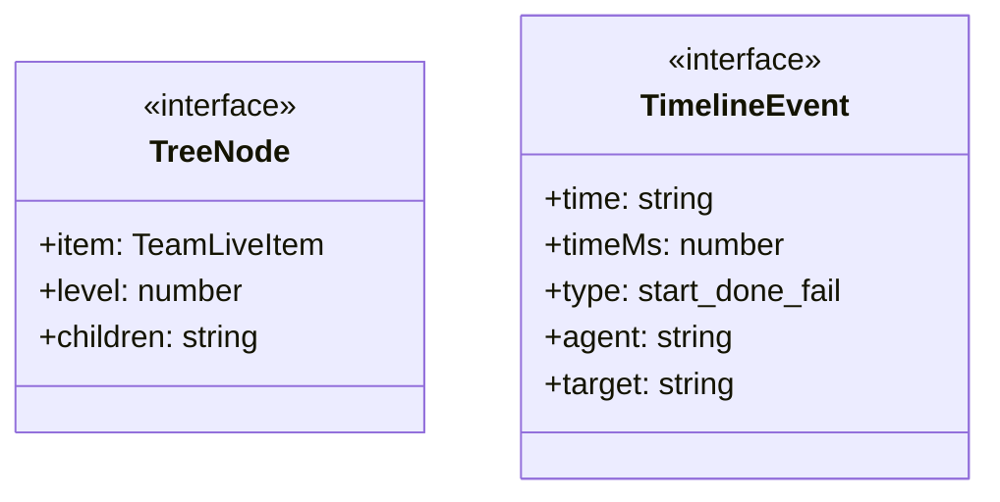
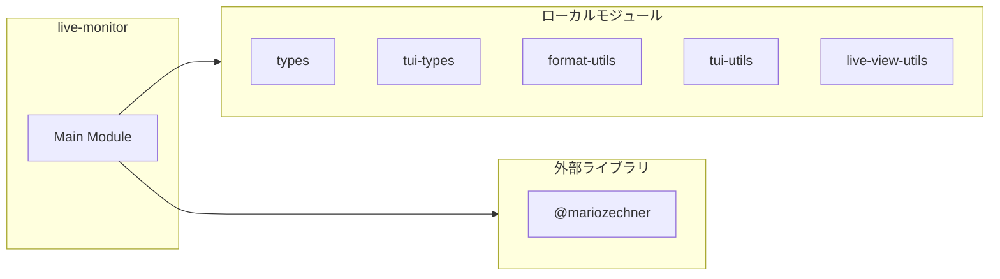
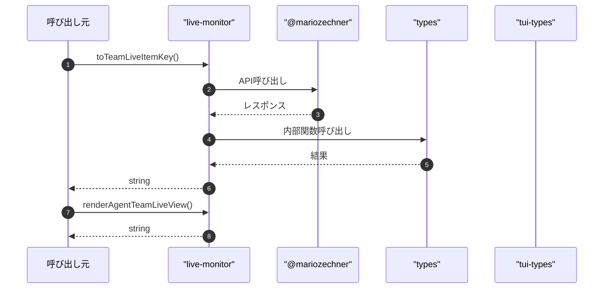

# live-monitor

## 概要

`live-monitor` モジュールのAPIリファレンス。

## インポート

```typescript
// from '@mariozechner/pi-tui': Key, matchesKey
// from '../../lib/tui/types.js': Theme
// from '../../lib/tui-types.js': TuiInstance, KeybindingMap, LiveMonitorContext
// from '../../lib/format-utils.js': formatDurationMs, formatBytes, formatClockTime, ...
// from '../../lib/tui/tui-utils.js': appendTail, countOccurrences, estimateLineCount, ...
// ... and 5 more imports
```

## エクスポート一覧

| 種別 | 名前 | 説明 |
|------|------|------|
| 関数 | `toTeamLiveItemKey` | チームIDとメンバーIDからキー生成 |
| 関数 | `renderAgentTeamLiveView` | ライブビューを描画 |
| 関数 | `createAgentTeamLiveMonitor` | ライブ監視を生成 |

## 図解

### クラス図



### 依存関係図



### 関数フロー

```mermaid
flowchart TD
  add["add()"]
  classifyActivityFromChunk["classifyActivityFromChunk()"]
  clearPollTimer["clearPollTimer()"]
  clearRenderTimer["clearRenderTimer()"]
  close["close()"]
  computeTreeLevels["computeTreeLevels()"]
  createAgentTeamLiveMonitor["createAgentTeamLiveMonitor()"]
  formatLivePhase["formatLivePhase()"]
  getActivitySpinner["getActivitySpinner()"]
  getLevel["getLevel()"]
  getTreePrefix["getTreePrefix()"]
  hasDynamicState["hasDynamicState()"]
  hasRunningItems["hasRunningItems()"]
  parseEventTimeLine["parseEventTimeLine()"]
  pushLiveEvent["pushLiveEvent()"]
  pushStateTransition["pushStateTransition()"]
  queueRender["queueRender()"]
  renderAgentTeamLiveView["renderAgentTeamLiveView()"]
  renderCommunicationEvents["renderCommunicationEvents()"]
  renderTimelineView["renderTimelineView()"]
  renderTreeView["renderTreeView()"]
  startPolling["startPolling()"]
  toEventTailLines["toEventTailLines()"]
  toTeamLiveItemKey["toTeamLiveItemKey()"]
  close --> clearPollTimer
  close --> clearRenderTimer
  computeTreeLevels --> add
  computeTreeLevels --> getLevel
  createAgentTeamLiveMonitor --> classifyActivityFromChunk
  createAgentTeamLiveMonitor --> clearPollTimer
  createAgentTeamLiveMonitor --> clearRenderTimer
  createAgentTeamLiveMonitor --> close
  createAgentTeamLiveMonitor --> formatLivePhase
  createAgentTeamLiveMonitor --> hasDynamicState
  createAgentTeamLiveMonitor --> hasRunningItems
  createAgentTeamLiveMonitor --> pushLiveEvent
  createAgentTeamLiveMonitor --> pushStateTransition
  createAgentTeamLiveMonitor --> queueRender
  createAgentTeamLiveMonitor --> renderAgentTeamLiveView
  createAgentTeamLiveMonitor --> startPolling
  hasDynamicState --> hasRunningItems
  renderAgentTeamLiveView --> add
  renderAgentTeamLiveView --> formatLivePhase
  renderAgentTeamLiveView --> renderCommunicationEvents
  renderAgentTeamLiveView --> renderTimelineView
  renderAgentTeamLiveView --> renderTreeView
  renderAgentTeamLiveView --> toEventTailLines
  renderCommunicationEvents --> add
  renderCommunicationEvents --> parseEventTimeLine
  renderTimelineView --> add
  renderTimelineView --> parseEventTimeLine
  renderTreeView --> add
  renderTreeView --> computeTreeLevels
  renderTreeView --> getActivitySpinner
  renderTreeView --> getTreePrefix
  startPolling --> clearPollTimer
  startPolling --> hasDynamicState
  startPolling --> queueRender
```



### シーケンス図



## 関数

### classifyActivityFromChunk

```typescript
classifyActivityFromChunk(chunk: string): NonNullable<StateTransition["activity"]>
```

**パラメータ**

| 名前 | 型 | 必須 |
|------|-----|------|
| chunk | `string` | はい |

**戻り値**: `NonNullable<StateTransition["activity"]>`

### pushStateTransition

```typescript
pushStateTransition(item: TeamLiveItem, state: StateTransition["state"], activity?: StateTransition["activity"]): void
```

**パラメータ**

| 名前 | 型 | 必須 |
|------|-----|------|
| item | `TeamLiveItem` | はい |
| state | `StateTransition["state"]` | はい |
| activity | `StateTransition["activity"]` | いいえ |

**戻り値**: `void`

### parseEventTimeLine

```typescript
parseEventTimeLine(eventLine: string): { time: string; timeMs: number; rest: string } | null
```

Parse "[hh:mm:ss] ..." style event lines.
Accepts h:mm:ss and hh:mm:ss(.SSS) and normalizes to hh:mm:ss.

**パラメータ**

| 名前 | 型 | 必須 |
|------|-----|------|
| eventLine | `string` | はい |

**戻り値**: `{ time: string; timeMs: number; rest: string } | null`

### computeTreeLevels

```typescript
computeTreeLevels(items: TeamLiveItem[]): Map<string, number>
```

アイテムのツリーレベルを計算

**パラメータ**

| 名前 | 型 | 必須 |
|------|-----|------|
| items | `TeamLiveItem[]` | はい |

**戻り値**: `Map<string, number>`

### getLevel

```typescript
getLevel(item: TeamLiveItem): number
```

**パラメータ**

| 名前 | 型 | 必須 |
|------|-----|------|
| item | `TeamLiveItem` | はい |

**戻り値**: `number`

### getTreePrefix

```typescript
getTreePrefix(level: number, isLast: boolean, parentContinues: boolean[]): string
```

ツリーラインのプレフィックスを生成

**パラメータ**

| 名前 | 型 | 必須 |
|------|-----|------|
| level | `number` | はい |
| isLast | `boolean` | はい |
| parentContinues | `boolean[]` | はい |

**戻り値**: `string`

### getActivitySpinner

```typescript
getActivitySpinner(isRunning: boolean): string
```

アクティビティスピナーを取得

**パラメータ**

| 名前 | 型 | 必須 |
|------|-----|------|
| isRunning | `boolean` | はい |

**戻り値**: `string`

### renderTreeView

```typescript
renderTreeView(items: TeamLiveItem[], cursor: number, width: number, theme: Theme): string[]
```

ツリービューを描画

**パラメータ**

| 名前 | 型 | 必須 |
|------|-----|------|
| items | `TeamLiveItem[]` | はい |
| cursor | `number` | はい |
| width | `number` | はい |
| theme | `Theme` | はい |

**戻り値**: `string[]`

### add

```typescript
add(line: any): void
```

**パラメータ**

| 名前 | 型 | 必須 |
|------|-----|------|
| line | `any` | はい |

**戻り値**: `void`

### renderCommunicationEvents

```typescript
renderCommunicationEvents(items: TeamLiveItem[], limit: number, width: number, theme: Theme): string[]
```

通信イベントを描画（連携可視化を含む）

**パラメータ**

| 名前 | 型 | 必須 |
|------|-----|------|
| items | `TeamLiveItem[]` | はい |
| limit | `number` | はい |
| width | `number` | はい |
| theme | `Theme` | はい |

**戻り値**: `string[]`

### add

```typescript
add(line: any): void
```

**パラメータ**

| 名前 | 型 | 必須 |
|------|-----|------|
| line | `any` | はい |

**戻り値**: `void`

### renderTimelineView

```typescript
renderTimelineView(items: TeamLiveItem[], globalEvents: string[], width: number, theme: Theme): string[]
```

タイムラインビューを描画

**パラメータ**

| 名前 | 型 | 必須 |
|------|-----|------|
| items | `TeamLiveItem[]` | はい |
| globalEvents | `string[]` | はい |
| width | `number` | はい |
| theme | `Theme` | はい |

**戻り値**: `string[]`

### add

```typescript
add(line: any): void
```

**パラメータ**

| 名前 | 型 | 必須 |
|------|-----|------|
| line | `any` | はい |

**戻り値**: `void`

### formatLivePhase

```typescript
formatLivePhase(phase: TeamLivePhase, round?: number): string
```

**パラメータ**

| 名前 | 型 | 必須 |
|------|-----|------|
| phase | `TeamLivePhase` | はい |
| round | `number` | いいえ |

**戻り値**: `string`

### pushLiveEvent

```typescript
pushLiveEvent(item: TeamLiveItem, rawEvent: string): void
```

**パラメータ**

| 名前 | 型 | 必須 |
|------|-----|------|
| item | `TeamLiveItem` | はい |
| rawEvent | `string` | はい |

**戻り値**: `void`

### toEventTailLines

```typescript
toEventTailLines(events: string[], limit: number): string[]
```

**パラメータ**

| 名前 | 型 | 必須 |
|------|-----|------|
| events | `string[]` | はい |
| limit | `number` | はい |

**戻り値**: `string[]`

### toTeamLiveItemKey

```typescript
toTeamLiveItemKey(teamId: string, memberId: string): string
```

チームIDとメンバーIDからキー生成

**パラメータ**

| 名前 | 型 | 必須 |
|------|-----|------|
| teamId | `string` | はい |
| memberId | `string` | はい |

**戻り値**: `string`

### renderAgentTeamLiveView

```typescript
renderAgentTeamLiveView(input: {
  title: string;
  items: TeamLiveItem[];
  globalEvents: string[];
  cursor: number;
  mode: TeamLiveViewMode;
  stream: LiveStreamView;
  width: number;
  height?: number;
  theme: Theme;
  /** 待機状態情報（オプション） */
  queueStatus?: {
    isWaiting: boolean;
    waitedMs?: number;
    queuePosition?: number;
    queuedAhead?: number;
    estimatedWaitMs?: number;
  };
}): string[]
```

ライブビューを描画

**パラメータ**

| 名前 | 型 | 必須 |
|------|-----|------|
| input | `object` | はい |
| &nbsp;&nbsp;↳ title | `string` | はい |
| &nbsp;&nbsp;↳ items | `TeamLiveItem[]` | はい |
| &nbsp;&nbsp;↳ globalEvents | `string[]` | はい |
| &nbsp;&nbsp;↳ cursor | `number` | はい |
| &nbsp;&nbsp;↳ mode | `TeamLiveViewMode` | はい |
| &nbsp;&nbsp;↳ stream | `LiveStreamView` | はい |
| &nbsp;&nbsp;↳ width | `number` | はい |
| &nbsp;&nbsp;↳ height | `number` | いいえ |
| &nbsp;&nbsp;↳ theme | `Theme` | はい |
| &nbsp;&nbsp;↳ queueStatus | `{    isWaiting: boolean;    waitedMs?: number;    queuePosition?: number;    queuedAhead?: number;    estimatedWaitMs?: number;  }` | いいえ |

**戻り値**: `string[]`

### add

```typescript
add(line: any): void
```

**パラメータ**

| 名前 | 型 | 必須 |
|------|-----|------|
| line | `any` | はい |

**戻り値**: `void`

### createAgentTeamLiveMonitor

```typescript
createAgentTeamLiveMonitor(ctx: LiveMonitorContext, input: {
    title: string;
    items: Array<{ key: string; label: string; partners?: string[] }>;
  }): AgentTeamLiveMonitorController | undefined
```

ライブ監視を生成

**パラメータ**

| 名前 | 型 | 必須 |
|------|-----|------|
| ctx | `LiveMonitorContext` | はい |
| input | `object` | はい |
| &nbsp;&nbsp;↳ title | `string` | はい |
| &nbsp;&nbsp;↳ items | `Array<{ key: string; label: string; partners?: string[] }>` | はい |

**戻り値**: `AgentTeamLiveMonitorController | undefined`

### clearRenderTimer

```typescript
clearRenderTimer(): void
```

**戻り値**: `void`

### clearPollTimer

```typescript
clearPollTimer(): void
```

**戻り値**: `void`

### hasRunningItems

```typescript
hasRunningItems(): boolean
```

実行中のアイテムがあるかチェック

**戻り値**: `boolean`

### hasDynamicState

```typescript
hasDynamicState(): boolean
```

動的更新が必要な状態かを判定する。
- 実行中メンバーがいる
- キュー待機中で待機表示を更新したい

**戻り値**: `boolean`

### startPolling

```typescript
startPolling(): void
```

定期ポーリングを開始（ストリーミングがない期間もUIを更新）

**戻り値**: `void`

### queueRender

```typescript
queueRender(): void
```

**戻り値**: `void`

### close

```typescript
close(): void
```

**戻り値**: `void`

## インターフェース

### TreeNode

```typescript
interface TreeNode {
  item: TeamLiveItem;
  level: number;
  children: string[];
}
```

### TimelineEvent

```typescript
interface TimelineEvent {
  time: string;
  timeMs: number;
  type: "start" | "done" | "fail" | "msg" | "event";
  agent: string;
  target?: string;
  content: string;
}
```

---
*自動生成: 2026-02-28T13:55:18.757Z*
