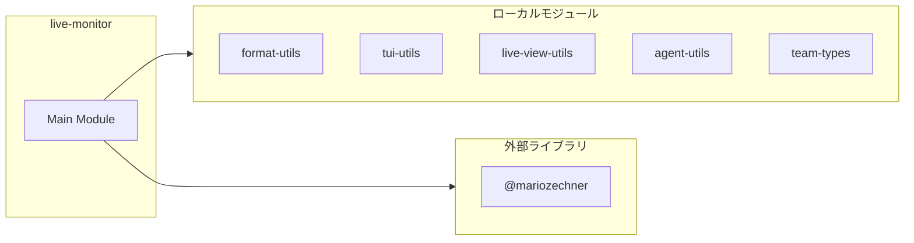
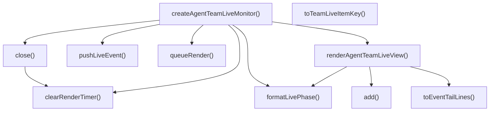
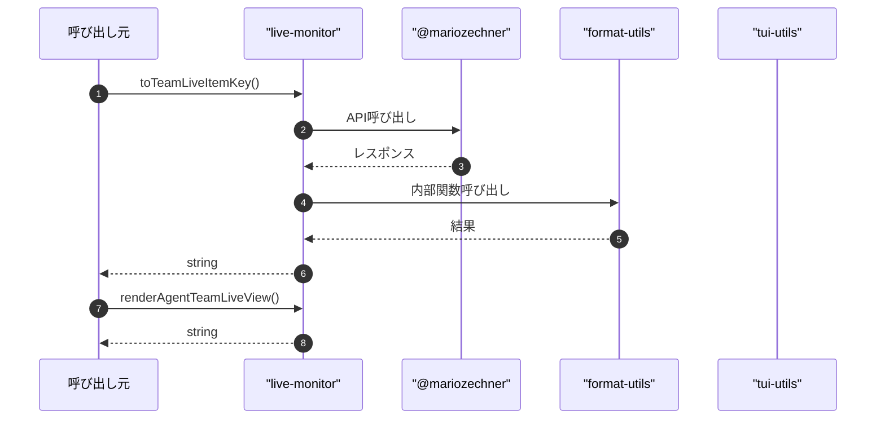

# live-monitor

## 概要

`live-monitor` モジュールのAPIリファレンス。

## インポート

```typescript
// from '@mariozechner/pi-tui': Key, matchesKey, truncateToWidth
// from '../../lib/format-utils.js': formatDurationMs, formatBytes, formatClockTime, ...
// from '../../lib/tui/tui-utils.js': appendTail, countOccurrences, estimateLineCount, ...
// from '../../lib/live-view-utils.js': toTailLines, looksLikeMarkdown, getLiveStatusGlyph, ...
// from '../../lib/agent-utils.js': computeLiveWindow
// ... and 1 more imports
```

## エクスポート一覧

| 種別 | 名前 | 説明 |
|------|------|------|
| 関数 | `toTeamLiveItemKey` | チームIDとメンバーIDからキー生成 |
| 関数 | `renderAgentTeamLiveView` | ライブビューを描画 |
| 関数 | `createAgentTeamLiveMonitor` | ライブ監視を生成 |

## 図解

### 依存関係図



### 関数フロー



### シーケンス図



## 関数

### formatLivePhase

```typescript
formatLivePhase(phase: TeamLivePhase, round?: number): string
```

**パラメータ**

| 名前 | 型 | 必須 |
|------|-----|------|
| phase | `TeamLivePhase` | はい |
| round | `number` | いいえ |

**戻り値**: `string`

### pushLiveEvent

```typescript
pushLiveEvent(item: TeamLiveItem, rawEvent: string): void
```

**パラメータ**

| 名前 | 型 | 必須 |
|------|-----|------|
| item | `TeamLiveItem` | はい |
| rawEvent | `string` | はい |

**戻り値**: `void`

### toEventTailLines

```typescript
toEventTailLines(events: string[], limit: number): string[]
```

**パラメータ**

| 名前 | 型 | 必須 |
|------|-----|------|
| events | `string[]` | はい |
| limit | `number` | はい |

**戻り値**: `string[]`

### toTeamLiveItemKey

```typescript
toTeamLiveItemKey(teamId: string, memberId: string): string
```

チームIDとメンバーIDからキー生成

**パラメータ**

| 名前 | 型 | 必須 |
|------|-----|------|
| teamId | `string` | はい |
| memberId | `string` | はい |

**戻り値**: `string`

### renderAgentTeamLiveView

```typescript
renderAgentTeamLiveView(input: {
  title: string;
  items: TeamLiveItem[];
  globalEvents: string[];
  cursor: number;
  mode: TeamLiveViewMode;
  stream: LiveStreamView;
  width: number;
  height?: number;
  theme: any;
}): string[]
```

ライブビューを描画

**パラメータ**

| 名前 | 型 | 必須 |
|------|-----|------|
| input | `object` | はい |
| &nbsp;&nbsp;↳ title | `string` | はい |
| &nbsp;&nbsp;↳ items | `TeamLiveItem[]` | はい |
| &nbsp;&nbsp;↳ globalEvents | `string[]` | はい |
| &nbsp;&nbsp;↳ cursor | `number` | はい |
| &nbsp;&nbsp;↳ mode | `TeamLiveViewMode` | はい |
| &nbsp;&nbsp;↳ stream | `LiveStreamView` | はい |
| &nbsp;&nbsp;↳ width | `number` | はい |
| &nbsp;&nbsp;↳ height | `number` | いいえ |
| &nbsp;&nbsp;↳ theme | `any` | はい |

**戻り値**: `string[]`

### add

```typescript
add(line: any): void
```

**パラメータ**

| 名前 | 型 | 必須 |
|------|-----|------|
| line | `any` | はい |

**戻り値**: `void`

### createAgentTeamLiveMonitor

```typescript
createAgentTeamLiveMonitor(ctx: any, input: {
    title: string;
    items: Array<{ key: string; label: string; partners?: string[] }>;
  }): AgentTeamLiveMonitorController | undefined
```

ライブ監視を生成

**パラメータ**

| 名前 | 型 | 必須 |
|------|-----|------|
| ctx | `any` | はい |
| input | `object` | はい |
| &nbsp;&nbsp;↳ title | `string` | はい |
| &nbsp;&nbsp;↳ items | `Array<{ key: string; label: string; partners?: string[] }>` | はい |

**戻り値**: `AgentTeamLiveMonitorController | undefined`

### clearRenderTimer

```typescript
clearRenderTimer(): void
```

**戻り値**: `void`

### queueRender

```typescript
queueRender(): void
```

**戻り値**: `void`

### close

```typescript
close(): void
```

**戻り値**: `void`

---
*自動生成: 2026-02-18T15:54:40.924Z*
