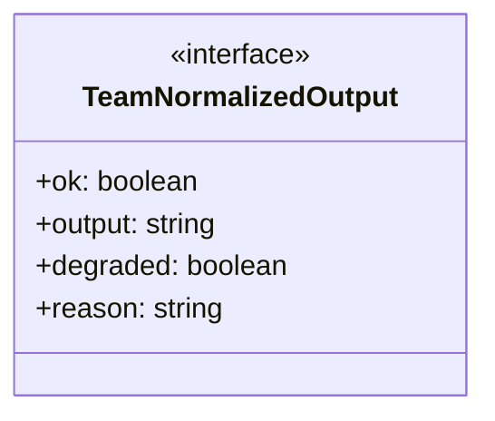
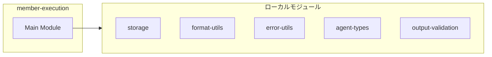
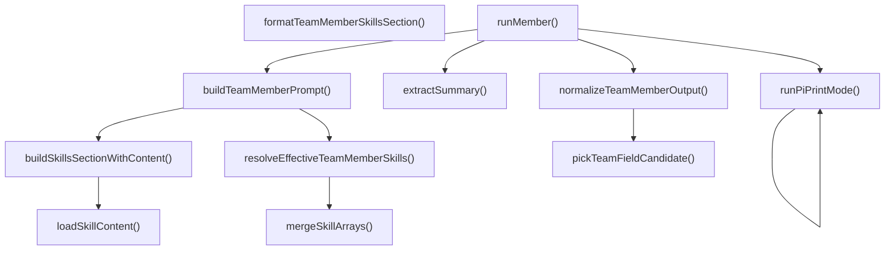
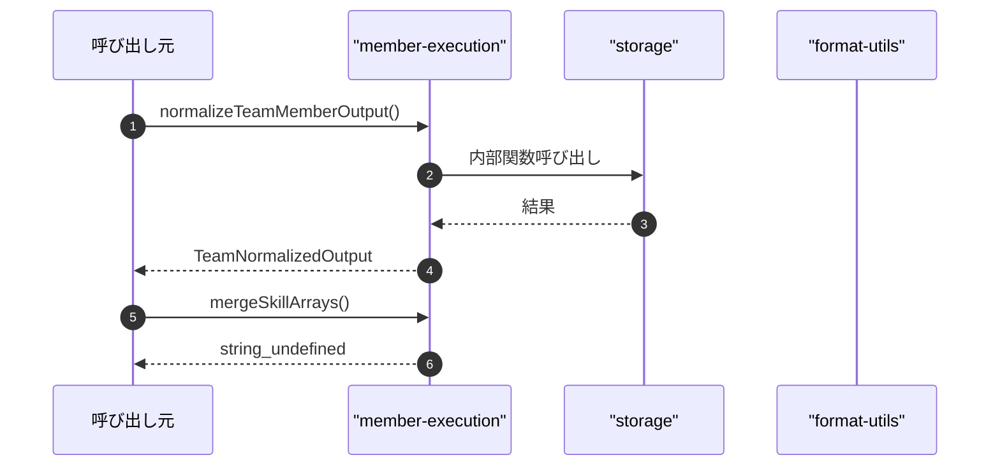

# member-execution

## 概要

`member-execution` モジュールのAPIリファレンス。

## インポート

```typescript
// from 'node:fs': existsSync, readFileSync
// from 'node:path': join
// from './storage': TeamDefinition, TeamMember, TeamMemberResult
// from '../../lib/format-utils.js': normalizeForSingleLine
// from '../../lib/error-utils.js': toErrorMessage
// ... and 6 more imports
```

## エクスポート一覧

| 種別 | 名前 | 説明 |
|------|------|------|
| 関数 | `normalizeTeamMemberOutput` | チームメンバー出力を正規化 |
| 関数 | `mergeSkillArrays` | スキル配列を継承ルールに従ってマージする。 |
| 関数 | `resolveEffectiveTeamMemberSkills` | チームメンバーの有効なスキルを解決する。 |
| 関数 | `formatTeamMemberSkillsSection` | スキルリストをプロンプト用に整形 |
| 関数 | `loadSkillContent` | スキル名からファイル内容を読込 |
| 関数 | `buildSkillsSectionWithContent` | スキル定義からコンテンツを生成 |
| 関数 | `buildTeamMemberPrompt` | チームメンバー用プロンプトを構築 |
| 関数 | `runMember` | メンバータスクを実行し結果を返却 |
| インターフェース | `TeamNormalizedOutput` | チーム実行結果の正規化出力 |

## 図解

### クラス図



### 依存関係図



### 関数フロー



### シーケンス図



## 関数

### pickTeamFieldCandidate

```typescript
pickTeamFieldCandidate(text: string, maxLength: number): string
```

Pick a candidate text for a field from unstructured output.
Note: Kept locally because the field format is team-member-specific.

**パラメータ**

| 名前 | 型 | 必須 |
|------|-----|------|
| text | `string` | はい |
| maxLength | `number` | はい |

**戻り値**: `string`

### normalizeTeamMemberOutput

```typescript
normalizeTeamMemberOutput(output: string): TeamNormalizedOutput
```

チームメンバー出力を正規化

**パラメータ**

| 名前 | 型 | 必須 |
|------|-----|------|
| output | `string` | はい |

**戻り値**: `TeamNormalizedOutput`

### mergeSkillArrays

```typescript
mergeSkillArrays(base: string[] | undefined, override: string[] | undefined): string[] | undefined
```

スキル配列を継承ルールに従ってマージする。

**パラメータ**

| 名前 | 型 | 必須 |
|------|-----|------|
| base | `string[] | undefined` | はい |
| override | `string[] | undefined` | はい |

**戻り値**: `string[] | undefined`

### resolveEffectiveTeamMemberSkills

```typescript
resolveEffectiveTeamMemberSkills(team: TeamDefinition, member: TeamMember): string[] | undefined
```

チームメンバーの有効なスキルを解決する。

**パラメータ**

| 名前 | 型 | 必須 |
|------|-----|------|
| team | `TeamDefinition` | はい |
| member | `TeamMember` | はい |

**戻り値**: `string[] | undefined`

### formatTeamMemberSkillsSection

```typescript
formatTeamMemberSkillsSection(skills: string[] | undefined): string | null
```

スキルリストをプロンプト用に整形

**パラメータ**

| 名前 | 型 | 必須 |
|------|-----|------|
| skills | `string[] | undefined` | はい |

**戻り値**: `string | null`

### loadSkillContent

```typescript
loadSkillContent(skillName: string): string | null
```

スキル名からファイル内容を読込

**パラメータ**

| 名前 | 型 | 必須 |
|------|-----|------|
| skillName | `string` | はい |

**戻り値**: `string | null`

### buildSkillsSectionWithContent

```typescript
buildSkillsSectionWithContent(skills: string[] | undefined): string | null
```

スキル定義からコンテンツを生成

**パラメータ**

| 名前 | 型 | 必須 |
|------|-----|------|
| skills | `string[] | undefined` | はい |

**戻り値**: `string | null`

### buildTeamMemberPrompt

```typescript
buildTeamMemberPrompt(input: {
  team: TeamDefinition;
  member: TeamMember;
  task: string;
  sharedContext?: string;
  phase?: "initial" | "communication";
  communicationContext?: string;
}): string
```

チームメンバー用プロンプトを構築

**パラメータ**

| 名前 | 型 | 必須 |
|------|-----|------|
| input | `object` | はい |
| &nbsp;&nbsp;↳ team | `TeamDefinition` | はい |
| &nbsp;&nbsp;↳ member | `TeamMember` | はい |
| &nbsp;&nbsp;↳ task | `string` | はい |
| &nbsp;&nbsp;↳ sharedContext | `string` | いいえ |
| &nbsp;&nbsp;↳ phase | `"initial" | "communication"` | いいえ |
| &nbsp;&nbsp;↳ communicationContext | `string` | いいえ |

**戻り値**: `string`

### runPiPrintMode

```typescript
async runPiPrintMode(input: {
  provider?: string;
  model?: string;
  prompt: string;
  timeoutMs: number;
  signal?: AbortSignal;
  onTextDelta?: (delta: string) => void;
  onStderrChunk?: (chunk: string) => void;
}): Promise<PrintCommandResult>
```

**パラメータ**

| 名前 | 型 | 必須 |
|------|-----|------|
| input | `object` | はい |
| &nbsp;&nbsp;↳ provider | `string` | いいえ |
| &nbsp;&nbsp;↳ model | `string` | いいえ |
| &nbsp;&nbsp;↳ prompt | `string` | はい |
| &nbsp;&nbsp;↳ timeoutMs | `number` | はい |
| &nbsp;&nbsp;↳ signal | `AbortSignal` | いいえ |
| &nbsp;&nbsp;↳ onTextDelta | `(delta: string) => void;  onStderrChunk?: (chunk: string) => void;` | いいえ |

**戻り値**: `Promise<PrintCommandResult>`

### runMember

```typescript
async runMember(input: {
  team: TeamDefinition;
  member: TeamMember;
  task: string;
  sharedContext?: string;
  phase?: "initial" | "communication";
  communicationContext?: string;
  timeoutMs: number;
  cwd: string;
  retryOverrides?: any;
  fallbackProvider?: string;
  fallbackModel?: string;
  signal?: AbortSignal;
  onStart?: (member: TeamMember) => void;
  onEnd?: (member: TeamMember) => void;
  onEvent?: (member: TeamMember, event: string) => void;
  onTextDelta?: (member: TeamMember, delta: string) => void;
  onStderrChunk?: (member: TeamMember, chunk: string) => void;
}): Promise<TeamMemberResult>
```

メンバータスクを実行し結果を返却

**パラメータ**

| 名前 | 型 | 必須 |
|------|-----|------|
| input | `object` | はい |
| &nbsp;&nbsp;↳ team | `TeamDefinition` | はい |
| &nbsp;&nbsp;↳ member | `TeamMember` | はい |
| &nbsp;&nbsp;↳ task | `string` | はい |
| &nbsp;&nbsp;↳ sharedContext | `string` | いいえ |
| &nbsp;&nbsp;↳ phase | `"initial" | "communication"` | いいえ |
| &nbsp;&nbsp;↳ communicationContext | `string` | いいえ |
| &nbsp;&nbsp;↳ timeoutMs | `number` | はい |
| &nbsp;&nbsp;↳ cwd | `string` | はい |
| &nbsp;&nbsp;↳ retryOverrides | `any` | いいえ |
| &nbsp;&nbsp;↳ fallbackProvider | `string` | いいえ |
| &nbsp;&nbsp;↳ fallbackModel | `string` | いいえ |
| &nbsp;&nbsp;↳ signal | `AbortSignal` | いいえ |
| &nbsp;&nbsp;↳ onStart | `(member: TeamMember) => void;  onEnd?: (member: TeamMember) => void;  onEvent?: (member: TeamMember, event: string) => void;  onTextDelta?: (member: TeamMember, delta: string) => void;  onStderrChunk?: (member: TeamMember, chunk: string) => void;` | いいえ |

**戻り値**: `Promise<TeamMemberResult>`

### extractSummary

```typescript
extractSummary(output: string): string
```

**パラメータ**

| 名前 | 型 | 必須 |
|------|-----|------|
| output | `string` | はい |

**戻り値**: `string`

## インターフェース

### TeamNormalizedOutput

```typescript
interface TeamNormalizedOutput {
  ok: boolean;
  output: string;
  degraded: boolean;
  reason?: string;
}
```

チーム実行結果の正規化出力

---
*自動生成: 2026-02-18T18:06:17.008Z*
