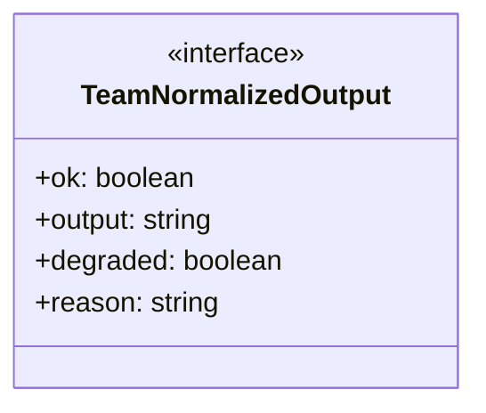
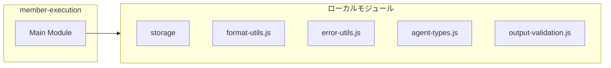
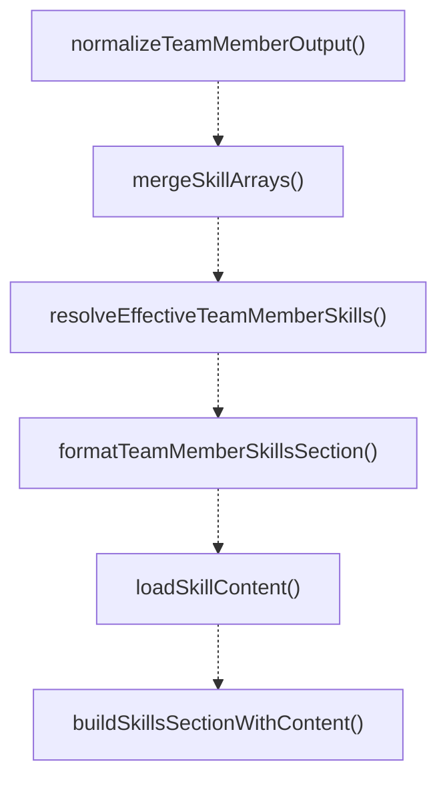
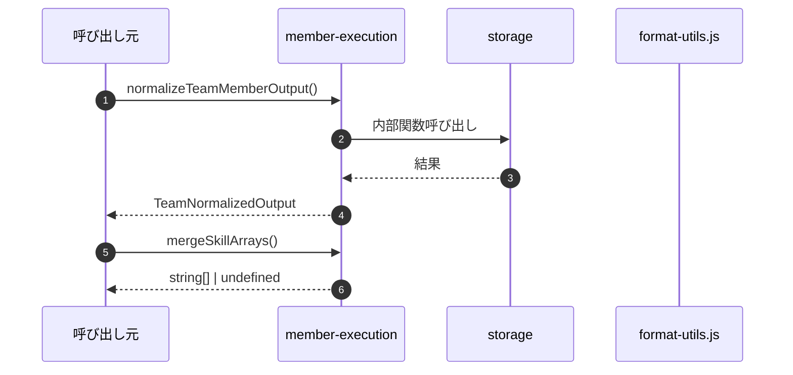

# member-execution

## 概要

`member-execution` モジュールのAPIリファレンス。

## インポート

```typescript
import { existsSync, readFileSync } from 'node:fs';
import { join } from 'node:path';
import { TeamDefinition, TeamMember, TeamMemberResult } from './storage';
import { normalizeForSingleLine } from '../../lib/format-utils.js';
import { toErrorMessage } from '../../lib/error-utils.js';
// ... and 6 more imports
```

## エクスポート一覧

| 種別 | 名前 | 説明 |
|------|------|------|
| 関数 | `normalizeTeamMemberOutput` | Normalize team member output to required format. |
| 関数 | `mergeSkillArrays` | Merge skill arrays following inheritance rules. |
| 関数 | `resolveEffectiveTeamMemberSkills` | Resolve effective skills for a team member. |
| 関数 | `formatTeamMemberSkillsSection` | Format skill list for prompt inclusion (Japanese). |
| 関数 | `loadSkillContent` | Load skill content from SKILL.md file. |
| 関数 | `buildSkillsSectionWithContent` | Build skills section with content for prompt inclu |
| 関数 | `buildTeamMemberPrompt` | - |
| 関数 | `runMember` | - |
| インターフェース | `TeamNormalizedOutput` | - |

## 図解

### クラス図



### 依存関係図



### 関数フロー



### シーケンス図



## 関数

### pickTeamFieldCandidate

```typescript
pickTeamFieldCandidate(text: string, maxLength: number): string
```

Pick a candidate text for a field from unstructured output.
Note: Kept locally because the field format is team-member-specific.

**パラメータ**

| 名前 | 型 | 必須 |
|------|-----|------|
| text | `string` | はい |
| maxLength | `number` | はい |

**戻り値**: `string`

### normalizeTeamMemberOutput

```typescript
normalizeTeamMemberOutput(output: string): TeamNormalizedOutput
```

Normalize team member output to required format.
Note: Kept locally (not in lib) because:
- Uses team-member-specific SUMMARY/CLAIM/EVIDENCE/CONFIDENCE/RESULT/NEXT_STEP format
- Has team-member-specific fallback messages (Japanese)
- Uses pickTeamFieldCandidate which is team-member-specific
Subagent output has different requirements (only SUMMARY/RESULT/NEXT_STEP).

**パラメータ**

| 名前 | 型 | 必須 |
|------|-----|------|
| output | `string` | はい |

**戻り値**: `TeamNormalizedOutput`

### mergeSkillArrays

```typescript
mergeSkillArrays(base: string[] | undefined, override: string[] | undefined): string[] | undefined
```

Merge skill arrays following inheritance rules.
- Empty array [] is treated as unspecified (ignored)
- Non-empty arrays are merged with deduplication

**パラメータ**

| 名前 | 型 | 必須 |
|------|-----|------|
| base | `string[] | undefined` | はい |
| override | `string[] | undefined` | はい |

**戻り値**: `string[] | undefined`

### resolveEffectiveTeamMemberSkills

```typescript
resolveEffectiveTeamMemberSkills(team: TeamDefinition, member: TeamMember): string[] | undefined
```

Resolve effective skills for a team member.
Inheritance: teamSkills (common) -> memberSkills (individual)

**パラメータ**

| 名前 | 型 | 必須 |
|------|-----|------|
| team | `TeamDefinition` | はい |
| member | `TeamMember` | はい |

**戻り値**: `string[] | undefined`

### formatTeamMemberSkillsSection

```typescript
formatTeamMemberSkillsSection(skills: string[] | undefined): string | null
```

Format skill list for prompt inclusion (Japanese).

**パラメータ**

| 名前 | 型 | 必須 |
|------|-----|------|
| skills | `string[] | undefined` | はい |

**戻り値**: `string | null`

### loadSkillContent

```typescript
loadSkillContent(skillName: string): string | null
```

Load skill content from SKILL.md file.
Searches in team-specific path first, then global path.
Returns null if skill not found.

**パラメータ**

| 名前 | 型 | 必須 |
|------|-----|------|
| skillName | `string` | はい |

**戻り値**: `string | null`

### buildSkillsSectionWithContent

```typescript
buildSkillsSectionWithContent(skills: string[] | undefined): string | null
```

Build skills section with content for prompt inclusion.
Only includes skills that are explicitly assigned to the team/member.
Falls back to skill names only if content cannot be loaded.

**パラメータ**

| 名前 | 型 | 必須 |
|------|-----|------|
| skills | `string[] | undefined` | はい |

**戻り値**: `string | null`

### buildTeamMemberPrompt

```typescript
buildTeamMemberPrompt(input: {
  team: TeamDefinition;
  member: TeamMember;
  task: string;
  sharedContext?: string;
  phase?: "initial" | "communication";
  communicationContext?: string;
}): string
```

**パラメータ**

| 名前 | 型 | 必須 |
|------|-----|------|
| input | `{
  team: TeamDefinition;
  member: TeamMember;
  task: string;
  sharedContext?: string;
  phase?: "initial" | "communication";
  communicationContext?: string;
}` | はい |

**戻り値**: `string`

### runPiPrintMode

```typescript
async runPiPrintMode(input: {
  provider?: string;
  model?: string;
  prompt: string;
  timeoutMs: number;
  signal?: AbortSignal;
  onTextDelta?: (delta: string) => void;
  onStderrChunk?: (chunk: string) => void;
}): Promise<PrintCommandResult>
```

**パラメータ**

| 名前 | 型 | 必須 |
|------|-----|------|
| input | `{
  provider?: string;
  model?: string;
  prompt: string;
  timeoutMs: number;
  signal?: AbortSignal;
  onTextDelta?: (delta: string) => void;
  onStderrChunk?: (chunk: string) => void;
}` | はい |

**戻り値**: `Promise<PrintCommandResult>`

### runMember

```typescript
async runMember(input: {
  team: TeamDefinition;
  member: TeamMember;
  task: string;
  sharedContext?: string;
  phase?: "initial" | "communication";
  communicationContext?: string;
  timeoutMs: number;
  cwd: string;
  retryOverrides?: any;
  fallbackProvider?: string;
  fallbackModel?: string;
  signal?: AbortSignal;
  onStart?: (member: TeamMember) => void;
  onEnd?: (member: TeamMember) => void;
  onEvent?: (member: TeamMember, event: string) => void;
  onTextDelta?: (member: TeamMember, delta: string) => void;
  onStderrChunk?: (member: TeamMember, chunk: string) => void;
}): Promise<TeamMemberResult>
```

**パラメータ**

| 名前 | 型 | 必須 |
|------|-----|------|
| input | `{
  team: TeamDefinition;
  member: TeamMember;
  task: string;
  sharedContext?: string;
  phase?: "initial" | "communication";
  communicationContext?: string;
  timeoutMs: number;
  cwd: string;
  retryOverrides?: any;
  fallbackProvider?: string;
  fallbackModel?: string;
  signal?: AbortSignal;
  onStart?: (member: TeamMember) => void;
  onEnd?: (member: TeamMember) => void;
  onEvent?: (member: TeamMember, event: string) => void;
  onTextDelta?: (member: TeamMember, delta: string) => void;
  onStderrChunk?: (member: TeamMember, chunk: string) => void;
}` | はい |

**戻り値**: `Promise<TeamMemberResult>`

### extractSummary

```typescript
extractSummary(output: string): string
```

**パラメータ**

| 名前 | 型 | 必須 |
|------|-----|------|
| output | `string` | はい |

**戻り値**: `string`

## インターフェース

### TeamNormalizedOutput

```typescript
interface TeamNormalizedOutput {
  ok: boolean;
  output: string;
  degraded: boolean;
  reason?: string;
}
```

---
*自動生成: 2026-02-17T21:54:59.606Z*
