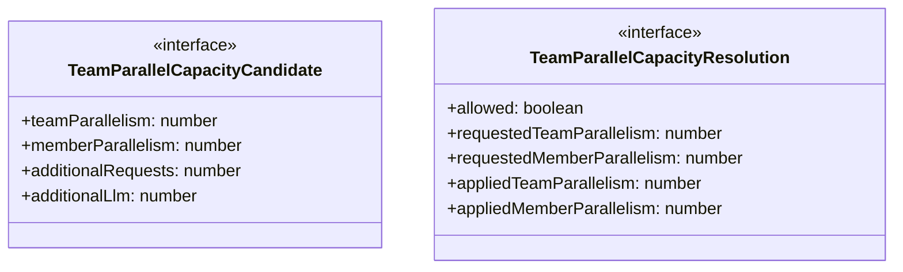
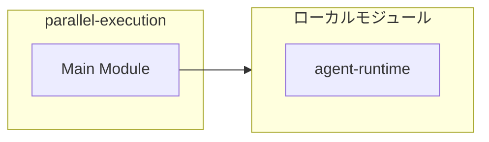
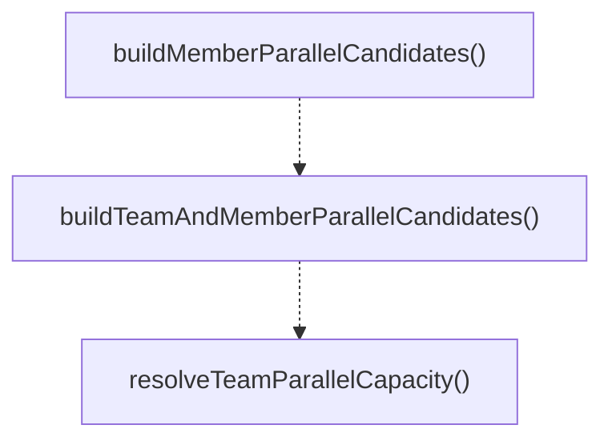
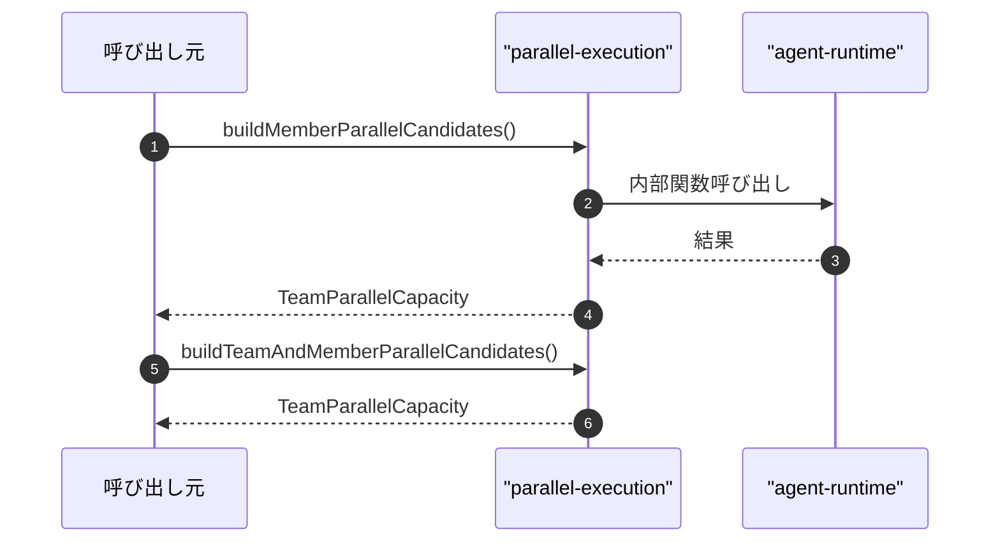

# parallel-execution

## 概要

`parallel-execution` モジュールのAPIリファレンス。

## インポート

```typescript
import { reserveRuntimeCapacity, tryReserveRuntimeCapacity, RuntimeCapacityReservationLease } from '../agent-runtime';
```

## エクスポート一覧

| 種別 | 名前 | 説明 |
|------|------|------|
| 関数 | `buildMemberParallelCandidates` | メンバーの並列度に基づいて候補を生成する |
| 関数 | `buildTeamAndMemberParallelCandidates` | チームとメンバーの並列実行候補を生成 |
| 関数 | `resolveTeamParallelCapacity` | チームの並列容量を解決する |
| インターフェース | `TeamParallelCapacityCandidate` | チーム並列実行容量の候補 |
| インターフェース | `TeamParallelCapacityResolution` | チーム並列実行の解決結果を表すインターフェース |

## 図解

### クラス図



### 依存関係図



### 関数フロー



### シーケンス図



## 関数

### buildMemberParallelCandidates

```typescript
buildMemberParallelCandidates(memberParallelism: number): TeamParallelCapacityCandidate[]
```

メンバーの並列度に基づいて候補を生成する

**パラメータ**

| 名前 | 型 | 必須 |
|------|-----|------|
| memberParallelism | `number` | はい |

**戻り値**: `TeamParallelCapacityCandidate[]`

### buildTeamAndMemberParallelCandidates

```typescript
buildTeamAndMemberParallelCandidates(teamParallelism: number, memberParallelism: number): TeamParallelCapacityCandidate[]
```

チームとメンバーの並列実行候補を生成

**パラメータ**

| 名前 | 型 | 必須 |
|------|-----|------|
| teamParallelism | `number` | はい |
| memberParallelism | `number` | はい |

**戻り値**: `TeamParallelCapacityCandidate[]`

### resolveTeamParallelCapacity

```typescript
async resolveTeamParallelCapacity(input: {
  requestedTeamParallelism: number;
  requestedMemberParallelism: number;
  candidates: TeamParallelCapacityCandidate[];
  toolName?: string;
  maxWaitMs: number;
  pollIntervalMs: number;
  signal?: AbortSignal;
}): Promise<TeamParallelCapacityResolution>
```

チームの並列容量を解決する

**パラメータ**

| 名前 | 型 | 必須 |
|------|-----|------|
| input | `object` | はい |
| &nbsp;&nbsp;↳ requestedTeamParallelism | `number` | はい |
| &nbsp;&nbsp;↳ requestedMemberParallelism | `number` | はい |
| &nbsp;&nbsp;↳ candidates | `TeamParallelCapacityCandidate[]` | はい |
| &nbsp;&nbsp;↳ toolName | `string` | いいえ |
| &nbsp;&nbsp;↳ maxWaitMs | `number` | はい |
| &nbsp;&nbsp;↳ pollIntervalMs | `number` | はい |
| &nbsp;&nbsp;↳ signal | `AbortSignal` | いいえ |

**戻り値**: `Promise<TeamParallelCapacityResolution>`

## インターフェース

### TeamParallelCapacityCandidate

```typescript
interface TeamParallelCapacityCandidate {
  teamParallelism: number;
  memberParallelism: number;
  additionalRequests: number;
  additionalLlm: number;
}
```

チーム並列実行容量の候補

### TeamParallelCapacityResolution

```typescript
interface TeamParallelCapacityResolution {
  allowed: boolean;
  requestedTeamParallelism: number;
  requestedMemberParallelism: number;
  appliedTeamParallelism: number;
  appliedMemberParallelism: number;
  reduced: boolean;
  reasons: string[];
  waitedMs: number;
  timedOut: boolean;
  aborted: boolean;
  attempts: number;
  projectedRequests: number;
  projectedLlm: number;
  reservation?: RuntimeCapacityReservationLease;
}
```

チーム並列実行の解決結果を表すインターフェース

---
*自動生成: 2026-02-18T07:17:30.145Z*
