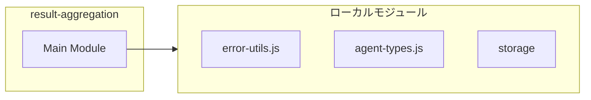
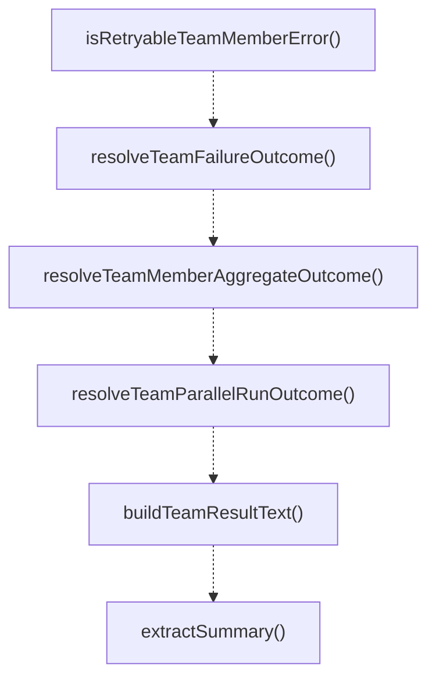

# result-aggregation

## 概要

`result-aggregation` モジュールのAPIリファレンス。

## インポート

```typescript
import { toErrorMessage, extractStatusCodeFromMessage, classifyPressureError... } from '../../lib/error-utils.js';
import { RunOutcomeCode, RunOutcomeSignal } from '../../lib/agent-types.js';
import { TeamMemberResult, TeamRunRecord, TeamDefinition... } from './storage';
```

## エクスポート一覧

| 種別 | 名前 | 説明 |
|------|------|------|
| 関数 | `isRetryableTeamMemberError` | - |
| 関数 | `resolveTeamFailureOutcome` | - |
| 関数 | `resolveTeamMemberAggregateOutcome` | - |
| 関数 | `resolveTeamParallelRunOutcome` | - |
| 関数 | `buildTeamResultText` | - |
| 関数 | `extractSummary` | - |

## 図解

### 依存関係図



### 関数フロー



## 関数

### isRetryableTeamMemberError

```typescript
isRetryableTeamMemberError(error: unknown, statusCode?: number): boolean
```

**パラメータ**

| 名前 | 型 | 必須 |
|------|-----|------|
| error | `unknown` | はい |
| statusCode | `number` | いいえ |

**戻り値**: `boolean`

### resolveTeamFailureOutcome

```typescript
resolveTeamFailureOutcome(error: unknown): RunOutcomeSignal
```

**パラメータ**

| 名前 | 型 | 必須 |
|------|-----|------|
| error | `unknown` | はい |

**戻り値**: `RunOutcomeSignal`

### resolveTeamMemberAggregateOutcome

```typescript
resolveTeamMemberAggregateOutcome(memberResults: TeamMemberResult[]): RunOutcomeSignal & {
  failedMemberIds: string[];
}
```

**パラメータ**

| 名前 | 型 | 必須 |
|------|-----|------|
| memberResults | `TeamMemberResult[]` | はい |

**戻り値**: `RunOutcomeSignal & {
  failedMemberIds: string[];
}`

### resolveTeamParallelRunOutcome

```typescript
resolveTeamParallelRunOutcome(results: Array<{
    team: TeamDefinition;
    runRecord: TeamRunRecord;
    memberResults: TeamMemberResult[];
  }>): RunOutcomeSignal & {
  failedTeamIds: string[];
  partialTeamIds: string[];
  failedMemberIdsByTeam: Record<string, string[]>;
}
```

**パラメータ**

| 名前 | 型 | 必須 |
|------|-----|------|
| results | `Array<{
    team: TeamDefinition;
    runRecord: TeamRunRecord;
    memberResults: TeamMemberResult[];
  }>` | はい |

**戻り値**: `RunOutcomeSignal & {
  failedTeamIds: string[];
  partialTeamIds: string[];
  failedMemberIdsByTeam: Record<string, string[]>;
}`

### buildTeamResultText

```typescript
buildTeamResultText(input: {
  run: TeamRunRecord;
  team: TeamDefinition;
  memberResults: TeamMemberResult[];
  communicationAudit?: TeamCommunicationAuditEntry[];
}): string
```

**パラメータ**

| 名前 | 型 | 必須 |
|------|-----|------|
| input | `{
  run: TeamRunRecord;
  team: TeamDefinition;
  memberResults: TeamMemberResult[];
  communicationAudit?: TeamCommunicationAuditEntry[];
}` | はい |

**戻り値**: `string`

### extractSummary

```typescript
extractSummary(output: string): string
```

**パラメータ**

| 名前 | 型 | 必須 |
|------|-----|------|
| output | `string` | はい |

**戻り値**: `string`

---
*自動生成: 2026-02-17T21:48:27.467Z*
