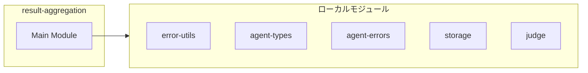
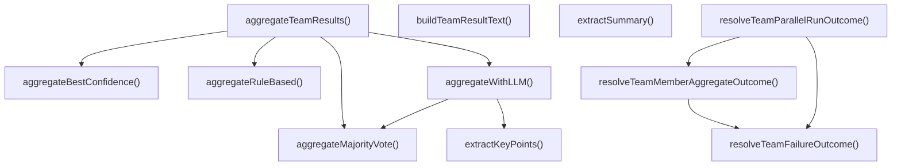
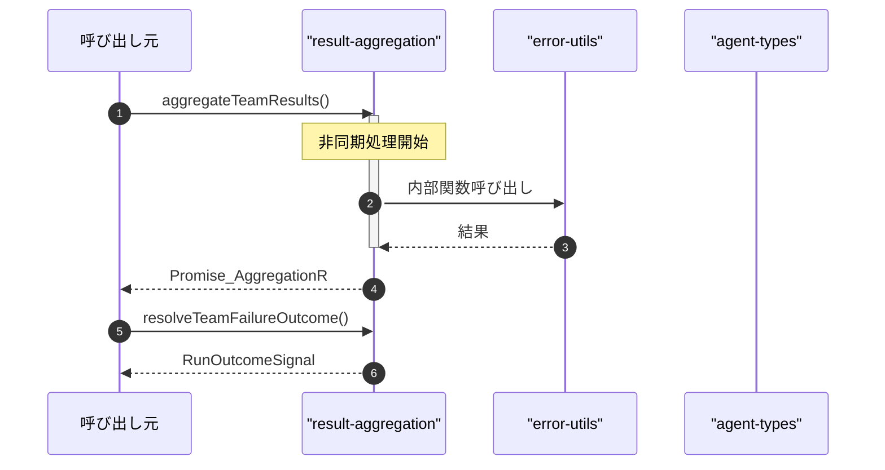

# result-aggregation

## 概要

`result-aggregation` モジュールのAPIリファレンス。

## インポート

```typescript
// from '../../lib/error-utils.js': toErrorMessage, extractStatusCodeFromMessage, classifyPressureError, ...
// from '../../lib/agent-types.js': RunOutcomeCode, RunOutcomeSignal
// from '../../lib/agent-errors.js': isRetryableTeamMemberErrorLib
// from './storage': TeamMemberResult, TeamRunRecord, TeamDefinition, ...
// from './judge': AggregationStrategy, AggregationInput, AggregationResult, ...
```

## エクスポート一覧

| 種別 | 名前 | 説明 |
|------|------|------|
| 関数 | `aggregateTeamResults` | チーム結果を指定された戦略で集約する |
| 関数 | `resolveTeamFailureOutcome` | 失敗時の結果生成 |
| 関数 | `resolveTeamMemberAggregateOutcome` | メンバー結果の統合判定 |
| 関数 | `resolveTeamParallelRunOutcome` | 並列実行結果の判定 |
| 関数 | `buildTeamResultText` | チーム結果のテキスト構築 |
| 関数 | `extractSummary` | 要約を抽出 |

## 図解

### 依存関係図



### 関数フロー



### シーケンス図



## 関数

### aggregateTeamResults

```typescript
async aggregateTeamResults(input: AggregationInput, _ctx?: { model?: { id: string }; provider?: string }): Promise<AggregationResult>
```

チーム結果を指定された戦略で集約する

**パラメータ**

| 名前 | 型 | 必須 |
|------|-----|------|
| input | `AggregationInput` | はい |
| _ctx | `object` | いいえ |
| &nbsp;&nbsp;↳ model | `{ id: string }` | いいえ |
| &nbsp;&nbsp;↳ provider | `string` | いいえ |

**戻り値**: `Promise<AggregationResult>`

### aggregateRuleBased

```typescript
aggregateRuleBased(results: AggregationInput['teamResults']): AggregationResult
```

ルールベースの集約（現在の動作）
最初のtrusted、次に最初のpartial、最後にuntrustedを返す

**パラメータ**

| 名前 | 型 | 必須 |
|------|-----|------|
| results | `AggregationInput['teamResults']` | はい |

**戻り値**: `AggregationResult`

### aggregateMajorityVote

```typescript
aggregateMajorityVote(results: AggregationInput['teamResults']): AggregationResult
```

多数決による集約
最も多い評決を採用し、同数の場合は信頼度で決定

**パラメータ**

| 名前 | 型 | 必須 |
|------|-----|------|
| results | `AggregationInput['teamResults']` | はい |

**戻り値**: `AggregationResult`

### aggregateBestConfidence

```typescript
aggregateBestConfidence(results: AggregationInput['teamResults']): AggregationResult
```

最高信頼度による集約
最も信頼度の高い結果を採用

**パラメータ**

| 名前 | 型 | 必須 |
|------|-----|------|
| results | `AggregationInput['teamResults']` | はい |

**戻り値**: `AggregationResult`

### aggregateWithLLM

```typescript
async aggregateWithLLM(results: AggregationInput['teamResults'], task: string, _ctx?: { model?: { id: string }; provider?: string }): Promise<AggregationResult>
```

LLMによる集約
複数のチーム結果をLLMが統合して最終結果を生成
現在はフォールバックとして多数決を使用

**パラメータ**

| 名前 | 型 | 必須 |
|------|-----|------|
| results | `AggregationInput['teamResults']` | はい |
| task | `string` | はい |
| _ctx | `object` | いいえ |
| &nbsp;&nbsp;↳ model | `{ id: string }` | いいえ |
| &nbsp;&nbsp;↳ provider | `string` | いいえ |

**戻り値**: `Promise<AggregationResult>`

### extractKeyPoints

```typescript
extractKeyPoints(memberResults: TeamMemberResult[]): string[]
```

メンバー結果からキーポイントを抽出

**パラメータ**

| 名前 | 型 | 必須 |
|------|-----|------|
| memberResults | `TeamMemberResult[]` | はい |

**戻り値**: `string[]`

### resolveTeamFailureOutcome

```typescript
resolveTeamFailureOutcome(error: unknown): RunOutcomeSignal
```

失敗時の結果生成

**パラメータ**

| 名前 | 型 | 必須 |
|------|-----|------|
| error | `unknown` | はい |

**戻り値**: `RunOutcomeSignal`

### resolveTeamMemberAggregateOutcome

```typescript
resolveTeamMemberAggregateOutcome(memberResults: TeamMemberResult[]): RunOutcomeSignal & {
  failedMemberIds: string[];
}
```

メンバー結果の統合判定

**パラメータ**

| 名前 | 型 | 必須 |
|------|-----|------|
| memberResults | `TeamMemberResult[]` | はい |

**戻り値**: `RunOutcomeSignal & {
  failedMemberIds: string[];
}`

### resolveTeamParallelRunOutcome

```typescript
resolveTeamParallelRunOutcome(results: Array<{
    team: TeamDefinition;
    runRecord: TeamRunRecord;
    memberResults: TeamMemberResult[];
  }>): RunOutcomeSignal & {
  failedTeamIds: string[];
  partialTeamIds: string[];
  failedMemberIdsByTeam: Record<string, string[]>;
}
```

並列実行結果の判定

**パラメータ**

| 名前 | 型 | 必須 |
|------|-----|------|
| results | `Array<{
    team: TeamDefinition;
    runRecord...` | はい |

**戻り値**: `RunOutcomeSignal & {
  failedTeamIds: string[];
  partialTeamIds: string[];
  failedMemberIdsByTeam: Record<string, string[]>;
}`

### buildTeamResultText

```typescript
buildTeamResultText(input: {
  run: TeamRunRecord;
  team: TeamDefinition;
  memberResults: TeamMemberResult[];
  communicationAudit?: TeamCommunicationAuditEntry[];
}): string
```

チーム結果のテキスト構築

**パラメータ**

| 名前 | 型 | 必須 |
|------|-----|------|
| input | `object` | はい |
| &nbsp;&nbsp;↳ run | `TeamRunRecord` | はい |
| &nbsp;&nbsp;↳ team | `TeamDefinition` | はい |
| &nbsp;&nbsp;↳ memberResults | `TeamMemberResult[]` | はい |
| &nbsp;&nbsp;↳ communicationAudit | `TeamCommunicationAuditEntry[]` | いいえ |

**戻り値**: `string`

### extractSummary

```typescript
extractSummary(output: string): string
```

要約を抽出

**パラメータ**

| 名前 | 型 | 必須 |
|------|-----|------|
| output | `string` | はい |

**戻り値**: `string`

---
*自動生成: 2026-02-24T17:08:02.109Z*
