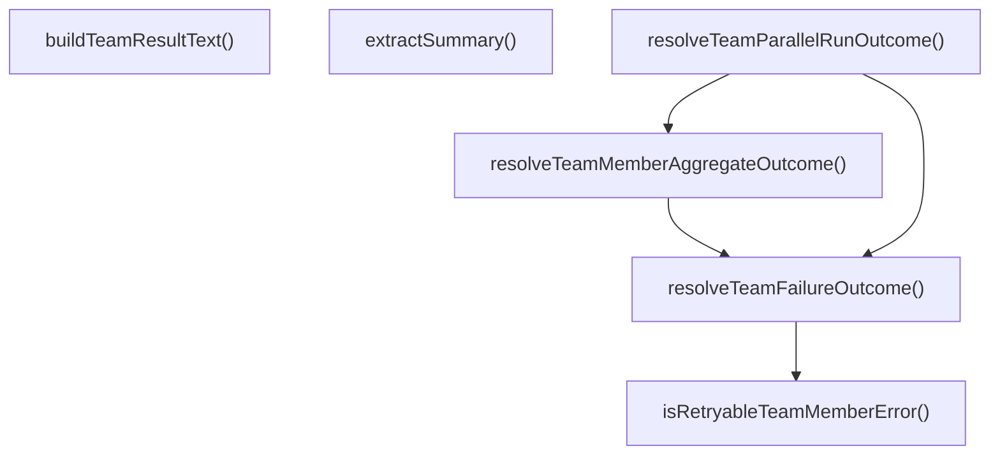

# result-aggregation

## 概要

`result-aggregation` モジュールのAPIリファレンス。

## インポート

```typescript
// from '../../lib/error-utils.js': toErrorMessage, extractStatusCodeFromMessage, classifyPressureError, ...
// from '../../lib/agent-types.js': RunOutcomeCode, RunOutcomeSignal
// from './storage': TeamMemberResult, TeamRunRecord, TeamDefinition, ...
```

## エクスポート一覧

| 種別 | 名前 | 説明 |
|------|------|------|
| 関数 | `isRetryableTeamMemberError` | チームメンバーのエラーが再試行可能か判定 |
| 関数 | `resolveTeamFailureOutcome` | チームのエラー種別を判定し、実行結果シグナルを返す |
| 関数 | `resolveTeamMemberAggregateOutcome` | チームメンバーの実行結果を集約して解決する |
| 関数 | `resolveTeamParallelRunOutcome` | チームの並列実行結果を集計して解決する |
| 関数 | `buildTeamResultText` | チームの実行結果をテキスト形式で構築します。 |
| 関数 | `extractSummary` | 出力文字列からサマリーを抽出する |

## 図解

### 依存関係図


### 関数フロー



### シーケンス図


## 関数

### isRetryableTeamMemberError

```typescript
isRetryableTeamMemberError(error: unknown, statusCode?: number): boolean
```

チームメンバーのエラーが再試行可能か判定

**パラメータ**

| 名前 | 型 | 必須 |
|------|-----|------|
| error | `unknown` | はい |
| statusCode | `number` | いいえ |

**戻り値**: `boolean`

### resolveTeamFailureOutcome

```typescript
resolveTeamFailureOutcome(error: unknown): RunOutcomeSignal
```

チームのエラー種別を判定し、実行結果シグナルを返す

**パラメータ**

| 名前 | 型 | 必須 |
|------|-----|------|
| error | `unknown` | はい |

**戻り値**: `RunOutcomeSignal`

### resolveTeamMemberAggregateOutcome

```typescript
resolveTeamMemberAggregateOutcome(memberResults: TeamMemberResult[]): RunOutcomeSignal & {
  failedMemberIds: string[];
}
```

チームメンバーの実行結果を集約して解決する

**パラメータ**

| 名前 | 型 | 必須 |
|------|-----|------|
| memberResults | `TeamMemberResult[]` | はい |

**戻り値**: `RunOutcomeSignal & {
  failedMemberIds: string[];
}`

### resolveTeamParallelRunOutcome

```typescript
resolveTeamParallelRunOutcome(results: Array<{
    team: TeamDefinition;
    runRecord: TeamRunRecord;
    memberResults: TeamMemberResult[];
  }>): RunOutcomeSignal & {
  failedTeamIds: string[];
  partialTeamIds: string[];
  failedMemberIdsByTeam: Record<string, string[]>;
}
```

チームの並列実行結果を集計して解決する

**パラメータ**

| 名前 | 型 | 必須 |
|------|-----|------|
| results | `Array<{
    team: TeamDefinition;
    runRecord...` | はい |

**戻り値**: `RunOutcomeSignal & {
  failedTeamIds: string[];
  partialTeamIds: string[];
  failedMemberIdsByTeam: Record<string, string[]>;
}`

### buildTeamResultText

```typescript
buildTeamResultText(input: {
  run: TeamRunRecord;
  team: TeamDefinition;
  memberResults: TeamMemberResult[];
  communicationAudit?: TeamCommunicationAuditEntry[];
}): string
```

チームの実行結果をテキスト形式で構築します。

**パラメータ**

| 名前 | 型 | 必須 |
|------|-----|------|
| input | `object` | はい |
| &nbsp;&nbsp;↳ run | `TeamRunRecord` | はい |
| &nbsp;&nbsp;↳ team | `TeamDefinition` | はい |
| &nbsp;&nbsp;↳ memberResults | `TeamMemberResult[]` | はい |
| &nbsp;&nbsp;↳ communicationAudit | `TeamCommunicationAuditEntry[]` | いいえ |

**戻り値**: `string`

### extractSummary

```typescript
extractSummary(output: string): string
```

出力文字列からサマリーを抽出する

**パラメータ**

| 名前 | 型 | 必須 |
|------|-----|------|
| output | `string` | はい |

**戻り値**: `string`

---
*自動生成: 2026-02-18T14:31:30.481Z*
