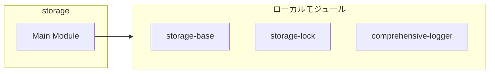
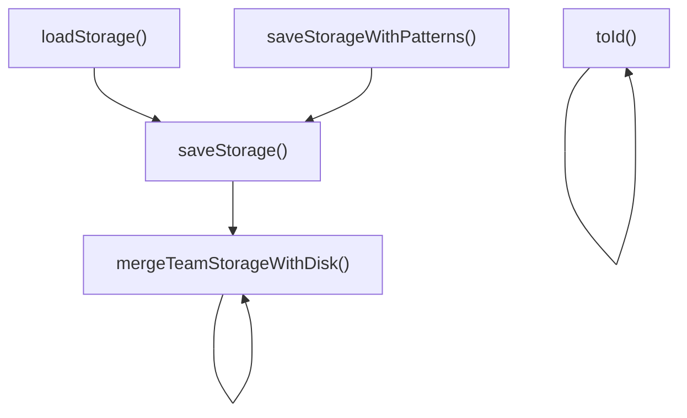
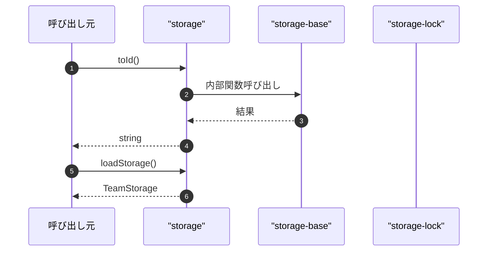

# storage

## 概要

`storage` モジュールのAPIリファレンス。

## インポート

```typescript
// from 'node:fs': existsSync, readFileSync
// from 'node:path': join
// from '../../lib/storage-base.js': createPathsFactory, createEnsurePaths, pruneRunArtifacts, ...
// from '../../lib/storage-lock.js': atomicWriteTextFile, withFileLock
// from '../../lib/comprehensive-logger.js': getLogger
```

## エクスポート一覧

| 種別 | 名前 | 説明 |
|------|------|------|
| 関数 | `toId` | ID文字列へ変換 |
| 関数 | `loadStorage` | ストレージを読込 |
| 関数 | `saveStorage` | ストレージを保存 |
| 関数 | `saveStorageWithPatterns` | パターン付きで保存 |
| インターフェース | `TeamMember` | チームメンバー情報 |
| インターフェース | `TeamDefinition` | エージェントチーム定義 |
| インターフェース | `TeamMemberResult` | チームメンバー実行結果 |
| インターフェース | `TeamFinalJudge` | チーム最終審査の結果 |
| インターフェース | `ClaimReference` | メンバー間のClaim参照構造 |
| インターフェース | `DiscussionAnalysis` | - |
| インターフェース | `DiscussionReference` | ディスカッション参照情報 |
| インターフェース | `TeamCommunicationAuditEntry` | 通信監査エントリ |
| インターフェース | `TeamRunRecord` | チーム実行記録 |
| インターフェース | `TeamStorage` | チームストレージ定義 |
| インターフェース | `TeamPaths` | チームパス定義 |
| 型 | `TeamEnabledState` | チームの有効状態を表す型 |
| 型 | `TeamStrategy` | チームの実行戦略を表す型 |
| 型 | `TeamJudgeVerdict` | チーム審査の判定結果 |

## 図解

### クラス図

```mermaid
classDiagram
  class TeamMember {
    <<interface>>
    +id: string
    +role: string
    +description: string
    +provider: string
    +model: string
  }
  class TeamDefinition {
    <<interface>>
    +id: string
    +name: string
    +description: string
    +enabled: TeamEnabledState
    +members: TeamMember
  }
  class TeamMemberResult {
    <<interface>>
    +memberId: string
    +role: string
    +summary: string
    +output: string
    +status: completed_failed
  }
  class TeamFinalJudge {
    <<interface>>
    +verdict: TeamJudgeVerdict
    +confidence: number
    +reason: string
    +nextStep: string
    +uIntra: number
  }
  class ClaimReference {
    <<interface>>
    +claimId: string
    +memberId: string
    +stance: agree_disagree
    +confidence: number
  }
  class DiscussionAnalysis {
    <<interface>>
    +references: DiscussionReference
    +consensusMarker: string
    +stanceDistribution: agree_number_disagr
  }
  class DiscussionReference {
    <<interface>>
    +targetMemberId: string
    +targetClaimId: string
    +stance: agree_disagree
    +excerpt: string
    +confidence: number
  }
  class TeamCommunicationAuditEntry {
    <<interface>>
    +round: number
    +memberId: string
    +role: string
    +partnerIds: string
    +referencedPartners: string
  }
  class TeamRunRecord {
    <<interface>>
    +runId: string
    +teamId: string
    +strategy: TeamStrategy
    +task: string
    +communicationRounds: number
  }
  class TeamStorage {
    <<interface>>
    +teams: TeamDefinition
    +runs: TeamRunRecord
    +currentTeamId: string
    +defaultsVersion: number
  }
  class TeamPaths {
    <<interface>>
  }
```



### 依存関係図



### 関数フロー



### シーケンス図



## 関数

### toId

```typescript
toId(input: string): string
```

ID文字列へ変換

**パラメータ**

| 名前 | 型 | 必須 |
|------|-----|------|
| input | `string` | はい |

**戻り値**: `string`

### mergeTeamStorageWithDisk

```typescript
mergeTeamStorageWithDisk(storageFile: string, next: TeamStorage): TeamStorage
```

Merge storage with disk state (for concurrent access).
Uses common utility from lib/storage-base.ts.

**パラメータ**

| 名前 | 型 | 必須 |
|------|-----|------|
| storageFile | `string` | はい |
| next | `TeamStorage` | はい |

**戻り値**: `TeamStorage`

### loadStorage

```typescript
loadStorage(cwd: string): TeamStorage
```

ストレージを読込

**パラメータ**

| 名前 | 型 | 必須 |
|------|-----|------|
| cwd | `string` | はい |

**戻り値**: `TeamStorage`

### saveStorage

```typescript
saveStorage(cwd: string, storage: TeamStorage): void
```

ストレージを保存

**パラメータ**

| 名前 | 型 | 必須 |
|------|-----|------|
| cwd | `string` | はい |
| storage | `TeamStorage` | はい |

**戻り値**: `void`

### saveStorageWithPatterns

```typescript
async saveStorageWithPatterns(cwd: string, storage: TeamStorage): Promise<void>
```

パターン付きで保存

**パラメータ**

| 名前 | 型 | 必須 |
|------|-----|------|
| cwd | `string` | はい |
| storage | `TeamStorage` | はい |

**戻り値**: `Promise<void>`

## インターフェース

### TeamMember

```typescript
interface TeamMember {
  id: string;
  role: string;
  description: string;
  provider?: string;
  model?: string;
  enabled: boolean;
  skills?: string[];
}
```

チームメンバー情報

### TeamDefinition

```typescript
interface TeamDefinition {
  id: string;
  name: string;
  description: string;
  enabled: TeamEnabledState;
  members: TeamMember[];
  skills?: string[];
  createdAt: string;
  updatedAt: string;
}
```

エージェントチーム定義

### TeamMemberResult

```typescript
interface TeamMemberResult {
  memberId: string;
  role: string;
  summary: string;
  output: string;
  status: "completed" | "failed";
  latencyMs: number;
  error?: string;
  diagnostics?: {
    confidence: number;
    evidenceCount: number;
    contradictionSignals: number;
    conflictSignals: number;
  };
}
```

チームメンバー実行結果

### TeamFinalJudge

```typescript
interface TeamFinalJudge {
  verdict: TeamJudgeVerdict;
  confidence: number;
  reason: string;
  nextStep: string;
  uIntra: number;
  uInter: number;
  uSys: number;
  collapseSignals: string[];
  rawOutput: string;
}
```

チーム最終審査の結果

### ClaimReference

```typescript
interface ClaimReference {
  claimId: string;
  memberId: string;
  stance: "agree" | "disagree" | "neutral" | "partial";
  confidence?: number;
}
```

メンバー間のClaim参照構造

### DiscussionAnalysis

```typescript
interface DiscussionAnalysis {
  references: DiscussionReference[];
  consensusMarker?: string;
  stanceDistribution: { agree: number; disagree: number; neutral: number; partial: number };
}
```

### DiscussionReference

```typescript
interface DiscussionReference {
  targetMemberId: string;
  targetClaimId?: string;
  stance: "agree" | "disagree" | "neutral" | "partial";
  excerpt: string;
  confidence: number;
}
```

ディスカッション参照情報

### TeamCommunicationAuditEntry

```typescript
interface TeamCommunicationAuditEntry {
  round: number;
  memberId: string;
  role: string;
  partnerIds: string[];
  referencedPartners: string[];
  missingPartners: string[];
  contextPreview: string;
  partnerSnapshots: string[];
  resultStatus: "completed" | "failed";
  claimId?: string;
  evidenceId?: string;
  claimReferences?: ClaimReference[];
}
```

通信監査エントリ

### TeamRunRecord

```typescript
interface TeamRunRecord {
  runId: string;
  teamId: string;
  strategy: TeamStrategy;
  task: string;
  communicationRounds?: number;
  failedMemberRetryRounds?: number;
  failedMemberRetryApplied?: number;
  recoveredMembers?: string[];
  communicationLinks?: Record<string, string[]>;
  summary: string;
  status: "completed" | "failed";
  startedAt: string;
  finishedAt: string;
  memberCount: number;
  outputFile: string;
  finalJudge?: {
    verdict: TeamJudgeVerdict;
    confidence: number;
    reason: string;
    nextStep: string;
    uIntra: number;
    uInter: number;
    uSys: number;
    collapseSignals: string[];
  };
  correlationId?: string;
  parentEventId?: string;
}
```

チーム実行記録

### TeamStorage

```typescript
interface TeamStorage {
  teams: TeamDefinition[];
  runs: TeamRunRecord[];
  currentTeamId?: string;
  defaultsVersion?: number;
}
```

チームストレージ定義

### TeamPaths

```typescript
interface TeamPaths {
}
```

チームパス定義

## 型定義

### TeamEnabledState

```typescript
type TeamEnabledState = "enabled" | "disabled"
```

チームの有効状態を表す型

### TeamStrategy

```typescript
type TeamStrategy = "parallel" | "sequential"
```

チームの実行戦略を表す型

### TeamJudgeVerdict

```typescript
type TeamJudgeVerdict = "trusted" | "partial" | "untrusted"
```

チーム審査の判定結果

---
*自動生成: 2026-02-18T18:06:17.014Z*
