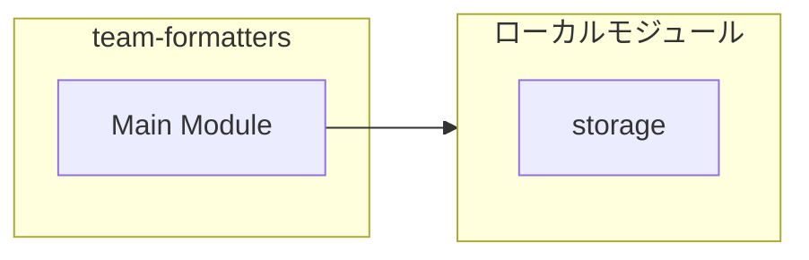
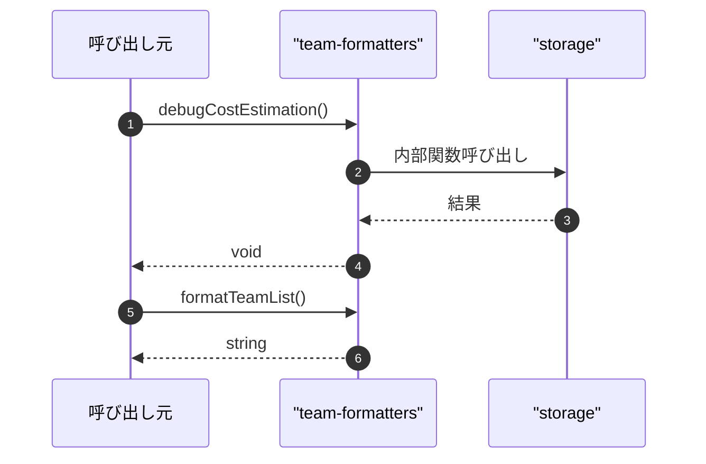

# team-formatters

## 概要

`team-formatters` モジュールのAPIリファレンス。

## インポート

```typescript
// from './storage.js': TeamStorage
```

## エクスポート一覧

| 種別 | 名前 | 説明 |
|------|------|------|
| 関数 | `debugCostEstimation` | デバッグ用コスト推定ログを出力 |
| 関数 | `formatTeamList` | チーム一覧をフォーマット |
| 関数 | `formatRecentRuns` | 直近のチーム実行履歴をフォーマット |

## 図解

### 依存関係図



### シーケンス図



## 関数

### debugCostEstimation

```typescript
debugCostEstimation(scope: string, fields: Record<string, unknown>): void
```

デバッグ用コスト推定ログを出力

**パラメータ**

| 名前 | 型 | 必須 |
|------|-----|------|
| scope | `string` | はい |
| fields | `Record<string, unknown>` | はい |

**戻り値**: `void`

### formatTeamList

```typescript
formatTeamList(storage: TeamStorage): string
```

チーム一覧をフォーマット

**パラメータ**

| 名前 | 型 | 必須 |
|------|-----|------|
| storage | `TeamStorage` | はい |

**戻り値**: `string`

### formatRecentRuns

```typescript
formatRecentRuns(storage: TeamStorage, limit: any): string
```

直近のチーム実行履歴をフォーマット

**パラメータ**

| 名前 | 型 | 必須 |
|------|-----|------|
| storage | `TeamStorage` | はい |
| limit | `any` | はい |

**戻り値**: `string`

---
*自動生成: 2026-02-22T18:55:28.329Z*
