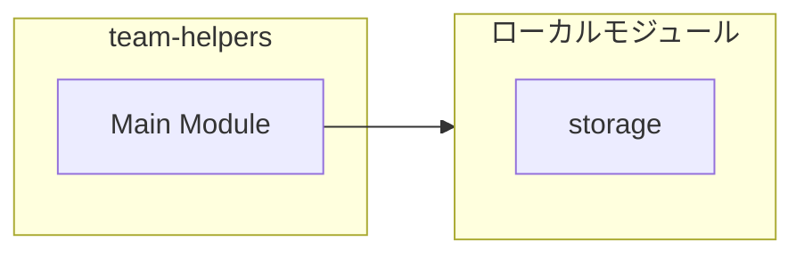
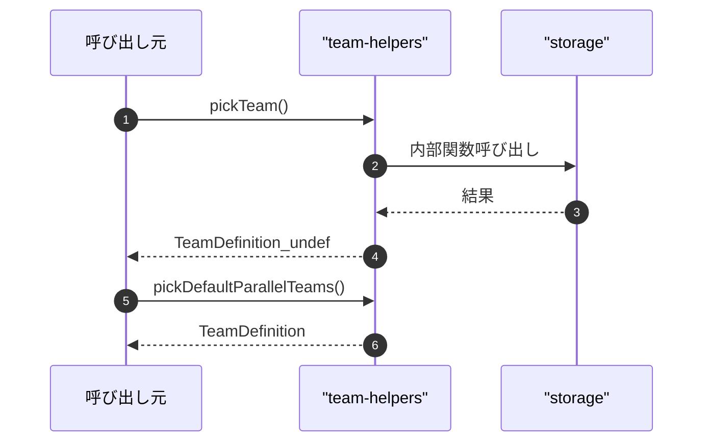

# team-helpers

## 概要

`team-helpers` モジュールのAPIリファレンス。

## インポート

```typescript
// from './storage.js': TeamStorage, TeamDefinition
```

## エクスポート一覧

| 種別 | 名前 | 説明 |
|------|------|------|
| 関数 | `pickTeam` | ストレージからチームを選択 |
| 関数 | `pickDefaultParallelTeams` | デフォルトの並列実行チームを選択 |

## 図解

### 依存関係図



### シーケンス図



## 関数

### pickTeam

```typescript
pickTeam(storage: TeamStorage, requestedId?: string): TeamDefinition | undefined
```

ストレージからチームを選択

**パラメータ**

| 名前 | 型 | 必須 |
|------|-----|------|
| storage | `TeamStorage` | はい |
| requestedId | `string` | いいえ |

**戻り値**: `TeamDefinition | undefined`

### pickDefaultParallelTeams

```typescript
pickDefaultParallelTeams(storage: TeamStorage): TeamDefinition[]
```

デフォルトの並列実行チームを選択

**パラメータ**

| 名前 | 型 | 必須 |
|------|-----|------|
| storage | `TeamStorage` | はい |

**戻り値**: `TeamDefinition[]`

---
*自動生成: 2026-02-28T13:55:18.768Z*
