# team-orchestrator

## 概要

`team-orchestrator` モジュールのAPIリファレンス。

## インポート

```typescript
// from 'node:fs': writeFileSync
// from 'node:path': join
// from '@mariozechner/pi-coding-agent': ExtensionAPI
// from '../../lib/agent-utils.js': createRunId
// from '../../lib/abort-utils.js': createChildAbortController
// ... and 15 more imports
```

## エクスポート一覧

| 種別 | 名前 | 説明 |
|------|------|------|
| 関数 | `shouldRetryFailedMemberResult` | 失敗したメンバー結果を再試行すべきか判定する |
| 関数 | `createChildAbort` | AbortControllerの子を作成してMaxListenersExceededWarningを |
| 関数 | `runTeamTask` | チームでタスクを実行する |
| インターフェース | `TeamTaskInput` | チームタスク実行の入力パラメータ |
| インターフェース | `TeamTaskResult` | チームタスク実行の結果 |

## 図解

### クラス図

```mermaid
classDiagram
  class TeamTaskInput {
    <<interface>>
    +team: TeamDefinition
    +task: string
    +strategy: TeamStrategy
    +memberParallelLimit: number
    +communicationRounds: number
  }
  class TeamTaskResult {
    <<interface>>
    +runRecord: TeamRunRecord
    +memberResults: TeamMemberResult
    +communicationAudit: TeamCommunicationAud
    +uncertaintyProxy: TeamUncertaintyProxy
    +uncertaintyProxyExplanation: JudgeExplanation
  }
  class CommunicationRoundParams {
    <<interface>>
    +input: TeamTaskInput
    +round: number
    +communicationMembers: TeamMember
    +previousResults: TeamMemberResult
    +previousResultById: Map_string_TeamMembe
  }
  class RunCommunicationMemberParams {
    <<interface>>
    +input: TeamTaskInput
    +member: TeamMember
    +round: number
    +previousResults: TeamMemberResult
    +communicationLinks: Map_string_string
  }
  class FailedMemberRetryParams {
    <<interface>>
    +input: TeamTaskInput
    +failedMemberRetryRounds: number
    +memberResults: TeamMemberResult
    +activeMembers: TeamMember
    +activeMemberById: Map_string_TeamMembe
  }
  class RunRetryMemberParams {
    <<interface>>
    +input: TeamTaskInput
    +member: TeamMember
    +retryRound: number
    +retryPhaseRound: number
    +previousResults: TeamMemberResult
  }
  class FinalJudgeParams {
    <<interface>>
    +input: TeamTaskInput
    +memberResults: TeamMemberResult
    +activeMembers: TeamMember
    +communicationRounds: number
    +failedMemberRetryRounds: number
  }
```



### 依存関係図


### 関数フロー


### シーケンス図


## 関数

### shouldRetryFailedMemberResult

```typescript
shouldRetryFailedMemberResult(result: TeamMemberResult, retryRound: number): boolean
```

失敗したメンバー結果を再試行すべきか判定する

**パラメータ**

| 名前 | 型 | 必須 |
|------|-----|------|
| result | `TeamMemberResult` | はい |
| retryRound | `number` | はい |

**戻り値**: `boolean`

### createChildAbort

```typescript
createChildAbort(signal?: AbortSignal): {
  controller: AbortController;
  cleanup: () => void;
}
```

AbortControllerの子を作成してMaxListenersExceededWarningを防止

**パラメータ**

| 名前 | 型 | 必須 |
|------|-----|------|
| signal | `AbortSignal` | いいえ |

**戻り値**: `{
  controller: AbortController;
  cleanup: () => void;
}`

### runTeamTask

```typescript
async runTeamTask(input: TeamTaskInput): Promise<TeamTaskResult>
```

チームでタスクを実行する

**パラメータ**

| 名前 | 型 | 必須 |
|------|-----|------|
| input | `TeamTaskInput` | はい |

**戻り値**: `Promise<TeamTaskResult>`

### emitResultEvent

```typescript
emitResultEvent(member: TeamMember, phaseLabel: string, result: TeamMemberResult): void
```

結果イベントを発行

**パラメータ**

| 名前 | 型 | 必須 |
|------|-----|------|
| member | `TeamMember` | はい |
| phaseLabel | `string` | はい |
| result | `TeamMemberResult` | はい |

**戻り値**: `void`

### executeCommunicationRound

```typescript
async executeCommunicationRound(params: CommunicationRoundParams): Promise<TeamMemberResult[]>
```

**パラメータ**

| 名前 | 型 | 必須 |
|------|-----|------|
| params | `CommunicationRoundParams` | はい |

**戻り値**: `Promise<TeamMemberResult[]>`

### runCommunicationMember

```typescript
async runCommunicationMember(params: RunCommunicationMemberParams): Promise<TeamMemberResult>
```

**パラメータ**

| 名前 | 型 | 必須 |
|------|-----|------|
| params | `RunCommunicationMemberParams` | はい |

**戻り値**: `Promise<TeamMemberResult>`

### mergeRoundResults

```typescript
mergeRoundResults(communicationMembers: TeamMember[], roundResults: TeamMemberResult[], previousResultById: Map<string, TeamMemberResult>): TeamMemberResult[]
```

**パラメータ**

| 名前 | 型 | 必須 |
|------|-----|------|
| communicationMembers | `TeamMember[]` | はい |
| roundResults | `TeamMemberResult[]` | はい |
| previousResultById | `Map<string, TeamMemberResult>` | はい |

**戻り値**: `TeamMemberResult[]`

### executeFailedMemberRetries

```typescript
async executeFailedMemberRetries(params: FailedMemberRetryParams): Promise<TeamMemberResult[]>
```

**パラメータ**

| 名前 | 型 | 必須 |
|------|-----|------|
| params | `FailedMemberRetryParams` | はい |

**戻り値**: `Promise<TeamMemberResult[]>`

### runRetryMember

```typescript
async runRetryMember(params: RunRetryMemberParams): Promise<TeamMemberResult>
```

**パラメータ**

| 名前 | 型 | 必須 |
|------|-----|------|
| params | `RunRetryMemberParams` | はい |

**戻り値**: `Promise<TeamMemberResult>`

### executeFinalJudge

```typescript
async executeFinalJudge(params: FinalJudgeParams): Promise<TeamTaskResult>
```

**パラメータ**

| 名前 | 型 | 必須 |
|------|-----|------|
| params | `FinalJudgeParams` | はい |

**戻り値**: `Promise<TeamTaskResult>`

### createFailedMemberResult

```typescript
createFailedMemberResult(member: TeamMember, error: string): TeamMemberResult
```

失敗したメンバーの結果を作成

**パラメータ**

| 名前 | 型 | 必須 |
|------|-----|------|
| member | `TeamMember` | はい |
| error | `string` | はい |

**戻り値**: `TeamMemberResult`

## インターフェース

### TeamTaskInput

```typescript
interface TeamTaskInput {
  team: TeamDefinition;
  task: string;
  strategy: TeamStrategy;
  memberParallelLimit?: number;
  communicationRounds: number;
  failedMemberRetryRounds?: number;
  communicationLinks?: Map<string, string[]>;
  sharedContext?: string;
  successCriteria?: string[];
  timeoutMs: number;
  cwd: string;
  retryOverrides?: RetryWithBackoffOverrides;
  fallbackProvider?: string;
  fallbackModel?: string;
  signal?: AbortSignal;
  onMemberStart?: (member: TeamMember) => void;
  onMemberEnd?: (member: TeamMember) => void;
  onMemberTextDelta?: (member: TeamMember, delta: string) => void;
  onMemberStderrChunk?: (member: TeamMember, chunk: string) => void;
  onMemberResult?: (member: TeamMember, result: TeamMemberResult) => void;
  onMemberPhase?: (member: TeamMember, phase: TeamLivePhase, round?: number) => void;
  onMemberEvent?: (member: TeamMember, event: string) => void;
  onTeamEvent?: (event: string) => void;
}
```

チームタスク実行の入力パラメータ

### TeamTaskResult

```typescript
interface TeamTaskResult {
  runRecord: TeamRunRecord;
  memberResults: TeamMemberResult[];
  communicationAudit: TeamCommunicationAuditEntry[];
  uncertaintyProxy: TeamUncertaintyProxy;
  uncertaintyProxyExplanation: JudgeExplanation;
}
```

チームタスク実行の結果

### CommunicationRoundParams

```typescript
interface CommunicationRoundParams {
  input: TeamTaskInput;
  round: number;
  communicationMembers: TeamMember[];
  previousResults: TeamMemberResult[];
  previousResultById: Map<string, TeamMemberResult>;
  contextMap: Map<string, PrecomputedMemberContext>;
  communicationLinks: Map<string, string[]>;
  memberById: Map<string, TeamMember>;
  memberResults: TeamMemberResult[];
  communicationAudit: TeamCommunicationAuditEntry[];
  emitResultEvent: (member: TeamMember, phaseLabel: string, result: TeamMemberResult) => void;
}
```

### RunCommunicationMemberParams

```typescript
interface RunCommunicationMemberParams {
  input: TeamTaskInput;
  member: TeamMember;
  round: number;
  previousResults: TeamMemberResult[];
  communicationLinks: Map<string, string[]>;
  contextMap: Map<string, PrecomputedMemberContext>;
  memberById: Map<string, TeamMember>;
  communicationAudit: TeamCommunicationAuditEntry[];
  emitResultEvent: (member: TeamMember, phaseLabel: string, result: TeamMemberResult) => void;
  signal?: AbortSignal;
}
```

### FailedMemberRetryParams

```typescript
interface FailedMemberRetryParams {
  input: TeamTaskInput;
  failedMemberRetryRounds: number;
  memberResults: TeamMemberResult[];
  activeMembers: TeamMember[];
  activeMemberById: Map<string, TeamMember>;
  communicationLinks: Map<string, string[]>;
  memberById: Map<string, TeamMember>;
  communicationRounds: number;
  communicationAudit: TeamCommunicationAuditEntry[];
  emitResultEvent: (member: TeamMember, phaseLabel: string, result: TeamMemberResult) => void;
  recoveredMembers: Set<string>;
  failedMemberRetryApplied: number;
}
```

### RunRetryMemberParams

```typescript
interface RunRetryMemberParams {
  input: TeamTaskInput;
  member: TeamMember;
  retryRound: number;
  retryPhaseRound: number;
  previousResults: TeamMemberResult[];
  communicationLinks: Map<string, string[]>;
  contextMap: Map<string, PrecomputedMemberContext>;
  memberById: Map<string, TeamMember>;
  communicationAudit: TeamCommunicationAuditEntry[];
  emitResultEvent: (member: TeamMember, phaseLabel: string, result: TeamMemberResult) => void;
}
```

### FinalJudgeParams

```typescript
interface FinalJudgeParams {
  input: TeamTaskInput;
  memberResults: TeamMemberResult[];
  activeMembers: TeamMember[];
  communicationRounds: number;
  failedMemberRetryRounds: number;
  failedMemberRetryApplied: number;
  recoveredMembers: Set<string>;
  communicationLinks: Map<string, string[]>;
  communicationAudit: TeamCommunicationAuditEntry[];
  runId: string;
  startedAt: string;
  outputFile: string;
}
```

---
*自動生成: 2026-02-23T06:29:41.855Z*
