# agent-usage-tracker

## 概要

`agent-usage-tracker` モジュールのAPIリファレンス。

## インポート

```typescript
import { randomBytes } from 'node:crypto';
import { existsSync, mkdirSync, readdirSync... } from 'node:fs';
import { basename, dirname, join... } from 'node:path';
import { Type } from '@mariozechner/pi-ai';
import { ExtensionAPI } from '@mariozechner/pi-coding-agent';
// ... and 4 more imports
```

## エクスポート一覧

| 種別 | 名前 | 説明 |
|------|------|------|
| 関数 | `registerAgentUsageTracker` | - |

## 図解

### クラス図

```mermaid
classDiagram
  class ContextSnapshot {
    <<interface>>
    +tokens: number
    +contextWindow: number
    +ratio: number
  }
  class FeatureMetrics {
    <<interface>>
    +extension: string
    +featureType: FeatureType
    +featureName: string
    +calls: number
    +errors: number
  }
  class UsageEventRecord {
    <<interface>>
    +id: string
    +timestamp: string
    +extension: string
    +featureType: FeatureType
    +featureName: string
  }
  class UsageTrackerState {
    <<interface>>
    +version: number
    +createdAt: string
    +updatedAt: string
    +totals: toolCallsnumbertoolErrorsnumberagentRunsnumberagentRunErrorsnumbercontextSamplesnumbercontextRatioSumnumbercontextTokenSamplesnumbercontextTokenSumnumber
    +features: Record<stringFeatureMetrics>
  }
  class FeatureCatalog {
    <<interface>>
    +discoveredAt: string
    +toolToExtension: Record<stringstring>
    +commandToExtension: Record<stringstring>
  }
  class ActiveToolCall {
    <<interface>>
    +toolName: string
    +extension: string
    +featureKey: string
    +startedAtMs: number
    +inputPreview: string
  }
  class ActiveAgentRun {
    <<interface>>
    +featureKey: string
    +startedAtMs: number
    +toolCalls: number
    +toolErrors: number
    +startContext: ContextSnapshot
  }
  class RuntimeState {
    <<interface>>
    +cwd: string
    +storageFile: string
    +state: UsageTrackerState
    +catalog: FeatureCatalog
    +pendingTools: Map<stringActiveToolCall>
  }
```



### 依存関係図

```mermaid
flowchart LR
  subgraph this[agent-usage-tracker]
    main[Main Module]
  end
  subgraph local[ローカルモジュール]
    fs_utils_js[fs-utils.js]
    validation_utils_js[validation-utils.js]
    comprehensive_logger[comprehensive-logger]
    comprehensive_logger_types[comprehensive-logger-types]
  end
  main --> local
  subgraph external[外部ライブラリ]
    _mariozechner[@mariozechner]
    _mariozechner[@mariozechner]
  end
  main --> external
```

## 関数

### nowIso

```typescript
nowIso(): string
```

**戻り値**: `string`

### getStorageFile

```typescript
getStorageFile(cwd: string): string
```

**パラメータ**

| 名前 | 型 | 必須 |
|------|-----|------|
| cwd | `string` | はい |

**戻り値**: `string`

### createEmptyState

```typescript
createEmptyState(timestamp: any): UsageTrackerState
```

**パラメータ**

| 名前 | 型 | 必須 |
|------|-----|------|
| timestamp | `any` | はい |

**戻り値**: `UsageTrackerState`

### loadState

```typescript
loadState(storageFile: string): UsageTrackerState
```

**パラメータ**

| 名前 | 型 | 必須 |
|------|-----|------|
| storageFile | `string` | はい |

**戻り値**: `UsageTrackerState`

### saveState

```typescript
saveState(currentRuntime: RuntimeState): void
```

**パラメータ**

| 名前 | 型 | 必須 |
|------|-----|------|
| currentRuntime | `RuntimeState` | はい |

**戻り値**: `void`

### ensureRuntime

```typescript
ensureRuntime(ctx: ExtensionAPI["context"]): RuntimeState
```

**パラメータ**

| 名前 | 型 | 必須 |
|------|-----|------|
| ctx | `ExtensionAPI["context"]` | はい |

**戻り値**: `RuntimeState`

### discoverFeatureCatalog

```typescript
discoverFeatureCatalog(cwd: string): FeatureCatalog
```

**パラメータ**

| 名前 | 型 | 必須 |
|------|-----|------|
| cwd | `string` | はい |

**戻り値**: `FeatureCatalog`

### extractRegisteredToolNames

```typescript
extractRegisteredToolNames(source: string): string[]
```

**パラメータ**

| 名前 | 型 | 必須 |
|------|-----|------|
| source | `string` | はい |

**戻り値**: `string[]`

### extractRegisteredCommandNames

```typescript
extractRegisteredCommandNames(source: string): string[]
```

**パラメータ**

| 名前 | 型 | 必須 |
|------|-----|------|
| source | `string` | はい |

**戻り値**: `string[]`

### resolveExtensionForTool

```typescript
resolveExtensionForTool(toolName: string, catalog: FeatureCatalog): string
```

**パラメータ**

| 名前 | 型 | 必須 |
|------|-----|------|
| toolName | `string` | はい |
| catalog | `FeatureCatalog` | はい |

**戻り値**: `string`

### toFeatureKey

```typescript
toFeatureKey(featureType: FeatureType, extension: string, featureName: string): string
```

**パラメータ**

| 名前 | 型 | 必須 |
|------|-----|------|
| featureType | `FeatureType` | はい |
| extension | `string` | はい |
| featureName | `string` | はい |

**戻り値**: `string`

### getOrCreateFeature

```typescript
getOrCreateFeature(state: UsageTrackerState, key: string, extension: string, featureType: FeatureType, featureName: string): FeatureMetrics
```

**パラメータ**

| 名前 | 型 | 必須 |
|------|-----|------|
| state | `UsageTrackerState` | はい |
| key | `string` | はい |
| extension | `string` | はい |
| featureType | `FeatureType` | はい |
| featureName | `string` | はい |

**戻り値**: `FeatureMetrics`

### applyContextSample

```typescript
applyContextSample(state: UsageTrackerState, feature: FeatureMetrics, context: ContextSnapshot | undefined): void
```

**パラメータ**

| 名前 | 型 | 必須 |
|------|-----|------|
| state | `UsageTrackerState` | はい |
| feature | `FeatureMetrics` | はい |
| context | `ContextSnapshot | undefined` | はい |

**戻り値**: `void`

### markFeatureCall

```typescript
markFeatureCall(state: UsageTrackerState, input: {
    extension: string;
    featureType: FeatureType;
    featureName: string;
    at: string;
    context?: ContextSnapshot;
  }): string
```

**パラメータ**

| 名前 | 型 | 必須 |
|------|-----|------|
| state | `UsageTrackerState` | はい |
| input | `{
    extension: string;
    featureType: FeatureType;
    featureName: string;
    at: string;
    context?: ContextSnapshot;
  }` | はい |

**戻り値**: `string`

### markFeatureError

```typescript
markFeatureError(state: UsageTrackerState, featureKey: string, at: string, errorMessage?: string): void
```

**パラメータ**

| 名前 | 型 | 必須 |
|------|-----|------|
| state | `UsageTrackerState` | はい |
| featureKey | `string` | はい |
| at | `string` | はい |
| errorMessage | `string` | いいえ |

**戻り値**: `void`

### appendEvent

```typescript
appendEvent(state: UsageTrackerState, event: Omit<UsageEventRecord, "id">): void
```

**パラメータ**

| 名前 | 型 | 必須 |
|------|-----|------|
| state | `UsageTrackerState` | はい |
| event | `Omit<UsageEventRecord, "id">` | はい |

**戻り値**: `void`

### pickNumber

```typescript
pickNumber(raw: Record<string, unknown>, keys: string[]): number | undefined
```

**パラメータ**

| 名前 | 型 | 必須 |
|------|-----|------|
| raw | `Record<string, unknown>` | はい |
| keys | `string[]` | はい |

**戻り値**: `number | undefined`

### normalizeRatio

```typescript
normalizeRatio(value: number | undefined): number | undefined
```

**パラメータ**

| 名前 | 型 | 必須 |
|------|-----|------|
| value | `number | undefined` | はい |

**戻り値**: `number | undefined`

### readContextSnapshot

```typescript
readContextSnapshot(ctx: ExtensionAPI["context"]): ContextSnapshot | undefined
```

**パラメータ**

| 名前 | 型 | 必須 |
|------|-----|------|
| ctx | `ExtensionAPI["context"]` | はい |

**戻り値**: `ContextSnapshot | undefined`

### formatPercent

```typescript
formatPercent(value: number | undefined): string
```

**パラメータ**

| 名前 | 型 | 必須 |
|------|-----|------|
| value | `number | undefined` | はい |

**戻り値**: `string`

### formatRate

```typescript
formatRate(numerator: number, denominator: number): string
```

**パラメータ**

| 名前 | 型 | 必須 |
|------|-----|------|
| numerator | `number` | はい |
| denominator | `number` | はい |

**戻り値**: `string`

### compactSingleLine

```typescript
compactSingleLine(input: string, limit: any): string
```

**パラメータ**

| 名前 | 型 | 必須 |
|------|-----|------|
| input | `string` | はい |
| limit | `any` | はい |

**戻り値**: `string`

### previewInput

```typescript
previewInput(input: unknown): string | undefined
```

**パラメータ**

| 名前 | 型 | 必須 |
|------|-----|------|
| input | `unknown` | はい |

**戻り値**: `string | undefined`

### extractToolErrorMessage

```typescript
extractToolErrorMessage(event: any): string | undefined
```

**パラメータ**

| 名前 | 型 | 必須 |
|------|-----|------|
| event | `any` | はい |

**戻り値**: `string | undefined`

### aggregateByExtension

```typescript
aggregateByExtension(features: FeatureMetrics[]): Array<{
  extension: string;
  calls: number;
  errors: number;
  contextSamples: number;
  contextRatioSum: number;
  featureCount: number;
}>
```

**パラメータ**

| 名前 | 型 | 必須 |
|------|-----|------|
| features | `FeatureMetrics[]` | はい |

**戻り値**: `Array<{
  extension: string;
  calls: number;
  errors: number;
  contextSamples: number;
  contextRatioSum: number;
  featureCount: number;
}>`

### buildSummaryReport

```typescript
buildSummaryReport(state: UsageTrackerState, catalog: FeatureCatalog, topLimit: number): string
```

**パラメータ**

| 名前 | 型 | 必須 |
|------|-----|------|
| state | `UsageTrackerState` | はい |
| catalog | `FeatureCatalog` | はい |
| topLimit | `number` | はい |

**戻り値**: `string`

### buildRecentReport

```typescript
buildRecentReport(state: UsageTrackerState, limit: number): string
```

**パラメータ**

| 名前 | 型 | 必須 |
|------|-----|------|
| state | `UsageTrackerState` | はい |
| limit | `number` | はい |

**戻り値**: `string`

### parsePositiveInt

```typescript
parsePositiveInt(raw: string | undefined, fallback: number): number
```

**パラメータ**

| 名前 | 型 | 必須 |
|------|-----|------|
| raw | `string | undefined` | はい |
| fallback | `number` | はい |

**戻り値**: `number`

### exportState

```typescript
exportState(currentRuntime: RuntimeState, exportPathRaw: string | undefined): string
```

**パラメータ**

| 名前 | 型 | 必須 |
|------|-----|------|
| currentRuntime | `RuntimeState` | はい |
| exportPathRaw | `string | undefined` | はい |

**戻り値**: `string`

### handleAgentUsageCommand

```typescript
handleAgentUsageCommand(args: string, ctx: ExtensionAPI["context"]): void
```

**パラメータ**

| 名前 | 型 | 必須 |
|------|-----|------|
| args | `string` | はい |
| ctx | `ExtensionAPI["context"]` | はい |

**戻り値**: `void`

### recordToolCall

```typescript
recordToolCall(event: any, ctx: ExtensionAPI["context"]): void
```

**パラメータ**

| 名前 | 型 | 必須 |
|------|-----|------|
| event | `any` | はい |
| ctx | `ExtensionAPI["context"]` | はい |

**戻り値**: `void`

### recordToolResult

```typescript
recordToolResult(event: any, ctx: ExtensionAPI["context"]): void
```

**パラメータ**

| 名前 | 型 | 必須 |
|------|-----|------|
| event | `any` | はい |
| ctx | `ExtensionAPI["context"]` | はい |

**戻り値**: `void`

### recordAgentStart

```typescript
recordAgentStart(ctx: ExtensionAPI["context"]): void
```

**パラメータ**

| 名前 | 型 | 必須 |
|------|-----|------|
| ctx | `ExtensionAPI["context"]` | はい |

**戻り値**: `void`

### recordAgentEnd

```typescript
recordAgentEnd(ctx: ExtensionAPI["context"]): void
```

**パラメータ**

| 名前 | 型 | 必須 |
|------|-----|------|
| ctx | `ExtensionAPI["context"]` | はい |

**戻り値**: `void`

### registerAgentUsageTracker

```typescript
registerAgentUsageTracker(pi: ExtensionAPI): void
```

**パラメータ**

| 名前 | 型 | 必須 |
|------|-----|------|
| pi | `ExtensionAPI` | はい |

**戻り値**: `void`

## インターフェース

### ContextSnapshot

```typescript
interface ContextSnapshot {
  tokens?: number;
  contextWindow?: number;
  ratio?: number;
}
```

### FeatureMetrics

```typescript
interface FeatureMetrics {
  extension: string;
  featureType: FeatureType;
  featureName: string;
  calls: number;
  errors: number;
  contextSamples: number;
  contextRatioSum: number;
  contextTokenSamples: number;
  contextTokenSum: number;
  lastUsedAt?: string;
  lastErrorAt?: string;
  lastErrorMessage?: string;
}
```

### UsageEventRecord

```typescript
interface UsageEventRecord {
  id: string;
  timestamp: string;
  extension: string;
  featureType: FeatureType;
  featureName: string;
  status: EventStatus;
  durationMs?: number;
  toolCallId?: string;
  inputPreview?: string;
  contextRatio?: number;
  contextTokens?: number;
  contextWindow?: number;
  error?: string;
}
```

### UsageTrackerState

```typescript
interface UsageTrackerState {
  version: number;
  createdAt: string;
  updatedAt: string;
  totals: {
    toolCalls: number;
    toolErrors: number;
    agentRuns: number;
    agentRunErrors: number;
    contextSamples: number;
    contextRatioSum: number;
    contextTokenSamples: number;
    contextTokenSum: number;
  };
  features: Record<string, FeatureMetrics>;
  events: UsageEventRecord[];
}
```

### FeatureCatalog

```typescript
interface FeatureCatalog {
  discoveredAt: string;
  toolToExtension: Record<string, string>;
  commandToExtension: Record<string, string>;
}
```

### ActiveToolCall

```typescript
interface ActiveToolCall {
  toolName: string;
  extension: string;
  featureKey: string;
  startedAtMs: number;
  inputPreview?: string;
  context?: ContextSnapshot;
}
```

### ActiveAgentRun

```typescript
interface ActiveAgentRun {
  featureKey: string;
  startedAtMs: number;
  toolCalls: number;
  toolErrors: number;
  startContext?: ContextSnapshot;
}
```

### RuntimeState

```typescript
interface RuntimeState {
  cwd: string;
  storageFile: string;
  state: UsageTrackerState;
  catalog: FeatureCatalog;
  pendingTools: Map<string, ActiveToolCall>;
  activeAgentRun?: ActiveAgentRun;
}
```

## 型定義

### FeatureType

```typescript
type FeatureType = "tool" | "agent_run"
```

### EventStatus

```typescript
type EventStatus = "ok" | "error"
```

---
*自動生成: 2026-02-17T21:54:59.636Z*
