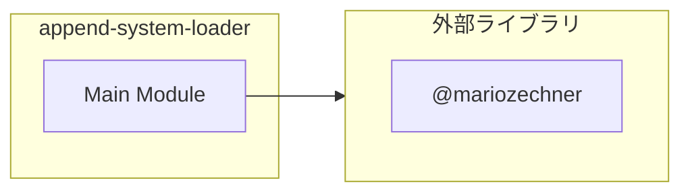

# append-system-loader

## 概要

`append-system-loader` モジュールのAPIリファレンス。

## インポート

```typescript
// from 'node:fs': existsSync, readFileSync
// from 'node:path': dirname, join
// from 'node:url': fileURLToPath
// from '@mariozechner/pi-coding-agent': ExtensionAPI
```

## エクスポート一覧

| 種別 | 名前 | 説明 |
|------|------|------|

## 図解

### 依存関係図



## 関数

### getPackageRoot

```typescript
getPackageRoot(): string
```

**戻り値**: `string`

### loadAppendSystemContent

```typescript
loadAppendSystemContent(): string | null
```

APPEND_SYSTEM.mdの内容を読み込む

**戻り値**: `string | null`

---
*自動生成: 2026-02-22T19:27:00.138Z*
