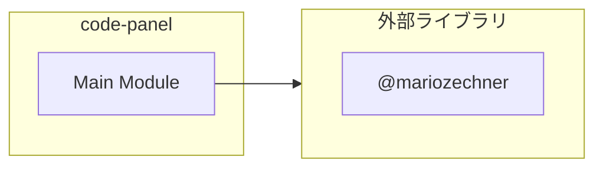

# code-panel

## 概要

`code-panel` モジュールのAPIリファレンス。

## インポート

```typescript
// from 'node:fs': fs
// from '@mariozechner/pi-coding-agent': ExtensionAPI
// from '@mariozechner/pi-coding-agent': highlightCode, getLanguageFromPath
// from '@mariozechner/pi-tui': Container, Text, matchesKey
```

## エクスポート一覧

| 種別 | 名前 | 説明 |
|------|------|------|

## 図解

### 依存関係図



## 関数

### formatLinesWithNumbers

```typescript
formatLinesWithNumbers(lines: string[], startLine: number, theme: { fg: (color: any, text: string) => string }): string[]
```

**パラメータ**

| 名前 | 型 | 必須 |
|------|-----|------|
| lines | `string[]` | はい |
| startLine | `number` | はい |
| theme | `object` | はい |
| &nbsp;&nbsp;↳ fg | `(color: any, text: string) => string` | はい |

**戻り値**: `string[]`

### createCodePanel

```typescript
createCodePanel(code: string, language: string | undefined, filePath: string | undefined, theme: { fg: (color: any, text: string) => string; bold: (text: string) => string }): Container
```

**パラメータ**

| 名前 | 型 | 必須 |
|------|-----|------|
| code | `string` | はい |
| language | `string | undefined` | はい |
| filePath | `string | undefined` | はい |
| theme | `object` | はい |
| &nbsp;&nbsp;↳ fg | `(color: any, text: string) => string; bold: (text: string) => string` | はい |

**戻り値**: `Container`

### parseArgs

```typescript
parseArgs(args: string): {
	code?: string;
	path?: string;
	language?: string;
}
```

**パラメータ**

| 名前 | 型 | 必須 |
|------|-----|------|
| args | `string` | はい |

**戻り値**: `{
	code?: string;
	path?: string;
	language?: string;
}`

---
*自動生成: 2026-02-22T19:27:00.140Z*
